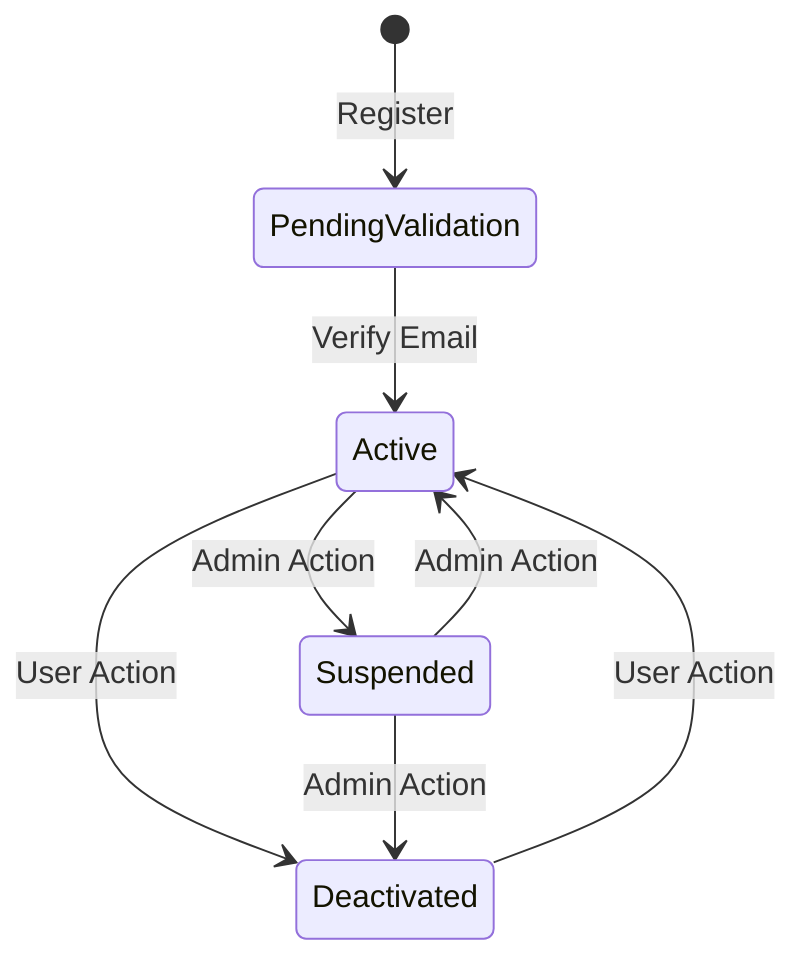

# Understanding Enums & State Machines

<link rel="stylesheet" href="../../assets/css/styles.css">

In this section, we'll explore the concept of state machines and how they can be used to manage the lifecycle of user accounts in our application. We'll also learn about PHP enums and how they can be used to represent the possible states of a user account.

## What is a State Machine?

A state machine is a design pattern that defines a finite set of states an object can be in, along with the possible transitions between those states. It's a powerful way to model and enforce the lifecycle of an object, ensuring that it can only transition between states in predefined ways.

### Key Characteristics of State Machines

1. **Finite States**: An object can only be in one state at a time, chosen from a finite set of possible states.
2. **Defined Transitions**: Transitions between states are explicitly defined and enforced.
3. **Transition Actions**: State transitions can trigger actions or side effects.
4. **Clear Visualization**: Provides a clear visualization of the object lifecycle.

## Why Use State Machines?

State machines offer several benefits for managing complex object lifecycles:

1. **Enforced Rules**: Prevents invalid state transitions (e.g., a suspended user can't directly become deactivated without first being reactivated).
2. **Centralized Logic**: State-specific behavior is encapsulated in state classes.
3. **Reduced Bugs**: Prevents impossible states and transitions, reducing bugs.
4. **Self-Documentation**: The state machine configuration serves as documentation of the allowed lifecycle.
5. **Testability**: Makes it easier to test all possible state transitions.

## The Spatie Laravel Model States Package

For our implementation, we'll use the [Spatie Laravel Model States](https://spatie.be/docs/laravel-model-states/v2/introduction) package, which provides a clean, object-oriented way to implement state machines in Laravel applications.

Key features of this package include:

1. **State Classes**: Each state is represented by a PHP class.
2. **Transition Configuration**: Allowed transitions are defined in a configuration method.
3. **Transition Classes**: Complex transitions can be encapsulated in dedicated classes.
4. **Validation**: Attempts to make invalid transitions will throw exceptions.
5. **Database Integration**: States are stored in the database as strings.

## User Account State Machine

For our user account system, we'll implement a state machine with the following states:

### States

1. **PendingValidation**: The initial state for newly registered users who haven't verified their email yet.
2. **Active**: Users who have verified their email and can use the system normally.
3. **Suspended**: Users who have been temporarily suspended by an administrator.
4. **Deactivated**: Users who have chosen to deactivate their account.

### Transitions

1. **Register**: A new user is created in the PendingValidation state.
2. **Verify Email**: A user verifies their email and transitions from PendingValidation to Active.
3. **Suspend**: An administrator suspends a user, transitioning them from Active to Suspended.
4. **Reactivate**: An administrator reactivates a suspended user, transitioning them from Suspended to Active.
5. **Deactivate**: A user deactivates their account, transitioning from Active to Deactivated.
6. **Reactivate**: A user reactivates their account, transitioning from Deactivated to Active.
7. **Force Deactivate**: An administrator deactivates a suspended user, transitioning them from Suspended to Deactivated.

## Real-World Applications

State machines are used in many real-world scenarios:

1. **Order Processing**: Orders can move through states like "Pending", "Processing", "Shipped", "Delivered", and "Returned".
2. **Content Publishing**: Content can be "Draft", "In Review", "Published", or "Archived".
3. **Subscription Management**: Subscriptions can be "Trial", "Active", "Past Due", "Canceled", or "Expired".
4. **Workflow Management**: Tasks can be "To Do", "In Progress", "In Review", "Done", or "Blocked".

## PHP Enums and State Machines

In PHP 8.1+, we can use enums to represent the possible states of our state machine. Enums provide type safety and can include helper methods for labels, colors, and other state-specific information.

We'll create an `AccountStatus` enum to represent the possible states of a user account, and then use it in conjunction with our state machine classes.

## Next Steps

In the next sections, we'll:

1. Create an `AccountStatus` enum to represent the possible states of a user account.
2. Implement the state machine classes using the Spatie Laravel Model States package.
3. Integrate the state machine with our User model.
4. Connect the state machine to the email verification process.

Let's start by [defining the AccountStatus enum](./040-account-status-enum.md).

## Additional Resources

- [Spatie Laravel Model States Documentation](https://spatie.be/docs/laravel-model-states/v2/introduction)
- [State Pattern on Refactoring Guru](https://refactoring.guru/design-patterns/state)
- [PHP 8.1 Enums Documentation](https://www.php.net/manual/en/language.enumerations.php)
