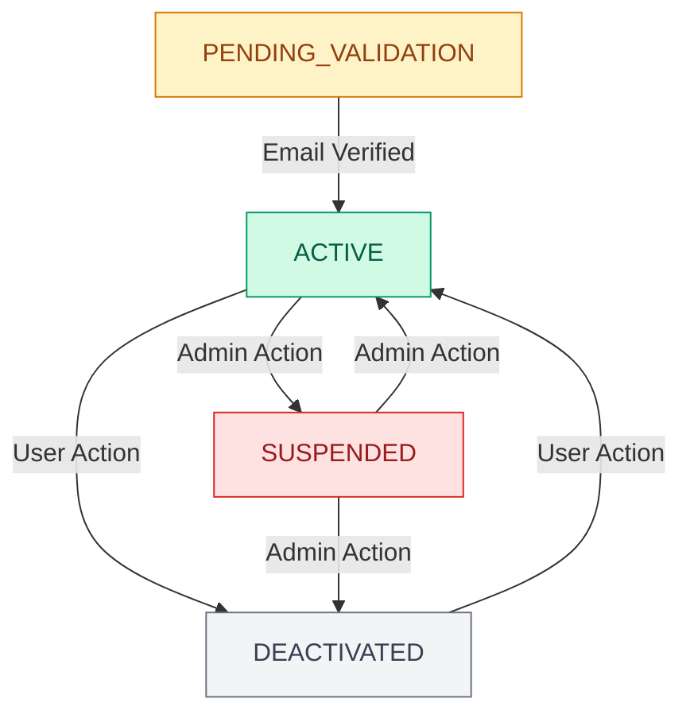

# Define AccountStatus Enum

<link rel="stylesheet" href="../../assets/css/styles.css">

In this section, we'll create an `AccountStatus` enum to represent the possible states of a user account. This enum will be used in conjunction with our state machine classes to provide a type-safe way to represent and work with account states.

## Understanding PHP Enums

PHP 8.1 introduced enums (enumerations), which are a special kind of class that represents a fixed set of possible values. Enums provide type safety and can include methods and implement interfaces.

There are two types of enums in PHP:
1. **Pure Enums**: Simple enumerations without associated values.
2. **Backed Enums**: Enumerations with associated values (string or int).

For our `AccountStatus` enum, we'll use a string-backed enum since we need to store the state in the database as a string.

## Creating the AccountStatus Enum

Let's create an `AccountStatus` enum that represents the possible states of a user account. We'll also implement Filament interfaces to make it work seamlessly with the Filament admin panel.

### Step 1: Create the Enum File

First, let's create the directory and file:

```bash
# Ensure directory exists
mkdir -p app/Enums
# Create the file
touch app/Enums/AccountStatus.php
```

### Step 2: Define the Enum

Now, let's define the `AccountStatus` enum with the possible states and helper methods:

```php
<?php

declare(strict_types=1);

namespace App\Enums;

use Filament\Support\Contracts\HasLabel;
use Filament\Support\Contracts\HasColor;
use Filament\Support\Contracts\HasIcon;

// Backed Enum for storing the state key (string)
enum AccountStatus: string implements HasLabel, HasColor, HasIcon
{
    // Define the possible states
    case PENDING_VALIDATION = 'pending_validation';
    case ACTIVE = 'active';
    case SUSPENDED = 'suspended';
    case DEACTIVATED = 'deactivated';

    /**
     * Get the display label for Filament.
     */
    public function getLabel(): ?string
    {
        return match ($this) {
            self::PENDING_VALIDATION => 'Pending Validation',
            self::ACTIVE => 'Active',
            self::SUSPENDED => 'Suspended',
            self::DEACTIVATED => 'Deactivated',
        };
    }

    /**
     * Get the color for Filament.
     */
    public function getColor(): ?string
    {
        return match ($this) {
            self::PENDING_VALIDATION => 'warning',
            self::ACTIVE => 'success',
            self::SUSPENDED => 'danger',
            self::DEACTIVATED => 'gray',
        };
    }

    /**
     * Get the icon for Filament.
     */
    public function getIcon(): ?string
    {
        return match ($this) {
            self::PENDING_VALIDATION => 'heroicon-o-clock',
            self::ACTIVE => 'heroicon-o-check-circle',
            self::SUSPENDED => 'heroicon-o-ban',
            self::DEACTIVATED => 'heroicon-o-x-circle',
        };
    }

    /**
     * Get all options as an array for select inputs.
     */
    public static function options(): array
    {
        return [
            self::PENDING_VALIDATION->value => self::PENDING_VALIDATION->getLabel(),
            self::ACTIVE->value => self::ACTIVE->getLabel(),
            self::SUSPENDED->value => self::SUSPENDED->getLabel(),
            self::DEACTIVATED->value => self::DEACTIVATED->getLabel(),
        ];
    }

    /**
     * Get the Tailwind CSS color classes for this status.
     */
    public function getTailwindClasses(): string
    {
        return match ($this) {
            self::PENDING_VALIDATION => 'text-yellow-800 bg-yellow-100 dark:text-yellow-300 dark:bg-yellow-900/50',
            self::ACTIVE => 'text-green-800 bg-green-100 dark:text-green-300 dark:bg-green-900/50',
            self::SUSPENDED => 'text-red-800 bg-red-100 dark:text-red-300 dark:bg-red-900/50',
            self::DEACTIVATED => 'text-gray-800 bg-gray-100 dark:text-gray-300 dark:bg-gray-900/50',
        };
    }

    /**
     * Check if the status is active.
     */
    public function isActive(): bool
    {
        return $this === self::ACTIVE;
    }

    /**
     * Check if the status is pending validation.
     */
    public function isPendingValidation(): bool
    {
        return $this === self::PENDING_VALIDATION;
    }

    /**
     * Check if the status is suspended.
     */
    public function isSuspended(): bool
    {
        return $this === self::SUSPENDED;
    }

    /**
     * Check if the status is deactivated.
     */
    public function isDeactivated(): bool
    {
        return $this === self::DEACTIVATED;
    }
}
```

## Understanding the Enum Implementation

Let's break down the key parts of our `AccountStatus` enum:

### 1. Enum Cases

We've defined four cases representing the possible states of a user account:
- `PENDING_VALIDATION`: For newly registered users who haven't verified their email yet.
- `ACTIVE`: For users who have verified their email and can use the system normally.
- `SUSPENDED`: For users who have been temporarily suspended by an administrator.
- `DEACTIVATED`: For users who have chosen to deactivate their account.

Each case has a string value that will be stored in the database.

### 2. Filament Integration

We've implemented three Filament interfaces:
- `HasLabel`: Provides a human-readable label for each state.
- `HasColor`: Provides a color for each state (used in badges, buttons, etc.).
- `HasIcon`: Provides an icon for each state.

This makes our enum work seamlessly with Filament UI components.

### 3. Helper Methods

We've added several helper methods:
- `options()`: Returns an array of options for select inputs.
- `getTailwindClasses()`: Returns Tailwind CSS classes for styling.
- `isActive()`, `isPendingValidation()`, etc.: Convenience methods for checking the current state.

## Adding Translations

For a multilingual application, we should add translations for the state labels. Let's add them to our language files:

```php
// resources/lang/en/messages.php
return [
    // ... other translations
    'account_status' => [
        'pending_validation' => 'Pending Validation',
        'active' => 'Active',
        'suspended' => 'Suspended',
        'deactivated' => 'Deactivated',
    ],
];
```

Then, update the `getLabel()` method to use these translations:

```php
public function getLabel(): ?string
{
    return match ($this) {
        self::PENDING_VALIDATION => __('messages.account_status.pending_validation'),
        self::ACTIVE => __('messages.account_status.active'),
        self::SUSPENDED => __('messages.account_status.suspended'),
        self::DEACTIVATED => __('messages.account_status.deactivated'),
    };
}
```

## Using the Enum

Now that we've created our `AccountStatus` enum, we can use it in our code:

```php
// Get the label for a status
$label = AccountStatus::ACTIVE->getLabel(); // "Active"

// Check if a status is active
$isActive = AccountStatus::ACTIVE->isActive(); // true

// Get Tailwind classes for a status
$classes = AccountStatus::SUSPENDED->getTailwindClasses();

// Get all options for a select input
$options = AccountStatus::options();
```

## Testing the Enum

Let's create a simple test to ensure our enum works correctly:

```php
<?php

namespace Tests\Unit\Enums;

use App\Enums\AccountStatus;use old\TestCase;use PHPUnit\Framework\Attributes\Test;

class AccountStatusTest extends TestCase
{
    #[Test]
    public function it_returns_correct_label()
    {
        $this->assertEquals('Pending Validation', AccountStatus::PENDING_VALIDATION->getLabel());
        $this->assertEquals('Active', AccountStatus::ACTIVE->getLabel());
        $this->assertEquals('Suspended', AccountStatus::SUSPENDED->getLabel());
        $this->assertEquals('Deactivated', AccountStatus::DEACTIVATED->getLabel());
    }

    #[Test]
    public function it_returns_correct_color()
    {
        $this->assertEquals('warning', AccountStatus::PENDING_VALIDATION->getColor());
        $this->assertEquals('success', AccountStatus::ACTIVE->getColor());
        $this->assertEquals('danger', AccountStatus::SUSPENDED->getColor());
        $this->assertEquals('gray', AccountStatus::DEACTIVATED->getColor());
    }

    #[Test]
    public function it_returns_correct_icon()
    {
        $this->assertEquals('heroicon-o-clock', AccountStatus::PENDING_VALIDATION->getIcon());
        $this->assertEquals('heroicon-o-check-circle', AccountStatus::ACTIVE->getIcon());
        $this->assertEquals('heroicon-o-ban', AccountStatus::SUSPENDED->getIcon());
        $this->assertEquals('heroicon-o-x-circle', AccountStatus::DEACTIVATED->getIcon());
    }

    #[Test]
    public function it_checks_status_correctly()
    {
        $this->assertTrue(AccountStatus::ACTIVE->isActive());
        $this->assertFalse(AccountStatus::PENDING_VALIDATION->isActive());
        
        $this->assertTrue(AccountStatus::PENDING_VALIDATION->isPendingValidation());
        $this->assertFalse(AccountStatus::ACTIVE->isPendingValidation());
        
        $this->assertTrue(AccountStatus::SUSPENDED->isSuspended());
        $this->assertFalse(AccountStatus::ACTIVE->isSuspended());
        
        $this->assertTrue(AccountStatus::DEACTIVATED->isDeactivated());
        $this->assertFalse(AccountStatus::ACTIVE->isDeactivated());
    }

    #[Test]
    public function it_returns_all_options()
    {
        $options = AccountStatus::options();
        
        $this->assertCount(4, $options);
        $this->assertArrayHasKey('pending_validation', $options);
        $this->assertArrayHasKey('active', $options);
        $this->assertArrayHasKey('suspended', $options);
        $this->assertArrayHasKey('deactivated', $options);
    }
}
```

## Visualizing the Account Status States

Here's a visual representation of our account status states:



## Next Steps

Now that we've created our `AccountStatus` enum, we're ready to implement the state machine classes that will use this enum to manage the lifecycle of user accounts. In the next section, we'll create the base `AccountState` class and the concrete state classes for each possible state.

Let's move on to [creating the account state machine classes](./050-state-machine-classes.md).

## Additional Resources

- [PHP 8.1 Enums Documentation](https://www.php.net/manual/en/language.enumerations.php)
- [Filament UI Components](https://filamentphp.com/docs/3.x/support/ui-components)
- [Laravel Localization](https://laravel.com/docs/12.x/localization)
