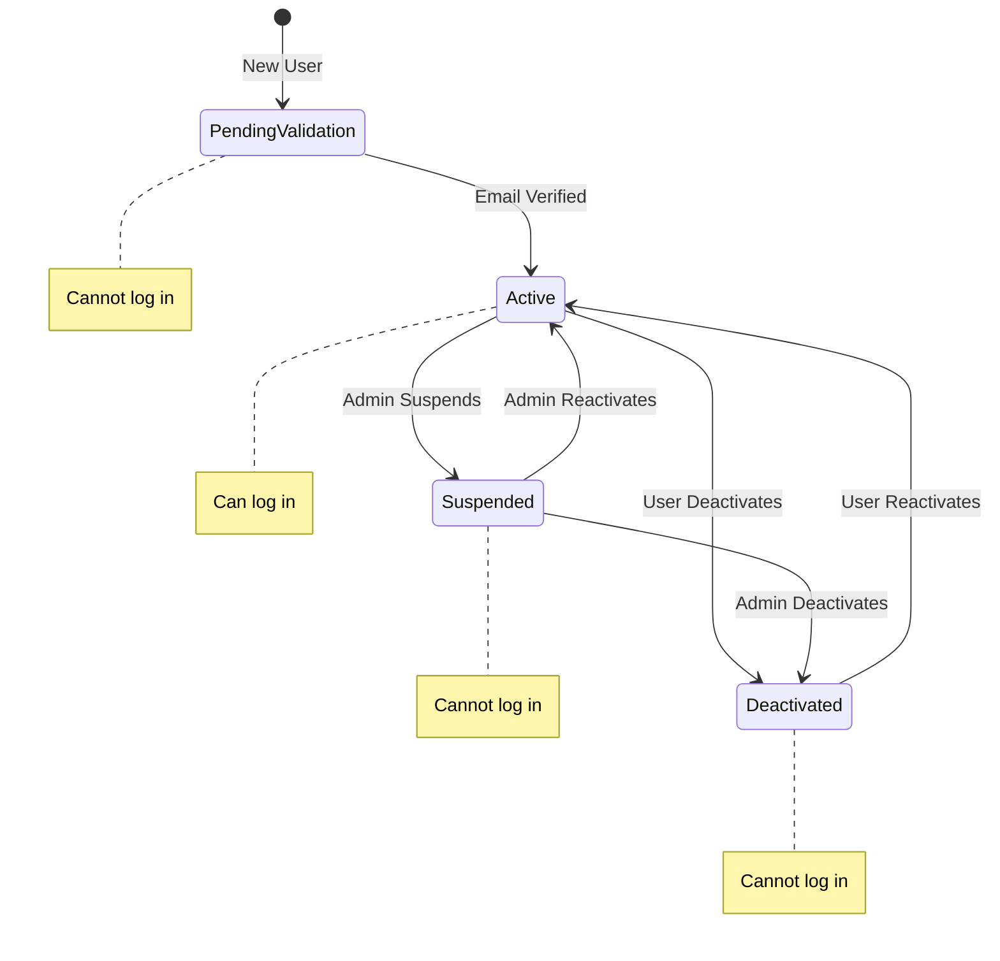

# Create Account State Machine Classes

<link rel="stylesheet" href="../../assets/css/styles.css">

In this section, we'll implement the state machine for user accounts using the Spatie Laravel Model States package. We'll create a base `AccountState` class and concrete state classes for each possible state, define allowed transitions, and integrate the state machine with our User model.

## Setting Up the State Machine

Before we start creating our state classes, let's make sure we have the Spatie Laravel Model States package installed:

```bash
composer require spatie/100-laravel-model-states
```

Then, publish the package configuration and migrations:

```bash
php artisan vendor:publish --provider="Spatie\ModelStates\ModelStatesServiceProvider"
```

## Creating the Base State Class

First, let's create a directory for our state classes and the base `AccountState` class:

```bash
# Create the directory
mkdir -p app/States/User

# Create the base state class
touch app/States/User/AccountState.php
```

Now, let's implement the base `AccountState` class:

```php
<?php

declare(strict_types=1);

namespace App\States\User;

use App\Enums\AccountStatus;
use Spatie\ModelStates\State;
use Spatie\ModelStates\StateConfig;

/**
 * Abstract base class for all account states.
 */
abstract class AccountState extends State
{
    /**
     * Get the corresponding enum value for this state.
     */
    abstract public static function status(): AccountStatus;

    /**
     * Configure the state machine.
     */
    public static function config(): StateConfig
    {
        return parent::config()
            ->default(PendingValidation::class) // Default state for new users
            ->allowTransition(PendingValidation::class, Active::class) // Can go from Pending -> Active
            ->allowTransition(Active::class, Suspended::class) // Active -> Suspended
            ->allowTransition(Active::class, Deactivated::class) // Active -> Deactivated
            ->allowTransition(Suspended::class, Active::class) // Suspended -> Active (Reactivate)
            ->allowTransition(Suspended::class, Deactivated::class) // Suspended -> Deactivated
            ->allowTransition(Deactivated::class, Active::class); // Deactivated -> Active (Reactivate)
    }

    /**
     * Get the display label for this state.
     */
    public function label(): string
    {
        return static::status()->getLabel();
    }

    /**
     * Get the color for this state.
     */
    public function color(): string
    {
        return static::status()->getColor();
    }

    /**
     * Get the icon for this state.
     */
    public function icon(): string
    {
        return static::status()->getIcon();
    }

    /**
     * Get the Tailwind CSS classes for this state.
     */
    public function tailwindClasses(): string
    {
        return static::status()->getTailwindClasses();
    }
}
```

## Creating Concrete State Classes

Now, let's create the concrete state classes for each possible state:

### 1. PendingValidation State

```bash
touch app/States/User/PendingValidation.php
```

```php
<?php

declare(strict_types=1);

namespace App\States\User;

use App\Enums\AccountStatus;

/**
 * Represents a user account that is pending email validation.
 */
class PendingValidation extends AccountState
{
    /**
     * Get the corresponding enum value for this state.
     */
    public static function status(): AccountStatus
    {
        return AccountStatus::PENDING_VALIDATION;
    }

    /**
     * Check if the user can log in.
     */
    public function canLogin(): bool
    {
        return false; // Users must verify their email before logging in
    }
}
```

### 2. Active State

```bash
touch app/States/User/Active.php
```

```php
<?php

declare(strict_types=1);

namespace App\States\User;

use App\Enums\AccountStatus;

/**
 * Represents an active user account.
 */
class Active extends AccountState
{
    /**
     * Get the corresponding enum value for this state.
     */
    public static function status(): AccountStatus
    {
        return AccountStatus::ACTIVE;
    }

    /**
     * Check if the user can log in.
     */
    public function canLogin(): bool
    {
        return true; // Active users can log in
    }
}
```

### 3. Suspended State

```bash
touch app/States/User/Suspended.php
```

```php
<?php

declare(strict_types=1);

namespace App\States\User;

use App\Enums\AccountStatus;

/**
 * Represents a suspended user account.
 */
class Suspended extends AccountState
{
    /**
     * Get the corresponding enum value for this state.
     */
    public static function status(): AccountStatus
    {
        return AccountStatus::SUSPENDED;
    }

    /**
     * Check if the user can log in.
     */
    public function canLogin(): bool
    {
        return false; // Suspended users cannot log in
    }
}
```

### 4. Deactivated State

```bash
touch app/States/User/Deactivated.php
```

```php
<?php

declare(strict_types=1);

namespace App\States\User;

use App\Enums\AccountStatus;

/**
 * Represents a deactivated user account.
 */
class Deactivated extends AccountState
{
    /**
     * Get the corresponding enum value for this state.
     */
    public static function status(): AccountStatus
    {
        return AccountStatus::DEACTIVATED;
    }

    /**
     * Check if the user can log in.
     */
    public function canLogin(): bool
    {
        return false; // Deactivated users cannot log in
    }
}
```

## Creating Transition Classes

For more complex transitions that require additional logic, we can create dedicated transition classes. Let's create a transition class for the email verification process:

```bash
mkdir -p app/States/User/Transitions
touch app/States/User/Transitions/VerifyEmailTransition.php
```

```php
<?php

declare(strict_types=1);

namespace App\States\User\Transitions;

use App\Models\User;
use App\States\User\Active;
use App\States\User\PendingValidation;
use Illuminate\Support\Facades\Log;
use Spatie\ModelStates\Transition;

/**
 * Transition from PendingValidation to Active when email is verified.
 */
class VerifyEmailTransition extends Transition
{
    /**
     * Handle the transition.
     */
    public function handle(User $user, PendingValidation $currentState): Active
    {
        // Log the transition
        Log::info("User {$user->id} verified their email and became active.");

        // You could add additional logic here, such as:
        // - Sending a custom email
        // - Creating default resources for the user
        // - Notifying administrators

        // Return the new state
        return new Active($user);
    }
}
```

Now, let's update our `AccountState` class to use this transition:

```php
public static function config(): StateConfig
{
    return parent::config()
        ->default(PendingValidation::class)
        ->allowTransition(PendingValidation::class, Active::class, Transitions\VerifyEmailTransition::class) // Use the transition class
        ->allowTransition(Active::class, Suspended::class)
        ->allowTransition(Active::class, Deactivated::class)
        ->allowTransition(Suspended::class, Active::class)
        ->allowTransition(Suspended::class, Deactivated::class)
        ->allowTransition(Deactivated::class, Active::class);
}
```

## Integrating with the User Model

Now, let's integrate our state machine with the User model. We need to:

1. Add the `HasStates` trait to the User model
2. Cast the `account_state` attribute to our `AccountState` class

```php
<?php

namespace App\Models;

use App\Enums\AccountStatus;
use App\States\User\AccountState;
use Illuminate\Database\Eloquent\Factories\HasFactory;
use Illuminate\Foundation\Auth\User as Authenticatable;
use Illuminate\Notifications\Notifiable;
use Laravel\Sanctum\HasApiTokens;
use Spatie\ModelStates\HasStates;

class User extends Authenticatable
{
    use HasApiTokens, HasFactory, Notifiable, HasStates;

    /**
     * The attributes that are mass assignable.
     *
     * @var array<int, string>
     */
    protected $fillable = [
        'name',
        'email',
        'password',
        'account_state',
    ];

    /**
     * The attributes that should be hidden for serialization.
     *
     * @var array<int, string>
     */
    protected $hidden = [
        'password',
        'remember_token',
    ];

    /**
     * The attributes that should be cast.
     *
     * @var array<string, string>
     */
    protected $casts = [
        'email_verified_at' => 'datetime',
        'password' => 'hashed',
        'account_state' => AccountState::class, // Cast to our state class
    ];

    /**
     * The "booted" method of the model.
     */
    protected static function booted(): void
    {
        // Set default state for new users
        static::creating(function (User $user) {
            if (is_null($user->account_state)) {
                $user->account_state = AccountStatus::PENDING_VALIDATION;
            }
        });
    }

    /**
     * Check if the user can log in.
     */
    public function canLogin(): bool
    {
        return $this->account_state->canLogin();
    }
}
```

## Adding a Migration

If you haven't already added the `account_state` column to your users table, you'll need to create a migration:

```bash
php artisan make:migration add_account_state_to_users_table
```

```php
<?php

use Illuminate\Database\Migrations\Migration;
use Illuminate\Database\Schema\Blueprint;
use Illuminate\Support\Facades\Schema;

return new class extends Migration
{
    /**
     * Run the migrations.
     */
    public function up(): void
    {
        Schema::table('users', function (Blueprint $table) {
            $table->string('account_state')->default('pending_validation');
        });
    }

    /**
     * Reverse the migrations.
     */
    public function down(): void
    {
        Schema::table('users', function (Blueprint $table) {
            $table->dropColumn('account_state');
        });
    }
};
```

Run the migration:

```bash
php artisan migrate
```

## Using the State Machine

Now that we've set up our state machine, let's see how to use it:

### Checking the Current State

```php
$user = User::find(1);

// Check the current state
if ($user->account_state instanceof \App\States\User\Active) {
    // User is active
}

// Or use the enum
if ($user->account_state->status() === \App\Enums\AccountStatus::ACTIVE) {
    // User is active
}

// Or use the helper method
if ($user->canLogin()) {
    // User can log in
}
```

### Transitioning Between States

```php
$user = User::find(1);

// Transition from PendingValidation to Active
if ($user->account_state instanceof \App\States\User\PendingValidation) {
    $user->account_state->transition(\App\States\User\Active::class);
    $user->save();
}

// Or use the transition class
if ($user->account_state instanceof \App\States\User\PendingValidation) {
    $user->account_state->transition(new \App\States\User\Transitions\VerifyEmailTransition());
    $user->save();
}
```

### Handling Invalid Transitions

If you try to make an invalid transition, the package will throw a `Spatie\ModelStates\Exceptions\TransitionNotFound` exception:

```php
try {
    // This will throw an exception if the user is not in the PendingValidation state
    $user->account_state->transition(\App\States\User\Suspended::class);
    $user->save();
} catch (\Spatie\ModelStates\Exceptions\TransitionNotFound $e) {
    // Handle the exception
}
```

## Visualizing the State Machine

Here's a visual representation of our state machine:



## Testing the State Machine

Let's create a test to ensure our state machine works correctly:

```php
<?php

namespace Tests\Unit\States;

use App\Models\User;use App\States\User\Active;use App\States\User\Deactivated;use App\States\User\PendingValidation;use App\States\User\Suspended;use App\States\User\Transitions\VerifyEmailTransition;use Illuminate\Foundation\Testing\RefreshDatabase;use old\TestCase;use PHPUnit\Framework\Attributes\Test;use Spatie\ModelStates\Exceptions\TransitionNotFound;

class AccountStateTest extends TestCase
{
    use RefreshDatabase;

    #[Test]
    public function new_users_have_pending_validation_state()
    {
        $user = User::factory()->create();
        
        $this->assertInstanceOf(PendingValidation::class, $user->account_state);
        $this->assertFalse($user->canLogin());
    }

    #[Test]
    public function users_can_transition_from_pending_to_active()
    {
        $user = User::factory()->create();
        
        $user->account_state->transition(Active::class);
        $user->save();
        
        $this->assertInstanceOf(Active::class, $user->account_state);
        $this->assertTrue($user->canLogin());
    }

    #[Test]
    public function users_can_transition_using_transition_class()
    {
        $user = User::factory()->create();
        
        $user->account_state->transition(new VerifyEmailTransition());
        $user->save();
        
        $this->assertInstanceOf(Active::class, $user->account_state);
    }

    #[Test]
    public function active_users_can_be_suspended()
    {
        $user = User::factory()->create();
        $user->account_state->transition(Active::class);
        $user->save();
        
        $user->account_state->transition(Suspended::class);
        $user->save();
        
        $this->assertInstanceOf(Suspended::class, $user->account_state);
        $this->assertFalse($user->canLogin());
    }

    #[Test]
    public function active_users_can_be_deactivated()
    {
        $user = User::factory()->create();
        $user->account_state->transition(Active::class);
        $user->save();
        
        $user->account_state->transition(Deactivated::class);
        $user->save();
        
        $this->assertInstanceOf(Deactivated::class, $user->account_state);
        $this->assertFalse($user->canLogin());
    }

    #[Test]
    public function suspended_users_can_be_reactivated()
    {
        $user = User::factory()->create();
        $user->account_state->transition(Active::class);
        $user->save();
        
        $user->account_state->transition(Suspended::class);
        $user->save();
        
        $user->account_state->transition(Active::class);
        $user->save();
        
        $this->assertInstanceOf(Active::class, $user->account_state);
        $this->assertTrue($user->canLogin());
    }

    #[Test]
    public function deactivated_users_can_be_reactivated()
    {
        $user = User::factory()->create();
        $user->account_state->transition(Active::class);
        $user->save();
        
        $user->account_state->transition(Deactivated::class);
        $user->save();
        
        $user->account_state->transition(Active::class);
        $user->save();
        
        $this->assertInstanceOf(Active::class, $user->account_state);
        $this->assertTrue($user->canLogin());
    }

    #[Test]
    public function invalid_transitions_throw_exceptions()
    {
        $this->expectException(TransitionNotFound::class);
        
        $user = User::factory()->create();
        
        // This should throw an exception because we can't go directly from PendingValidation to Suspended
        $user->account_state->transition(Suspended::class);
    }
}
```

## Next Steps

Now that we've implemented our state machine, we're ready to integrate it with the email verification process. In the next section, we'll modify the email verification controller to transition users from the `PendingValidation` state to the `Active` state when they verify their email.

Let's move on to [integrating the state machine with email verification](./070-state-machine-integration.md).

## Additional Resources

- [Spatie Laravel Model States Documentation](https://spatie.be/docs/laravel-model-states/v2/introduction)
- [Laravel Eloquent: Mutators & Casting](https://laravel.com/docs/12.x/eloquent-mutators)
- [Laravel Testing](https://laravel.com/docs/12.x/testing)
