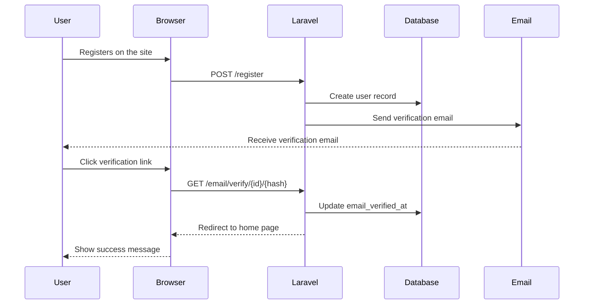

# Understanding Email Verification Flow

<link rel="stylesheet" href="../../assets/css/styles.css">

In this section, we'll explore Laravel's email verification system and how it works with Fortify. Understanding this flow is essential before we integrate it with our state machine.

## Email Verification in Laravel

Laravel provides built-in support for email verification through the `MustVerifyEmail` interface. When a user registers, they receive an email with a verification link. When they click the link, Laravel verifies their email and redirects them to a specified route.

### The MustVerifyEmail Interface

The `MustVerifyEmail` interface defines methods that a model must implement to support email verification:

```php
interface MustVerifyEmail
{
    public function hasVerifiedEmail();
    public function markEmailAsVerified();
    public function sendEmailVerificationNotification();
    public function getEmailForVerification();
}
```

The `User` model in Laravel already implements this interface through the `Illuminate\Foundation\Auth\User` class.

## Email Verification with Fortify

Fortify provides a complete implementation of Laravel's email verification features. It includes:

1. Routes for email verification
2. Controllers to handle verification requests
3. Views for the verification notice and success pages

### Enabling Email Verification in Fortify

Email verification is enabled in Fortify by adding the `emailVerification` feature to the `features` array in `config/fortify.php`:

```php
'features' => [
    Features::registration(),
    Features::resetPasswords(),
    Features::emailVerification(),
    Features::updateProfileInformation(),
    Features::updatePasswords(),
    Features::twoFactorAuthentication(),
],
```

### Fortify Email Verification Routes

Fortify registers the following routes for email verification:

1. `GET /email/verify` - Shows the verification notice page
2. `GET /email/verify/{id}/{hash}` - Verifies the email when the user clicks the link in the email
3. `POST /email/verification-notification` - Resends the verification email

### The Verification Process

Here's how the email verification process works with Fortify:

1. A user registers on the site
2. Laravel sends an email with a verification link
3. The user clicks the link in the email
4. Laravel verifies the email and updates the `email_verified_at` timestamp
5. The user is redirected to the home page with a success message



## Customizing the Email Verification Flow

By default, Laravel's email verification only updates the `email_verified_at` timestamp. It doesn't change any state or status. In the next section, we'll extend this functionality to also transition the user's account state from `PendingValidation` to `Active` when they verify their email.

### Customizing the Verification Controller

To customize the verification process, we can create our own controller that extends or replaces Fortify's `VerifyEmailController`. This allows us to add additional logic, such as transitioning the user's account state.

### Customizing the Verification Views

Fortify provides default views for email verification, but we can customize them by publishing the Fortify views and modifying them:

```bash
php artisan vendor:publish --tag=fortify-views
```

## Email Verification Middleware

Laravel provides the `verified` middleware that can be used to ensure that only users with verified emails can access certain routes:

```php
Route::middleware(['auth', 'verified'])->group(function () {
    Route::get('/dashboard', function () {
        return view('dashboard');
    })->name('dashboard');
});
```

## Next Steps

Now that we understand how Laravel's email verification system works, we're ready to integrate it with our state machine. In the next section, we'll modify the email verification controller to transition users from the `PendingValidation` state to the `Active` state when they verify their email.

Let's move on to [integrating the state machine with email verification](./070-state-machine-integration.md).

## Additional Resources

- [Laravel Email Verification Documentation](https://laravel.com/docs/12.x/verification)
- [Laravel Fortify Documentation](https://laravel.com/docs/fortify)
- [Laravel Notifications](https://laravel.com/docs/12.x/notifications)
