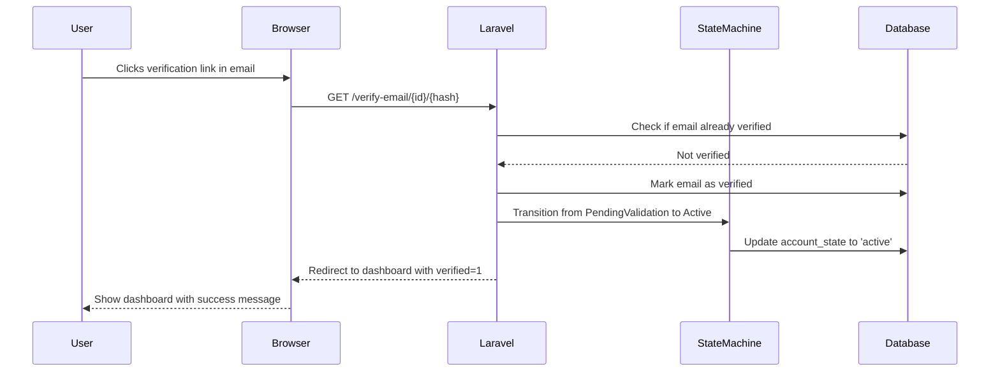

# Integrate State Machine with Email Verification

<link rel="stylesheet" href="../../assets/css/styles.css">

In this section, we'll integrate our state machine with Laravel's email verification process. We'll modify the email verification controller to transition users from the `PendingValidation` state to the `Active` state when they verify their email.

## Understanding Email Verification in Laravel

Laravel provides built-in email verification through the `MustVerifyEmail` interface and the `VerifyEmail` notification. When a user registers, they receive an email with a verification link. When they click the link, Laravel verifies their email and redirects them to a specified route.

By default, Laravel sets the `email_verified_at` timestamp when a user verifies their email, but it doesn't change any state or status. We'll extend this functionality to also transition the user's account state.

## Modifying the Email Verification Controller

Laravel's email verification is handled by the `VerifyEmailController` in the `App\Http\Controllers\Auth` namespace. We'll need to modify this controller to also transition the user's account state when they verify their email.

First, let's create our own version of the controller:

```bash
# Create the directory if it doesn't exist
mkdir -p app/Http/Controllers/Auth

# Create the controller
touch app/Http/Controllers/Auth/VerifyEmailController.php
```

Now, let's implement the controller:

```php
<?php

namespace App\Http\Controllers\Auth;

use App\Http\Controllers\Controller;
use App\Providers\RouteServiceProvider;
use App\States\User\Transitions\VerifyEmailTransition;
use Illuminate\Auth\Events\Verified;
use Illuminate\Foundation\Auth\EmailVerificationRequest;
use Illuminate\Http\RedirectResponse;

class VerifyEmailController extends Controller
{
    /**
     * Mark the authenticated user's email address as verified.
     */
    public function __invoke(EmailVerificationRequest $request): RedirectResponse
    {
        if ($request->user()->hasVerifiedEmail()) {
            return redirect()->intended(RouteServiceProvider::HOME.'?verified=1');
        }

        if ($request->user()->markEmailAsVerified()) {
            event(new Verified($request->user()));

            // Transition the user's account state from PendingValidation to Active
            $request->user()->account_state->transition(new VerifyEmailTransition());
            $request->user()->save();
        }

        return redirect()->intended(RouteServiceProvider::HOME.'?verified=1');
    }
}
```

## Updating the Routes

Now, we need to update the routes to use our custom controller. In `routes/web.php`, find the email verification routes and update them:

```php
Route::middleware('auth')->group(function () {
    Route::get('verify-email', [EmailVerificationPromptController::class, '__invoke'])
        ->name('verification.notice');

    Route::get('verify-email/{id}/{hash}', [VerifyEmailController::class, '__invoke'])
        ->middleware(['signed', 'throttle:6,1'])
        ->name('verification.verify');

    Route::post('email/verification-notification', [EmailVerificationNotificationController::class, 'store'])
        ->middleware('throttle:6,1')
        ->name('verification.send');
});
```

## Creating a Middleware to Check Account State

Now, let's create a middleware to check if a user's account state allows them to access the application. This middleware will redirect users to appropriate pages based on their account state.

```bash
# Create the middleware
php artisan make:middleware CheckAccountState
```

```php
<?php

namespace App\Http\Middleware;

use App\States\User\Active;
use App\States\User\Deactivated;
use App\States\User\PendingValidation;
use App\States\User\Suspended;
use Closure;
use Illuminate\Http\Request;
use Symfony\Component\HttpFoundation\Response;

class CheckAccountState
{
    /**
     * Handle an incoming request.
     */
    public function handle(Request $request, Closure $next): Response
    {
        if (!$request->user()) {
            return $next($request);
        }

        $accountState = $request->user()->account_state;

        if ($accountState instanceof PendingValidation) {
            // If the user hasn't verified their email, redirect them to the verification notice page
            if ($request->route()->getName() !== 'verification.notice' && 
                $request->route()->getName() !== 'verification.verify' && 
                $request->route()->getName() !== 'verification.send') {
                return redirect()->route('verification.notice');
            }
        } elseif ($accountState instanceof Suspended) {
            // If the user is suspended, show them a suspended page
            return response()->view('auth.suspended');
        } elseif ($accountState instanceof Deactivated) {
            // If the user is deactivated, show them a deactivated page
            return response()->view('auth.deactivated');
        } elseif (!($accountState instanceof Active)) {
            // If the user is in any other state, log them out
            auth()->logout();
            return redirect()->route('login')->with('error', 'Your account is not active.');
        }

        return $next($request);
    }
}
```

Register the middleware in `app/Http/Kernel.php`:

```php
protected $middlewareGroups = [
    'web' => [
        // ... other middleware
        \App\Http\Middleware\CheckAccountState::class,
    ],
];
```

## Creating Views for Different Account States

Let's create views for the suspended and deactivated states:

```bash
# Create the directory if it doesn't exist
mkdir -p resources/views/auth

# Create the views
touch resources/views/auth/suspended.blade.php
touch resources/views/auth/deactivated.blade.php
```

### Suspended View

```blade
<x-guest-layout>
    <div class="mb-4 text-sm text-gray-600 dark:text-gray-400">
        <h1 class="text-2xl font-bold mb-4">Account Suspended</h1>
        <p class="mb-4">Your account has been suspended by an administrator.</p>
        <p class="mb-4">If you believe this is an error, please contact support.</p>
    </div>

    <form method="POST" action="{{ route('logout') }}">
        @csrf
        <div class="mt-4 flex items-center justify-end">
            <x-primary-button>
                {{ __('Log Out') }}
            </x-primary-button>
        </div>
    </form>
</x-guest-layout>
```

### Deactivated View

```blade
<x-guest-layout>
    <div class="mb-4 text-sm text-gray-600 dark:text-gray-400">
        <h1 class="text-2xl font-bold mb-4">Account Deactivated</h1>
        <p class="mb-4">Your account has been deactivated.</p>
        <p class="mb-4">If you would like to reactivate your account, please click the button below.</p>
    </div>

    <form method="POST" action="{{ route('account.reactivate') }}">
        @csrf
        <div class="mt-4 flex items-center justify-end">
            <x-primary-button>
                {{ __('Reactivate Account') }}
            </x-primary-button>
        </div>
    </form>
</x-guest-layout>
```

## Creating a Controller for Account Actions

Let's create a controller to handle account actions like reactivation:

```bash
# Create the controller
php artisan make:controller AccountController
```

```php
<?php

namespace App\Http\Controllers;

use App\States\User\Active;
use Illuminate\Http\RedirectResponse;
use Illuminate\Http\Request;

class AccountController extends Controller
{
    /**
     * Reactivate a deactivated account.
     */
    public function reactivate(Request $request): RedirectResponse
    {
        $user = $request->user();

        // Transition the user's account state to Active
        $user->account_state->transition(Active::class);
        $user->save();

        return redirect()->route('dashboard')->with('status', 'account-reactivated');
    }

    /**
     * Deactivate the user's account.
     */
    public function deactivate(Request $request): RedirectResponse
    {
        $user = $request->user();

        // Transition the user's account state to Deactivated
        $user->account_state->transition(\App\States\User\Deactivated::class);
        $user->save();

        auth()->logout();

        return redirect()->route('login')->with('status', 'account-deactivated');
    }
}
```

Add the routes for these actions in `routes/web.php`:

```php
Route::middleware(['auth'])->group(function () {
    Route::post('/account/reactivate', [AccountController::class, 'reactivate'])->name('account.reactivate');
    Route::post('/account/deactivate', [AccountController::class, 'deactivate'])->name('account.deactivate');
});
```

## Adding Account State to the User Profile

Let's add the account state to the user profile page so users can see their current state and take actions like deactivating their account:

```blade
<div class="mt-6">
    <h3 class="text-lg font-medium text-gray-900 dark:text-gray-100">
        {{ __('Account Status') }}
    </h3>

    <div class="mt-2 max-w-xl text-sm text-gray-600 dark:text-gray-400">
        <p>
            {{ __('Your account is currently ') }}
            <span class="inline-flex items-center px-2.5 py-0.5 rounded-full text-xs font-medium {{ $user->account_state->tailwindClasses() }}">
                {{ $user->account_state->label() }}
            </span>
        </p>
    </div>

    @if ($user->account_state instanceof \App\States\User\Active)
        <div class="mt-4">
            <x-danger-button
                x-data=""
                x-on:click.prevent="$dispatch('open-modal', 'confirm-account-deactivation')"
            >{{ __('Deactivate Account') }}</x-danger-button>
        </div>

        <x-modal name="confirm-account-deactivation" :show="$errors->userDeletion->isNotEmpty()" focusable>
            <form method="post" action="{{ route('account.deactivate') }}" class="p-6">
                @csrf

                <h2 class="text-lg font-medium text-gray-900 dark:text-gray-100">
                    {{ __('Are you sure you want to deactivate your account?') }}
                </h2>

                <p class="mt-1 text-sm text-gray-600 dark:text-gray-400">
                    {{ __('Once your account is deactivated, you will be logged out and will need to reactivate your account to log in again.') }}
                </p>

                <div class="mt-6 flex justify-end">
                    <x-secondary-button x-on:click="$dispatch('close')">
                        {{ __('Cancel') }}
                    </x-secondary-button>

                    <x-danger-button class="ms-3">
                        {{ __('Deactivate Account') }}
                    </x-danger-button>
                </div>
            </form>
        </x-modal>
    @endif
</div>
```

## Creating an Admin Interface for Managing User States

For administrators, we'll create a Filament resource to manage user account states:

```bash
# Create the Filament resource
php artisan make:filament-resource User
```

Then, modify the generated resource to include account state management:

```php
<?php

namespace App\Filament\Resources;

use App\Filament\Resources\UserResource\Pages;
use App\Models\User;
use App\States\User\Active;
use App\States\User\Deactivated;
use App\States\User\Suspended;
use Filament\Forms;
use Filament\Forms\Form;
use Filament\Resources\Resource;
use Filament\Tables;
use Filament\Tables\Table;

class UserResource extends Resource
{
    protected static ?string $model = User::class;

    protected static ?string $navigationIcon = 'heroicon-o-users';

    public static function form(Form $form): Form
    {
        return $form
            ->schema([
                Forms\Components\TextInput::make('name')
                    ->required()
                    ->maxLength(255),
                Forms\Components\TextInput::make('email')
                    ->email()
                    ->required()
                    ->maxLength(255),
                Forms\Components\Select::make('account_state')
                    ->options(\App\Enums\AccountStatus::options())
                    ->required(),
                // ... other fields
            ]);
    }

    public static function table(Table $table): Table
    {
        return $table
            ->columns([
                Tables\Columns\TextColumn::make('name')
                    ->searchable(),
                Tables\Columns\TextColumn::make('email')
                    ->searchable(),
                Tables\Columns\BadgeColumn::make('account_state')
                    ->formatStateUsing(fn (User $record) => $record->account_state->label())
                    ->colors([
                        'warning' => fn (User $record) => $record->account_state instanceof \App\States\User\PendingValidation,
                        'success' => fn (User $record) => $record->account_state instanceof \App\States\User\Active,
                        'danger' => fn (User $record) => $record->account_state instanceof \App\States\User\Suspended,
                        'gray' => fn (User $record) => $record->account_state instanceof \App\States\User\Deactivated,
                    ]),
                Tables\Columns\TextColumn::make('created_at')
                    ->dateTime()
                    ->sortable()
                    ->toggleable(isToggledHiddenByDefault: true),
                Tables\Columns\TextColumn::make('updated_at')
                    ->dateTime()
                    ->sortable()
                    ->toggleable(isToggledHiddenByDefault: true),
            ])
            ->filters([
                // ... filters
            ])
            ->actions([
                Tables\Actions\Action::make('suspend')
                    ->visible(fn (User $record) => $record->account_state instanceof Active)
                    ->color('danger')
                    ->icon('heroicon-o-ban')
                    ->requiresConfirmation()
                    ->action(function (User $record) {
                        $record->account_state->transition(Suspended::class);
                        $record->save();
                    }),
                Tables\Actions\Action::make('activate')
                    ->visible(fn (User $record) => $record->account_state instanceof Suspended || $record->account_state instanceof Deactivated)
                    ->color('success')
                    ->icon('heroicon-o-check-circle')
                    ->requiresConfirmation()
                    ->action(function (User $record) {
                        $record->account_state->transition(Active::class);
                        $record->save();
                    }),
                Tables\Actions\Action::make('deactivate')
                    ->visible(fn (User $record) => $record->account_state instanceof Active || $record->account_state instanceof Suspended)
                    ->color('gray')
                    ->icon('heroicon-o-x-circle')
                    ->requiresConfirmation()
                    ->action(function (User $record) {
                        $record->account_state->transition(Deactivated::class);
                        $record->save();
                    }),
                Tables\Actions\EditAction::make(),
            ])
            ->bulkActions([
                Tables\Actions\BulkActionGroup::make([
                    Tables\Actions\DeleteBulkAction::make(),
                ]),
            ]);
    }

    public static function getRelations(): array
    {
        return [
            // ... relations
        ];
    }

    public static function getPages(): array
    {
        return [
            'index' => Pages\ListUsers::route('/'),
            'create' => Pages\CreateUser::route('/create'),
            'edit' => Pages\EditUser::route('/{record}/edit'),
        ];
    }
}
```

## Testing the Integration

Let's create a test to ensure our email verification integration works correctly:

```php
<?php

namespace Tests\Feature;

use App\Models\User;use App\States\User\Active;use App\States\User\PendingValidation;use Illuminate\Auth\Events\Verified;use Illuminate\Foundation\Testing\RefreshDatabase;use Illuminate\Support\Facades\Event;use Illuminate\Support\Facades\URL;use old\TestCase;use PHPUnit\Framework\Attributes\Test;

class EmailVerificationTest extends TestCase
{
    use RefreshDatabase;

    #[Test]
    public function email_verification_transitions_account_state()
    {
        Event::fake();

        $user = User::factory()->create([
            'email_verified_at' => null,
        ]);

        $this->assertInstanceOf(PendingValidation::class, $user->account_state);

        $verificationUrl = URL::temporarySignedRoute(
            'verification.verify',
            now()->addMinutes(60),
            ['id' => $user->id, 'hash' => sha1($user->email)]
        );

        $response = $this->actingAs($user)->get($verificationUrl);

        Event::assertDispatched(Verified::class);

        $user->refresh();

        $this->assertNotNull($user->email_verified_at);
        $this->assertInstanceOf(Active::class, $user->account_state);

        $response->assertRedirect(route('dashboard') . '?verified=1');
    }

    #[Test]
    public function suspended_users_cannot_access_dashboard()
    {
        $user = User::factory()->create();
        $user->account_state->transition(Active::class);
        $user->save();

        $user->account_state->transition(Suspended::class);
        $user->save();

        $response = $this->actingAs($user)->get(route('dashboard'));

        $response->assertViewIs('auth.suspended');
    }

    #[Test]
    public function deactivated_users_cannot_access_dashboard()
    {
        $user = User::factory()->create();
        $user->account_state->transition(Active::class);
        $user->save();

        $user->account_state->transition(Deactivated::class);
        $user->save();

        $response = $this->actingAs($user)->get(route('dashboard'));

        $response->assertViewIs('auth.deactivated');
    }

    #[Test]
    public function users_can_reactivate_their_account()
    {
        $user = User::factory()->create();
        $user->account_state->transition(Active::class);
        $user->save();

        $user->account_state->transition(Deactivated::class);
        $user->save();

        $response = $this->actingAs($user)->post(route('account.reactivate'));

        $user->refresh();

        $this->assertInstanceOf(Active::class, $user->account_state);

        $response->assertRedirect(route('dashboard'));
        $response->assertSessionHas('status', 'account-reactivated');
    }

    #[Test]
    public function users_can_deactivate_their_account()
    {
        $user = User::factory()->create();
        $user->account_state->transition(Active::class);
        $user->save();

        $response = $this->actingAs($user)->post(route('account.deactivate'));

        $user->refresh();

        $this->assertInstanceOf(Deactivated::class, $user->account_state);

        $response->assertRedirect(route('login'));
        $response->assertSessionHas('status', 'account-deactivated');
    }
}
```

## Visualizing the Integration

Here's a visual representation of how the email verification process integrates with our state machine:



## Next Steps

Now that we've integrated our state machine with email verification, we have a robust system for managing user account lifecycles. Users will automatically transition from `PendingValidation` to `Active` when they verify their email, and administrators can suspend or deactivate accounts as needed.

In the next section, we'll learn about two-factor authentication and how to implement it in our application.

Let's move on to [Understanding Two-Factor Authentication](./080-2fa.md).

## Additional Resources

- [Laravel Email Verification](https://laravel.com/docs/12.x/verification)
- [Laravel Middleware](https://laravel.com/docs/12.x/middleware)
- [Filament Admin Panel](https://filamentphp.com/docs/3.x/panels/installation)
- [Laravel Events](https://laravel.com/docs/12.x/events)
