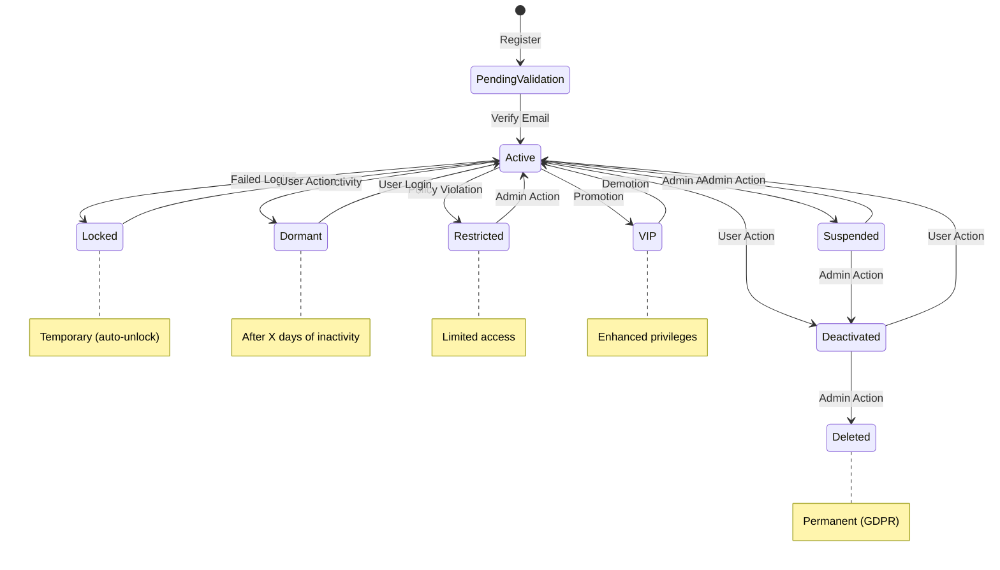
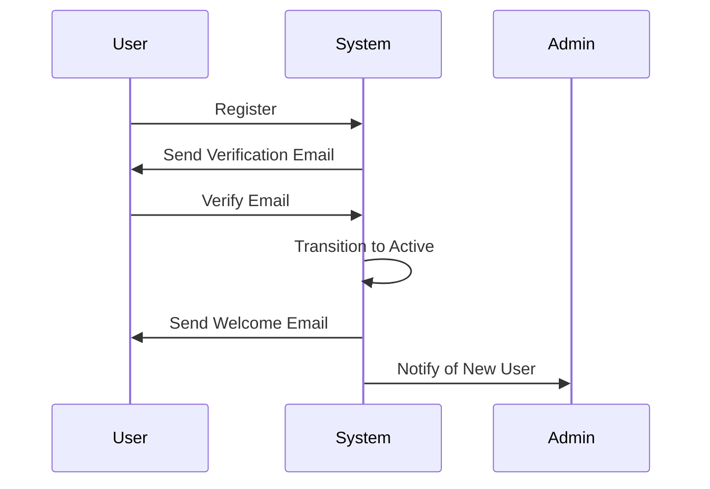
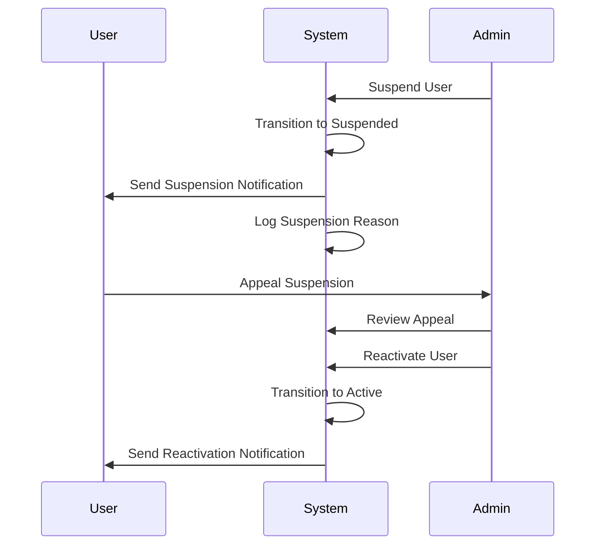
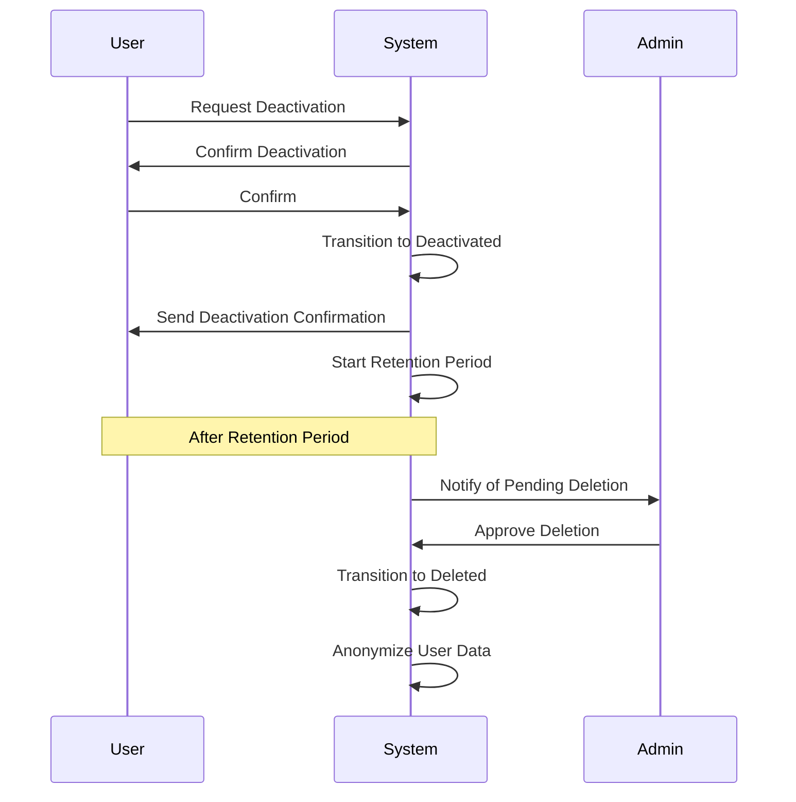

# State Machine Workflows for Future Development

<link rel="stylesheet" href="../../assets/css/styles.css">

In this section, we'll explore potential workflows and extensions for the User Account State Machine. These ideas can serve as a foundation for future development and enhancement of the state machine.

## Extending the State Machine

The current state machine implementation covers the basic lifecycle of a user account, but there are many ways it could be extended to handle more complex scenarios.

### Additional States

Consider adding these states to handle more specific account situations:

1. **Locked**: For accounts that have been temporarily locked due to suspicious activity or failed login attempts
2. **Dormant**: For accounts that haven't been active for a specified period
3. **Restricted**: For accounts with limited access due to policy violations
4. **VIP**: For accounts with special privileges or status
5. **Deleted**: For accounts that have been permanently deleted



### Enhanced Transition Classes

Transition classes can be enhanced to include more sophisticated logic:

1. **Rate Limiting**: Prevent too many transitions in a short period
2. **Approval Workflows**: Require approval for certain transitions
3. **Scheduled Transitions**: Schedule transitions to occur at a future time
4. **Conditional Transitions**: Allow transitions only if certain conditions are met
5. **Cascading Transitions**: Trigger transitions in related models

## Integration with Other Systems

The state machine can be integrated with other systems to create a more comprehensive user management solution.

### Notification System

Send notifications when account states change:

1. **Email Notifications**: Notify users when their account state changes
2. **Admin Alerts**: Alert administrators about suspicious state changes
3. **Slack/Teams Notifications**: Send notifications to team channels
4. **SMS Notifications**: Send text messages for critical state changes

### Audit System

Track all state changes for audit purposes:

1. **Audit Log**: Record all state transitions with metadata
2. **Change History**: Show a history of state changes for each user
3. **Reason Tracking**: Require and store reasons for state changes
4. **Admin Accountability**: Track which admin made each state change

### Analytics System

Analyze state changes to gain insights:

1. **State Distribution**: Track how many users are in each state
2. **Transition Patterns**: Identify common transition patterns
3. **Churn Prediction**: Predict which users are likely to deactivate
4. **Conversion Metrics**: Measure conversion from PendingValidation to Active

## Workflow Patterns

Here are some common workflow patterns that can be implemented using the state machine:

### User Onboarding Workflow



### Account Suspension Workflow



### Account Deactivation Workflow



## Implementation Strategies

When implementing these workflows, consider the following strategies:

### Event-Driven Architecture

Use Laravel's event system to decouple state transitions from their side effects:

1. **Dispatch Events**: Dispatch events when states change
2. **Listeners**: Create listeners that respond to state change events
3. **Queued Jobs**: Use queued jobs for time-consuming side effects
4. **Observers**: Use model observers to monitor state changes

```php
// In the transition class
public function handle(User $user, PendingValidation $currentState): Active
{
    // Perform the transition
    $newState = new Active($user);
    
    // Dispatch an event
    event(new UserActivated($user));
    
    return $newState;
}

// In an event listener
public function handle(UserActivated $event)
{
    // Send custom email
    $event->user->notify(new WelcomeNotification());
    
    // Create default resources
    $this->createDefaultResourcesForUser($event->user);
    
    // Log the activation
    Log::info("User {$event->user->id} was activated");
}
```

### Command Pattern

Use the command pattern to encapsulate state transitions:

```php
// Command class
class SuspendUserCommand
{
    private $userId;
    private $reason;
    private $adminId;
    
    public function __construct(int $userId, string $reason, int $adminId)
    {
        $this->userId = $userId;
        $this->reason = $reason;
        $this->adminId = $adminId;
    }
    
    public function handle()
    {
        $user = User::findOrFail($this->userId);
        $admin = User::findOrFail($this->adminId);
        
        // Check if the admin has permission
        if (!$admin->can('suspend', $user)) {
            throw new UnauthorizedException();
        }
        
        // Perform the transition
        $user->account_state->transition(new SuspendTransition($this->reason, $admin));
        $user->save();
        
        return $user;
    }
}

// Usage
$command = new SuspendUserCommand($userId, $reason, $adminId);
$user = $command->handle();
```

### State Machine Factory

Use a factory to create state machines for different models:

```php
class StateMachineFactory
{
    public function createForUser(User $user): StateMachine
    {
        return new StateMachine(
            $user,
            'account_state',
            [
                PendingValidation::class,
                Active::class,
                Suspended::class,
                Deactivated::class,
            ]
        );
    }
    
    public function createForOrder(Order $order): StateMachine
    {
        return new StateMachine(
            $order,
            'status',
            [
                Pending::class,
                Processing::class,
                Shipped::class,
                Delivered::class,
                Cancelled::class,
            ]
        );
    }
}
```

## Best Practices

When extending the state machine, follow these best practices:

1. **Keep States Focused**: Each state should represent a distinct condition
2. **Document Transitions**: Clearly document allowed transitions and their conditions
3. **Use Transition Classes**: Encapsulate complex transition logic in dedicated classes
4. **Test Thoroughly**: Write tests for all states, transitions, and side effects
5. **Consider Performance**: Be mindful of performance implications, especially for side effects
6. **Use Events**: Dispatch events for state changes to decouple concerns
7. **Provide Visualizations**: Keep state diagrams updated as the state machine evolves

## Next Steps

Now that we've explored potential workflows and extensions for the User Account State Machine, you have a foundation for future development. In the next section, we'll learn about two-factor authentication and how to implement it in our application.

Let's move on to [Understanding Two-Factor Authentication](./080-2fa.md).

## Additional Resources

- [Event-Driven Architecture](https://laravel.com/docs/12.x/events)
- [Command Pattern](https://refactoring.guru/design-patterns/command)
- [Factory Pattern](https://refactoring.guru/design-patterns/factory-method)
- [Laravel Queues](https://laravel.com/docs/12.x/queues)
