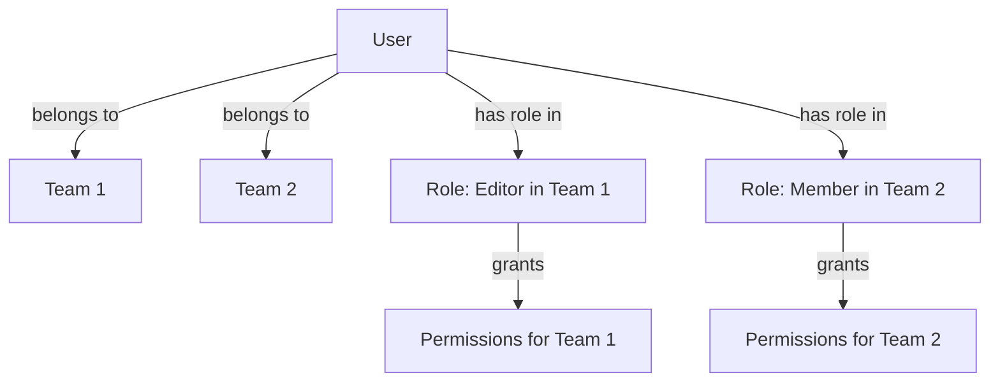

# Phase 3: Implementing Teams and Permissions

<link rel="stylesheet" href="../../assets/css/styles.css">

**Goal:** Implement a comprehensive team system with role-based permissions. Users can belong to multiple teams, and their permissions are scoped to specific teams. We'll use Spatie's Laravel Permission package configured for team-based permissions.

## In This Phase

1. [Understanding spatie/laravel-permission & Team Scoping](./010-understanding-permissions.md) - Learn about the permission package and team scoping
2. [Configure spatie/laravel-permission for Teams](./020-configure-permissions.md) - Set up the permission package for team-based permissions
3. [Permission/Role State Machine](./030-permission-role-state-machine.md) - Implement a state machine for permissions and roles
4. [Permission/Role State Implementation](./020-permission-role-state-implementation.md) - Create the state machine classes for permissions and roles
5. [Permission/Role State Transitions](./040-permission-role-state-transitions.md) - Implement transition classes for permission and role states
6. [Permission/Role State Integration](040-010-permission-role-state-integration.md) - Integrate the state machines with the application
7. [Permission/Role State Integration Part 2](040-020-permission-role-state-integration-part2.md) - Continue integration of state machines
8. [Permission/Role State Integration Part 3](040-030-permission-role-state-integration-part3.md) - Further integration of state machines
9. [Permission/Role State Integration Part 4](040-040-permission-role-state-integration-part4.md) - Additional integration steps
10. [Permission/Role State Integration Part 5](040-050-permission-role-state-integration-part5.md) - Final integration steps
11. [Permission/Role State Testing](100-010-permission-role-state-testing.md) - Test the permission and role state machines
12. [Permission/Role State Testing Part 2](100-020-permission-role-state-testing-part2.md) - Additional testing
13. [Permission/Role State Testing Part 3](100-030-permission-role-state-testing-part3.md) - Final testing
14. [Create PermissionSeeder](./030-permission-seeder.md) - Seed roles and permissions based on team/user type
15. [Create TeamService](./040-team-service.md) - Implement the team service class
16. [Team Hierarchy State Machine](./070-team-hierarchy-state-machine.md) - Implement a state machine for team hierarchies
17. [Team Hierarchy State Implementation](./080-team-hierarchy-state-implementation.md) - Create the state machine classes
18. [Team Hierarchy State Transitions](./090-team-hierarchy-state-transitions.md) - Implement transition classes for the state machine
19. [Team Hierarchy State Integration](150-010-team-hierarchy-state-integration.md) - Integrate the state machine with the application
20. [Team Hierarchy State Integration Part 2](150-020-team-hierarchy-state-integration-part2.md) - Continue integration of state machine
21. [Team Hierarchy State Integration Part 3](150-030-team-hierarchy-state-integration-part3.md) - Further integration steps
22. [Team Hierarchy State Integration Part 4](150-040-team-hierarchy-state-integration-part4.md) - Final integration steps
23. [Team Hierarchy State Testing](190-010-team-hierarchy-state-testing.md) - Test the team hierarchy state machine
24. [Team Hierarchy State Testing Part 2](190-020-team-hierarchy-state-testing-part2.md) - Additional testing
25. [Team Invitation State Machine](./050-team-invitation-state-machine.md) - Implement a state machine for team invitations
26. [Team Invitation State Implementation](./100-team-invitation-state-implementation.md) - Create the state machine classes for invitations
27. [Team Invitation State Transitions](./110-team-invitation-state-transitions.md) - Implement transition classes for invitation states
28. [Team Invitation State Integration](./120-team-invitation-state-integration.md) - Integrate the invitation state machine with the application
29. [Team Invitation State Testing](./130-team-invitation-state-testing.md) - Test the team invitation state machine
30. [Understanding Resource Controllers & Authorization](./055-controllers-policies.md) - Learn about resource controllers and policies
31. [Set up Team Management Backend](./060-team-management-backend.md) - Implement routes, controllers, and policies
32. [User Type Management Component](./060-user-type-management.md) - Implement a component for changing user types
33. [Understanding User Types vs. Roles in Team Context](./070-user-type-vs-role.md) - Learn the differences between user types and roles in teams
34. [Implement Team Management UI with Flux UI](./070-team-management-ui-flux.md) - Create the team management interface with Livewire and Flux UI
35. [Implement Team Management UI in Filament](./080-team-management-ui-filament.md) - Create the team management interface in Filament
36. [Understanding Middleware](./090-middleware.md) - Learn about middleware in Laravel
37. [Create EnsureUserHasTeamRole Middleware](./100-team-role-middleware.md) - Implement middleware for team role checking
38. [Phase 3 Git Commit](./110-git-commit.md) - Save your progress

## Team-Based Permissions

In this phase, we'll implement a sophisticated permission system where:

1. Users can belong to multiple teams
2. Users have specific roles within each team
3. Permissions are scoped to teams
4. Different user types (Admin, Manager, Practitioner, User) have different default permissions
5. Admins have global permissions across all teams

## Flux UI Components for Team Management

We'll use several Flux UI components to create a polished team management interface:

- Cards for team information
- Tables for team members
- Forms for creating and editing teams
- Modals for confirmation dialogs
- Dropdowns for role selection
- Badges for status indicators

Let's begin by [Understanding spatie/laravel-permission & Team Scoping](./010-understanding-permissions.md).
