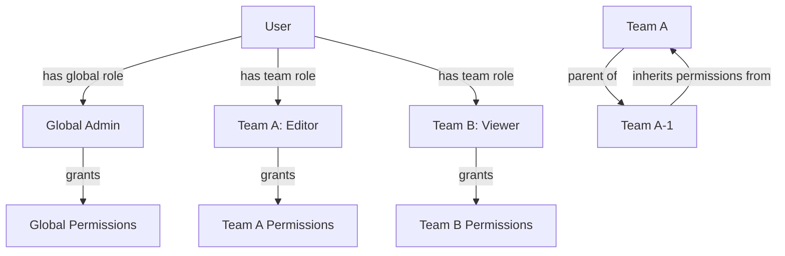

# Understanding spatie/laravel-permission & Team Scoping

<link rel="stylesheet" href="../../assets/css/styles.css">

## Goal

Understand how the Spatie Laravel Permission package works and how to configure it for team-based permissions.

## What is spatie/laravel-permission?

Spatie's Laravel Permission package provides a flexible way to manage roles and permissions in your Laravel application. It allows you to:

1. **Define Permissions**: Create granular permissions for specific actions (e.g., "edit posts", "delete users")
2. **Create Roles**: Group permissions into roles (e.g., "Editor", "Admin")
3. **Assign Roles to Users**: Give users one or more roles
4. **Check Permissions**: Verify if a user has a specific permission, either directly or through a role

### Key Concepts

- **Permission**: A specific action that can be performed (e.g., "edit posts")
- **Role**: A collection of permissions (e.g., "Editor" has "create posts", "edit posts", "delete own posts")
- **Direct Permissions**: Permissions assigned directly to a user
- **Role Permissions**: Permissions inherited through a role

## Team-Based Permissions

By default, Spatie Laravel Permission operates globally - a user with the "Editor" role has that role across the entire application. However, in our UME application, we need to scope permissions to specific teams:

- A user might be an "Editor" in Team A but only a "Viewer" in Team B
- Permissions should only apply within the context of a specific team
- Some users (like Admins) might have global permissions that apply across all teams

### How Team Scoping Works

Spatie Laravel Permission supports team scoping through a simple mechanism:

1. **Team ID Column**: Add a `team_id` column to the roles and permissions tables
2. **Scoped Queries**: When checking permissions, include the team ID in the query
3. **Global vs. Team Permissions**: Permissions without a team ID are global, while those with a team ID are scoped to that team

```php
// Assign a role to a user within a team
$user->assignRole('editor', $team->id);

// Check if a user has a permission within a team
$user->hasPermissionTo('edit posts', $team->id);
```

## Database Structure

When configured for team scoping, the database structure looks like this:

### permissions Table

| Column | Type | Description |
|--------|------|-------------|
| id | bigint | Primary key |
| name | varchar | Permission name (e.g., "edit posts") |
| guard_name | varchar | Authentication guard |
| team_id | bigint | Team ID (null for global permissions) |

### roles Table

| Column | Type | Description |
|--------|------|-------------|
| id | bigint | Primary key |
| name | varchar | Role name (e.g., "Editor") |
| guard_name | varchar | Authentication guard |
| team_id | bigint | Team ID (null for global roles) |

### model_has_permissions Table

| Column | Type | Description |
|--------|------|-------------|
| permission_id | bigint | Permission ID |
| model_type | varchar | Model class (e.g., "App\\Models\\User") |
| model_id | bigint | Model ID |
| team_id | bigint | Team ID (null for global permissions) |

### model_has_roles Table

| Column | Type | Description |
|--------|------|-------------|
| role_id | bigint | Role ID |
| model_type | varchar | Model class (e.g., "App\\Models\\User") |
| model_id | bigint | Model ID |
| team_id | bigint | Team ID (null for global roles) |

### role_has_permissions Table

| Column | Type | Description |
|--------|------|-------------|
| permission_id | bigint | Permission ID |
| role_id | bigint | Role ID |

## Permission Hierarchy

In our UME application, we'll implement a permission hierarchy:

1. **Global Permissions**: Apply across all teams (typically for Admins)
2. **Team Permissions**: Apply only within a specific team
3. **Inherited Permissions**: Teams can inherit permissions from parent teams in the hierarchy



## Integration with STI

Our Single Table Inheritance (STI) user types will integrate with the permission system:

- **Admin**: Has global permissions across all teams
- **Manager**: Has elevated permissions within their teams
- **Practitioner**: Has specific permissions related to their professional activities
- **User**: Has basic permissions based on their team roles

This combination of STI and team-based permissions provides a powerful and flexible authorization system.

## Next Steps

Now that you understand how Spatie Laravel Permission works with team scoping, let's move on to [Configure spatie/laravel-permission for Teams](./020-configure-permissions.md) to set up the package in our application.
