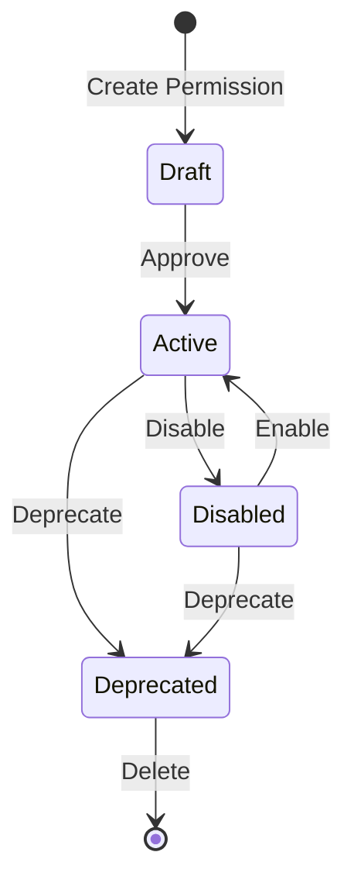
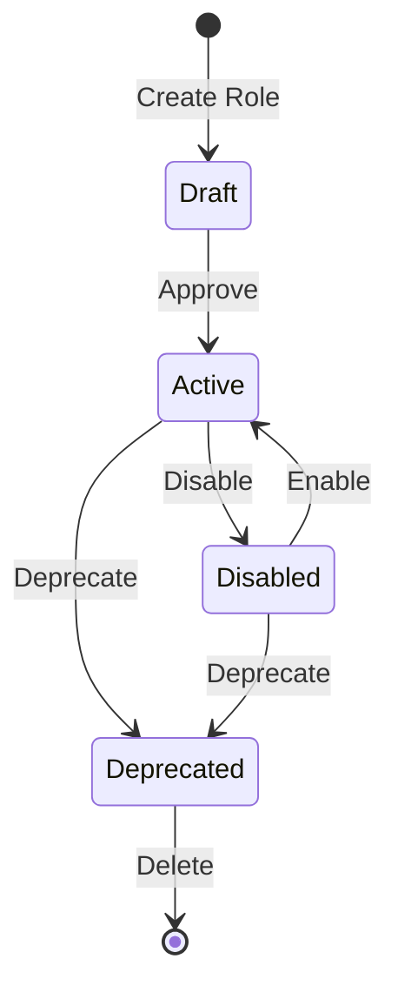
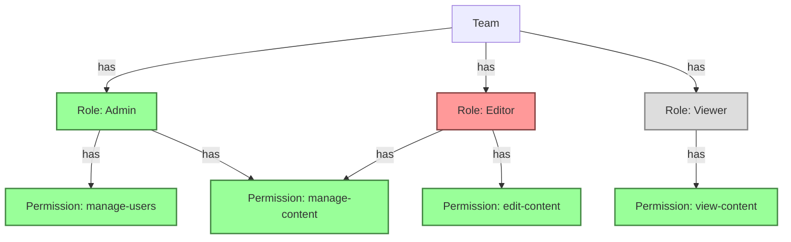

# Permission/Role State Machine

<link rel="stylesheet" href="../../../assets/css/styles.css">

In this section, we'll explore how to implement state machines for permissions and roles in our UME application. This will allow us to manage the lifecycle of permissions and roles, ensuring they transition between states in a controlled and predictable manner.

## Why Use State Machines for Permissions and Roles?

Permissions and roles in enterprise applications often follow specific workflows and lifecycle stages. For example:

1. A new permission might start in a **Draft** state, awaiting approval
2. Once approved, it becomes **Active** and can be assigned to roles
3. Permissions that are no longer needed can be **Deprecated**
4. Some permissions might be temporarily **Disabled** due to system maintenance or security concerns

Using state machines for permissions and roles provides several benefits:

1. **Enforced Workflows**: Ensures permissions and roles follow the correct lifecycle stages
2. **Validation**: Prevents invalid state transitions (e.g., a draft permission can't be deprecated directly)
3. **Audit Trail**: Makes it easy to track the history of permission and role status changes
4. **Business Logic Encapsulation**: Each state can encapsulate specific behavior
5. **Clear Visualization**: Provides a clear visual representation of the permission and role lifecycle

## UPermission State Machine Design

For our UPermission state machine, we'll implement the following states:

### Permission States

1. **Draft**: The initial state for newly created permissions that require approval
2. **Active**: Permissions that are fully operational and can be assigned to roles
3. **Disabled**: Permissions that are temporarily disabled but not removed
4. **Deprecated**: Permissions that are no longer active but preserved for historical purposes

### Permission Transitions

1. **Create Permission**: A new permission is created in the Draft state
2. **Approve**: A draft permission is approved and becomes Active
3. **Disable**: An active permission is temporarily disabled
4. **Enable**: A disabled permission is re-enabled
5. **Deprecate**: An active or disabled permission is deprecated
6. **Delete**: A deprecated permission is permanently deleted

## URole State Machine Design

For our URole state machine, we'll implement the following states:

### Role States

1. **Draft**: The initial state for newly created roles that require approval
2. **Active**: Roles that are fully operational and can be assigned to users
3. **Disabled**: Roles that are temporarily disabled but not removed
4. **Deprecated**: Roles that are no longer active but preserved for historical purposes

### Role Transitions

1. **Create Role**: A new role is created in the Draft state
2. **Approve**: A draft role is approved and becomes Active
3. **Disable**: An active role is temporarily disabled
4. **Enable**: A disabled role is re-enabled
5. **Deprecate**: An active or disabled role is deprecated
6. **Delete**: A deprecated role is permanently deleted

## State-Specific Behaviors

Each state will have specific behaviors and restrictions:

### Permission State Behaviors

| State | Can Be Assigned | Visible in UI | Can Be Modified | Can Be Deleted |
|-------|----------------|---------------|----------------|---------------|
| Draft | No | Only to admins | Yes | Yes |
| Active | Yes | Yes | Yes | No |
| Disabled | No | Yes (with indicator) | Yes | No |
| Deprecated | No | Only in archive view | No | Yes |

### Role State Behaviors

| State | Can Be Assigned | Visible in UI | Can Modify Permissions | Can Be Deleted |
|-------|----------------|---------------|------------------------|---------------|
| Draft | No | Only to admins | Yes | Yes |
| Active | Yes | Yes | Yes | No |
| Disabled | No | Yes (with indicator) | No | No |
| Deprecated | No | Only in archive view | No | Yes |

## Integration with Team-Based Permissions

The state machines will integrate with our team-based permission system:

1. **Team Scoping**: Permission and role states are scoped to teams
2. **Inheritance**: State affects how permissions are inherited in the team hierarchy
3. **Visibility**: State determines permission and role visibility in UI views

## Implementation Approach

We'll implement the permission and role state machines using the Spatie Laravel Model States package, similar to how we implemented the account and team state machines. The implementation will include:

1. **PermissionStatus and RoleStatus Enums**: To represent the possible states
2. **State Classes**: One class for each possible state
3. **Transition Classes**: For complex transitions with additional logic
4. **Model Integration**: Update the UPermission and URole models to use the state machines

## Next Steps

In the next sections, we'll:

1. Create `PermissionStatus` and `RoleStatus` enums to represent the possible states
2. Implement the state machine classes using the Spatie Laravel Model States package
3. Create transition classes for complex transitions
4. Integrate the state machines with our UPermission and URole models
5. Implement controllers and policies for state transitions
6. Create views to display and manage permission and role states

Let's start by [implementing the Permission/Role state classes](./021-permission-role-state-implementation.md).

## Additional Resources

- [Spatie Laravel Model States Documentation](https://spatie.be/docs/laravel-model-states/v2/introduction)
- [Spatie Laravel Permission Documentation](https://spatie.be/docs/laravel-permission/v5/introduction)
- [State Pattern on Refactoring Guru](https://refactoring.guru/design-patterns/state)
- [Laravel Eloquent: Mutators & Casting](https://laravel.com/docs/12.x/eloquent-mutators)
