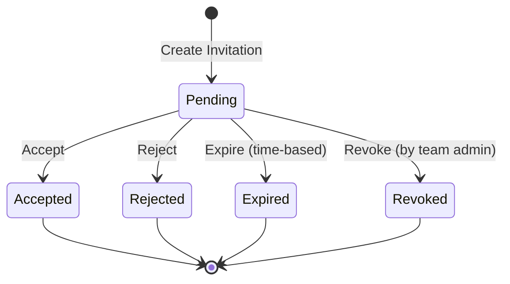

# Team Invitation State Machine

## Introduction

Team invitations are a critical part of team management, allowing team owners and administrators to invite new members to join their teams. To manage the lifecycle of these invitations effectively, we'll implement a state machine that tracks the status of each invitation from creation to resolution.

In this section, we'll implement a robust state machine for team invitations using the Spatie Laravel Model States package. This will provide a clean, maintainable way to manage invitation states and transitions.

## Understanding Team Invitation States

Team invitations can exist in several states throughout their lifecycle:

Let's examine each state:

1. **Pending**: The initial state when an invitation is created and sent to a user.
2. **Accepted**: The invitation has been accepted by the recipient, and they have been added to the team.
3. **Rejected**: The invitation has been explicitly rejected by the recipient.
4. **Expired**: The invitation has expired after a certain period without being accepted or rejected.
5. **Revoked**: The invitation has been revoked by a team administrator before it was accepted or rejected.

## Implementation Approach

We'll implement the team invitation state machine using the Spatie Laravel Model States package, similar to how we implemented the team hierarchy state machine. The implementation will include:

1. **TeamInvitationStatus Enum**: To represent the possible states
2. **State Classes**: One class for each possible state
3. **Transition Classes**: For complex transitions with additional logic
4. **TeamInvitation Model Integration**: Update the TeamInvitation model to use the state machine

## Next Steps

In the next sections, we'll:

1. Create a `TeamInvitationStatus` enum to represent the possible states
2. Implement the state machine classes using the Spatie Laravel Model States package
3. Create transition classes for complex transitions
4. Integrate the state machine with our TeamInvitation model
5. Implement controllers and policies for state transitions
6. Create views to display and manage invitation states

Let's start by defining the TeamInvitationStatus enum and implementing the state machine.

## Additional Resources

- [Spatie Laravel Model States Documentation](https://spatie.be/docs/laravel-model-states)
- [Laravel State Pattern](https://laravel-news.com/the-state-pattern)
- [Finite State Machines in Software Development](https://www.smashingmagazine.com/2018/01/rise-state-machines/)
