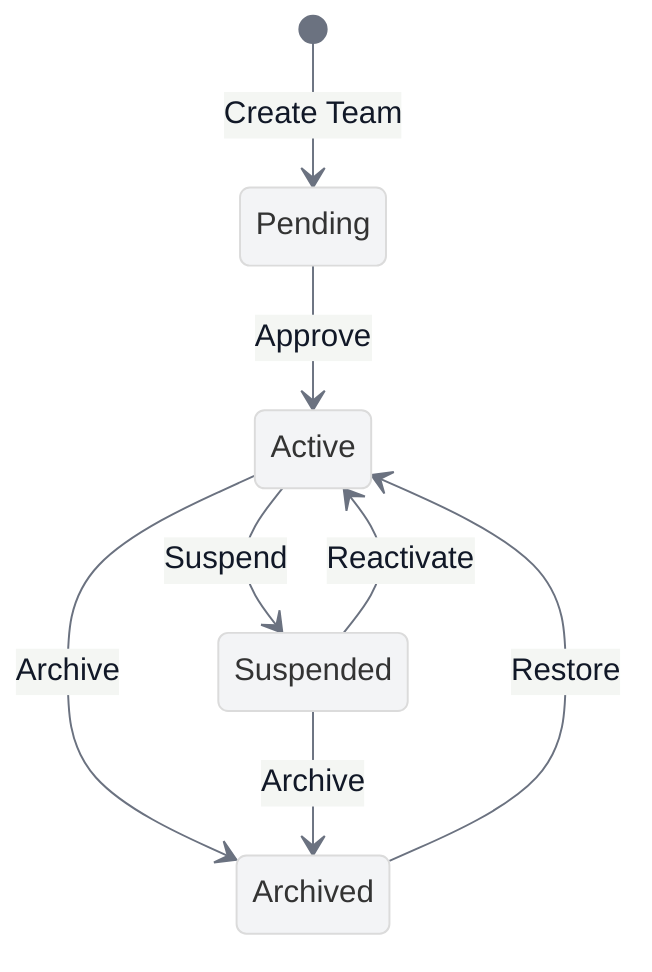
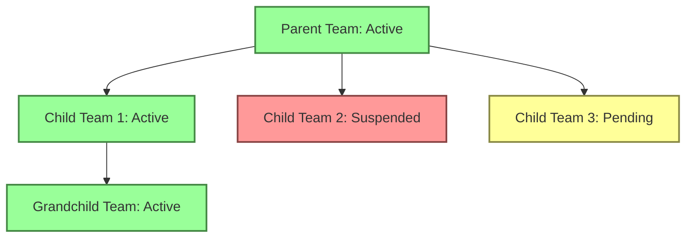

# Team Hierarchy State Machine

<link rel="stylesheet" href="../../../assets/css/styles.css">

In this section, we'll explore how to implement a state machine for team hierarchies in our UME application. This will allow us to manage the lifecycle of teams within a hierarchy, ensuring that teams transition between states in a controlled and predictable manner.

## Why Use a State Machine for Team Hierarchy?

Team hierarchies in organizations often follow specific workflows and lifecycle stages. For example:

1. A new team might start in a **Pending** state, awaiting approval
2. Once approved, it becomes **Active** and fully operational
3. Teams that are no longer needed can be **Archived**
4. Some teams might be temporarily **Suspended** due to reorganization

Using a state machine for team hierarchy provides several benefits:

1. **Enforced Workflows**: Ensures teams follow the correct lifecycle stages
2. **Validation**: Prevents invalid state transitions (e.g., a pending team can't be archived directly)
3. **Audit Trail**: Makes it easy to track the history of team status changes
4. **Business Logic Encapsulation**: Each state can encapsulate specific behavior
5. **Clear Visualization**: Provides a clear visual representation of the team lifecycle

## Team Hierarchy State Machine Design

For our team hierarchy state machine, we'll implement the following states:

### States

1. **Pending**: The initial state for newly created teams that require approval
2. **Active**: Teams that are fully operational and visible in the hierarchy
3. **Suspended**: Teams that are temporarily disabled but not removed
4. **Archived**: Teams that are no longer active but preserved for historical purposes

### Transitions

1. **Create Team**: A new team is created in the Pending state
2. **Approve**: A pending team is approved and becomes Active
3. **Suspend**: An active team is temporarily suspended
4. **Reactivate**: A suspended team is reactivated
5. **Archive**: An active or suspended team is archived
6. **Restore**: An archived team is restored to Active status

## State-Specific Behaviors

Each state will have specific behaviors and restrictions:

| State | Can Add Members | Can Create Child Teams | Visible in Hierarchy | Can Assign Permissions |
|-------|----------------|------------------------|----------------------|------------------------|
| Pending | No | No | Only to admins | No |
| Active | Yes | Yes | Yes | Yes |
| Suspended | No | No | Yes (with indicator) | No |
| Archived | No | No | Only in archive view | No |

## Integration with Team Hierarchy

The state machine will integrate with our existing team hierarchy implementation:

1. **Parent-Child Relationships**: State transitions may cascade to child teams
2. **Permission Inheritance**: State affects how permissions are inherited
3. **Visibility**: State determines team visibility in hierarchy views

## Implementation Approach

We'll implement the team hierarchy state machine using the Spatie Laravel Model States package, similar to how we implemented the account state machine. The implementation will include:

1. **TeamHierarchyStatus Enum**: To represent the possible states
2. **State Classes**: One class for each possible state
3. **Transition Classes**: For complex transitions with additional logic
4. **Team Model Integration**: Update the Team model to use the state machine

## Next Steps

In the next sections, we'll:

1. Create a `TeamHierarchyStatus` enum to represent the possible states
2. Implement the state machine classes using the Spatie Laravel Model States package
3. Create transition classes for complex transitions
4. Integrate the state machine with our Team model
5. Implement controllers and policies for state transitions
6. Create views to display and manage team states

Let's start by [defining the TeamHierarchyStatus enum](./046-team-hierarchy-state-implementation.md).

## Additional Resources

- [Spatie Laravel Model States Documentation](https://spatie.be/docs/laravel-model-states/v2/introduction)
- [State Pattern on Refactoring Guru](https://refactoring.guru/design-patterns/state)
- [Laravel Eloquent: Mutators & Casting](https://laravel.com/docs/12.x/eloquent-mutators)
