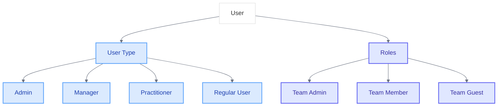

# Understanding User Types vs. Roles in Team Context

<link rel="stylesheet" href="../../assets/css/styles.css">
<link rel="stylesheet" href="../../assets/css/ume-docs-enhancements.css">
<script src="../../assets/js/ume-docs-enhancements.js"></script>

<ul class="breadcrumb-navigation">
    <li><a href="../../000-index.md">UME Tutorial</a></li>
    <li><a href="../000-index.md">Implementation</a></li>
    <li><a href="./000-index.md">Phase 3: Teams & Permissions</a></li>
    <li><a href="./070-user-type-vs-role.md">User Types vs. Roles</a></li>
</ul>

<div class="section-metadata">
    <div class="time-estimate">
        <span class="icon">⏱️</span>
        <span class="label">Time Estimate:</span>
        <span class="value">30-45 minutes</span>
    </div>
    <div class="difficulty-level">
        <span class="icon">🔶🔶</span>
        <span class="label">Difficulty:</span>
        <span class="value">Intermediate</span>
        <span class="explanation">Requires understanding of inheritance, permissions, and team structures</span>
    </div>
    <div class="prerequisites">
        <span class="icon">📋</span>
        <span class="label">Prerequisites:</span>
        <ul>
            <li>Understanding of Single Table Inheritance</li>
            <li>Understanding of Role-Based Access Control</li>
            <li>Team Model Implementation</li>
        </ul>
    </div>
    <div class="learning-outcomes">
        <span class="icon">🎯</span>
        <span class="label">You'll Learn:</span>
        <ul>
            <li>The fundamental differences between user types and roles</li>
            <li>How user types affect team capabilities</li>
            <li>How roles work within team contexts</li>
            <li>Best practices for combining user types and roles</li>
        </ul>
    </div>
</div>

## Goal

Understand the conceptual and practical differences between user types and roles, particularly in the context of teams, and learn how to effectively combine them in your application.

## Introduction

In the UME tutorial, we use both user types (via Single Table Inheritance) and roles (via role-based access control) to manage user capabilities. While these concepts might seem similar at first glance, they serve different purposes and work together to create a flexible and powerful permission system.



<div class="mermaid-caption">Figure 1: User types vs. roles in the UME system</div>

## Understanding User Types

### What are User Types?

User types represent fundamental, often permanent aspects of a user's identity within your application. They define what a user **is** rather than what they can do. In the UME tutorial, we implement user types using Single Table Inheritance (STI).

### Key Characteristics of User Types

1. **Implementation**: Implemented using class inheritance (STI)
2. **Mutability**: Generally static and rarely changed
3. **Scope**: Global to the user across the entire application
4. **Behavior**: Defines what a user "is" (their identity)
5. **Code Organization**: Type-specific methods and properties

### Example User Types in UME

```php
// Base User class
class User extends Authenticatable
{
    // Common user functionality
}

// Admin user type
class Admin extends User
{
    use HasParent;
    
    // Admin-specific functionality
}

// Manager user type
class Manager extends User
{
    use HasParent;
    
    // Manager-specific functionality
}

// Practitioner user type
class Practitioner extends User
{
    use HasParent;
    
    // Practitioner-specific functionality
}
```

## Understanding Roles

### What are Roles?

Roles represent collections of permissions that define what actions a user can perform. Unlike user types, roles are often contextual and can be assigned or revoked as needed. In the UME tutorial, we implement roles using the Spatie Laravel Permission package.

### Key Characteristics of Roles

1. **Implementation**: Implemented using many-to-many relationships
2. **Mutability**: Dynamic and can be assigned/revoked
3. **Scope**: Can be context-specific (e.g., team-specific)
4. **Behavior**: Defines what a user "can do" (their permissions)
5. **Code Organization**: Permission checks and guards

### Example Roles in UME

```php
// Creating roles
Role::create(['name' => 'team-admin']);
Role::create(['name' => 'team-member']);
Role::create(['name' => 'team-guest']);

// Assigning roles to users
$user->assignRole('team-admin');

// Checking roles
if ($user->hasRole('team-admin')) {
    // User has team-admin role
}
```

## Key Differences Between User Types and Roles

| Aspect | User Types | Roles |
|--------|------------|-------|
| **Implementation** | Class inheritance (STI) | Many-to-many relationship |
| **Mutability** | Generally static | Can be assigned/revoked |
| **Scope** | Global to the user | Can be context-specific |
| **Behavior** | Defines what a user "is" | Defines what a user "can do" |
| **Code Organization** | Type-specific methods | Permission checks |
| **Number** | Usually few (3-5) | Can be many (10+) |
| **Granularity** | Coarse-grained | Fine-grained |
| **Change Frequency** | Rarely changed | Changed as needed |

## User Types in Team Context

User types can significantly affect how users interact with teams in your application. Different user types might have different capabilities regarding team creation, management, and membership.

### How User Types Affect Team Capabilities

```php
// Different user types might have different team capabilities
class Admin extends User
{
    use HasParent;
    
    /**
     * Determine if the user can create teams.
     *
     * @return bool
     */
    public function canCreateTeams(): bool
    {
        return true; // Admins can create teams
    }
    
    /**
     * Determine if the user can join any team.
     *
     * @return bool
     */
    public function canJoinAnyTeam(): bool
    {
        return true; // Admins can join any team
    }
    
    /**
     * Determine if the user can manage all teams.
     *
     * @return bool
     */
    public function canManageAllTeams(): bool
    {
        return true; // Admins can manage all teams
    }
}

class Manager extends User
{
    use HasParent;
    
    /**
     * Determine if the user can create teams.
     *
     * @return bool
     */
    public function canCreateTeams(): bool
    {
        return true; // Managers can create teams
    }
    
    /**
     * Determine if the user can join any team.
     *
     * @return bool
     */
    public function canJoinAnyTeam(): bool
    {
        return false; // Managers can only join teams they're invited to
    }
    
    /**
     * Determine if the user can manage all teams.
     *
     * @return bool
     */
    public function canManageAllTeams(): bool
    {
        return false; // Managers can only manage their own teams
    }
}

class Practitioner extends User
{
    use HasParent;
    
    /**
     * Determine if the user can create teams.
     *
     * @return bool
     */
    public function canCreateTeams(): bool
    {
        return false; // Practitioners cannot create teams
    }
    
    /**
     * Determine if the user can join any team.
     *
     * @return bool
     */
    public function canJoinAnyTeam(): bool
    {
        return false; // Practitioners can only join teams they're invited to
    }
    
    /**
     * Determine if the user can manage all teams.
     *
     * @return bool
     */
    public function canManageAllTeams(): bool
    {
        return false; // Practitioners cannot manage teams
    }
}
```

### Type-Based Team Operations

User types can be used to determine what team operations a user can perform:

```php
// In a controller or service
public function index(Request $request)
{
    $user = $request->user();
    
    // Different team listing based on user type
    if ($user instanceof Admin) {
        // Admins can see all teams
        $teams = Team::all();
    } elseif ($user instanceof Manager) {
        // Managers can see teams they own or are members of
        $teams = $user->ownedTeams->merge($user->teams);
    } else {
        // Regular users can only see teams they're members of
        $teams = $user->teams;
    }
    
    return view('teams.index', compact('teams'));
}
```

## Roles in Team Context

While user types define global capabilities, roles are often used to define permissions within specific teams. This allows for fine-grained control over what users can do within each team they belong to.

### Team-Specific Roles

In the UME tutorial, we implement team-specific roles by adding a `team_id` column to the roles and permissions tables:

```php
// Team-specific role assignment
$user->assignRole('team-admin', $team->id);

// Check if user has a role in a specific team
if ($user->hasRole('team-admin', $team->id)) {
    // User has team-admin role in this team
}
```

### Role-Based Team Permissions

Roles can be used to determine what actions a user can perform within a team:

```php
// In a controller or service
public function update(Request $request, Team $team)
{
    $user = $request->user();
    
    // Check if user has permission to update the team
    if ($user->hasPermissionTo('update team', $team->id)) {
        // Update the team
        $team->update($request->validated());
        return redirect()->route('teams.show', $team);
    }
    
    return back()->with('error', 'You do not have permission to update this team.');
}
```

### Role Hierarchy in Teams

You can implement a role hierarchy within teams to simplify permission management:

```php
// Define role hierarchy
$roleHierarchy = [
    'team-owner' => ['team-admin', 'team-moderator', 'team-member'],
    'team-admin' => ['team-moderator', 'team-member'],
    'team-moderator' => ['team-member'],
    'team-member' => [],
];

// Check if a user has a role or a higher role
public function hasRoleOrHigher(User $user, string $role, Team $team): bool
{
    $userRole = $team->users()->where('user_id', $user->id)->first()->pivot->role;
    
    if ($userRole === $role) {
        return true;
    }
    
    foreach ($this->roleHierarchy as $higherRole => $lowerRoles) {
        if (in_array($role, $lowerRoles) && $userRole === $higherRole) {
            return true;
        }
    }
    
    return false;
}
```

## Combining User Types and Roles

The real power comes from combining user types and roles to create a flexible and powerful permission system. User types provide broad, application-wide capabilities, while roles provide fine-grained, context-specific permissions.

### Complementary Usage

```php
// In a controller or service
public function show(Request $request, Team $team)
{
    $user = $request->user();
    
    // Global access for admins
    if ($user instanceof Admin) {
        return view('teams.show', compact('team'));
    }
    
    // Team-specific access based on roles
    if ($user->hasRole('team-member', $team->id)) {
        return view('teams.show', compact('team'));
    }
    
    return back()->with('error', 'You do not have permission to view this team.');
}
```

### Type-Aware Role Assignment

You can use user types to determine default roles when a user joins a team:

```php
// In a team invitation service
public function addUserToTeam(User $user, Team $team)
{
    // Add the user to the team
    $team->users()->attach($user->id);
    
    // Assign default role based on user type
    if ($user instanceof Admin) {
        $user->assignRole('team-admin', $team->id);
    } elseif ($user instanceof Manager) {
        $user->assignRole('team-moderator', $team->id);
    } else {
        $user->assignRole('team-member', $team->id);
    }
}
```

### Complex Permission Systems

By combining user types and roles, you can create complex permission systems that handle both global and team-specific permissions:

```php
// In a permission service
public function canManageTeam(User $user, Team $team): bool
{
    // Global admin can manage any team
    if ($user instanceof Admin) {
        return true;
    }
    
    // Team owner can manage their team
    if ($team->owner_id === $user->id) {
        return true;
    }
    
    // User with team-admin role can manage the team
    if ($user->hasRole('team-admin', $team->id)) {
        return true;
    }
    
    return false;
}
```

## Real-World Examples

Let's look at some real-world examples of how user types and roles can be combined in different application contexts.

### Healthcare Application Example

**User Types**:
- Administrator (global system access)
- Physician (can see patients, write prescriptions)
- Nurse (can see patients, record vitals)
- Patient (can see own records)

**Roles within Teams (Departments)**:
- Department Head (can manage department settings)
- Staff Member (can participate in department activities)
- Consultant (limited access to department resources)

**Example Implementation**:

```php
// A physician joining a department
public function addPhysicianToDepartment(Physician $physician, Team $department)
{
    // Add the physician to the department
    $department->users()->attach($physician->id);
    
    // Assign role based on whether they're the department head
    if ($department->head_id === $physician->id) {
        $physician->assignRole('department-head', $department->id);
    } else {
        $physician->assignRole('staff-member', $department->id);
    }
    
    // Physicians always get prescription privileges
    $physician->givePermissionTo('write prescriptions', $department->id);
}
```

### Educational Platform Example

**User Types**:
- Administrator (global system access)
- Teacher (can create courses, grade assignments)
- Student (can enroll in courses, submit assignments)
- Parent (can view student progress)

**Roles within Teams (Courses)**:
- Course Creator (can modify course structure)
- Teaching Assistant (can grade assignments)
- Student (can access course materials)
- Observer (can view but not participate)

**Example Implementation**:

```php
// A teacher creating a course
public function createCourse(Teacher $teacher, array $courseData)
{
    // Create the course (team)
    $course = Team::create([
        'name' => $courseData['name'],
        'description' => $courseData['description'],
        'owner_id' => $teacher->id,
    ]);
    
    // Add the teacher to the course
    $course->users()->attach($teacher->id);
    
    // Assign course creator role
    $teacher->assignRole('course-creator', $course->id);
    
    // Teachers automatically get grading permissions
    $teacher->givePermissionTo('grade assignments', $course->id);
    
    return $course;
}
```

## Best Practices

When working with user types and roles in the context of teams, consider the following best practices:

1. **Use User Types for Identity, Roles for Permissions**:
   - User types should define what a user is (identity)
   - Roles should define what a user can do (permissions)

2. **Keep User Types Simple**:
   - Limit the number of user types to 3-5
   - Focus on fundamental differences in user identity

3. **Make Roles Contextual**:
   - Design roles to be team-specific when appropriate
   - Create a clear hierarchy of roles within teams

4. **Combine Types and Roles Effectively**:
   - Use user types for broad, application-wide capabilities
   - Use roles for fine-grained, context-specific permissions

5. **Document the Relationship**:
   - Clearly document how user types and roles interact
   - Create a permission matrix showing what each type and role can do

6. **Test Complex Scenarios**:
   - Write tests for complex permission scenarios
   - Ensure that the combination of types and roles works as expected

7. **Consider Performance**:
   - Cache permission checks for frequently accessed resources
   - Optimize database queries for role and permission checks

## Quick Reference

<div class="quick-reference">
    <h2>User Types vs. Roles Quick Reference</h2>

    <div class="key-concepts">
        <dl>
            <dt>User Type</dt>
            <dd>A fundamental aspect of a user's identity implemented using Single Table Inheritance</dd>

            <dt>Role</dt>
            <dd>A collection of permissions that define what actions a user can perform</dd>

            <dt>Team-Specific Role</dt>
            <dd>A role that is scoped to a specific team, allowing for context-specific permissions</dd>

            <dt>Permission</dt>
            <dd>A specific action that a user is allowed to perform</dd>
        </dl>
    </div>

    <div class="syntax">
        <h3>Common Usage Patterns</h3>
        <pre><code>// Check user type
if ($user instanceof Admin) {
    // User is an Admin
}

// Assign role
$user->assignRole('team-admin', $team->id);

// Check role
if ($user->hasRole('team-admin', $team->id)) {
    // User has team-admin role in this team
}

// Give permission
$user->givePermissionTo('edit team', $team->id);

// Check permission
if ($user->hasPermissionTo('edit team', $team->id)) {
    // User can edit the team
}</code></pre>
    </div>

    <div class="gotchas">
        <h3>Common Pitfalls</h3>
        <ul>
            <li>Confusing user types and roles</li>
            <li>Creating too many user types</li>
            <li>Not scoping roles to teams when appropriate</li>
            <li>Hardcoding permissions instead of using role checks</li>
            <li>Not considering the interaction between types and roles</li>
        </ul>
    </div>
</div>

## Troubleshooting

<div class="troubleshooting-guide">
    <h2>Common Issues with User Types and Roles</h2>

    <div class="symptoms">
        <h3>Permission Inconsistencies</h3>
        <ul>
            <li>Users have unexpected permissions</li>
            <li>Permissions work in some contexts but not others</li>
            <li>Permission checks return different results in different parts of the application</li>
        </ul>
    </div>

    <div class="causes">
        <h3>Possible Causes</h3>
        <ol>
            <li>Confusion between user type capabilities and role permissions</li>
            <li>Missing team context in permission checks</li>
            <li>Caching issues with permissions</li>
            <li>Inconsistent permission naming</li>
        </ol>
    </div>

    <div class="solutions">
        <h3>Solutions</h3>

        <h4>For Type vs. Role Confusion</h4>
        <p>Clearly separate type-based and role-based checks:</p>
        <pre><code>// Type-based check (what the user is)
if ($user instanceof Admin) {
    // Admin-specific functionality
}

// Role-based check (what the user can do)
if ($user->hasRole('team-admin', $team->id)) {
    // Team admin functionality
}</code></pre>

        <h4>For Missing Team Context</h4>
        <p>Always include team context in role and permission checks:</p>
        <pre><code>// Incorrect (no team context)
if ($user->hasRole('admin')) {
    // This checks for a global admin role
}

// Correct (with team context)
if ($user->hasRole('admin', $team->id)) {
    // This checks for an admin role in the specific team
}</code></pre>

        <h4>For Caching Issues</h4>
        <p>Clear permission cache when roles or permissions change:</p>
        <pre><code>// After changing roles or permissions
app()->make(\Spatie\Permission\PermissionRegistrar::class)->forgetCachedPermissions();</code></pre>

        <h4>For Inconsistent Naming</h4>
        <p>Standardize permission and role naming:</p>
        <pre><code>// Use consistent naming patterns
// For permissions: [action].[resource]
// For roles: [context]-[role]

// Examples:
// Permissions: 'create.team', 'update.team', 'delete.team'
// Roles: 'team-admin', 'team-member', 'team-guest'</code></pre>
    </div>

    <div class="prevention">
        <h3>Prevention</h3>
        <ul>
            <li>Document the relationship between user types and roles</li>
            <li>Create a permission matrix showing what each type and role can do</li>
            <li>Write tests for complex permission scenarios</li>
            <li>Use middleware to enforce permissions consistently</li>
            <li>Implement a permission debugging tool for development</li>
        </ul>
    </div>
</div>

## Next Steps

<div class="page-navigation">
    <a href="060-user-type-management.md" class="prev">User Type Management</a>
    <a href="080-team-hierarchy-state-implementation.md" class="next">Team Hierarchy State Implementation</a>
</div>

Now that you understand the differences between user types and roles in the context of teams, you're ready to implement a comprehensive permission system that leverages both concepts effectively.
