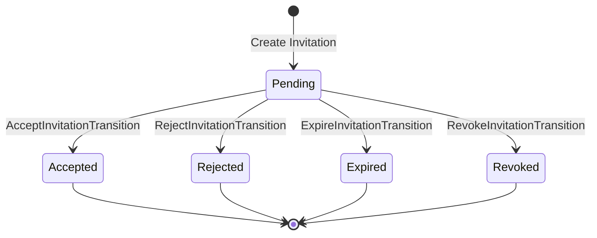

# Team Invitation State Transitions

In this section, we'll implement the transition classes for our team invitation state machine. These classes will handle the logic for transitioning between different states.

## Understanding State Transitions

State transitions represent the movement from one state to another. In our team invitation state machine, we have the following transitions:



Each transition has its own class that encapsulates the logic for that specific transition. This approach allows us to:

1. Keep our state classes focused on representing states, not transitions
2. Add complex logic to transitions without cluttering state classes
3. Easily add validation, logging, and other side effects to transitions
4. Maintain a clean separation of concerns

## Implementing Transition Classes

Let's implement each transition class:

### AcceptInvitationTransition

```php
<?php

declare(strict_types=1);

namespace App\States\TeamInvitation\Transitions;

use App\Models\TeamInvitation;
use App\Models\User;
use App\States\TeamInvitation\Accepted;
use App\States\TeamInvitation\Pending;
use Illuminate\Support\Facades\Log;
use Spatie\ModelStates\Transition;

class AcceptInvitationTransition extends Transition
{
    public function __construct(
        private User $user,
        private ?string $notes = null
    ) {}

    /**
     * Handle the transition.
     */
    public function handle(TeamInvitation $invitation, Pending $currentState): Accepted
    {
        // Check if the invitation is for this user
        if ($invitation->email !== $this->user->email) {
            throw new \Exception('This invitation is not for you.');
        }

        // Check if the invitation has expired
        if ($invitation->hasExpired()) {
            throw new \Exception('This invitation has expired.');
        }

        // Add the user to the team
        $invitation->team->users()->attach($this->user->id, [
            'role' => $invitation->role ?? 'member',
        ]);

        // Set the user's current team if they don't have one
        if (! $this->user->current_team_id) {
            $this->user->forceFill(['current_team_id' => $invitation->team_id])->save();
        }

        // Log the transition
        Log::info("Team invitation {$invitation->id} was accepted by User {$this->user->id}" . 
            ($this->notes ? " with notes: {$this->notes}" : ""));

        // Record the action in activity log
        activity()
            ->performedOn($invitation)
            ->causedBy($this->user)
            ->withProperties([
                'notes' => $this->notes,
                'from_state' => 'pending',
                'to_state' => 'accepted',
                'team_id' => $invitation->team_id,
            ])
            ->log('team_invitation_accepted');

        return new Accepted($invitation);
    }
}
```

### RejectInvitationTransition

```php
<?php

declare(strict_types=1);

namespace App\States\TeamInvitation\Transitions;

use App\Models\TeamInvitation;
use App\Models\User;
use App\States\TeamInvitation\Pending;
use App\States\TeamInvitation\Rejected;
use Illuminate\Support\Facades\Log;
use Spatie\ModelStates\Transition;

class RejectInvitationTransition extends Transition
{
    public function __construct(
        private User $user,
        private ?string $reason = null,
        private ?string $notes = null
    ) {}

    /**
     * Handle the transition.
     */
    public function handle(TeamInvitation $invitation, Pending $currentState): Rejected
    {
        // Check if the invitation is for this user
        if ($invitation->email !== $this->user->email) {
            throw new \Exception('This invitation is not for you.');
        }

        // Check if the invitation has expired
        if ($invitation->hasExpired()) {
            throw new \Exception('This invitation has expired.');
        }

        // Log the transition
        Log::info("Team invitation {$invitation->id} was rejected by User {$this->user->id}" . 
            ($this->reason ? " for reason: {$this->reason}" : "") .
            ($this->notes ? " with notes: {$this->notes}" : ""));

        // Record the action in activity log
        activity()
            ->performedOn($invitation)
            ->causedBy($this->user)
            ->withProperties([
                'reason' => $this->reason,
                'notes' => $this->notes,
                'from_state' => 'pending',
                'to_state' => 'rejected',
                'team_id' => $invitation->team_id,
            ])
            ->log('team_invitation_rejected');

        return new Rejected($invitation);
    }
}
```

### ExpireInvitationTransition

```php
<?php

declare(strict_types=1);

namespace App\States\TeamInvitation\Transitions;

use App\Models\TeamInvitation;
use App\States\TeamInvitation\Expired;
use App\States\TeamInvitation\Pending;
use Illuminate\Support\Facades\Log;
use Spatie\ModelStates\Transition;

class ExpireInvitationTransition extends Transition
{
    /**
     * Handle the transition.
     */
    public function handle(TeamInvitation $invitation, Pending $currentState): Expired
    {
        // Check if the invitation has actually expired
        if (! $invitation->hasExpired()) {
            throw new \Exception('This invitation has not expired yet.');
        }

        // Log the transition
        Log::info("Team invitation {$invitation->id} has expired.");

        // Record the action in activity log
        activity()
            ->performedOn($invitation)
            ->withProperties([
                'from_state' => 'pending',
                'to_state' => 'expired',
                'team_id' => $invitation->team_id,
                'expired_at' => $invitation->expires_at->toDateTimeString(),
            ])
            ->log('team_invitation_expired');

        return new Expired($invitation);
    }
}
```

### RevokeInvitationTransition

```php
<?php

declare(strict_types=1);

namespace App\States\TeamInvitation\Transitions;

use App\Models\TeamInvitation;
use App\Models\User;
use App\States\TeamInvitation\Pending;
use App\States\TeamInvitation\Revoked;
use Illuminate\Support\Facades\Log;
use Spatie\ModelStates\Transition;

class RevokeInvitationTransition extends Transition
{
    public function __construct(
        private User $revokedBy,
        private ?string $reason = null,
        private ?string $notes = null
    ) {}

    /**
     * Handle the transition.
     */
    public function handle(TeamInvitation $invitation, Pending $currentState): Revoked
    {
        // Check if the user has permission to revoke the invitation
        if (! $invitation->team->users()->where('user_id', $this->revokedBy->id)->exists() &&
            $invitation->team->owner_id !== $this->revokedBy->id) {
            throw new \Exception('You do not have permission to revoke this invitation.');
        }

        // Log the transition
        Log::info("Team invitation {$invitation->id} was revoked by User {$this->revokedBy->id}" . 
            ($this->reason ? " for reason: {$this->reason}" : "") .
            ($this->notes ? " with notes: {$this->notes}" : ""));

        // Record the action in activity log
        activity()
            ->performedOn($invitation)
            ->causedBy($this->revokedBy)
            ->withProperties([
                'reason' => $this->reason,
                'notes' => $this->notes,
                'from_state' => 'pending',
                'to_state' => 'revoked',
                'team_id' => $invitation->team_id,
            ])
            ->log('team_invitation_revoked');

        return new Revoked($invitation);
    }
}
```

## Integrating Transitions with the TeamInvitation Model

Now, let's add methods to the TeamInvitation model to make it easier to use these transitions:

```php
<?php

namespace App\Models;

use App\Enums\TeamInvitationStatus;
use App\States\TeamInvitation\TeamInvitationState;
use App\States\TeamInvitation\Transitions\AcceptInvitationTransition;
use App\States\TeamInvitation\Transitions\ExpireInvitationTransition;
use App\States\TeamInvitation\Transitions\RejectInvitationTransition;
use App\States\TeamInvitation\Transitions\RevokeInvitationTransition;
use Illuminate\Database\Eloquent\Factories\HasFactory;
use Illuminate\Database\Eloquent\Model;
use Illuminate\Database\Eloquent\Relations\BelongsTo;
use Illuminate\Support\Str;
use Spatie\ModelStates\HasStates;

class TeamInvitation extends Model
{
    use HasFactory, HasStates;

    // ... existing code ...

    /**
     * Accept the invitation.
     */
    public function accept(User $user, ?string $notes = null): self
    {
        $this->state->transition(AcceptInvitationTransition::class, $user, $notes);
        return $this;
    }

    /**
     * Reject the invitation.
     */
    public function reject(User $user, ?string $reason = null, ?string $notes = null): self
    {
        $this->state->transition(RejectInvitationTransition::class, $user, $reason, $notes);
        return $this;
    }

    /**
     * Expire the invitation.
     */
    public function expire(): self
    {
        $this->state->transition(ExpireInvitationTransition::class);
        return $this;
    }

    /**
     * Revoke the invitation.
     */
    public function revoke(User $revokedBy, ?string $reason = null, ?string $notes = null): self
    {
        $this->state->transition(RevokeInvitationTransition::class, $revokedBy, $reason, $notes);
        return $this;
    }

    /**
     * Check if the invitation is in a specific state.
     */
    public function isInState(TeamInvitationStatus $status): bool
    {
        return $this->state->status() === $status;
    }

    /**
     * Check if the invitation is pending.
     */
    public function isPending(): bool
    {
        return $this->isInState(TeamInvitationStatus::PENDING);
    }

    /**
     * Check if the invitation is accepted.
     */
    public function isAccepted(): bool
    {
        return $this->isInState(TeamInvitationStatus::ACCEPTED);
    }

    /**
     * Check if the invitation is rejected.
     */
    public function isRejected(): bool
    {
        return $this->isInState(TeamInvitationStatus::REJECTED);
    }

    /**
     * Check if the invitation is expired.
     */
    public function isExpired(): bool
    {
        return $this->isInState(TeamInvitationStatus::EXPIRED);
    }

    /**
     * Check if the invitation is revoked.
     */
    public function isRevoked(): bool
    {
        return $this->isInState(TeamInvitationStatus::REVOKED);
    }
}
```

## Creating a Command to Expire Invitations

Let's create a command to automatically expire invitations that have passed their expiration date:

```php
<?php

namespace App\Console\Commands;

use App\Models\TeamInvitation;
use App\States\TeamInvitation\Pending;
use Illuminate\Console\Command;

class ExpireTeamInvitations extends Command
{
    protected $signature = 'team-invitations:expire';
    protected $description = 'Expire team invitations that have passed their expiration date';

    public function handle()
    {
        $expiredInvitations = TeamInvitation::whereState('state', Pending::class)
            ->where('expires_at', '<', now())
            ->get();

        $count = 0;
        foreach ($expiredInvitations as $invitation) {
            try {
                $invitation->expire();
                $count++;
            } catch (\Exception $e) {
                $this->error("Failed to expire invitation {$invitation->id}: {$e->getMessage()}");
            }
        }

        $this->info("Expired {$count} team invitations.");

        return Command::SUCCESS;
    }
}
```

Don't forget to register this command in the `app/Console/Kernel.php` file to run it daily:

```php
protected function schedule(Schedule $schedule)
{
    // ... other scheduled commands ...
    $schedule->command('team-invitations:expire')->daily();
}
```

In the next section, we'll implement the controller methods and policies for managing team invitations.
