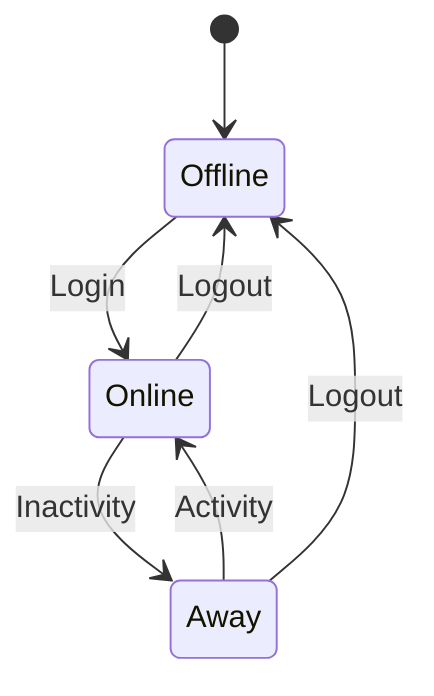
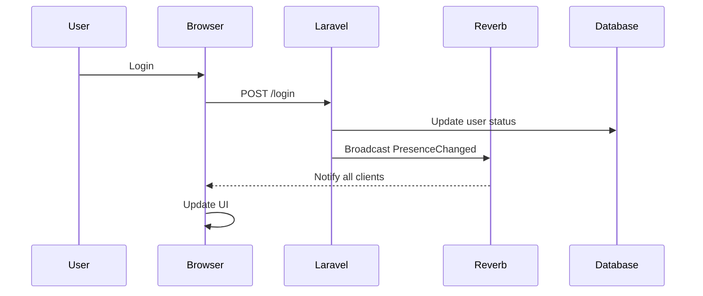

# Phase 4: Real-time Features & User Presence

<link rel="stylesheet" href="../../assets/css/styles.css">

**Goal:** Implement the User Presence State Machine using Laravel Reverb and Echo. Create a real-time system to track user online status, implement presence indicators, and add comprehensive activity logging.

## In This Phase

1. [Understanding WebSockets, Reverb & Echo](./010-understanding-websockets.md) - Learn about real-time communication
2. [Set Up Laravel Reverb](./020-setup-reverb.md) - Configure the WebSocket server
3. [Configure Laravel Echo](./030-configure-echo.md) - Set up the client-side library
4. [Implement Presence Status Backend](./040-presence-backend.md) - Create the User Presence State Machine
5. [Create PresenceChanged Broadcast Event](./050-presence-event.md) - Implement the broadcast event
6. [Create Login/Logout Presence Listeners](./060-presence-listeners.md) - Update presence on login/logout
7. [Understanding Contextual Activity Logging](./070-activity-logging.md) - Learn about activity logging
8. [Implement Activity Logging via Listeners](./085-implement-logging.md) - Set up comprehensive logging
9. [Implement Real-time Presence UI with Flux UI](./090-flux-ui-presence-indicator.md) - Create the presence indicator
10. [Implement Real-time Chat with Flux UI](./100-flux-ui-chat.md) - Create the chat interface
11. [Attribute-Based API](./115-attribute-based-api.md) - Use PHP 8 attributes for API endpoints
12. [Testing](./120-testing.md) - Test the real-time features ([Test Files](./120-testing/))
13. [Phase 4 Git Commit](./130-git-commit.md) - Save your progress

## User Presence State Machine

The User Presence State Machine is a key feature of this phase. It allows us to track and display the real-time status of users in the application:

- **Online**: User is actively using the application
- **Away**: User has been inactive for a period of time
- **Offline**: User is not logged in

The state machine is implemented using PHP 8.1+ Enums and integrated with Laravel's broadcasting system to provide real-time updates across the application.

## Real-time Communication Flow

The diagram below illustrates how presence status changes are communicated in real-time:

Let's begin by [Understanding WebSockets, Reverb & Echo](./010-understanding-websockets.md).
