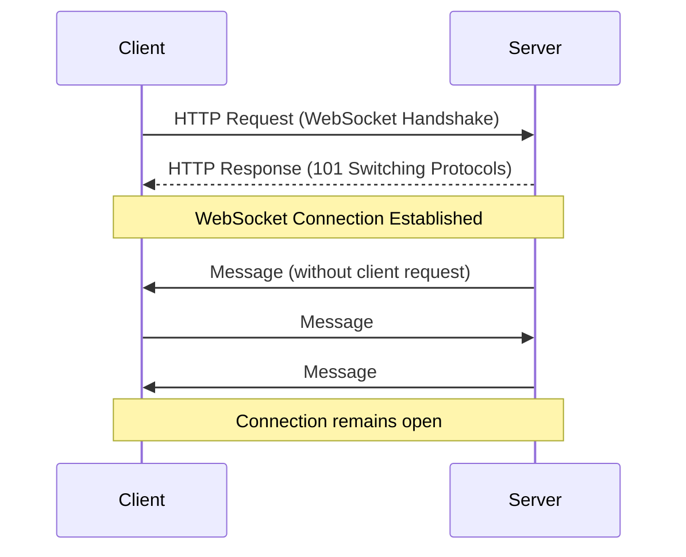
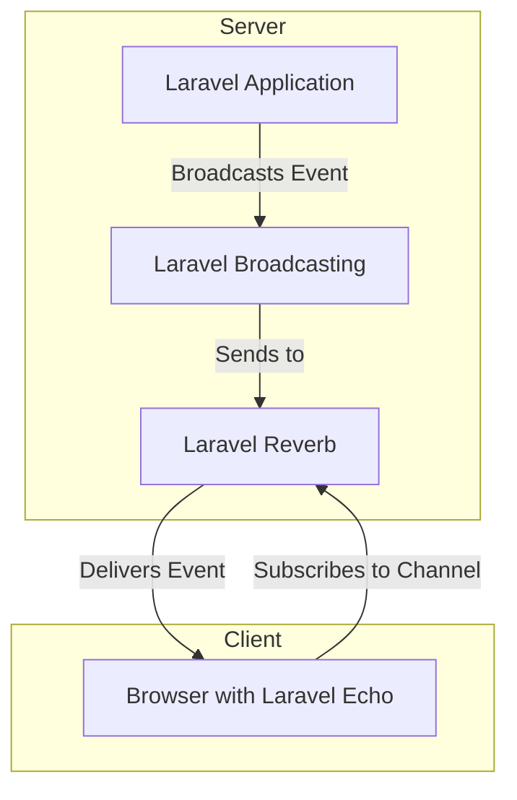

# Understanding WebSockets, Reverb & Echo

<link rel="stylesheet" href="../../assets/css/styles.css">

## Introduction to Real-time Web Applications

Traditional web applications follow a request-response model: the client makes a request, the server responds, and the connection is closed. This approach works well for many scenarios but falls short when real-time updates are needed.

Real-time features like presence indicators (showing which users are online), chat applications, and live notifications require a different approach. This is where WebSockets come in.

## What are WebSockets?

WebSockets provide a persistent connection between a client and server, allowing bi-directional communication. Unlike HTTP, which is stateless, WebSockets maintain an open connection, enabling:

- Server-to-client communication without client requests
- Lower latency for real-time updates
- Reduced overhead compared to polling

## Laravel's Real-time Stack

Laravel provides a comprehensive stack for real-time applications:

### 1. Laravel Reverb

[Laravel Reverb](https://laravel.com/docs/11.x/reverb) is Laravel's first-party WebSocket server, introduced in Laravel 11. It's designed specifically for Laravel applications and provides:

- Simple setup and configuration
- Seamless integration with Laravel's authentication
- Support for private, presence, and public channels
- Horizontal scaling with Redis
- Lower resource usage compared to third-party solutions

### 2. Laravel Echo

[Laravel Echo](https://laravel.com/docs/11.x/broadcasting#client-side-installation) is a JavaScript library that makes it easy to subscribe to channels and listen for events broadcast by your Laravel application. It provides:

- A simple API for subscribing to channels
- Authentication for private and presence channels
- Event handling for incoming messages
- Support for presence channels with user tracking

### 3. Laravel Broadcasting

[Laravel Broadcasting](https://laravel.com/docs/11.x/broadcasting) is the server-side component that allows you to broadcast events to your WebSocket server. It provides:

- A simple API for broadcasting events
- Channel authorization
- Support for multiple broadcast drivers (Reverb, Pusher, Ably, Redis)
- Integration with Laravel's event system

## Types of Channels

Laravel's broadcasting system supports three types of channels:

### Public Channels

- Available to anyone without authentication
- Good for public data like announcements
- Least secure option

### Private Channels

- Require authentication
- Only authenticated users can subscribe
- Good for user-specific data
- Named with a `private-` prefix

### Presence Channels

- Extend private channels with presence awareness
- Track which users are subscribed to the channel
- Provide events when users join or leave
- Perfect for online indicators and chat applications
- Named with a `presence-` prefix

## How It All Works Together

Here's how the components work together in a real-time Laravel application:

1. Your Laravel application dispatches an event that implements `ShouldBroadcast`
2. Laravel's broadcasting system serializes the event and sends it to Reverb
3. Clients subscribed to the relevant channel via Laravel Echo receive the event
4. Your JavaScript code handles the event and updates the UI

## Key Concepts for Our Implementation

For our User Presence State Machine, we'll use:

1. **Presence Channels**: To track which users are online in each team
2. **Broadcast Events**: To notify clients when a user's presence status changes
3. **Event Listeners**: To update presence status on login/logout
4. **Laravel Echo**: To subscribe to presence channels and update the UI

## Benefits for the UME Application

Implementing real-time features with WebSockets provides several benefits:

1. **Enhanced User Experience**: Users see who's online without refreshing
2. **Reduced Server Load**: No need for polling to check status
3. **Team Awareness**: Team members can see who's available for collaboration
4. **Foundation for Chat**: The same infrastructure supports our chat feature

## Next Steps

Now that we understand the concepts, let's set up Laravel Reverb to handle our WebSocket connections.

[Set Up Laravel Reverb →](./020-setup-reverb.md)
