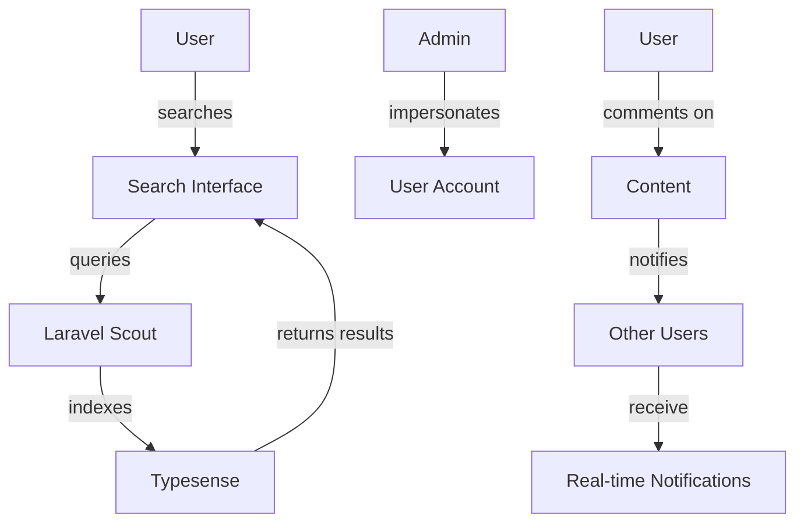

# Phase 5: Advanced Features & Real-time Implementation

<link rel="stylesheet" href="../../assets/css/styles.css">

**Goal:** Implement advanced features including user impersonation, comments, user settings, search functionality, and API authentication. Enhance the real-time features with channel authorizations and UI components.

## In This Phase

1. [Implement Impersonation Feature](./010-impersonation.md) - Allow admins to impersonate users
2. [Implement Comments Feature with Flux UI](./020-comments-flux.md) - Add commenting functionality
3. [Implement User Settings with Flux UI](./030-user-settings.md) - Create user settings management
4. [Understanding Full-Text Search](./040-search.md) - Learn about Scout and Typesense
5. [Implement Search Backend](./050-search-backend.md) - Set up the search infrastructure
6. [Implement Search Frontend with Flux UI](./020-flux-ui-search.md) - Create the search interface
7. [Understanding Broadcasting Channels & Authorization](./070-broadcasting-channels.md) - Learn about channel auth
8. [Define Broadcast Channel Authorizations](./080-channel-auth.md) - Set up channel permissions
9. [Implement Real-time Notifications with Flux UI](./030-flux-ui-notifications.md) - Create the notification system
10. [Understanding API Authentication](./100-api-auth.md) - Learn about Passport and Sanctum
11. [Configure API Authentication Guards](./110-api-guards.md) - Set up authentication guards
12. [Set Up Passport and Sanctum](./120-passport-sanctum.md) - Configure API authentication
13. [Implement Filament User Type Change Action](./130-filament-user-type.md) - Add type change functionality
14. [Testing User Model Enhancements](./010-testing.md) - Comprehensive testing strategies
15. [Phase 5 Git Commit](./140-git-commit.md) - Save your progress

## Advanced Features with Flux UI

In this phase, we'll use Flux UI components to create sophisticated interfaces for:

- User impersonation controls
- Comment threads and forms
- User settings panels
- Search interfaces with real-time results
- Notification systems

Let's begin by implementing the [Impersonation Feature](./010-impersonation.md).
