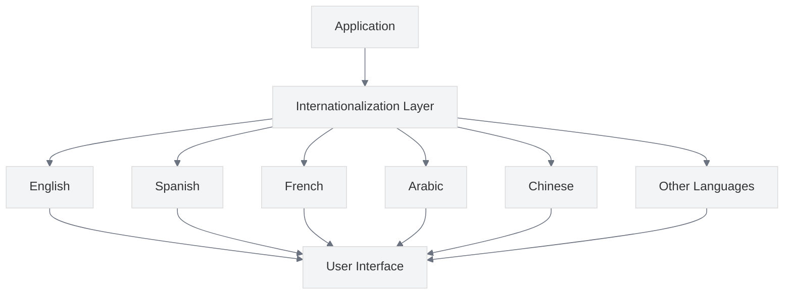

# Internationalization and Localization

<link rel="stylesheet" href="../../../../assets/css/styles.css">

**Goal:** Implement internationalization and localization features in your UME application to support multiple languages and regional settings, making your application accessible to a global audience.

## What You'll Learn

In this section, you'll learn how to:

- Set up internationalization in Laravel
- Manage translations for your application
- Localize UME features for different languages and regions
- Support right-to-left (RTL) languages
- Format dates, times, and currencies for different locales
- Implement pluralization rules for different languages
- Detect user language preferences
- Consider cultural differences in your application
- Test internationalized applications

## In This Section

1. [Setting Up Internationalization](./010-setting-up-i18n.md) - Configure your Laravel application for internationalization
2. [Translation Management](./020-translation-management.md) - Manage translations for your application
3. [Localizing UME Features](./030-localizing-ume-features.md) - Examples of localizing specific UME features
4. [RTL Language Support](./040-rtl-language-support.md) - Support right-to-left languages
5. [Date and Time Formatting](./050-date-time-formatting.md) - Format dates and times for different locales
6. [Currency Handling](./060-currency-handling.md) - Handle currencies in different locales
7. [Pluralization Rules](./070-pluralization-rules.md) - Handle pluralization in different languages
8. [Language Detection](./080-language-detection.md) - Detect user language preferences
9. [Cultural Considerations](./090-cultural-considerations.md) - Consider cultural differences in your application
10. [Testing Internationalized Applications](./100-testing-i18n.md) - Test your internationalized application

## Why Internationalization Matters

Internationalization is essential for applications that aim to reach a global audience. By supporting multiple languages and regional settings, you can:

- **Expand Your User Base**: Reach users who speak different languages
- **Improve User Experience**: Users prefer applications in their native language
- **Meet Legal Requirements**: Some regions require applications to be available in local languages
- **Demonstrate Inclusivity**: Show that you value users from different cultures and backgrounds

Let's begin by [Setting Up Internationalization](./010-setting-up-i18n.md) in your Laravel application.
