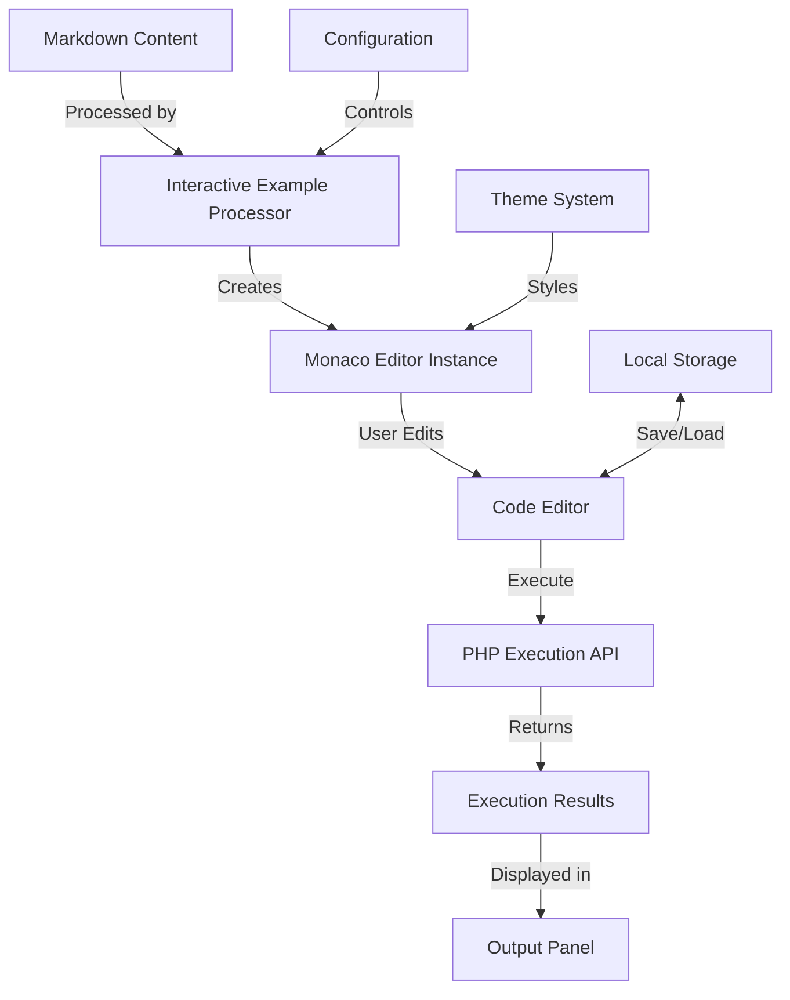

# Interactive Examples System Overview

This document provides a comprehensive overview of the interactive code examples system implemented in the UME tutorial documentation.

## System Architecture

The interactive examples system consists of several components working together to provide a seamless experience for users:

### Key Components

1. **Interactive Example Processor**: Parses markdown content to find interactive code blocks and converts them to interactive examples.
2. **Monaco Editor**: A powerful code editor that provides syntax highlighting, code completion, and other features.
3. **Code Executor**: Sends code to the backend API for execution and displays the results.
4. **PHP Execution API**: A secure backend service that executes PHP code in a sandboxed environment.
5. **Local Storage**: Saves user modifications to code examples between sessions.

## Data Flow

1. When a page loads, the interactive example processor scans the content for interactive code blocks.
2. For each block found, it creates an interactive example with a Monaco editor instance.
3. When a user clicks the "Run" button, the code is sent to the PHP execution API.
4. The API executes the code in a secure sandbox and returns the results.
5. The results are displayed in the output panel.
6. User modifications are saved to local storage for persistence between sessions.

## Security Measures

The system implements several security measures to prevent malicious code execution:

1. **Sandboxed Environment**: Code is executed in an isolated environment with limited access to system resources.
2. **Timeout Limits**: Execution is limited to 5 seconds to prevent infinite loops.
3. **Memory Limits**: Memory usage is limited to 128MB to prevent memory exhaustion.
4. **Disabled Functions**: Dangerous functions like `system`, `exec`, `shell_exec`, etc. are disabled.
5. **Input Validation**: All input is validated to ensure it meets the required format.
6. **Output Sanitization**: All output is sanitized to prevent XSS attacks.

## Performance Considerations

The system is designed to be performant and responsive:

1. **Lazy Loading**: Monaco editor is loaded only when needed.
2. **Caching**: Executed code results are cached to prevent unnecessary API calls.
3. **Throttling**: API calls are throttled to prevent overloading the server.
4. **Optimized Assets**: JavaScript and CSS files are minified and optimized for production.

## Accessibility Features

The interactive examples are designed to be accessible to all users:

1. **Keyboard Navigation**: All features can be accessed using keyboard shortcuts.
2. **Screen Reader Support**: ARIA attributes and proper semantic HTML ensure screen reader compatibility.
3. **High Contrast Mode**: The UI adapts to high contrast mode for users with visual impairments.
4. **Focus Management**: Proper focus management ensures a good experience for keyboard users.

## Browser Compatibility

The system is tested and compatible with the following browsers:

- Chrome 90+
- Firefox 90+
- Safari 14+
- Edge 90+

Mobile browsers are also supported, with a responsive design that adapts to different screen sizes.

## Dependencies

The system relies on the following dependencies:

1. **Monaco Editor**: For code editing capabilities.
2. **Laravel**: For the backend API.
3. **Symfony Process**: For secure code execution.
4. **Local Storage API**: For saving user modifications.

## Configuration Options

The system can be configured through the following options:

1. **Theme**: Light or dark theme for the editor.
2. **Font Size**: Adjustable font size for the editor.
3. **Tab Size**: Number of spaces for tabs.
4. **Line Numbers**: Show or hide line numbers.
5. **Execution Timeout**: Maximum execution time for code.
6. **Memory Limit**: Maximum memory usage for code execution.

These options can be customized in the configuration files or through the API.
