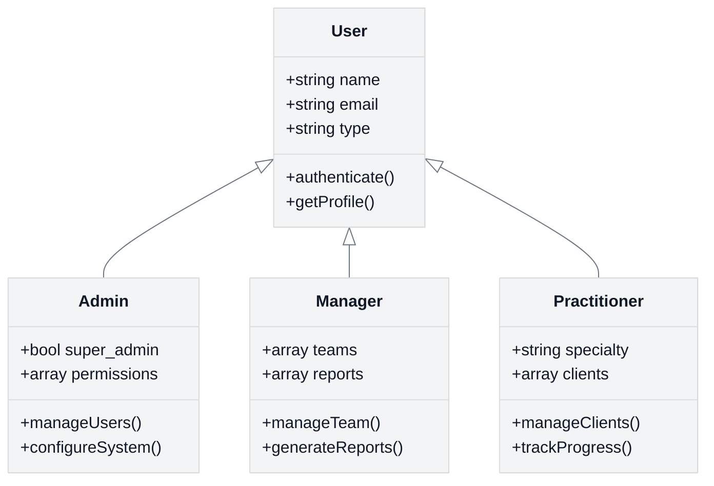

# Introduction Exercises - Sample Answers

<link rel="stylesheet" href="../assets/css/styles.css">

This document provides sample answers to the exercises in the Introduction section of the User Model Enhancements (UME) tutorial.

## Set 1: Understanding UME Concepts

### Question Answers

1. **What is Single Table Inheritance (STI) and why is it used in the UME tutorial?**
   - **Answer: B) A design pattern that allows an inheritance hierarchy of classes to be stored in a single database table**
   - **Explanation:** Single Table Inheritance (STI) is a design pattern that allows you to represent an inheritance hierarchy of classes in a single database table. In the UME tutorial, STI is used to create different user types (Admin, Manager, Practitioner) that all share the same database table but have different behaviors and properties.

2. **Which package is used to implement STI in the UME tutorial?**
   - **Answer: C) tightenco/parental**
   - **Explanation:** The UME tutorial uses the tightenco/parental package to implement Single Table Inheritance. This package provides traits like HasChildren and HasParent that make it easy to set up STI in Laravel Eloquent models.

3. **What are the four user types implemented in the UME tutorial?**
   - **Answer: B) Admin, Manager, Practitioner, User**
   - **Explanation:** The UME tutorial implements four user types: the base User model and three specialized types - Admin, Manager, and Practitioner. Each specialized type inherits from the base User model but has additional functionality specific to its role.

4. **Which UI approach is used as the primary path in the UME tutorial?**
   - **Answer: C) Livewire/Volt with Flux UI**
   - **Explanation:** The primary UI approach in the UME tutorial is Livewire/Volt with Flux UI. This combination provides a modern, reactive UI experience without requiring a separate JavaScript framework, making it a good fit for Laravel developers who prefer to work primarily with PHP.

### Exercise Solution: Create a diagram that illustrates the relationship between the different user types



**Explanation:**
- The diagram shows the inheritance relationship between the base User model and the specialized user types
- Each user type inherits all properties and methods from the base User model
- Each specialized type has additional attributes and methods specific to its role
- The type field in the User model is used to determine which specialized class to instantiate
- All user types are stored in the same database table, following the STI pattern

## Set 2: Understanding the Tutorial Structure

### Question Answers

1. **What is the purpose of breaking the UME tutorial into phases?**
   - **Answer: C) To provide bite-sized, incremental steps with working code at each stage**
   - **Explanation:** The UME tutorial is broken into phases to provide bite-sized, incremental steps with working code at each stage. This approach makes the tutorial more manageable, allows learners to see progress at each step, and ensures that they have a functional application even if they don't complete all phases.

2. **Why does the UME tutorial provide multiple UI implementation approaches?**
   - **Answer: B) To accommodate different team skills and project requirements**
   - **Explanation:** The UME tutorial provides multiple UI implementation approaches to accommodate different team skills and project requirements. Some teams may prefer Livewire/Volt for its PHP-centric approach, while others might prefer Inertia.js with Vue or React for more complex frontend requirements.

3. **What is the relationship between Laravel Fortify and Livewire in the UME tutorial?**
   - **Answer: B) Fortify provides backend authentication logic while Livewire provides the UI**
   - **Explanation:** In the UME tutorial, Laravel Fortify provides the backend authentication logic (registration, login, password reset, etc.), while Livewire provides the UI components that interact with Fortify. This separation allows for a clean architecture where authentication logic is decoupled from the presentation layer.

4. **Which of the following is NOT a real-time feature implemented in the UME tutorial?**
   - **Answer: D) Real-time video conferencing**
   - **Explanation:** The UME tutorial implements real-time presence indicators (online/offline status), real-time notifications, and a real-time chat system, but it does not implement real-time video conferencing, which would require additional technologies beyond the scope of the tutorial.

### Exercise Solution: Create a learning roadmap for the UME tutorial

#### UME Tutorial Learning Roadmap

**Prerequisites (1-2 days)**
- Basic Laravel knowledge
- Understanding of PHP 8.2+ features
- Familiarity with Composer and npm
- Basic understanding of authentication concepts

**Phase 0: Foundation (1 day)**
- **Key Learning Outcomes:**
  - Setting up a Laravel 12 project
  - Installing and configuring required packages
  - Understanding the project structure

**Phase 1: Core Models & STI (2 days)**
- **Key Learning Outcomes:**
  - Implementing Single Table Inheritance
  - Creating model relationships
  - Writing and running migrations
  - Understanding model traits

**Phase 2: Auth & Profiles (2-3 days)**
- **Key Learning Outcomes:**
  - Implementing authentication with Fortify
  - Creating user profiles
  - Managing avatars with Spatie Media Library
  - Understanding state machines for user status

**Phase 3: Teams & Permissions (2-3 days)**
- **Key Learning Outcomes:**
  - Implementing team management
  - Setting up role-based permissions
  - Creating invitation systems
  - Understanding many-to-many relationships

**Phase 4: Real-time Features (2 days)**
- **Key Learning Outcomes:**
  - Implementing WebSockets with Laravel Echo
  - Creating real-time notifications
  - Building presence indicators
  - Understanding event broadcasting

**Phase 5: Advanced Features (2-3 days)**
- **Key Learning Outcomes:**
  - Implementing activity logging
  - Creating user impersonation
  - Building an API with sanctum
  - Understanding advanced Laravel features

**Phase 6: Polishing (1-2 days)**
- **Key Learning Outcomes:**
  - Implementing internationalization
  - Optimizing performance
  - Enhancing security
  - Preparing for deployment

**Total Estimated Time: 11-16 days**

**Approach Tips:**
- Complete each phase before moving to the next
- Run tests after each major implementation step
- Commit code at logical milestones
- Take time to understand concepts before implementing
- Experiment with variations of the implementation

## Exercise 3: Understanding User Models in Laravel

### Question Answers

1. **What are the core interfaces implemented by the standard Laravel User model?**
   - **Answer: B) Authenticatable, Authorizable, Notifiable**
   - **Explanation:** The standard Laravel User model implements the Authenticatable interface for authentication functionality, the Authorizable interface for authorization capabilities, and the Notifiable interface for sending notifications to users.

2. **Which of the following is NOT typically a fillable attribute in the base Laravel User model?**
   - **Answer: D) remember_token**
   - **Explanation:** The remember_token attribute is not typically included in the fillable array because it's used internally by Laravel's authentication system to maintain "remember me" sessions. Including it in the fillable array could pose a security risk.

3. **What is the purpose of the 'hidden' attributes in the User model?**
   - **Answer: B) To prevent attributes from being serialized to JSON/arrays**
   - **Explanation:** The 'hidden' attributes in the User model are excluded when the model is converted to an array or JSON. This is important for sensitive data like passwords and remember tokens that should never be exposed in API responses or frontend data.

4. **How does Laravel's authentication system interact with the User model?**
   - **Answer: B) It uses the User model for login, registration, and password resets**
   - **Explanation:** Laravel's authentication system uses the User model as the central component for all authentication operations, including login, registration, password resets, and session management.

### Exercise Solution

### Sample Answer

The standard Laravel User model is a foundational element of the authentication system. Here's a detailed breakdown:

1. **Model Structure**: The User model extends `Authenticatable` which provides core authentication functionality and implements multiple interfaces for various authentication features:
   - `Authenticatable`: Provides core user authentication
   - `MustVerifyEmail`: Enables email verification functionality
   - `CanResetPassword`: Enables password reset functionality

2. **Key Components**:
   - **Fillable attributes**: Controls mass assignment protection (`name`, `email`, `password`)
   - **Hidden attributes**: Prevents sensitive data like passwords from being serialized
   - **Cast attributes**: Automatically converts attributes to specific types (e.g., `email_verified_at` to datetime)

3. **Authentication Flow**:
   - Laravel's auth system uses the User model for login, registration, password resets
   - The model interacts with middleware like `auth` to protect routes
   - Sessions and tokens are linked to User model instances

4. **Relationships**: The base User model can be extended with relationships to other models, such as:
   - One-to-many relationships with content (posts, comments)
   - Many-to-many relationships with roles, permissions, teams

### Resources for Further Study

1. **Official Documentation**:
   - [Laravel Authentication](https://laravel.com/docs/authentication)
   - [Eloquent Model Conventions](https://laravel.com/docs/eloquent)

2. **Books and Tutorials**:
   - "Laravel Up & Running" by Matt Stauffer (Chapters on Authentication)
   - "Laravel: Code Bright" by Dayle Rees (User Authentication sections)

3. **Video Resources**:
   - Laracasts series: "Laravel Authentication: From Scratch"
   - Laravel Daily: "Authentication Deep Dive"

4. **Advanced Topics**:
   - Custom authentication guards
   - Multi-auth systems
   - JWT (JSON Web Token) authentication

## Exercise 4: Exploring Enhancement Opportunities

### Question Answers

1. **Which of the following is NOT a common enhancement to the User model?**
   - **Answer: D) Implementing database sharding**
   - **Explanation:** While adding profile fields, implementing avatar management, and adding social authentication are common enhancements to the User model, database sharding is an advanced database architecture technique that goes beyond simple model enhancements and involves distributing data across multiple databases.

2. **What is a benefit of using a package like Spatie MediaLibrary for avatar management?**
   - **Answer: B) It provides automatic resizing, format conversion, and storage optimization**
   - **Explanation:** Spatie MediaLibrary provides powerful features for managing media files, including automatic image resizing, format conversion, and storage optimization. This makes it ideal for handling user avatars, which often need to be displayed in different sizes and formats.

3. **What is a common approach for implementing user status management?**
   - **Answer: B) Using a status field with predefined states**
   - **Explanation:** A common approach for implementing user status management is to use a status field with predefined states (e.g., active, inactive, suspended). This can be further enhanced with state machine patterns to manage transitions between states.

4. **Which enhancement would be most useful for security monitoring?**
   - **Answer: C) Adding tracking metadata like last_login_at and last_login_ip**
   - **Explanation:** Adding tracking metadata like last_login_at and last_login_ip is most useful for security monitoring as it allows you to track user login patterns and detect potentially suspicious activity.

### Exercise Description
You were asked to identify potential enhancements to the base Laravel User model and explain their benefits.

### Sample Answer

The standard User model can be enhanced in numerous ways to provide richer functionality:

1. **Extended Profile Data**:
   - **Implementation**: Add columns like `first_name`, `last_name`, `bio`, `phone_number`
   - **Benefits**: Provides a more complete user profile without needing an additional table
   - **Technical approach**: Create migration to add fields and update the User model's fillable array

2. **Avatar Management**:
   - **Implementation**: Add avatar handling with packages like Spatie MediaLibrary
   - **Benefits**: Consistent image handling with automatic resizing, format conversion, and storage optimization
   - **Technical approach**:
     ```php
     // In User model
     use Spatie\MediaLibrary\HasMedia;
     use Spatie\MediaLibrary\InteractsWithMedia;

     class User extends Authenticatable implements HasMedia
     {
         use InteractsWithMedia;

         // Register collections
         public function registerMediaCollections(): void
         {
             $this->addMediaCollection('avatar')
                 ->singleFile()
                 ->useDisk('public');
         }
     }
     ```

3. **Social Authentication Integration**:
   - **Implementation**: Add fields for social provider IDs (e.g., `github_id`, `google_id`)
   - **Benefits**: Allows users to login via multiple authentication providers
   - **Technical considerations**: Requires logic to link accounts and prevent duplicate emails

4. **Tracking Metadata**:
   - **Implementation**: Add fields like `last_login_at`, `login_count`, `last_login_ip`
   - **Benefits**: Provides analytics and security insights
   - **Technical approach**: Create listeners for login events to update these fields

5. **Status Management**:
   - **Implementation**: Add `status` field with states like 'active', 'suspended', 'pending'
   - **Benefits**: Allows granular control over user access without deleting accounts
   - **Technical approach**: Use enum types (PHP 8.1+) or define constants in the model

### Resources for Further Study

1. **Official Documentation and Packages**:
   - [Spatie Media Library](https://spatie.be/docs/laravel-medialibrary)
   - [Laravel Socialite](https://laravel.com/docs/socialite)
   - [Laravel Enum package](https://github.com/BenSampo/laravel-enum)

2. **Articles and Tutorials**:
   - "Advanced Laravel User Models" on Laravel News
   - "Building User Profiles in Laravel" on Laravel Daily

3. **GitHub Examples**:
   - Examine popular open-source Laravel projects like Bagisto, BookStack, or Monica

4. **Advanced Concepts**:
   - Implementing Two-Factor Authentication
   - User impersonation capabilities
   - Role-Based Access Control (RBAC) integration

## Exercise 5: Planning a Model Enhancement Strategy

### Question Answers

1. **What is the first step in enhancing a User model in a production application?**
   - **Answer: B) Assessment and analysis of current structure and usage**
   - **Explanation:** Before making any changes to a User model in a production application, it's essential to thoroughly assess and analyze the current structure and usage. This helps identify potential impacts, dependencies, and risks associated with the planned enhancements.

2. **Why is it important to create backward-compatible migrations?**
   - **Answer: B) To allow for rollback if issues occur**
   - **Explanation:** Creating backward-compatible migrations is crucial because it allows you to roll back changes if issues occur during deployment. This minimizes the risk of data loss or application downtime in production environments.

3. **What testing approach is recommended before deploying User model changes?**
   - **Answer: C) Comprehensive testing including unit, integration, and performance tests**
   - **Explanation:** Before deploying User model changes, comprehensive testing is recommended, including unit tests for individual components, integration tests for interactions between components, and performance tests to ensure the changes don't negatively impact application performance.

4. **What is a recommended approach when adding new fields to the User model?**
   - **Answer: B) Add fields as nullable initially and populate data before making them required**
   - **Explanation:** When adding new fields to the User model, it's recommended to add them as nullable initially and populate data before making them required. This approach allows for a smoother transition and prevents issues with existing records.

### Exercise Description
You were asked to outline a step-by-step approach for enhancing the User model in a production application.

### Sample Answer

Enhancing a User model in a production environment requires careful planning and execution to prevent disruption:

1. **Assessment Phase**:
   - **Database Analysis**: Examine the current table structure, indexes, and constraints
   - **Code Review**: Identify all places in code that interact with the User model
   - **Dependency Mapping**: Map all relationships and foreign key constraints
   - **Usage Patterns**: Analyze how the User model is currently used (through logs/monitoring)

2. **Planning Phase**:
   - **Schema Design**: Design the enhanced schema with all new fields and relationships
   - **Migration Strategy**: Plan backward-compatible migrations that can be rolled back
   - **Testing Strategy**: Plan unit, integration, and production simulation tests
   - **Rollback Plan**: Create a detailed plan for reversing changes if issues occur

3. **Development Phase**:
   - **Create Migrations**: Write migrations that add columns without removing existing ones
   - **Update Model**: Modify User model to support new fields and functionality
   - **Update Related Code**: Update controllers, views, and related logic
   - **Write Tests**: Create comprehensive tests for all new functionality

4. **Testing Phase**:
   - **Unit Testing**: Test individual components in isolation
   - **Integration Testing**: Test components working together
   - **Performance Testing**: Ensure changes don't negatively impact performance
   - **Staging Environment**: Deploy to a staging environment that mirrors production

5. **Deployment Phase**:
   - **Backup**: Create database backups before deployment
   - **Scheduled Downtime**: Consider scheduling deployment during low-traffic periods
   - **Incremental Deployment**: Deploy changes in phases if possible
   - **Monitoring**: Implement enhanced monitoring during and after deployment

6. **Post-Deployment Phase**:
   - **Verification**: Verify all functionality works as expected
   - **Performance Monitoring**: Monitor for any performance impacts
   - **User Feedback**: Collect feedback on new features
   - **Documentation**: Update internal and external documentation

### Practical Implementation Example

For adding a `first_name` and `last_name` to replace a single `name` field:

1. **Create migration**:
   ```php
   public function up()
   {
       Schema::table('users', function (Blueprint $table) {
           $table->string('first_name')->nullable()->after('name');
           $table->string('last_name')->nullable()->after('first_name');
       });

       // Populate new fields from existing name field
       DB::statement("UPDATE users SET
           first_name = SUBSTRING_INDEX(name, ' ', 1),
           last_name = TRIM(SUBSTRING(name, LOCATE(' ', name)))
       ");
   }

   public function down()
   {
       Schema::table('users', function (Blueprint $table) {
           $table->dropColumn(['first_name', 'last_name']);
       });
   }
   ```

2. **Update User model**:
   ```php
   protected $fillable = [
       'name', 'first_name', 'last_name', 'email', 'password',
   ];

   // Add accessor for backward compatibility
   public function getNameAttribute()
   {
       if (!$this->first_name && !$this->last_name) {
           return $this->attributes['name'];
       }

       return trim($this->first_name . ' ' . $this->last_name);
   }

   // Add mutator for backward compatibility
   public function setNameAttribute($value)
   {
       $this->attributes['name'] = $value;

       $parts = explode(' ', $value, 2);
       $this->attributes['first_name'] = $parts[0];
       $this->attributes['last_name'] = $parts[1] ?? '';
   }
   ```

### Resources for Further Study

1. **Database Migration Strategies**:
   - [Laravel's Zero Downtime Deployment](https://laravel-news.com/laravel-zero-downtime-deployment)
   - [Safe Database Migration Patterns](https://www.braintreepayments.com/blog/safe-operations-for-high-volume-postgresql/)

2. **Testing Resources**:
   - [Testing Laravel Applications](https://laravel.com/docs/testing)
   - [Laravel Dusk for Browser Testing](https://laravel.com/docs/dusk)

3. **Deployment Tools**:
   - [Laravel Envoy for Deployment Scripts](https://laravel.com/docs/envoy)
   - [Laravel Forge for Server Management](https://forge.laravel.com/)
   - [GitHub Actions for CI/CD](https://github.com/features/actions)

4. **Monitoring Tools**:
   - [Laravel Telescope for Application Insights](https://laravel.com/docs/telescope)
   - [New Relic for Performance Monitoring](https://newrelic.com/)
   - [Sentry for Error Tracking](https://sentry.io/)
