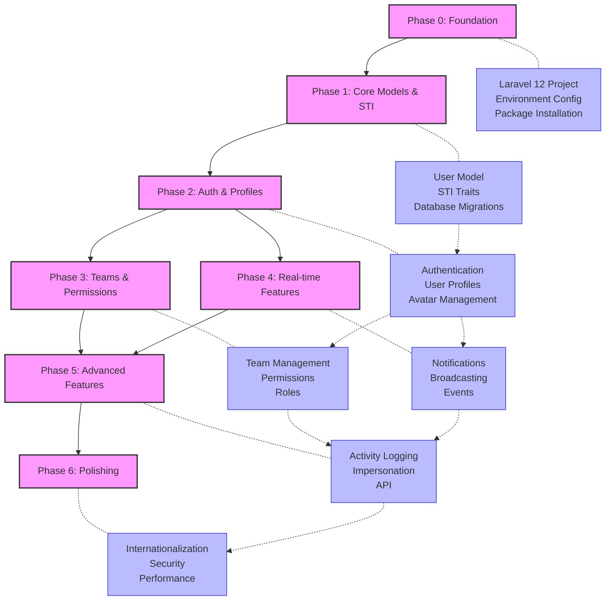

# Implementation Approach Exercises - Sample Answers

<link rel="stylesheet" href="../assets/css/styles.css">

This file contains sample answers to the Implementation Approach exercises from the UME tutorial.

## Set 1: Understanding Implementation Phases

### Question Answers

1. **What is the purpose of Phase 0 in the UME tutorial?**
   - **Answer: B) To set up the Laravel 12 project, install packages, and configure the environment**
   - **Explanation:** Phase 0 (Foundation) is focused on setting up the project infrastructure, including creating a new Laravel 12 project, installing necessary packages, configuring the environment, and preparing the development environment. This phase establishes the foundation for all subsequent phases.

2. **Which phase implements Single Table Inheritance for the User model?**
   - **Answer: B) Phase 1: Core Models & STI**
   - **Explanation:** Phase 1 is specifically dedicated to implementing the core models, with a focus on enhancing the User model using Single Table Inheritance (STI). This phase includes creating the necessary traits, implementing the inheritance structure, and setting up the database migrations to support STI.

3. **What is the relationship between Phase 2 (Auth & Profiles) and Phase 3 (Teams & Permissions)?**
   - **Answer: B) Phase 3 depends on Phase 2**
   - **Explanation:** Phase 3 (Teams & Permissions) builds upon the authentication and user profile functionality implemented in Phase 2. The teams and permissions system requires authenticated users with profiles to function properly, establishing a clear dependency where Phase 3 relies on the completion of Phase 2.

4. **What is the final phase of the UME tutorial?**
   - **Answer: B) Phase 6: Polishing**
   - **Explanation:** Phase 6 (Polishing) is the final phase of the UME tutorial. This phase focuses on refining the application, implementing internationalization, enhancing security, optimizing performance, and preparing the application for deployment.

### Exercise Solution: Dependency Graph for Implementation Phases

**Explanation:**
- The diagram shows the sequential dependency between phases, with each phase building upon the previous ones
- Phase 0 establishes the foundation for all subsequent phases
- Phase 1 implements the core models and STI, which is required for all other functionality
- Phase 2 (Auth & Profiles) is a prerequisite for both Phase 3 (Teams & Permissions) and Phase 4 (Real-time Features)
- Both Phase 3 and Phase 4 feed into Phase 5 (Advanced Features)
- Phase 6 (Polishing) depends on all previous phases being completed
- The key components in each phase are shown, along with how they interact across phases

## Set 2: Understanding Implementation Approach

### Question Answers

1. **What structure does each implementation step follow in the UME tutorial?**
   - **Answer: B) Goal, prerequisites, implementation, verification, troubleshooting, next steps**
   - **Explanation:** The UME tutorial follows a consistent structure for each implementation step. It begins by defining the goal of the step, lists any prerequisites, provides detailed implementation instructions, explains how to verify the implementation works correctly, offers troubleshooting guidance for common issues, and concludes with next steps to guide the transition to the following step.

2. **What testing strategy is used in the UME tutorial?**
   - **Answer: D) Unit tests, feature tests, and browser tests**
   - **Explanation:** The UME tutorial employs a comprehensive testing strategy that includes unit tests for individual components, feature tests for testing functionality across multiple components, and browser tests for end-to-end testing of the user interface. This multi-layered approach ensures thorough test coverage.

3. **What is the recommended Git workflow in the UME tutorial?**
   - **Answer: B) Commit after completing each major milestone**
   - **Explanation:** The UME tutorial recommends committing code after completing each major milestone within a phase. This approach strikes a balance between too frequent commits (which can clutter the history) and too infrequent commits (which can make it difficult to track changes and revert if necessary).

4. **Which UI framework is used for the admin interface in the UME tutorial?**
   - **Answer: A) Livewire with Flux UI**
   - **Explanation:** The UME tutorial uses Livewire with Flux UI for the admin interface. Livewire provides the reactive functionality for dynamic interfaces, while Flux UI offers a modern, responsive design system that integrates well with Laravel and Livewire.

### Exercise Solution: Design Your Own Implementation Approach

#### Feature: Subscription Management System

##### Overview
This implementation approach outlines the development of a subscription management system for a SaaS application, following the structure used in the UME tutorial.

##### Phase Breakdown

**Phase 0: Foundation**
- **Goals:** Set up project infrastructure and install necessary packages
- **Prerequisites:** PHP 8.2+, Composer, Node.js, MySQL
- **Implementation Steps:**
  1. Create a new Laravel 12 project
  2. Install required packages (Laravel Cashier, Stripe SDK)
  3. Configure environment variables for Stripe integration
  4. Set up database migrations for subscription tables
- **Verification:** Run tests to ensure Stripe connection works
- **Troubleshooting:** Check API keys, verify Stripe webhook configuration
- **Next Steps:** Proceed to implementing subscription models

**Phase 1: Subscription Models**
- **Goals:** Create models for plans, subscriptions, and payment methods
- **Prerequisites:** Completed Phase 0
- **Implementation Steps:**
  1. Create Plan model with features and pricing tiers
  2. Implement Subscription model with relationships to User and Plan
  3. Create PaymentMethod model for storing payment information
  4. Set up database migrations for all models
- **Verification:** Run unit tests for model relationships and methods
- **Troubleshooting:** Check database schema, verify model relationships
- **Next Steps:** Implement subscription management UI

**Phase 2: Subscription Management UI**
- **Goals:** Create user interface for managing subscriptions
- **Prerequisites:** Completed Phase 1
- **Implementation Steps:**
  1. Create subscription dashboard using Livewire components
  2. Implement plan selection interface
  3. Build payment method management UI
  4. Create subscription history and invoice viewing pages
- **Verification:** Run browser tests for UI functionality
- **Troubleshooting:** Check Livewire component rendering, verify form submissions
- **Next Steps:** Implement billing and payment processing

**Phase 3: Billing and Payment Processing**
- **Goals:** Implement billing logic and payment processing
- **Prerequisites:** Completed Phase 2
- **Implementation Steps:**
  1. Integrate Stripe Checkout for payment collection
  2. Implement webhook handlers for payment events
  3. Create invoice generation system
  4. Build payment failure handling and retry logic
- **Verification:** Test payment flows with Stripe test cards
- **Troubleshooting:** Check webhook logs, verify Stripe event handling
- **Next Steps:** Implement subscription features and access control

**Phase 4: Feature Access Control**
- **Goals:** Control access to features based on subscription plan
- **Prerequisites:** Completed Phase 3
- **Implementation Steps:**
  1. Create middleware for checking subscription status
  2. Implement feature flags based on subscription plan
  3. Build UI elements that adapt to subscription level
  4. Create upgrade/downgrade flows
- **Verification:** Test access control with different subscription levels
- **Troubleshooting:** Check middleware logic, verify feature flag implementation
- **Next Steps:** Implement notifications and reporting

**Phase 5: Notifications and Reporting**
- **Goals:** Create notification system and reporting dashboard
- **Prerequisites:** Completed Phase 4
- **Implementation Steps:**
  1. Implement email notifications for subscription events
  2. Create in-app notification system
  3. Build admin dashboard for subscription analytics
  4. Implement reporting and revenue tracking
- **Verification:** Test notification delivery and dashboard functionality
- **Troubleshooting:** Check email delivery, verify data aggregation
- **Next Steps:** Polish and optimize the system

**Phase 6: Polishing and Optimization**
- **Goals:** Refine the system and optimize performance
- **Prerequisites:** Completed Phase 5
- **Implementation Steps:**
  1. Implement caching for subscription data
  2. Optimize database queries
  3. Add internationalization for subscription UI
  4. Enhance security for payment processing
- **Verification:** Run performance tests and security audits
- **Troubleshooting:** Check cache invalidation, verify query performance
- **Next Steps:** Deploy to production

##### Timeline
- Phase 0: 1 day
- Phase 1: 2 days
- Phase 2: 3 days
- Phase 3: 4 days
- Phase 4: 2 days
- Phase 5: 3 days
- Phase 6: 2 days
- Total: 17 days

##### Testing Strategy
- **Unit Tests:** Test individual models, methods, and classes
- **Feature Tests:** Test subscription flows and integration with Stripe
- **Browser Tests:** Test UI components and user interactions
- **Manual Testing:** Test payment flows with various scenarios

##### Git Workflow
- Create feature branches for each phase
- Commit after completing each major milestone
- Create pull requests for code review before merging
- Tag releases after completing each phase

## Additional Resources

- [Laravel Cashier Documentation](https://laravel.com/docs/billing)
- [Stripe API Documentation](https://stripe.com/docs/api)
- [Subscription Business Models](https://www.chargebee.com/blog/subscription-business-model/)
- [SaaS Metrics and KPIs](https://www.klipfolio.com/blog/saas-metrics-and-kpis)
