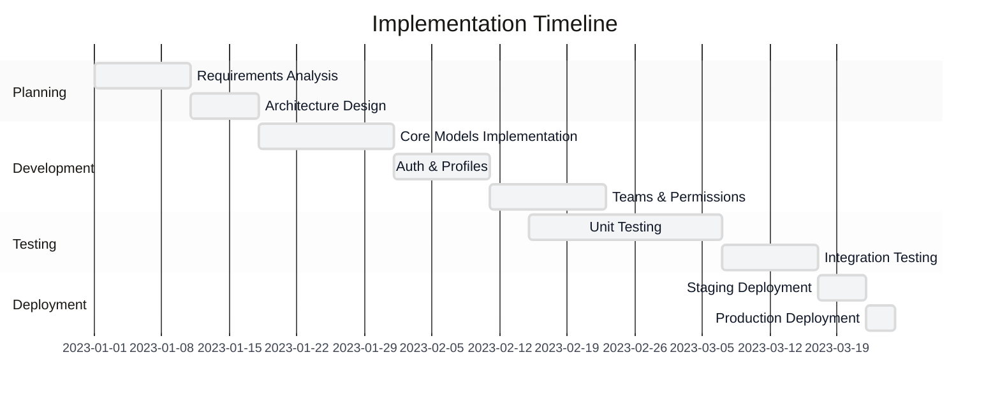
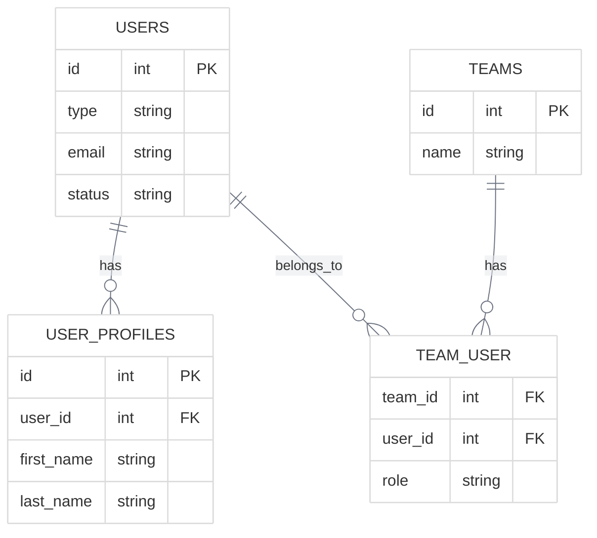
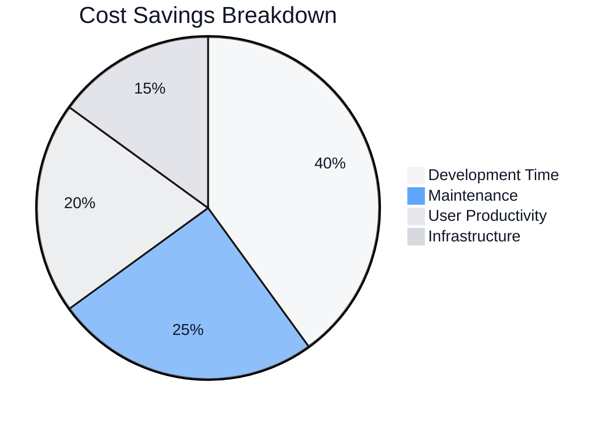

# Case Study Template

<link rel="stylesheet" href="../assets/css/styles.css">

This template provides a standardized structure for creating case studies of User Model Enhancements (UME) implementations. Following this template ensures consistency across case studies and makes it easier for readers to compare different implementations.

## 1. Organization Profile

### 1.1 Organization Overview
- **Organization Name**: [Name]
- **Industry**: [Industry]
- **Size**: [Number of employees, users, customers]
- **Geographic Scope**: [Local, regional, national, global]

### 1.2 Technical Environment
- **Existing Technology Stack**: [Key technologies in use]
- **Laravel Version**: [Version]
- **Database System**: [MySQL, PostgreSQL, etc.]
- **Deployment Environment**: [Cloud provider, on-premises, hybrid]

### 1.3 User Base
- **User Types**: [Types of users in the system]
- **User Volume**: [Number of users by type]
- **Growth Rate**: [User growth patterns]

## 2. Business Challenge

### 2.1 Problem Statement
[Clear statement of the business problem or opportunity]

### 2.2 Key Requirements
- [Requirement 1]
- [Requirement 2]
- [Requirement 3]
- ...

### 2.3 Constraints
- **Budget Constraints**: [Budget limitations]
- **Timeline Constraints**: [Time limitations]
- **Technical Constraints**: [Technical limitations]
- **Resource Constraints**: [Team size, expertise]

### 2.4 Success Criteria
- [Criterion 1]
- [Criterion 2]
- [Criterion 3]
- ...

## 3. Implementation Approach

### 3.1 UME Features Implemented
- [Feature 1]
- [Feature 2]
- [Feature 3]
- ...

### 3.2 Implementation Strategy
[Overview of the implementation strategy]

### 3.3 Team Structure
- **Team Size**: [Number of team members]
- **Roles**: [Key roles involved]
- **External Resources**: [Consultants, vendors]

### 3.4 Development Methodology
[Agile, Waterfall, Hybrid, etc.]

## 4. Technical Details

### 4.1 Database Schema Modifications
[Description of database changes]

### 4.2 Key Code Implementations
[Highlight important code implementations]

### 4.3 Integration Points
[Description of integration with existing systems]

### 4.4 Security Considerations
[Security measures implemented]

## 5. Challenges and Solutions

### 5.1 Technical Challenges
- **Challenge 1**: [Description]
  - **Solution**: [How it was addressed]
- **Challenge 2**: [Description]
  - **Solution**: [How it was addressed]
- ...

### 5.2 Organizational Challenges
- **Challenge 1**: [Description]
  - **Solution**: [How it was addressed]
- **Challenge 2**: [Description]
  - **Solution**: [How it was addressed]
- ...

### 5.3 User Adoption Challenges
- **Challenge 1**: [Description]
  - **Solution**: [How it was addressed]
- **Challenge 2**: [Description]
  - **Solution**: [How it was addressed]
- ...

## 6. Outcomes and Metrics

### 6.1 Business Outcomes
- [Outcome 1]
- [Outcome 2]
- [Outcome 3]
- ...

### 6.2 Performance Metrics
- **Before Implementation**:
  - [Metric 1]: [Value]
  - [Metric 2]: [Value]
  - ...
- **After Implementation**:
  - [Metric 1]: [Value]
  - [Metric 2]: [Value]
  - ...

### 6.3 ROI Analysis
[Return on investment analysis]

### 6.4 User Feedback
[Summary of user feedback]

## 7. Lessons Learned

### 7.1 What Worked Well
- [Success 1]
- [Success 2]
- [Success 3]
- ...

### 7.2 What Could Be Improved
- [Improvement 1]
- [Improvement 2]
- [Improvement 3]
- ...

### 7.3 Recommendations for Similar Implementations
- [Recommendation 1]
- [Recommendation 2]
- [Recommendation 3]
- ...

## 8. Future Plans

### 8.1 Planned Enhancements
- [Enhancement 1]
- [Enhancement 2]
- [Enhancement 3]
- ...

### 8.2 Scaling Strategy
[How the implementation will be scaled]

### 8.3 Maintenance Approach
[How the implementation will be maintained]

## 9. Contact Information

### 9.1 Key Stakeholders
- **Project Manager**: [Name, Contact Information]
- **Technical Lead**: [Name, Contact Information]
- **Business Sponsor**: [Name, Contact Information]

### 9.2 For More Information
[How to get more information about this case study]
