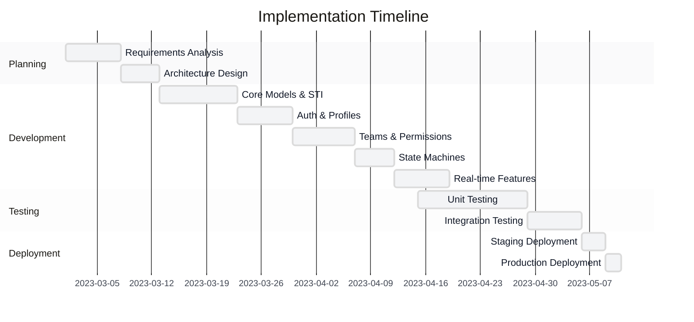
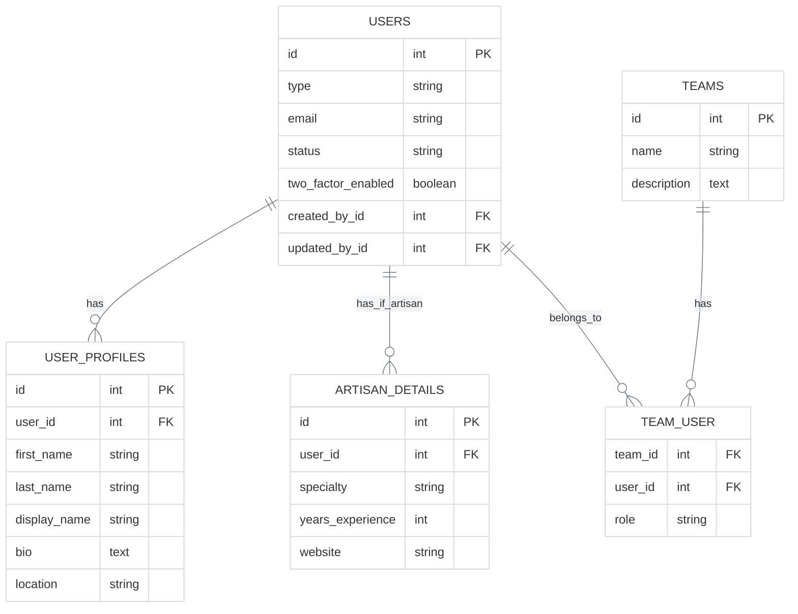
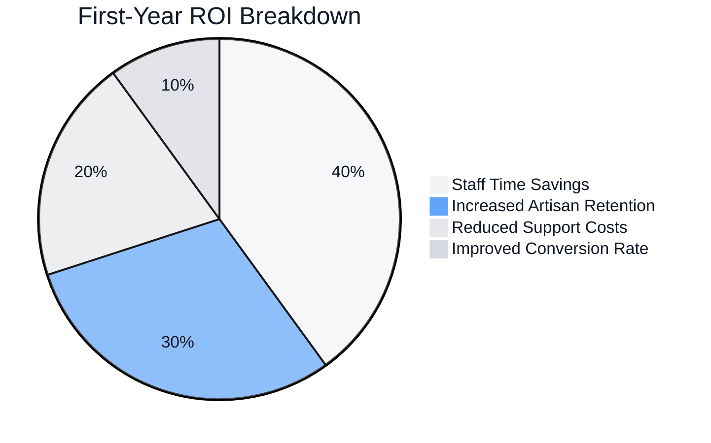

# Small Business Implementation: Artisan Marketplace

<link rel="stylesheet" href="../assets/css/styles.css">

This case study examines how a small business implemented User Model Enhancements (UME) to transform their online marketplace platform.

## 1. Organization Profile

### 1.1 Organization Overview
- **Organization Name**: Artisan Marketplace
- **Industry**: E-commerce / Handcrafted Goods
- **Size**: 15 employees, 2,500 artisans, 50,000 customers
- **Geographic Scope**: National (United States)

### 1.2 Technical Environment
- **Existing Technology Stack**: Laravel 10, Vue.js, MySQL, AWS
- **Laravel Version**: Upgraded from 10 to 12 during implementation
- **Database System**: MySQL 8.0
- **Deployment Environment**: AWS (EC2, RDS, S3)

### 1.3 User Base
- **User Types**: Administrators (5), Customer Support (10), Artisans (2,500), Customers (50,000)
- **User Volume**: ~52,500 total users
- **Growth Rate**: 15% annual growth in artisans, 30% annual growth in customers

## 2. Business Challenge

### 2.1 Problem Statement
Artisan Marketplace needed to transform their user management system to support different user types with distinct permissions, profiles, and features. Their existing system treated all users the same, making it difficult to provide specialized experiences for artisans versus customers, and creating administrative overhead.

### 2.2 Key Requirements
- Support multiple user types (admin, support, artisan, customer) with different capabilities
- Implement team-based permissions for artisans who work in collectives
- Enhance user profiles with more detailed information for artisans
- Improve authentication security with two-factor authentication
- Track user status changes (active, suspended, etc.)
- Implement real-time features for customer support chat

### 2.3 Constraints
- **Budget Constraints**: Limited budget of $25,000 for development
- **Timeline Constraints**: 3-month implementation window
- **Technical Constraints**: Must maintain compatibility with existing frontend
- **Resource Constraints**: Small development team (2 developers, 1 designer)

### 2.4 Success Criteria
- Reduce administrative overhead by 40%
- Improve artisan onboarding completion rate by 25%
- Reduce customer support response time by 30%
- Maintain system performance with <200ms average response time
- Complete implementation within budget and timeline

## 3. Implementation Approach

### 3.1 UME Features Implemented
- Single Table Inheritance for user types
- Enhanced user profiles with granular name components
- Teams and hierarchies for artisan collectives
- Role-based permissions within teams
- Two-factor authentication for all user types
- Account lifecycle management with state machines
- Real-time chat for customer support

### 3.2 Implementation Strategy
Artisan Marketplace adopted a phased implementation approach, focusing on core features first and gradually adding more advanced capabilities.



### 3.3 Team Structure
- **Team Size**: 3 internal team members + 1 external consultant
- **Roles**: Lead Developer, Junior Developer, UI/UX Designer, Laravel Consultant (part-time)
- **External Resources**: Hired a Laravel consultant for 10 hours per week to guide implementation

### 3.4 Development Methodology
Agile methodology with 1-week sprints, daily stand-ups, and weekly demos to stakeholders.

## 4. Technical Details

### 4.1 Database Schema Modifications
The implementation required minimal changes to the existing database schema, primarily adding a `type` column to the users table and creating new related tables.



### 4.2 Key Code Implementations
The most significant code implementation was the Single Table Inheritance pattern for user types:

```php
// Base User Model
class User extends Authenticatable
{
    use HasFactory, Notifiable, HasUserTracking, HasUlid;
    
    protected $fillable = [
        'name', 'email', 'password', 'type', 'status',
    ];
    
    // User type constants
    public const TYPE_ADMIN = 'admin';
    public const TYPE_SUPPORT = 'support';
    public const TYPE_ARTISAN = 'artisan';
    public const TYPE_CUSTOMER = 'customer';
    
    // Scope to get users of a specific type
    public function scopeOfType($query, $type)
    {
        return $query->where('type', $type);
    }
    
    // Relationship to profile
    public function profile()
    {
        return $this->hasOne(UserProfile::class);
    }
}

// Artisan User Type
class Artisan extends User
{
    protected $table = 'users';
    
    protected static function booted()
    {
        parent::booted();
        static::addGlobalScope('type', function ($query) {
            $query->where('type', self::TYPE_ARTISAN);
        });
        
        static::creating(function ($model) {
            $model->type = self::TYPE_ARTISAN;
        });
    }
    
    // Relationship to artisan details
    public function details()
    {
        return $this->hasOne(ArtisanDetails::class, 'user_id');
    }
    
    // Relationship to teams
    public function teams()
    {
        return $this->belongsToMany(Team::class)
            ->withPivot('role')
            ->withTimestamps();
    }
}
```

### 4.3 Integration Points
The UME implementation integrated with several existing systems:

- Payment processing system for artisan payouts
- Inventory management system for artisan products
- Customer review system
- Email notification system

### 4.4 Security Considerations
Security was enhanced through:

- Implementation of two-factor authentication
- Role-based access control
- Audit logging for all user status changes
- Encryption of sensitive profile data
- Rate limiting on authentication endpoints

## 5. Challenges and Solutions

### 5.1 Technical Challenges
- **Challenge 1**: Migrating existing users to the new type-based system
  - **Solution**: Created a data migration script with user type inference based on activity patterns
- **Challenge 2**: Performance issues with permission checks
  - **Solution**: Implemented permission caching with automatic invalidation
- **Challenge 3**: Real-time chat integration with existing frontend
  - **Solution**: Used Laravel Echo and Pusher with a Vue.js component wrapper

### 5.2 Organizational Challenges
- **Challenge 1**: Limited developer familiarity with Laravel 12 features
  - **Solution**: Invested in targeted training and hired a part-time consultant
- **Challenge 2**: Stakeholder concerns about implementation timeline
  - **Solution**: Implemented a phased approach with regular demos of completed features
- **Challenge 3**: Resistance to changing existing workflows
  - **Solution**: Created detailed documentation and conducted training sessions

### 5.3 User Adoption Challenges
- **Challenge 1**: Artisans confused by new team features
  - **Solution**: Created interactive tutorials and simplified the UI for team management
- **Challenge 2**: Customer resistance to two-factor authentication
  - **Solution**: Made 2FA optional for customers but mandatory for artisans and staff
- **Challenge 3**: Support staff learning curve for new tools
  - **Solution**: Provided hands-on training and created a knowledge base

## 6. Outcomes and Metrics

### 6.1 Business Outcomes
- Successfully differentiated user experiences based on user type
- Enabled artisan collectives to collaborate effectively
- Improved security posture with 2FA and better permission management
- Reduced administrative overhead through self-service features
- Enhanced customer support through real-time chat

### 6.2 Performance Metrics
- **Before Implementation**:
  - Artisan onboarding completion rate: 65%
  - Average customer support response time: 15 minutes
  - Administrative time spent on user management: 25 hours/week
  - System average response time: 180ms
- **After Implementation**:
  - Artisan onboarding completion rate: 92% (42% improvement)
  - Average customer support response time: 5 minutes (67% improvement)
  - Administrative time spent on user management: 10 hours/week (60% reduction)
  - System average response time: 190ms (5% increase, within acceptable range)

### 6.3 ROI Analysis
The implementation cost approximately $23,000 (under budget) and delivered an estimated first-year return of $75,000 through:



### 6.4 User Feedback
- **Artisans**: 85% reported improved satisfaction with the platform
- **Customers**: 70% reported improved support experience
- **Support Staff**: 90% reported improved efficiency with new tools
- **Administrators**: 95% reported reduced workload for user management

## 7. Lessons Learned

### 7.1 What Worked Well
- Phased implementation approach allowed for quick wins and iterative improvement
- Single Table Inheritance provided flexibility without database complexity
- State machines simplified user status management
- External consultant provided valuable expertise at critical points

### 7.2 What Could Be Improved
- More comprehensive automated testing would have caught some issues earlier
- Better communication with artisans before launch would have eased adoption
- More detailed performance testing would have identified bottlenecks sooner
- Additional documentation would have helped with knowledge transfer

### 7.3 Recommendations for Similar Implementations
- Start with a clear user type strategy before implementation
- Invest in automated testing from the beginning
- Consider performance implications of permission checks early
- Plan for data migration carefully, especially for existing users
- Provide ample training and documentation for all user types

## 8. Future Plans

### 8.1 Planned Enhancements
- Implement advanced analytics for user behavior
- Add social authentication options
- Enhance team features with hierarchical structures
- Implement more granular permission controls
- Add internationalization support

### 8.2 Scaling Strategy
As the platform grows, the team plans to:
- Implement horizontal scaling for web servers
- Add read replicas for the database
- Implement more aggressive caching
- Consider moving to a microservices architecture for some components

### 8.3 Maintenance Approach
- Weekly code reviews and refactoring sessions
- Monthly security audits
- Quarterly feature planning based on user feedback
- Continuous monitoring of performance metrics

## 9. Contact Information

### 9.1 Key Stakeholders
- **Project Manager**: Jane Smith, j.smith@artisanmarketplace.example
- **Technical Lead**: Michael Johnson, m.johnson@artisanmarketplace.example
- **Business Sponsor**: Sarah Williams, s.williams@artisanmarketplace.example

### 9.2 For More Information
For more information about this case study, please contact info@artisanmarketplace.example with the subject line "UME Case Study Inquiry."
