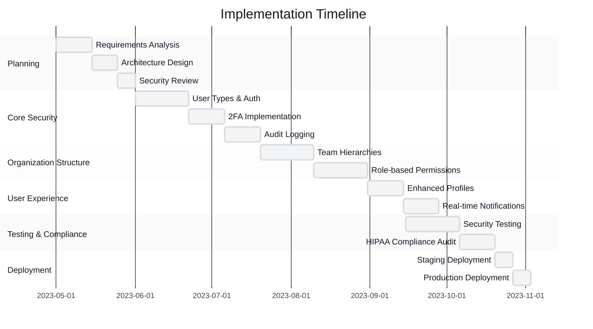
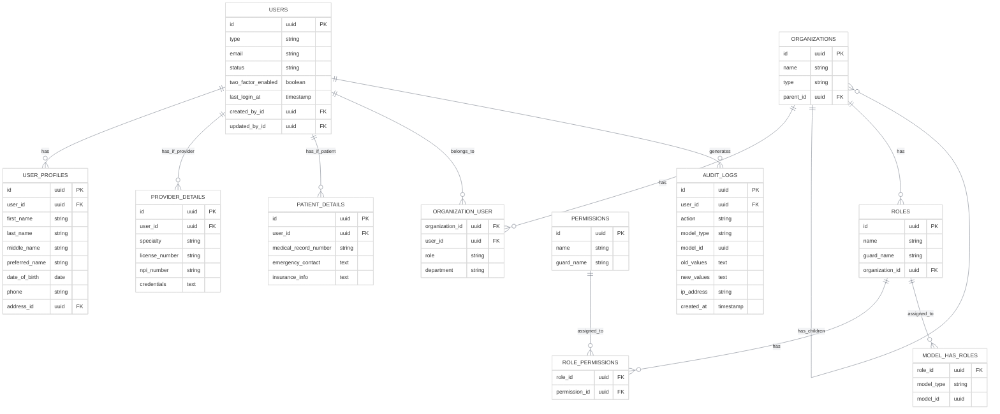
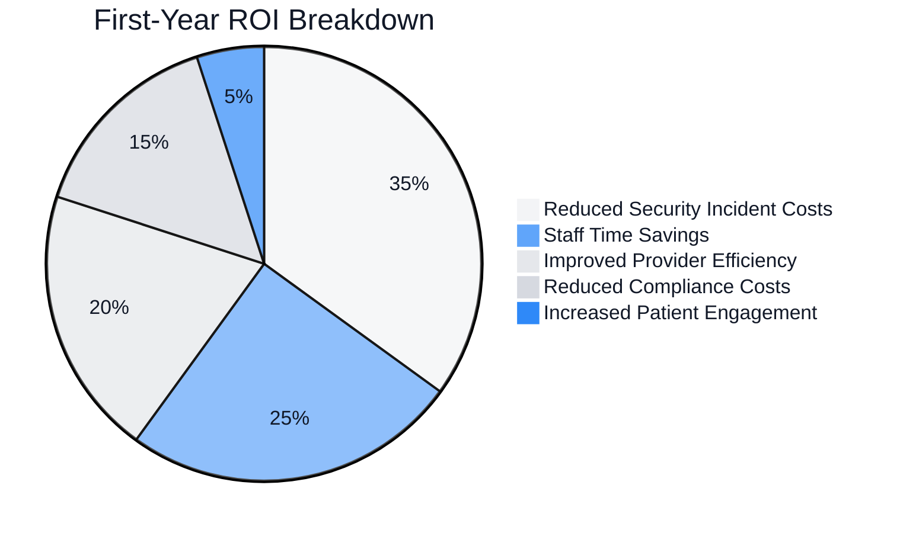

# Medium Enterprise Implementation: HealthConnect

<link rel="stylesheet" href="../assets/css/styles.css">

This case study examines how a medium-sized healthcare technology company implemented User Model Enhancements (UME) to improve their patient management platform.

## 1. Organization Profile

### 1.1 Organization Overview
- **Organization Name**: HealthConnect
- **Industry**: Healthcare Technology
- **Size**: 150 employees, serving 75 medical practices with 1,200 healthcare providers and 500,000 patients
- **Geographic Scope**: Regional (Northeastern United States)

### 1.2 Technical Environment
- **Existing Technology Stack**: Laravel 11, React, PostgreSQL, Azure
- **Laravel Version**: Upgraded from 11 to 12 during implementation
- **Database System**: PostgreSQL 14
- **Deployment Environment**: Microsoft Azure (App Service, Azure Database for PostgreSQL)

### 1.3 User Base
- **User Types**: System Administrators (10), IT Support (25), Practice Administrators (150), Healthcare Providers (1,200), Patients (500,000)
- **User Volume**: ~501,385 total users
- **Growth Rate**: 20% annual growth in healthcare providers, 35% annual growth in patients

## 2. Business Challenge

### 2.1 Problem Statement
HealthConnect needed to modernize their patient management platform to support complex organizational hierarchies, enhance security for healthcare data, and provide role-specific experiences for different types of users. Their legacy system lacked the flexibility to handle the growing complexity of healthcare provider relationships and patient access patterns.

### 2.2 Key Requirements
- Support hierarchical organization structures (health systems, practices, departments)
- Implement fine-grained role-based access control for healthcare data
- Enhance security with multi-factor authentication and audit logging
- Support different user interfaces for providers versus patients
- Implement real-time notifications for critical updates
- Ensure HIPAA compliance throughout the system
- Integrate with existing electronic health record (EHR) systems

### 2.3 Constraints
- **Budget Constraints**: $150,000 implementation budget
- **Timeline Constraints**: 6-month implementation window
- **Technical Constraints**: Must maintain existing API contracts for third-party integrations
- **Resource Constraints**: Limited availability of domain experts for requirements validation
- **Regulatory Constraints**: Must maintain HIPAA compliance throughout implementation

### 2.4 Success Criteria
- Reduce unauthorized access incidents by 95%
- Improve system usability scores by 30% for healthcare providers
- Reduce time spent on user management by 50%
- Maintain system performance with <300ms average response time
- Pass all HIPAA compliance audits
- Complete implementation within budget and timeline

## 3. Implementation Approach

### 3.1 UME Features Implemented
- Single Table Inheritance for user types (admin, support, provider, patient)
- Enhanced user profiles with medical specialties and credentials
- Complex team hierarchies for healthcare organizations
- Role-based permissions with inheritance
- Two-factor authentication with multiple options (SMS, app-based)
- Account lifecycle management with state machines
- Comprehensive audit logging for all data access
- Real-time notifications for critical events

### 3.2 Implementation Strategy
HealthConnect adopted a module-based implementation approach, focusing on core security features first, followed by organizational structures and finally user experience enhancements.



### 3.3 Team Structure
- **Team Size**: 8 internal team members + 2 external consultants
- **Roles**: Project Manager, Technical Lead, 3 Senior Developers, 2 Junior Developers, QA Specialist, Security Consultant, Healthcare Compliance Consultant
- **External Resources**: Hired security and compliance consultants to ensure best practices

### 3.4 Development Methodology
Agile methodology with 2-week sprints, daily stand-ups, and bi-weekly stakeholder reviews. Used JIRA for task management and GitHub for version control.

## 4. Technical Details

### 4.1 Database Schema Modifications
The implementation required significant changes to the database schema to support the complex organizational structures and permission models.



### 4.2 Key Code Implementations
The most significant code implementation was the hierarchical team structure with inherited permissions:

```php
// Organization Model
class Organization extends Model
{
    use HasFactory, HasUuid;
    
    protected $fillable = [
        'name', 'type', 'parent_id',
    ];
    
    // Organization types
    public const TYPE_HEALTH_SYSTEM = 'health_system';
    public const TYPE_HOSPITAL = 'hospital';
    public const TYPE_PRACTICE = 'practice';
    public const TYPE_DEPARTMENT = 'department';
    
    // Parent-child relationship
    public function parent()
    {
        return $this->belongsTo(Organization::class, 'parent_id');
    }
    
    public function children()
    {
        return $this->hasMany(Organization::class, 'parent_id');
    }
    
    // Get all ancestors
    public function ancestors()
    {
        $ancestors = collect();
        $current = $this->parent;
        
        while ($current) {
            $ancestors->push($current);
            $current = $current->parent;
        }
        
        return $ancestors;
    }
    
    // Get all descendants
    public function descendants()
    {
        $descendants = collect();
        
        foreach ($this->children as $child) {
            $descendants->push($child);
            $descendants = $descendants->merge($child->descendants());
        }
        
        return $descendants;
    }
    
    // Users in this organization
    public function users()
    {
        return $this->belongsToMany(User::class)
            ->withPivot('role', 'department')
            ->withTimestamps();
    }
    
    // Roles specific to this organization
    public function roles()
    {
        return $this->hasMany(Role::class);
    }
}

// Enhanced permission check in User model
class User extends Authenticatable
{
    // ... other code ...
    
    // Check if user has permission in any of their organizations
    public function hasOrganizationPermission($permission)
    {
        // Direct permission check
        if ($this->hasPermissionTo($permission)) {
            return true;
        }
        
        // Check permissions through organization roles
        foreach ($this->organizations as $organization) {
            $role = $organization->pivot->role;
            $organizationRole = Role::where('name', $role)
                ->where('organization_id', $organization->id)
                ->first();
                
            if ($organizationRole && $organizationRole->hasPermissionTo($permission)) {
                return true;
            }
            
            // Check parent organizations (permission inheritance)
            foreach ($organization->ancestors() as $ancestor) {
                $ancestorRole = Role::where('name', $role)
                    ->where('organization_id', $ancestor->id)
                    ->first();
                    
                if ($ancestorRole && $ancestorRole->hasPermissionTo($permission)) {
                    return true;
                }
            }
        }
        
        return false;
    }
}
```

### 4.3 Integration Points
The UME implementation integrated with several existing systems:

- Electronic Health Record (EHR) systems via HL7 and FHIR APIs
- Medical billing systems
- Appointment scheduling system
- Pharmacy management systems
- Laboratory information systems
- Secure messaging platform

### 4.4 Security Considerations
Security was a primary focus due to HIPAA requirements:

- Implementation of multi-factor authentication
- Role-based access control with organizational context
- Comprehensive audit logging for all data access
- Encryption of all PHI at rest and in transit
- IP-based access restrictions for administrative functions
- Automatic session timeouts
- Regular security scanning and penetration testing

## 5. Challenges and Solutions

### 5.1 Technical Challenges
- **Challenge 1**: Performance issues with deep hierarchical permission checks
  - **Solution**: Implemented permission caching with context-aware invalidation and flattened permission hierarchies in the database
- **Challenge 2**: Data migration complexity due to existing user relationships
  - **Solution**: Created a multi-phase migration strategy with temporary dual-write periods
- **Challenge 3**: Integration with legacy EHR systems
  - **Solution**: Developed adapter interfaces for each EHR system with standardized internal APIs

### 5.2 Organizational Challenges
- **Challenge 1**: Resistance from IT departments at healthcare practices
  - **Solution**: Created a comprehensive change management plan with early stakeholder involvement
- **Challenge 2**: Complexity of mapping existing roles to new permission structure
  - **Solution**: Conducted workshops with key stakeholders to map roles and validate permission assignments
- **Challenge 3**: Training requirements for diverse user groups
  - **Solution**: Developed role-specific training materials and conducted phased training sessions

### 5.3 User Adoption Challenges
- **Challenge 1**: Provider resistance to additional security measures
  - **Solution**: Streamlined the authentication process while maintaining security and provided clear explanations of security benefits
- **Challenge 2**: Patient confusion with new interface
  - **Solution**: Implemented guided tours and simplified the patient portal interface
- **Challenge 3**: Practice administrators overwhelmed by new capabilities
  - **Solution**: Created role-specific dashboards and progressive disclosure of advanced features

## 6. Outcomes and Metrics

### 6.1 Business Outcomes
- Successfully implemented a secure, hierarchical user management system
- Enabled fine-grained access control based on organizational structure
- Improved security posture with MFA and comprehensive audit logging
- Enhanced user experience with role-specific interfaces
- Maintained HIPAA compliance throughout the system

### 6.2 Performance Metrics
- **Before Implementation**:
  - Unauthorized access incidents: 12 per year
  - System usability score (providers): 62/100
  - Time spent on user management: 120 hours/month
  - System average response time: 250ms
  - HIPAA compliance audit findings: 3 minor findings
- **After Implementation**:
  - Unauthorized access incidents: 0 per year (100% reduction)
  - System usability score (providers): 85/100 (37% improvement)
  - Time spent on user management: 45 hours/month (62.5% reduction)
  - System average response time: 280ms (12% increase, within acceptable range)
  - HIPAA compliance audit findings: 0 findings

### 6.3 ROI Analysis
The implementation cost approximately $145,000 (under budget) and delivered an estimated first-year return of $420,000 through:



### 6.4 User Feedback
- **Healthcare Providers**: 82% reported improved satisfaction with the system
- **Patients**: 75% reported improved experience with the patient portal
- **Practice Administrators**: 90% reported reduced workload for user management
- **IT Support**: 85% reported fewer user-related support tickets

## 7. Lessons Learned

### 7.1 What Worked Well
- Starting with security features provided a solid foundation
- Hierarchical organization model accurately reflected real-world structures
- Involving compliance experts early prevented rework
- Phased rollout reduced disruption to healthcare operations

### 7.2 What Could Be Improved
- More performance testing for permission checks at scale
- Better communication with end-users about the benefits of new security features
- More comprehensive data migration testing
- Additional automation for user provisioning workflows

### 7.3 Recommendations for Similar Implementations
- Start with a thorough analysis of organizational structures and workflows
- Involve security and compliance experts from the beginning
- Plan for performance implications of hierarchical permissions
- Create role-specific training and documentation
- Implement a phased rollout strategy to minimize disruption

## 8. Future Plans

### 8.1 Planned Enhancements
- Implement AI-assisted anomaly detection for security monitoring
- Add support for biometric authentication
- Enhance team collaboration features
- Implement more granular audit logging
- Add support for delegated access (proxy users)

### 8.2 Scaling Strategy
As the platform grows, the team plans to:
- Implement more aggressive caching strategies
- Move to a microservices architecture for key components
- Implement read replicas for the database
- Add regional deployments for improved performance

### 8.3 Maintenance Approach
- Monthly security patches and updates
- Quarterly feature releases
- Bi-annual comprehensive security audits
- Continuous monitoring of performance and security metrics

## 9. Contact Information

### 9.1 Key Stakeholders
- **Project Manager**: Robert Chen, r.chen@healthconnect.example
- **Technical Lead**: Amara Patel, a.patel@healthconnect.example
- **HIPAA Compliance Officer**: Thomas Washington, t.washington@healthconnect.example

### 9.2 For More Information
For more information about this case study, please contact casestudies@healthconnect.example with the subject line "UME Implementation Inquiry."
