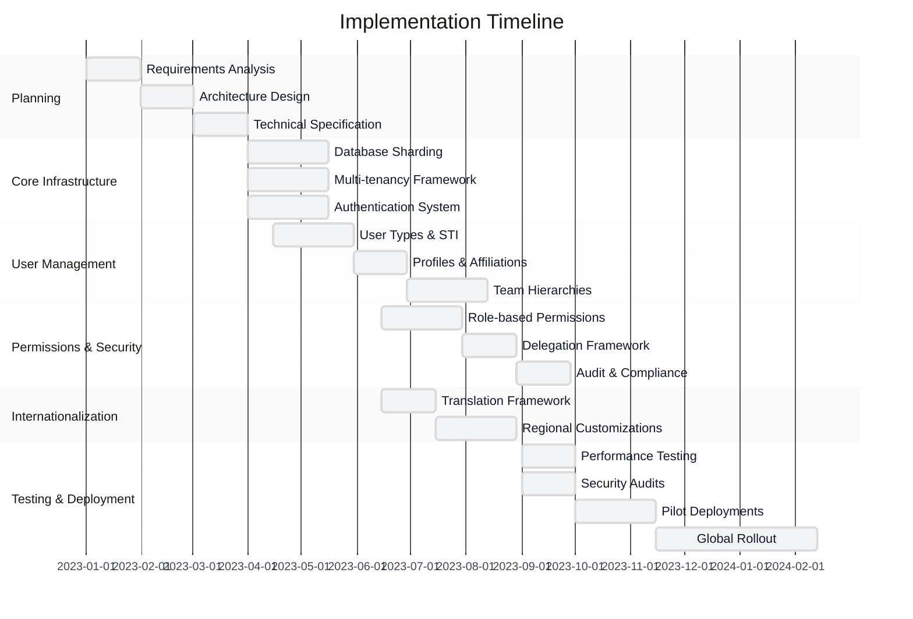
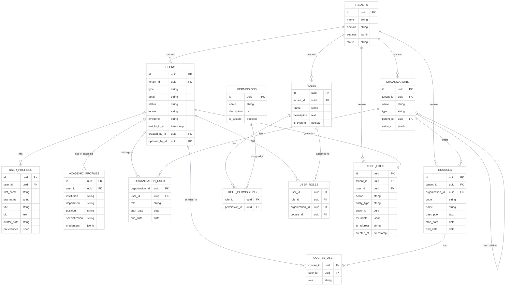
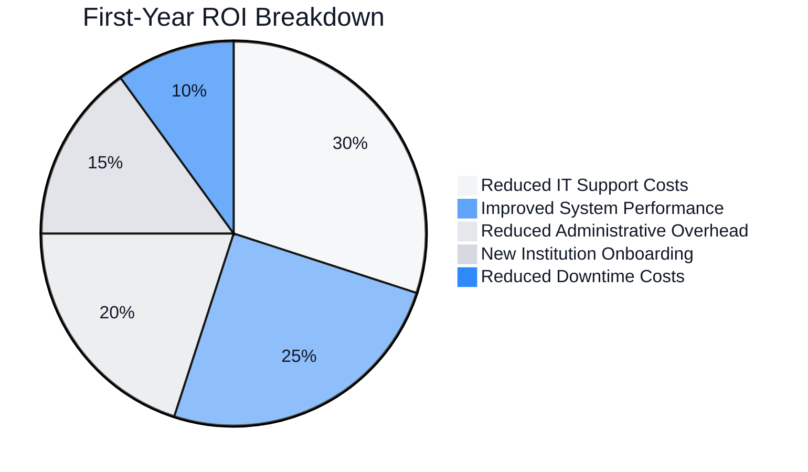

# Large Organization Implementation: EduSphere

<link rel="stylesheet" href="../assets/css/styles.css">

This case study examines how a large educational technology organization implemented User Model Enhancements (UME) to transform their learning management system used by universities worldwide.

## 1. Organization Profile

### 1.1 Organization Overview
- **Organization Name**: EduSphere
- **Industry**: Educational Technology
- **Size**: 750 employees, serving 200+ universities with 25,000 faculty members and 2.5 million students
- **Geographic Scope**: Global (operations in 45 countries)

### 1.2 Technical Environment
- **Existing Technology Stack**: Laravel 10, Vue.js, MySQL, Google Cloud Platform
- **Laravel Version**: Upgraded from 10 to 12 during implementation
- **Database System**: MySQL 8.0 with sharding
- **Deployment Environment**: Google Cloud Platform (GKE, Cloud SQL, Cloud Storage)

### 1.3 User Base
- **User Types**: System Administrators (50), IT Support (200), University Administrators (1,000), Faculty (25,000), Teaching Assistants (50,000), Students (2.5 million)
- **User Volume**: ~2.58 million total users
- **Growth Rate**: 15% annual growth overall, with seasonal fluctuations based on academic calendars

## 2. Business Challenge

### 2.1 Problem Statement
EduSphere needed to modernize their learning management system to support complex multi-tenant university environments with diverse organizational structures, role requirements, and regional compliance needs. Their legacy system struggled with performance at scale and lacked the flexibility to accommodate the varying needs of different educational institutions worldwide.

### 2.2 Key Requirements
- Support multi-tenant architecture with institution-specific customizations
- Implement complex organizational hierarchies (universities, colleges, departments, courses)
- Support diverse user types with different permissions and capabilities
- Enable delegation of administrative functions to institution administrators
- Implement robust internationalization and localization
- Ensure compliance with regional data protection regulations (GDPR, CCPA, etc.)
- Maintain high performance at scale with millions of concurrent users
- Support real-time collaboration features

### 2.3 Constraints
- **Budget Constraints**: $1.2 million implementation budget
- **Timeline Constraints**: 12-month implementation window with phased rollout
- **Technical Constraints**: Must maintain API compatibility for third-party integrations
- **Resource Constraints**: Development teams distributed across multiple time zones
- **Regulatory Constraints**: Must comply with diverse international data protection laws

### 2.4 Success Criteria
- Reduce system administration overhead by 60%
- Improve system performance by 40% during peak usage periods
- Reduce user-related support tickets by 50%
- Achieve 99.99% system availability
- Complete implementation within budget and timeline
- Successfully migrate all existing institutions with zero data loss

## 3. Implementation Approach

### 3.1 UME Features Implemented
- Single Table Inheritance for diverse user types
- Enhanced user profiles with academic credentials and institutional affiliations
- Complex team hierarchies for educational institutions
- Role-based permissions with inheritance and delegation
- Multi-factor authentication with regional customizations
- Account lifecycle management with state machines
- Comprehensive audit logging and reporting
- Real-time collaboration features
- Advanced internationalization and localization

### 3.2 Implementation Strategy
EduSphere adopted a multi-phase implementation strategy with parallel workstreams and a gradual rollout to institutions based on size and complexity.



### 3.3 Team Structure
- **Team Size**: 35 internal team members organized into 5 cross-functional teams
- **Roles**: Project Director, 3 Technical Architects, 5 Team Leads, 15 Senior Developers, 10 Junior Developers, 5 QA Specialists, 3 UX Designers, 3 DevOps Engineers, 5 Product Managers
- **External Resources**: Engaged specialized consultants for security, performance optimization, and regional compliance

### 3.4 Development Methodology
Scaled Agile Framework (SAFe) with 2-week sprints, daily stand-ups, and quarterly planning. Used JIRA for task management, GitHub for version control, and Jenkins for CI/CD.

## 4. Technical Details

### 4.1 Database Schema Modifications
The implementation required a complete redesign of the database schema to support multi-tenancy, sharding, and complex organizational structures.



### 4.2 Key Code Implementations
The most significant code implementation was the multi-tenant architecture with tenant-specific customizations:

```php
// Tenant Model
class Tenant extends Model
{
    use HasFactory, HasUuid;
    
    protected $fillable = [
        'name', 'domain', 'settings', 'status',
    ];
    
    protected $casts = [
        'settings' => 'array',
    ];
    
    // Tenant statuses
    public const STATUS_ACTIVE = 'active';
    public const STATUS_INACTIVE = 'inactive';
    public const STATUS_PROVISIONING = 'provisioning';
    public const STATUS_DECOMMISSIONING = 'decommissioning';
    
    // Relationships
    public function users()
    {
        return $this->hasMany(User::class);
    }
    
    public function organizations()
    {
        return $this->hasMany(Organization::class);
    }
    
    public function roles()
    {
        return $this->hasMany(Role::class);
    }
    
    // Settings management
    public function getSetting($key, $default = null)
    {
        return data_get($this->settings, $key, $default);
    }
    
    public function setSetting($key, $value)
    {
        $settings = $this->settings;
        data_set($settings, $key, $value);
        $this->settings = $settings;
        return $this;
    }
    
    // Tenant resolution
    public static function resolveFromRequest(Request $request)
    {
        $host = $request->getHost();
        
        // First try exact domain match
        $tenant = static::where('domain', $host)->first();
        
        if (!$tenant) {
            // Try wildcard subdomains
            $parts = explode('.', $host);
            if (count($parts) > 2) {
                array_shift($parts);
                $parentDomain = implode('.', $parts);
                $tenant = static::where('domain', '*.' . $parentDomain)->first();
            }
        }
        
        return $tenant;
    }
}

// Multi-tenant middleware
class TenantMiddleware
{
    public function handle($request, Closure $next)
    {
        $tenant = Tenant::resolveFromRequest($request);
        
        if (!$tenant || $tenant->status !== Tenant::STATUS_ACTIVE) {
            abort(404);
        }
        
        // Set tenant in the container
        app()->instance('tenant', $tenant);
        
        // Set tenant connection if using separate databases
        if (config('tenancy.database_separation')) {
            $this->configureTenantConnection($tenant);
        }
        
        return $next($request);
    }
    
    protected function configureTenantConnection(Tenant $tenant)
    {
        // Configure database connection based on tenant
        config([
            'database.connections.tenant.database' => 'tenant_' . $tenant->id,
        ]);
        
        DB::purge('tenant');
        DB::reconnect('tenant');
    }
}

// User model with tenant scope
class User extends Authenticatable
{
    use HasFactory, HasUuid, HasUserTracking;
    
    protected $fillable = [
        'tenant_id', 'type', 'email', 'password', 'status', 'locale', 'timezone',
    ];
    
    protected static function booted()
    {
        static::addGlobalScope('tenant', function (Builder $builder) {
            if (app()->has('tenant')) {
                $builder->where('tenant_id', app('tenant')->id);
            }
        });
    }
    
    // User types with Single Table Inheritance
    public const TYPE_ADMIN = 'admin';
    public const TYPE_SUPPORT = 'support';
    public const TYPE_UNIVERSITY_ADMIN = 'university_admin';
    public const TYPE_FACULTY = 'faculty';
    public const TYPE_TEACHING_ASSISTANT = 'teaching_assistant';
    public const TYPE_STUDENT = 'student';
    
    // Relationships
    public function tenant()
    {
        return $this->belongsTo(Tenant::class);
    }
    
    public function profile()
    {
        return $this->hasOne(UserProfile::class);
    }
    
    public function academicProfile()
    {
        return $this->hasOne(AcademicProfile::class);
    }
    
    public function organizations()
    {
        return $this->belongsToMany(Organization::class)
            ->withPivot('role', 'start_date', 'end_date')
            ->withTimestamps();
    }
    
    public function courses()
    {
        return $this->belongsToMany(Course::class)
            ->withPivot('role')
            ->withTimestamps();
    }
    
    public function roles()
    {
        return $this->belongsToMany(Role::class, 'user_roles')
            ->withPivot('organization_id', 'course_id')
            ->withTimestamps();
    }
    
    // Check if user has permission in context
    public function hasPermissionTo($permission, $organizationId = null, $courseId = null)
    {
        // Get all roles applicable to the context
        $roles = $this->roles()
            ->when($organizationId, function ($query) use ($organizationId) {
                return $query->where(function ($q) use ($organizationId) {
                    $q->where('organization_id', $organizationId)
                      ->orWhereNull('organization_id');
                });
            })
            ->when($courseId, function ($query) use ($courseId) {
                return $query->where(function ($q) use ($courseId) {
                    $q->where('course_id', $courseId)
                      ->orWhereNull('course_id');
                });
            })
            ->get();
        
        // Check if any role has the permission
        foreach ($roles as $role) {
            if ($role->hasPermissionTo($permission)) {
                return true;
            }
        }
        
        return false;
    }
}
```

### 4.3 Integration Points
The UME implementation integrated with numerous existing systems:

- Student Information Systems (SIS) at various institutions
- Learning Tools Interoperability (LTI) providers
- Content Management Systems
- Plagiarism detection services
- Video conferencing platforms
- E-book and digital resource providers
- Analytics and reporting tools
- Payment processing systems
- Identity providers (SAML, OAuth)

### 4.4 Security Considerations
Security was implemented with a focus on multi-tenant isolation and regional compliance:

- Tenant isolation at the database and application levels
- Role-based access control with contextual permissions
- Multi-factor authentication with regional customizations
- Comprehensive audit logging for all sensitive operations
- Data encryption at rest and in transit
- Regional data storage options for compliance with local laws
- Automated security scanning and penetration testing
- Regular security audits and compliance reviews

## 5. Challenges and Solutions

### 5.1 Technical Challenges
- **Challenge 1**: Database performance at scale with complex permission checks
  - **Solution**: Implemented a sophisticated caching strategy with Redis and denormalized permission tables
- **Challenge 2**: Multi-tenant data isolation while maintaining performance
  - **Solution**: Used a hybrid approach with shared tables for common data and tenant-specific shards for user data
- **Challenge 3**: Supporting diverse authentication requirements across regions
  - **Solution**: Created a pluggable authentication framework with tenant-specific configurations

### 5.2 Organizational Challenges
- **Challenge 1**: Coordinating development across distributed teams
  - **Solution**: Implemented clear architecture boundaries with well-defined interfaces and comprehensive documentation
- **Challenge 2**: Managing the expectations of diverse institutional stakeholders
  - **Solution**: Created a stakeholder council with representatives from different types of institutions
- **Challenge 3**: Balancing standardization with institutional customization needs
  - **Solution**: Developed a configuration framework that allowed customization within defined boundaries

### 5.3 User Adoption Challenges
- **Challenge 1**: Resistance from faculty accustomed to the old system
  - **Solution**: Created faculty champions program and provided extensive training resources
- **Challenge 2**: Varying technical capabilities across global user base
  - **Solution**: Implemented progressive disclosure of features and contextual help
- **Challenge 3**: Managing the transition for millions of users
  - **Solution**: Developed a phased rollout strategy with opt-in periods and parallel system access

## 6. Outcomes and Metrics

### 6.1 Business Outcomes
- Successfully implemented a scalable, multi-tenant user management system
- Enabled institution-specific customizations while maintaining a unified codebase
- Improved security posture with MFA and comprehensive audit logging
- Enhanced user experience with role-specific interfaces
- Achieved compliance with diverse regional regulations

### 6.2 Performance Metrics
- **Before Implementation**:
  - System administration overhead: 5,000 hours/month
  - Peak load performance: 500ms average response time
  - User-related support tickets: 15,000/month
  - System availability: 99.9% (8.76 hours downtime/year)
  - Database size: 5TB
- **After Implementation**:
  - System administration overhead: 1,800 hours/month (64% reduction)
  - Peak load performance: 180ms average response time (64% improvement)
  - User-related support tickets: 6,200/month (59% reduction)
  - System availability: 99.995% (26 minutes downtime/year)
  - Database size: 7TB (optimized through sharding)

### 6.3 ROI Analysis
The implementation cost approximately $1.15 million (under budget) and delivered an estimated first-year return of $4.8 million through:



### 6.4 User Feedback
- **University Administrators**: 88% reported improved system management capabilities
- **Faculty**: 75% reported improved usability after initial adjustment period
- **Students**: 82% reported improved system reliability and performance
- **IT Support**: 90% reported reduced workload for user management tasks

## 7. Lessons Learned

### 7.1 What Worked Well
- Multi-tenant architecture provided excellent scalability and customization
- Phased rollout strategy minimized disruption
- Stakeholder council ensured diverse needs were addressed
- Comprehensive caching strategy maintained performance at scale

### 7.2 What Could Be Improved
- Earlier focus on performance testing would have identified bottlenecks sooner
- More comprehensive data migration tools would have simplified institution onboarding
- Better communication about the benefits of new security features
- More gradual feature rollout to reduce initial user confusion

### 7.3 Recommendations for Similar Implementations
- Start with a clear multi-tenant strategy that balances isolation and resource sharing
- Invest heavily in performance testing and optimization from the beginning
- Create a flexible permission system that can adapt to diverse organizational structures
- Develop comprehensive data migration and validation tools
- Implement a phased rollout strategy with clear communication

## 8. Future Plans

### 8.1 Planned Enhancements
- Implement AI-powered adaptive learning features
- Add support for blockchain credentials and achievements
- Enhance analytics capabilities with machine learning
- Implement more advanced collaboration tools
- Add support for virtual and augmented reality learning experiences

### 8.2 Scaling Strategy
As the platform continues to grow, the team plans to:
- Implement global load balancing with regional deployments
- Further optimize database sharding strategies
- Move to a full microservices architecture
- Implement edge caching for static content
- Adopt serverless computing for specific workloads

### 8.3 Maintenance Approach
- Continuous deployment pipeline with automated testing
- Monthly feature releases with opt-in beta program
- Quarterly security audits and compliance reviews
- Annual architecture review and optimization
- Ongoing performance monitoring and optimization

## 9. Contact Information

### 9.1 Key Stakeholders
- **Project Director**: Elena Rodriguez, e.rodriguez@edusphere.example
- **Chief Architect**: David Kim, d.kim@edusphere.example
- **Product Director**: Jamal Washington, j.washington@edusphere.example

### 9.2 For More Information
For more information about this case study, please contact enterprise@edusphere.example with the subject line "UME Implementation Case Study."
