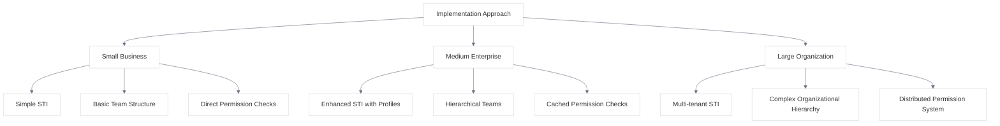
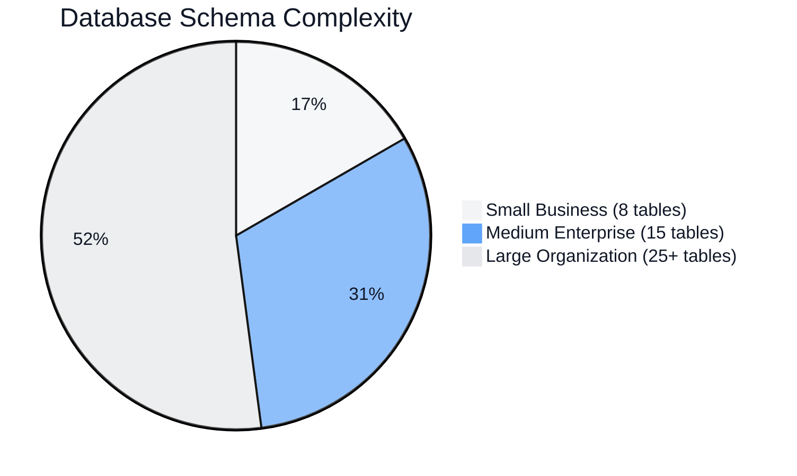

# Implementation Comparison

<link rel="stylesheet" href="../assets/css/styles.css">

This document provides a side-by-side comparison of the different approaches to implementing User Model Enhancements (UME) across organizations of varying sizes and requirements. By examining these different implementation strategies, you can identify patterns and approaches that might be most suitable for your specific context.

## Organization Profiles

| Characteristic | Small Business<br>(Artisan Marketplace) | Medium Enterprise<br>(HealthConnect) | Large Organization<br>(EduSphere) |
|----------------|----------------------------------------|-------------------------------------|----------------------------------|
| **Industry** | E-commerce / Handcrafted Goods | Healthcare Technology | Educational Technology |
| **User Base** | 52,500 users | 501,385 users | 2.58 million users |
| **Geographic Scope** | National | Regional | Global |
| **Team Size** | 3 internal + 1 consultant | 8 internal + 2 consultants | 35 internal team members |
| **Implementation Budget** | $25,000 | $150,000 | $1.2 million |
| **Timeline** | 3 months | 6 months | 12 months |

## Implementation Approaches

### Core Architecture Decisions



| Aspect | Small Business | Medium Enterprise | Large Organization |
|--------|---------------|-------------------|-------------------|
| **Database Approach** | Single database | Single database with complex schema | Sharded database with tenant isolation |
| **User Type Implementation** | Basic STI with type column | Enhanced STI with specialized profiles | Multi-tenant STI with contextual scopes |
| **Team Structure** | Simple teams with direct membership | Hierarchical teams with inheritance | Complex organizational hierarchy with multiple contexts |
| **Permission System** | Direct role-based permissions | Cached permissions with inheritance | Distributed permission system with context-aware checks |
| **Authentication** | Basic 2FA implementation | Multiple 2FA options with security policies | Regional authentication strategies with compliance controls |
| **Development Methodology** | Agile with 1-week sprints | Agile with 2-week sprints | Scaled Agile Framework (SAFe) |
| **Deployment Strategy** | Single-phase deployment | Module-based phased deployment | Global phased rollout by region and institution size |

## Feature Implementation Comparison

| Feature | Small Business | Medium Enterprise | Large Organization |
|---------|---------------|-------------------|-------------------|
| **Single Table Inheritance** | Basic implementation with global scopes | Enhanced with specialized profile tables | Multi-tenant with contextual scopes |
| **User Profiles** | Simple profile with basic fields | Comprehensive profiles with medical specialties | Extensible profiles with academic credentials and regional fields |
| **Teams & Hierarchies** | Flat team structure | Two-level organizational hierarchy | Complex multi-level organizational hierarchy with course contexts |
| **Permissions** | Direct role-based permissions | Inherited permissions through organization hierarchy | Context-aware permissions with tenant-specific roles |
| **Authentication** | Email-based 2FA | Multiple 2FA options (SMS, app) | Regional authentication strategies with compliance controls |
| **State Machines** | Basic user status management | Comprehensive lifecycle management | Complex state machines with approval workflows |
| **Real-time Features** | Simple chat functionality | Comprehensive notifications | Advanced collaboration tools with presence indicators |
| **Audit Logging** | Basic change tracking | Comprehensive audit logging | Distributed audit system with compliance reporting |
| **Internationalization** | Not implemented | Basic language support | Comprehensive i18n with regional customizations |

## Technical Implementation Details

### Database Schema Complexity



| Aspect | Small Business | Medium Enterprise | Large Organization |
|--------|---------------|-------------------|-------------------|
| **Database Tables** | 8 core tables | 15 core tables | 25+ core tables with sharding |
| **Relationships** | Simple one-to-many | Complex many-to-many with pivot data | Multi-level relationships with contextual constraints |
| **Query Complexity** | Simple queries with basic joins | Complex queries with multiple joins | Distributed queries with cross-shard operations |
| **Data Volume** | Megabytes to Gigabytes | Gigabytes to Terabytes | Multiple Terabytes with sharding |
| **Caching Strategy** | Basic model caching | Comprehensive permission caching | Distributed multi-level caching with regional optimization |

### Performance Considerations

| Aspect | Small Business | Medium Enterprise | Large Organization |
|--------|---------------|-------------------|-------------------|
| **Average Response Time** | 190ms | 280ms | 180ms (with global CDN) |
| **Database Optimization** | Basic indexes | Advanced indexes and query optimization | Sharding, read replicas, and query optimization |
| **Caching Implementation** | Simple Redis caching | Multi-level caching with invalidation | Distributed caching with regional nodes |
| **Scaling Approach** | Vertical scaling | Horizontal scaling with load balancing | Global distribution with regional deployments |
| **Performance Testing** | Basic load testing | Comprehensive performance testing | Continuous performance monitoring and testing |

### Security Implementation

| Aspect | Small Business | Medium Enterprise | Large Organization |
|--------|---------------|-------------------|-------------------|
| **Authentication Methods** | Password + Email 2FA | Password + Multiple 2FA options | Multiple authentication methods with regional compliance |
| **Authorization Approach** | Simple role-based access control | Hierarchical RBAC with inheritance | Context-aware RBAC with tenant isolation |
| **Data Protection** | Basic encryption at rest | Comprehensive encryption with key management | Regional data storage with compliance controls |
| **Audit Logging** | Basic change tracking | Comprehensive audit logging | Distributed audit system with compliance reporting |
| **Security Testing** | Manual security review | Regular penetration testing | Continuous security monitoring and testing |

## Implementation Challenges

| Challenge Type | Small Business | Medium Enterprise | Large Organization |
|---------------|---------------|-------------------|-------------------|
| **Technical Challenges** | Data migration, permission performance | Hierarchical permissions, EHR integration | Multi-tenant scaling, regional compliance |
| **Organizational Challenges** | Limited developer expertise, stakeholder concerns | IT department resistance, role mapping complexity | Distributed team coordination, diverse stakeholder needs |
| **User Adoption Challenges** | User confusion with new features | Provider resistance to security measures | Faculty resistance, varying technical capabilities |
| **Primary Solutions** | External consultant, phased approach | Workshops with stakeholders, comprehensive training | Stakeholder council, phased rollout strategy |

## Outcomes and ROI

| Metric | Small Business | Medium Enterprise | Large Organization |
|--------|---------------|-------------------|-------------------|
| **Implementation Cost** | $23,000 | $145,000 | $1.15 million |
| **First-Year ROI** | $75,000 (326%) | $420,000 (290%) | $4.8 million (417%) |
| **Admin Time Reduction** | 60% | 62.5% | 64% |
| **User Satisfaction Improvement** | 85% (artisans) | 82% (providers) | 75% (faculty), 82% (students) |
| **Support Ticket Reduction** | Not measured | Not measured | 59% |

```mermaid
%%{init: {'theme': 'base', 'themeVariables': {'primaryColor': '#f3f4f6', 'lineColor': '#6b7280', 'textColor': '#111827', 'mainBkg': '#ffffff', 'secondaryColor': '#60a5fa', 'tertiaryColor': '#e5e7eb'}}}%%
bar
    title ROI Comparison
    "Small Business" : 326
    "Medium Enterprise" : 290
    "Large Organization" : 417
```

## Lessons Learned Across Implementations

### Common Success Factors

1. **Phased Implementation Approach**
   - All three organizations benefited from implementing features incrementally
   - Allowed for quick wins and stakeholder buy-in
   - Reduced risk and enabled course correction

2. **Stakeholder Involvement**
   - Early and continuous stakeholder involvement was critical
   - User feedback shaped implementation priorities
   - Created champions who helped with adoption

3. **Performance Optimization**
   - All implementations required careful attention to performance
   - Caching strategies were essential for permission checks
   - Database optimization was critical for scaling

4. **Clear Documentation and Training**
   - Comprehensive documentation supported implementation
   - Role-specific training improved adoption
   - Knowledge transfer was essential for maintenance

### Common Challenges

1. **Permission System Complexity**
   - All implementations struggled with permission system performance
   - Hierarchical permissions required careful optimization
   - Caching was essential but introduced complexity

2. **Data Migration**
   - Moving existing users to the new system was challenging
   - Required careful planning and validation
   - Often underestimated in initial planning

3. **User Adoption**
   - Initial resistance to change was common
   - Security features often faced the most resistance
   - Required clear communication of benefits

4. **Integration Complexity**
   - Integration with existing systems was more complex than anticipated
   - Required careful API design and compatibility layers
   - Often caused timeline extensions

## Choosing the Right Approach for Your Organization

### Factors to Consider

1. **Organization Size and Complexity**
   - Simpler implementations work well for smaller organizations
   - Larger organizations require more sophisticated approaches
   - Consider future growth in your design

2. **User Base Characteristics**
   - Consider the diversity of your user types
   - Evaluate the complexity of your organizational structure
   - Assess the technical capabilities of your users

3. **Technical Resources**
   - Evaluate your team's expertise with Laravel and UME
   - Consider whether external expertise is needed
   - Assess your infrastructure capabilities

4. **Budget and Timeline**
   - Smaller implementations can be completed with limited budgets
   - More complex implementations require larger investments
   - Consider phasing implementation to spread costs

5. **Regulatory Requirements**
   - Assess compliance requirements that may affect implementation
   - Consider data protection and privacy regulations
   - Evaluate audit and reporting requirements

### Recommended Approaches by Organization Type

| Organization Type | Recommended Approach | Key Considerations |
|-------------------|----------------------|-------------------|
| **Startup / Small Business** | Simple STI with basic teams | Focus on core features, consider future scalability, leverage external expertise |
| **Medium Business** | Enhanced STI with hierarchical teams | Balance complexity with maintainability, invest in performance optimization |
| **Enterprise** | Multi-tenant STI with organizational hierarchy | Focus on scalability and performance, invest in comprehensive testing |
| **Multi-national Organization** | Distributed multi-tenant architecture | Prioritize regional compliance, implement sophisticated caching |
| **Educational Institution** | Hierarchical teams with course contexts | Focus on flexible role definitions, implement comprehensive permissions |
| **Healthcare Organization** | Enhanced security with audit logging | Prioritize compliance and security, implement comprehensive audit trails |

## Conclusion

The implementation of User Model Enhancements varies significantly based on organization size, complexity, and requirements. By examining these case studies and their comparative analysis, you can identify patterns and approaches that align with your specific context.

Key takeaways from this comparison:

1. **Start with a clear understanding of your organizational structure and user types**
2. **Choose an implementation approach that matches your scale and complexity**
3. **Plan for performance and scalability from the beginning**
4. **Involve stakeholders early and continuously**
5. **Implement features incrementally with a phased approach**
6. **Invest in documentation, training, and change management**
7. **Consider future growth in your initial design**

By applying these lessons from organizations of different sizes, you can develop an implementation strategy that maximizes the benefits of UME while minimizing risks and challenges.
