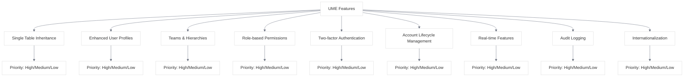
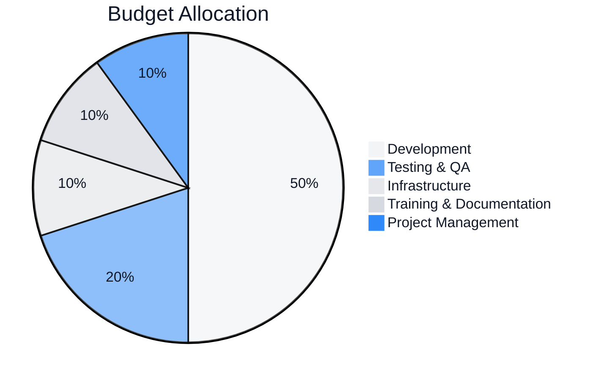
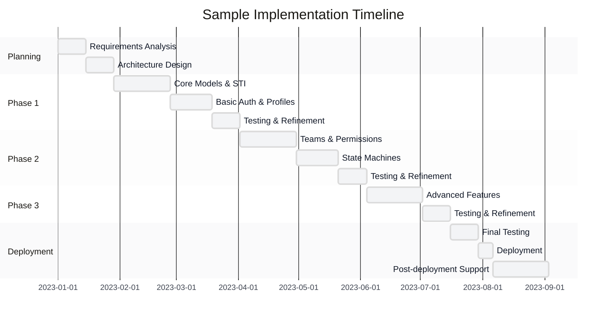
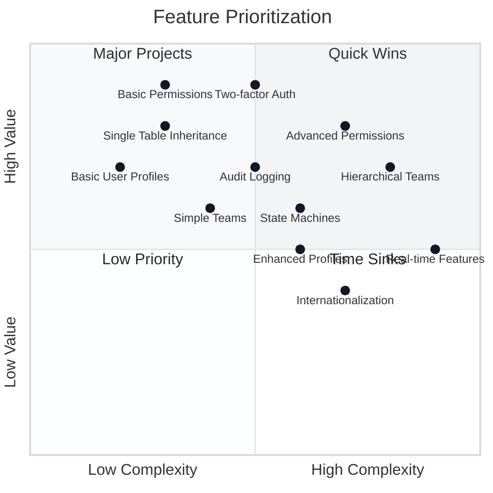

# Decision Framework for UME Implementation

<link rel="stylesheet" href="../assets/css/styles.css">

This decision framework provides a structured approach to planning your User Model Enhancements (UME) implementation. By evaluating your organization's specific needs, constraints, and goals, you can develop a tailored implementation strategy that maximizes value while minimizing risks.

## 1. Assessing Your Organization's Needs

### 1.1 Organization Profile Assessment

Begin by assessing your organization's profile to understand the scope and complexity of your implementation:

| Factor | Small | Medium | Large |
|--------|-------|--------|-------|
| **Total Users** | <100,000 | 100,000 - 1,000,000 | >1,000,000 |
| **User Types** | 2-3 types | 4-6 types | 7+ types |
| **Team Structure** | Flat or simple hierarchy | Two-level hierarchy | Complex multi-level hierarchy |
| **Geographic Scope** | Single region | Multiple regions | Global |
| **Regulatory Requirements** | Basic | Moderate | Complex |
| **Integration Needs** | Few integrations | Multiple integrations | Extensive integrations |

### 1.2 Technical Environment Assessment

Evaluate your current technical environment to identify constraints and opportunities:

| Factor | Basic | Intermediate | Advanced |
|--------|-------|-------------|----------|
| **Current Laravel Version** | <10 | 10-11 | 12+ |
| **Database System** | Simple MySQL | Optimized MySQL/PostgreSQL | Sharded/Distributed |
| **Infrastructure** | Single server | Load-balanced servers | Cloud-native/Kubernetes |
| **Development Team Size** | 1-3 developers | 4-10 developers | 10+ developers |
| **Team Laravel Expertise** | Limited | Moderate | Extensive |
| **Current Test Coverage** | Limited | Moderate | Comprehensive |

### 1.3 Feature Priority Assessment

Rate the importance of each UME feature for your organization:

Use the following worksheet to assess your priorities:

| Feature | Priority (1-5) | Justification | Implementation Complexity |
|---------|----------------|---------------|---------------------------|
| Single Table Inheritance | | | |
| Enhanced User Profiles | | | |
| Teams & Hierarchies | | | |
| Role-based Permissions | | | |
| Two-factor Authentication | | | |
| Account Lifecycle Management | | | |
| Real-time Features | | | |
| Audit Logging | | | |
| Internationalization | | | |

## 2. Implementation Strategy Selection

Based on your assessments, select the most appropriate implementation strategy:

### 2.1 Implementation Scope

| Scope | Description | Best For |
|-------|-------------|----------|
| **Minimal** | Implement only core UME features (STI, basic profiles, simple permissions) | Organizations with limited resources or immediate basic needs |
| **Standard** | Implement core features plus teams, enhanced permissions, and 2FA | Most small to medium organizations |
| **Comprehensive** | Implement all UME features with advanced configurations | Large organizations with complex requirements |
| **Custom** | Tailored implementation focusing on specific high-priority features | Organizations with unique or specialized needs |

### 2.2 Implementation Approach

| Approach | Description | Best For |
|----------|-------------|----------|
| **All-at-once** | Implement all selected features in a single project | Small implementations with simple requirements |
| **Phased by Feature** | Implement features sequentially based on priority | Most organizations, especially with limited resources |
| **Phased by User Group** | Implement for different user groups sequentially | Organizations with diverse user bases |
| **Pilot-then-Scale** | Implement for a subset of users, then expand | Organizations with high-risk or complex implementations |

### 2.3 Technical Implementation Strategy

| Strategy | Description | Best For |
|----------|-------------|----------|
| **Simple STI** | Basic type column with minimal specialized behavior | Small organizations with few user types |
| **Enhanced STI with Profiles** | Type column with related profile tables | Medium organizations with diverse user types |
| **Multi-tenant STI** | Type column with tenant isolation | Large organizations or SaaS applications |
| **Simple Teams** | Basic team membership without hierarchy | Organizations with flat structures |
| **Hierarchical Teams** | Teams with parent-child relationships | Organizations with multi-level structures |
| **Organization Units** | Complex organizational units with multiple contexts | Large enterprises with matrix organizations |

## 3. Resource Planning

### 3.1 Team Composition

Based on your implementation strategy, determine the optimal team composition:

| Role | Small Implementation | Medium Implementation | Large Implementation |
|------|----------------------|------------------------|----------------------|
| **Project Manager** | Part-time | Full-time | Full-time |
| **Technical Lead** | 1 (may be hands-on) | 1 | 1-2 |
| **Senior Developers** | 1-2 | 2-4 | 5+ |
| **Junior Developers** | 0-1 | 1-3 | 3+ |
| **QA Specialists** | 0-1 | 1-2 | 2+ |
| **UX Designers** | 0-1 | 1 | 2+ |
| **DevOps Engineers** | 0-1 | 1 | 2+ |
| **External Consultants** | Consider for expertise gaps | Consider for specialized areas | Consider for strategic guidance |

### 3.2 Budget Estimation

Use the following guidelines to estimate your implementation budget:

| Implementation Size | Typical Budget Range | Timeline |
|---------------------|----------------------|----------|
| **Small** | $20,000 - $50,000 | 2-4 months |
| **Medium** | $50,000 - $200,000 | 4-8 months |
| **Large** | $200,000 - $1,500,000+ | 8-18 months |

### 3.3 Timeline Planning

Develop a realistic timeline based on your implementation strategy:

## 4. Risk Assessment and Mitigation

### 4.1 Common Implementation Risks

| Risk Category | Common Risks | Mitigation Strategies |
|---------------|--------------|------------------------|
| **Technical** | Performance issues with permission checks | Implement caching, optimize queries, conduct early performance testing |
| | Data migration errors | Develop comprehensive migration plan, create validation tools, perform dry runs |
| | Integration failures | Define clear API contracts, create adapter layers, implement comprehensive testing |
| **Organizational** | Stakeholder resistance | Involve stakeholders early, demonstrate benefits, address concerns proactively |
| | Resource constraints | Prioritize features, consider phased implementation, secure adequate budget |
| | Knowledge gaps | Provide training, engage consultants, develop comprehensive documentation |
| **User Adoption** | User resistance | Communicate benefits, provide training, gather and address feedback |
| | Learning curve | Create intuitive interfaces, provide contextual help, implement progressive disclosure |
| | Feature overload | Prioritize essential features, implement incrementally, gather user feedback |

### 4.2 Risk Assessment Matrix

For your implementation, assess each risk using this matrix:

| Risk | Probability (1-5) | Impact (1-5) | Risk Score | Mitigation Strategy |
|------|-------------------|--------------|------------|---------------------|
| | | | | |
| | | | | |
| | | | | |

### 4.3 Contingency Planning

Develop contingency plans for high-risk aspects of your implementation:

| Scenario | Trigger | Contingency Plan |
|----------|---------|------------------|
| Performance issues | Response times exceed thresholds | Implement additional caching, optimize queries, scale infrastructure |
| Data migration issues | Validation failures exceed threshold | Pause migration, fix issues, consider phased migration approach |
| Integration failures | Critical integrations fail testing | Implement temporary workarounds, engage vendor support, revise integration approach |
| Resource constraints | Team velocity falls below target | Prioritize critical features, extend timeline, consider additional resources |

## 5. Implementation Roadmap Development

### 5.1 Feature Prioritization Matrix

Use this matrix to prioritize features based on value and implementation complexity:

### 5.2 Implementation Phases

Based on your prioritization, define clear implementation phases:

| Phase | Features | Timeline | Success Criteria |
|-------|----------|----------|------------------|
| **Phase 1** | | | |
| **Phase 2** | | | |
| **Phase 3** | | | |
| **Phase 4** | | | |

### 5.3 Milestone Definition

Define specific milestones to track progress:

| Milestone | Description | Target Date | Dependencies | Verification Method |
|-----------|-------------|-------------|--------------|---------------------|
| | | | | |
| | | | | |
| | | | | |

## 6. Success Measurement Framework

### 6.1 Key Performance Indicators

Define KPIs to measure the success of your implementation:

| Category | KPI | Baseline | Target | Measurement Method |
|----------|-----|----------|--------|-------------------|
| **Technical** | System performance | | | |
| | Error rates | | | |
| | Test coverage | | | |
| **Operational** | Administrative time | | | |
| | Support ticket volume | | | |
| | User management efficiency | | | |
| **User Experience** | User satisfaction | | | |
| | Feature adoption | | | |
| | Task completion rates | | | |
| **Business** | ROI | | | |
| | Cost savings | | | |
| | Revenue impact | | | |

### 6.2 Measurement Plan

Develop a plan for measuring and reporting on KPIs:

| KPI | Data Source | Collection Frequency | Responsible Party | Reporting Format |
|-----|-------------|----------------------|-------------------|------------------|
| | | | | |
| | | | | |
| | | | | |

## 7. Decision Worksheet

Use this worksheet to document your key implementation decisions:

### 7.1 Implementation Strategy

- **Implementation Scope**: [Minimal / Standard / Comprehensive / Custom]
- **Implementation Approach**: [All-at-once / Phased by Feature / Phased by User Group / Pilot-then-Scale]
- **Technical Implementation Strategy**: [Simple STI / Enhanced STI with Profiles / Multi-tenant STI / etc.]

### 7.2 Feature Selection

| Feature | Include? | Priority | Phase | Justification |
|---------|----------|----------|-------|---------------|
| Single Table Inheritance | | | | |
| Enhanced User Profiles | | | | |
| Teams & Hierarchies | | | | |
| Role-based Permissions | | | | |
| Two-factor Authentication | | | | |
| Account Lifecycle Management | | | | |
| Real-time Features | | | | |
| Audit Logging | | | | |
| Internationalization | | | | |

### 7.3 Resource Allocation

- **Team Composition**: [List key roles and allocation]
- **Budget Allocation**: [Total budget and breakdown]
- **Timeline**: [Start date, end date, key milestones]

### 7.4 Risk Management

- **Top Risks**: [List top 3-5 risks]
- **Mitigation Strategies**: [List key mitigation strategies]
- **Contingency Triggers**: [List key triggers for contingency plans]

## 8. Next Steps

After completing this decision framework:

1. **Finalize Implementation Plan**
   - Document detailed implementation strategy
   - Create comprehensive project plan
   - Define team roles and responsibilities

2. **Secure Resources**
   - Obtain budget approval
   - Assemble implementation team
   - Secure necessary infrastructure

3. **Initiate Implementation**
   - Begin with planning phase
   - Establish regular progress reviews
   - Implement continuous feedback mechanisms

4. **Monitor and Adapt**
   - Track KPIs against targets
   - Adjust implementation as needed
   - Document lessons learned

By following this structured decision framework, you can develop a tailored UME implementation strategy that aligns with your organization's specific needs, constraints, and goals.
