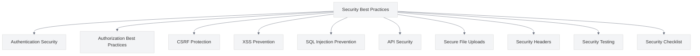

# Security Best Practices

<link rel="stylesheet" href="../assets/css/styles.css">

This section provides comprehensive security best practices for your User Model Enhancements (UME) implementation. Security is a critical aspect of any application, especially those handling user data and authentication.

## Overview

The security best practices in this section cover various aspects of application security, from authentication and authorization to protection against common web vulnerabilities. Each guide includes practical examples specific to the UME implementation.

## In This Section

1. [Security Checklist](./010-security-checklist.md) - Comprehensive security checklist for each implementation phase
2. [Authentication Security](./020-authentication-security.md) - Best practices for secure authentication
3. [Authorization Best Practices](./030-authorization-best-practices.md) - Implementing secure authorization
4. [CSRF Protection](./040-csrf-protection.md) - Protecting against Cross-Site Request Forgery
5. [XSS Prevention](./050-xss-prevention.md) - Preventing Cross-Site Scripting attacks
6. [SQL Injection Prevention](./060-sql-injection-prevention.md) - Protecting against SQL injection
7. [API Security](./070-api-security.md) - Securing API endpoints
8. [Secure File Uploads](./080-secure-file-uploads.md) - Handling file uploads securely
9. [Security Headers](./090-security-headers.md) - Implementing secure HTTP headers
10. [Security Testing](./110-security-testing.md) - Testing your application for security vulnerabilities

## Why Security Matters

Security is not an afterthought but a fundamental aspect of application development. The UME implementation deals with sensitive user data, authentication, and authorization, making security particularly important. Following these best practices will help protect your application and its users from common security threats.

## Getting Started

Begin with the [Security Checklist](./010-security-checklist.md) to get an overview of security considerations for each implementation phase. Then, explore the specific security topics based on your current implementation phase or areas of concern.
