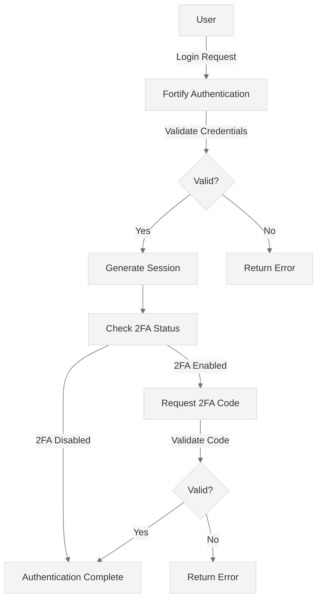

# Authentication Security Best Practices

<link rel="stylesheet" href="../assets/css/styles.css">

This guide covers best practices for implementing secure authentication in your UME application. Authentication is the foundation of application security, and implementing it correctly is crucial for protecting user accounts and data.

## Overview

Authentication in the UME implementation uses Laravel Fortify as a backend authentication service, with custom UI components built using Livewire/Volt and Flux UI. This separation of concerns allows for a clean implementation while maintaining security.



## Key Security Considerations

### 1. Password Storage

**Best Practice**: Never store passwords in plain text. Always use strong, adaptive hashing algorithms.

**Implementation**:
- Laravel automatically uses bcrypt (or Argon2 if configured) for password hashing
- Password hashes are stored in the `password` column of the `users` table
- The hashing configuration can be found in `config/hashing.php`

```php
// Example of proper password handling in a registration service
public function createUser(array $data): User
{
    return User::create([
        'name' => $data['name'],
        'email' => $data['email'],
        'password' => Hash::make($data['password']), // Proper hashing
    ]);
}
```

### 2. Password Policies

**Best Practice**: Enforce strong password policies to prevent brute force attacks.

**Implementation**:
- Configure password validation rules in `app/Actions/Fortify/PasswordValidationRules.php`
- Enforce minimum length, complexity, and common password checks

```php
// Example of strong password validation rules
public function passwordRules(): array
{
    return [
        'required',
        'string',
        (new Password)
            ->length(12)      // Require at least 12 characters
            ->mixedCase()     // Require both upper and lower case letters
            ->numbers()       // Require at least one number
            ->symbols()       // Require at least one symbol
            ->uncompromised(), // Check against known compromised passwords
        'confirmed',
    ];
}
```

### 3. Multi-Factor Authentication (MFA)

**Best Practice**: Implement multi-factor authentication to add an additional layer of security.

**Implementation**:
- Enable two-factor authentication in Fortify configuration
- Implement the UI for enabling, confirming, and using 2FA
- Store 2FA secrets securely

```php
// In config/fortify.php
'features' => [
    Features::registration(),
    Features::resetPasswords(),
    Features::emailVerification(),
    Features::updateProfileInformation(),
    Features::updatePasswords(),
    Features::twoFactorAuthentication([
        'confirmPassword' => true,
    ]),
],
```

### 4. Account Lockout

**Best Practice**: Implement account lockout after multiple failed login attempts to prevent brute force attacks.

**Implementation**:
- Configure the maximum login attempts and lockout time in `config/fortify.php`
- Use exponential backoff for repeated failures

```php
// In config/fortify.php
'limiters' => [
    'login' => 'login',
    'two-factor' => 'two-factor',
],

// In app/Providers/RouteServiceProvider.php
RateLimiter::for('login', function (Request $request) {
    return Limit::perMinute(5)->by($request->email.$request->ip());
});

RateLimiter::for('two-factor', function (Request $request) {
    return Limit::perMinute(5)->by($request->session()->get('login.id'));
});
```

### 5. Session Security

**Best Practice**: Configure secure session settings to prevent session hijacking and fixation.

**Implementation**:
- Configure session settings in `config/session.php`
- Use HTTPS-only cookies
- Implement proper session timeouts
- Regenerate session IDs on login

```php
// In config/session.php
'secure' => env('SESSION_SECURE_COOKIE', true),
'http_only' => true,
'same_site' => 'lax',
```

### 6. Email Verification

**Best Practice**: Implement email verification to confirm user identity and prevent account abuse.

**Implementation**:
- Enable email verification in Fortify configuration
- Customize email verification templates
- Integrate with the account state machine

```php
// In config/fortify.php
'features' => [
    // ...
    Features::emailVerification(),
    // ...
],
```

### 7. Secure Password Reset

**Best Practice**: Implement secure password reset functionality that doesn't expose user information.

**Implementation**:
- Use time-limited, single-use tokens for password resets
- Send reset links to the user's email address
- Verify the token before allowing password change
- Log password changes and notify the user

```php
// Example of secure password reset notification
class ResetPassword extends Notification
{
    // ...
    
    public function toMail($notifiable)
    {
        return (new MailMessage)
            ->subject('Reset Password Notification')
            ->line('You are receiving this email because we received a password reset request for your account.')
            ->action('Reset Password', url(route('password.reset', [
                'token' => $this->token,
                'email' => $notifiable->getEmailForPasswordReset(),
            ], false)))
            ->line('This password reset link will expire in :count minutes.', ['count' => config('auth.passwords.'.config('auth.defaults.passwords').'.expire')])
            ->line('If you did not request a password reset, no further action is required.');
    }
}
```

### 8. Remember Me Functionality

**Best Practice**: Implement "Remember Me" functionality securely to balance convenience and security.

**Implementation**:
- Use long-lived, secure cookies for "Remember Me"
- Implement proper token rotation
- Allow users to view and revoke active sessions

```php
// In config/auth.php
'guards' => [
    'web' => [
        'driver' => 'session',
        'provider' => 'users',
    ],
],

// In login form
<div class="block mt-4">
    <label for="remember_me" class="flex items-center">
        <x-checkbox id="remember_me" name="remember" />
        <span class="ml-2 text-sm text-gray-600">{{ __('Remember me') }}</span>
    </label>
</div>
```

### 9. Secure Logout

**Best Practice**: Implement secure logout functionality to properly terminate sessions.

**Implementation**:
- Invalidate the session on logout
- Clear authentication cookies
- Redirect to a safe page after logout

```php
// In a controller or route
public function logout(Request $request)
{
    Auth::logout();
    
    $request->session()->invalidate();
    $request->session()->regenerateToken();
    
    return redirect('/');
}
```

### 10. Authentication Logging and Monitoring

**Best Practice**: Log authentication events for security monitoring and auditing.

**Implementation**:
- Log successful and failed login attempts
- Log password changes and account recovery actions
- Monitor for suspicious activity patterns

```php
// Example of authentication event listener
protected function authenticated(Request $request, $user)
{
    Log::info('User logged in', [
        'user_id' => $user->id,
        'email' => $user->email,
        'ip' => $request->ip(),
        'user_agent' => $request->userAgent(),
    ]);
}
```

## Implementation in UME

The UME implementation follows these best practices through:

1. **Fortify Integration**: Using Laravel Fortify for secure authentication backend
2. **State Machine**: Implementing account lifecycle management with state machines
3. **Two-Factor Authentication**: Supporting app-based 2FA
4. **Email Verification**: Requiring email verification for new accounts
5. **Custom UI**: Implementing secure UI components with Livewire/Volt and Flux UI

## Common Vulnerabilities to Avoid

1. **Credential Stuffing**: Use rate limiting and CAPTCHA for login attempts
2. **Session Hijacking**: Use secure, HTTP-only cookies and proper session configuration
3. **Phishing**: Implement proper email templates and domain verification
4. **Password Spraying**: Enforce strong password policies and account lockouts
5. **Man-in-the-Middle**: Enforce HTTPS for all authentication-related requests

## Testing Authentication Security

Regularly test your authentication implementation for security vulnerabilities:

1. **Automated Testing**: Write tests for authentication flows and edge cases
2. **Penetration Testing**: Conduct regular penetration testing of authentication mechanisms
3. **Code Review**: Review authentication-related code for security issues
4. **Dependency Scanning**: Regularly scan dependencies for security vulnerabilities

## Next Steps

After implementing secure authentication, proceed to [Authorization Best Practices](./030-authorization-best-practices.md) to ensure that authenticated users can only access resources they are authorized to use.
