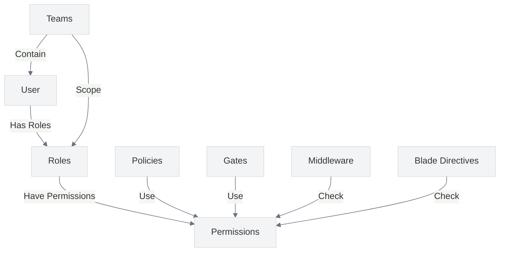

# Authorization Best Practices

<link rel="stylesheet" href="../assets/css/styles.css">

This guide covers best practices for implementing secure authorization in your UME application. Authorization determines what authenticated users are allowed to do, making it a critical component of application security.

## Overview

The UME implementation uses a combination of Laravel's built-in authorization features and the Spatie Laravel Permission package to implement a comprehensive, team-based authorization system. This approach allows for fine-grained access control while maintaining flexibility.



## Key Security Considerations

### 1. Role-Based Access Control (RBAC)

**Best Practice**: Implement role-based access control to manage permissions at scale.

**Implementation**:
- Use Spatie Laravel Permission to define roles and permissions
- Assign roles to users rather than individual permissions
- Implement role hierarchies where appropriate

```php
// Example of role definition
Role::create(['name' => 'editor']);
Role::create(['name' => 'admin']);

// Assign permissions to roles
$editorRole = Role::findByName('editor');
$editorRole->givePermissionTo('edit articles');
$editorRole->givePermissionTo('publish articles');

$adminRole = Role::findByName('admin');
$adminRole->givePermissionTo('edit articles');
$adminRole->givePermissionTo('publish articles');
$adminRole->givePermissionTo('delete articles');

// Assign role to user
$user->assignRole('editor');
```

### 2. Team-Based Permissions

**Best Practice**: Scope permissions to specific teams to implement multi-tenancy.

**Implementation**:
- Configure Spatie Laravel Permission for team-based permissions
- Add team_id to roles and permissions tables
- Check permissions within the context of a team

```php
// Example of team-based permission check
// Check if user has permission in the context of a team
if ($user->hasPermissionTo('edit articles', $team->id)) {
    // User can edit articles in this team
}

// Assign a role to a user within a team
$user->assignRole('editor', $team->id);
```

### 3. Policy-Based Authorization

**Best Practice**: Use policies to centralize authorization logic for models.

**Implementation**:
- Create policies for each model
- Register policies in the AuthServiceProvider
- Use policy methods in controllers and views

```php
// Example of a policy
class ArticlePolicy
{
    public function view(User $user, Article $article)
    {
        return $user->hasPermissionTo('view articles', $article->team_id);
    }
    
    public function edit(User $user, Article $article)
    {
        return $user->hasPermissionTo('edit articles', $article->team_id);
    }
    
    public function delete(User $user, Article $article)
    {
        return $user->hasPermissionTo('delete articles', $article->team_id);
    }
}

// Using the policy in a controller
public function edit(Article $article)
{
    $this->authorize('edit', $article);
    
    // User is authorized to edit the article
    return view('articles.edit', compact('article'));
}
```

### 4. Gate-Based Authorization

**Best Practice**: Use gates for custom authorization logic that doesn't map directly to models.

**Implementation**:
- Define gates in the AuthServiceProvider
- Use gates in controllers and views
- Combine gates with policies for comprehensive authorization

```php
// Example of gate definition
Gate::define('access-admin-dashboard', function (User $user) {
    return $user->hasRole('admin');
});

// Using the gate in a controller
public function dashboard()
{
    if (Gate::denies('access-admin-dashboard')) {
        abort(403);
    }
    
    // User is authorized to access the admin dashboard
    return view('admin.dashboard');
}
```

### 5. Middleware-Based Authorization

**Best Practice**: Use middleware for route-level authorization.

**Implementation**:
- Use the built-in `can` middleware for policy-based checks
- Use the `role` and `permission` middleware from Spatie Laravel Permission
- Create custom middleware for complex authorization logic

```php
// Example of middleware-based authorization
Route::get('/admin/dashboard', function () {
    // Only admins can access this route
    return view('admin.dashboard');
})->middleware('role:admin');

Route::get('/articles/{article}/edit', function (Article $article) {
    // Only users with the 'edit articles' permission can access this route
    return view('articles.edit', compact('article'));
})->middleware('permission:edit articles');

Route::get('/teams/{team}/manage', function (Team $team) {
    // Only team owners can access this route
    return view('teams.manage', compact('team'));
})->middleware('can:manage,team');
```

### 6. Blade Directive Authorization

**Best Practice**: Use Blade directives for view-level authorization.

**Implementation**:
- Use the built-in `@can`, `@cannot`, and `@canany` directives
- Use the `@role`, `@hasrole`, `@hasanyrole`, and `@hasallroles` directives from Spatie Laravel Permission
- Use the `@unlessrole` directive for negative role checks

```blade
<!-- Example of Blade directive authorization -->
@can('edit', $article)
    <a href="{{ route('articles.edit', $article) }}">Edit</a>
@endcan

@role('admin')
    <a href="{{ route('admin.dashboard') }}">Admin Dashboard</a>
@endrole

@hasPermission('delete articles')
    <form method="POST" action="{{ route('articles.destroy', $article) }}">
        @csrf
        @method('DELETE')
        <button type="submit">Delete</button>
    </form>
@endhasPermission
```

### 7. API Authorization

**Best Practice**: Implement consistent authorization for API endpoints.

**Implementation**:
- Use policies for API resource controllers
- Implement token-based authorization with appropriate scopes
- Return proper HTTP status codes for authorization failures

```php
// Example of API authorization
public function update(Request $request, Article $article)
{
    $this->authorize('update', $article);
    
    // User is authorized to update the article
    $article->update($request->validated());
    
    return response()->json($article);
}
```

### 8. Super Admin Role

**Best Practice**: Implement a super admin role with caution and proper controls.

**Implementation**:
- Create a super admin role with all permissions
- Limit the number of users with super admin role
- Log all actions performed by super admins
- Consider requiring additional confirmation for destructive actions

```php
// Example of super admin implementation
// In AuthServiceProvider
Gate::before(function ($user, $ability) {
    if ($user->hasRole('super-admin')) {
        return true;
    }
});

// Log super admin actions
if ($user->hasRole('super-admin')) {
    Log::info('Super admin action', [
        'user_id' => $user->id,
        'action' => 'delete_user',
        'target_id' => $targetUser->id,
    ]);
}
```

### 9. Authorization Caching

**Best Practice**: Implement authorization caching to improve performance.

**Implementation**:
- Configure Spatie Laravel Permission to use cache
- Set appropriate cache TTL
- Clear cache when permissions change

```php
// In config/permission.php
'cache' => [
    'expiration_time' => \DateInterval::createFromDateString('24 hours'),
    'key' => 'spatie.permission.cache',
    'model_key' => 'name',
    'store' => 'default',
],

// Clear cache when permissions change
$role->syncPermissions($permissions);
app()->make(\Spatie\Permission\PermissionRegistrar::class)->forgetCachedPermissions();
```

### 10. Audit Logging

**Best Practice**: Log authorization decisions for audit and debugging purposes.

**Implementation**:
- Log permission checks and their results
- Log role and permission changes
- Implement a comprehensive audit trail

```php
// Example of authorization logging
Log::info('Permission check', [
    'user_id' => $user->id,
    'permission' => 'edit articles',
    'team_id' => $team->id,
    'result' => $user->hasPermissionTo('edit articles', $team->id),
]);

// Log role assignment
Log::info('Role assigned', [
    'user_id' => $user->id,
    'role' => 'editor',
    'team_id' => $team->id,
    'assigned_by' => Auth::id(),
]);
```

## Implementation in UME

The UME implementation follows these best practices through:

1. **Spatie Laravel Permission**: Using a battle-tested package for role and permission management
2. **Team Scoping**: Implementing team-based permissions for multi-tenancy
3. **Policy Implementation**: Creating policies for all models
4. **Middleware Usage**: Using middleware for route-level authorization
5. **Blade Directives**: Using Blade directives for view-level authorization
6. **State Machine Integration**: Integrating authorization with the account state machine

## Common Vulnerabilities to Avoid

1. **Insecure Direct Object References**: Always check authorization before accessing objects
2. **Missing Function Level Authorization**: Implement authorization checks for all sensitive operations
3. **Horizontal Privilege Escalation**: Prevent users from accessing resources of other users at the same level
4. **Vertical Privilege Escalation**: Prevent users from accessing resources reserved for higher privilege levels
5. **Improper Authorization Checks**: Ensure authorization checks are comprehensive and consistent

## Testing Authorization Security

Regularly test your authorization implementation for security vulnerabilities:

1. **Unit Testing**: Write tests for authorization rules and edge cases
2. **Integration Testing**: Test authorization in the context of the application
3. **Penetration Testing**: Conduct regular penetration testing of authorization mechanisms
4. **Code Review**: Review authorization-related code for security issues

## Next Steps

After implementing secure authorization, proceed to [CSRF Protection](./040-csrf-protection.md) to protect your application from cross-site request forgery attacks.
