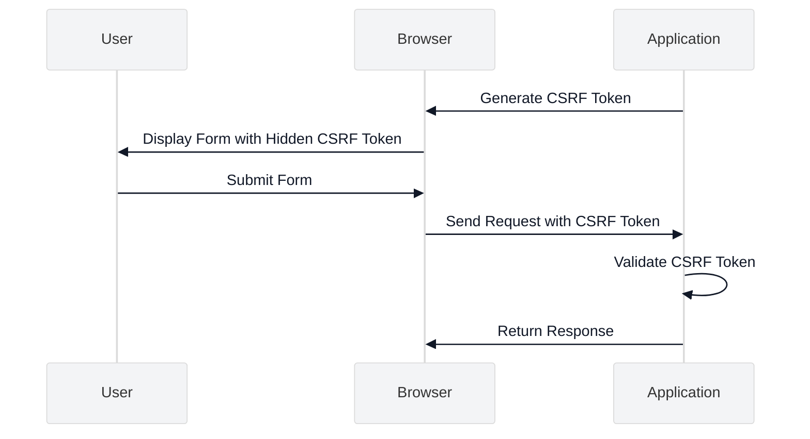

# CSRF Protection

<link rel="stylesheet" href="../assets/css/styles.css">

This guide covers best practices for implementing Cross-Site Request Forgery (CSRF) protection in your UME application. CSRF is an attack that tricks users into submitting unwanted requests to a website where they're authenticated.

## Overview

Laravel provides built-in CSRF protection that helps prevent CSRF attacks by requiring a token with each POST, PUT, PATCH, or DELETE request. The UME implementation leverages this protection and extends it with additional best practices.



## How CSRF Attacks Work

A CSRF attack occurs when a malicious website tricks a user's browser into making an unwanted request to a website where the user is authenticated. For example:

1. User logs into your application and receives an authentication cookie
2. User visits a malicious website
3. The malicious website contains code that submits a form to your application
4. The browser automatically includes the authentication cookie with the request
5. Your application processes the request as if it came from the legitimate user

## Laravel's CSRF Protection

Laravel protects against CSRF attacks by:

1. Generating a CSRF token for each active user session
2. Including this token in forms as a hidden field
3. Checking that incoming requests include a valid token
4. Rejecting requests that don't include a valid token

## Key Security Considerations

### 1. Include CSRF Tokens in All Forms

**Best Practice**: Include CSRF tokens in all forms that modify data.

**Implementation**:
- Use the `@csrf` Blade directive in all forms
- For JavaScript-based forms, include the CSRF token as a hidden field or in the headers

```blade
<!-- Example of CSRF token in a Blade form -->
<form method="POST" action="/profile">
    @csrf
    <!-- Form fields -->
    <button type="submit">Update Profile</button>
</form>
```

```javascript
// Example of CSRF token in an Axios request
axios.post('/api/profile', data, {
    headers: {
        'X-CSRF-TOKEN': document.querySelector('meta[name="csrf-token"]').content
    }
});
```

### 2. CSRF Protection for APIs

**Best Practice**: Implement appropriate CSRF protection for APIs based on authentication method.

**Implementation**:
- For cookie-based authentication, require CSRF tokens
- For token-based authentication (e.g., API tokens, JWT), CSRF protection is typically not needed
- Configure CSRF middleware appropriately

```php
// Example of CSRF configuration in app/Http/Kernel.php
protected $middlewareGroups = [
    'web' => [
        // ...
        \App\Http\Middleware\VerifyCsrfToken::class,
        // ...
    ],
    
    'api' => [
        // No CSRF middleware for token-based API routes
        // ...
    ],
];
```

### 3. CSRF Token Rotation

**Best Practice**: Rotate CSRF tokens to limit the window of opportunity for attacks.

**Implementation**:
- Laravel automatically regenerates CSRF tokens when a user logs in or out
- Consider additional token rotation for sensitive operations

```php
// Example of manual CSRF token regeneration
public function sensitiveOperation(Request $request)
{
    // Perform sensitive operation
    
    // Regenerate CSRF token
    $request->session()->regenerateToken();
    
    return redirect()->back();
}
```

### 4. Same-Site Cookie Attribute

**Best Practice**: Use the SameSite cookie attribute to prevent CSRF attacks.

**Implementation**:
- Configure the SameSite attribute for cookies in `config/session.php`
- Use 'lax' or 'strict' based on your application's needs

```php
// In config/session.php
'same_site' => 'lax',
```

### 5. CSRF Protection for Livewire Components

**Best Practice**: Ensure Livewire components are protected against CSRF attacks.

**Implementation**:
- Livewire automatically includes CSRF protection
- No additional configuration is needed for standard Livewire components

```php
// Example of a Livewire component (CSRF protection is automatic)
class ProfileForm extends Component
{
    public $name;
    public $email;
    
    public function mount()
    {
        $this->name = auth()->user()->name;
        $this->email = auth()->user()->email;
    }
    
    public function save()
    {
        // CSRF protection is automatically applied
        auth()->user()->update([
            'name' => $this->name,
            'email' => $this->email,
        ]);
    }
    
    public function render()
    {
        return view('livewire.profile-form');
    }
}
```

### 6. CSRF Protection for Inertia.js

**Best Practice**: Ensure Inertia.js requests are protected against CSRF attacks.

**Implementation**:
- Inertia.js automatically includes the CSRF token in requests
- No additional configuration is needed for standard Inertia.js applications

```javascript
// Example of an Inertia.js form submission (CSRF protection is automatic)
<form @submit.prevent="form.post(route('profile.update'))">
    <input type="text" v-model="form.name">
    <input type="email" v-model="form.email">
    <button type="submit">Update Profile</button>
</form>
```

### 7. CSRF Exceptions

**Best Practice**: Carefully consider which routes should be exempt from CSRF protection.

**Implementation**:
- Configure CSRF exceptions in `app/Http/Middleware/VerifyCsrfToken.php`
- Only exempt routes that absolutely require it (e.g., webhook endpoints)
- Implement alternative protection for exempt routes

```php
// Example of CSRF exceptions
class VerifyCsrfToken extends Middleware
{
    /**
     * The URIs that should be excluded from CSRF verification.
     *
     * @var array
     */
    protected $except = [
        'stripe/webhook',
        'paypal/webhook',
    ];
}
```

### 8. CSRF Protection for File Uploads

**Best Practice**: Ensure file upload forms include CSRF protection.

**Implementation**:
- Include CSRF tokens in file upload forms
- For AJAX file uploads, include the CSRF token in the request

```blade
<!-- Example of CSRF token in a file upload form -->
<form method="POST" action="/upload" enctype="multipart/form-data">
    @csrf
    <input type="file" name="avatar">
    <button type="submit">Upload</button>
</form>
```

### 9. CSRF Protection for Multi-Step Forms

**Best Practice**: Maintain CSRF protection across multi-step forms.

**Implementation**:
- Include the CSRF token in each step of the form
- For forms that span multiple requests, regenerate the token as needed

```php
// Example of a multi-step form controller
public function stepOne(Request $request)
{
    // Validate step one
    $validated = $request->validate([
        'name' => 'required',
        'email' => 'required|email',
    ]);
    
    // Store validated data in session
    $request->session()->put('step_one_data', $validated);
    
    return view('forms.step-two');
}

public function stepTwo(Request $request)
{
    // Validate step two
    $validated = $request->validate([
        'address' => 'required',
        'phone' => 'required',
    ]);
    
    // Retrieve step one data
    $stepOneData = $request->session()->get('step_one_data');
    
    // Process the complete form data
    $user = User::create(array_merge($stepOneData, $validated));
    
    // Clean up session
    $request->session()->forget('step_one_data');
    
    return redirect()->route('home');
}
```

### 10. Testing CSRF Protection

**Best Practice**: Test CSRF protection to ensure it's working correctly.

**Implementation**:
- Write tests that verify CSRF protection is enforced
- Test both valid and invalid CSRF tokens

```php
// Example of a CSRF protection test
public function test_csrf_protection()
{
    // Test that a POST request without a CSRF token fails
    $response = $this->post('/profile', [
        'name' => 'John Doe',
        'email' => 'john@example.com',
    ]);
    
    $response->assertStatus(419); // 419 is Laravel's CSRF token mismatch status code
    
    // Test that a POST request with a valid CSRF token succeeds
    $response = $this->withoutMiddleware(VerifyCsrfToken::class)
        ->post('/profile', [
            'name' => 'John Doe',
            'email' => 'john@example.com',
        ]);
    
    $response->assertStatus(302); // Redirect after successful submission
}
```

## Implementation in UME

The UME implementation follows these best practices through:

1. **Laravel Middleware**: Using Laravel's built-in CSRF protection middleware
2. **Blade Directives**: Using the `@csrf` directive in all forms
3. **JavaScript Integration**: Including CSRF tokens in AJAX requests
4. **SameSite Cookies**: Configuring SameSite cookie attributes
5. **Livewire Integration**: Leveraging Livewire's automatic CSRF protection

## Common Vulnerabilities to Avoid

1. **Missing CSRF Tokens**: Ensure all forms include CSRF tokens
2. **Improper CSRF Exceptions**: Be cautious when exempting routes from CSRF protection
3. **Predictable CSRF Tokens**: Rely on Laravel's secure token generation
4. **Insufficient SameSite Protection**: Configure SameSite cookie attributes appropriately
5. **Insecure AJAX Requests**: Include CSRF tokens in all AJAX requests that modify data

## Next Steps

After implementing CSRF protection, proceed to [XSS Prevention](./050-xss-prevention.md) to protect your application from cross-site scripting attacks.
