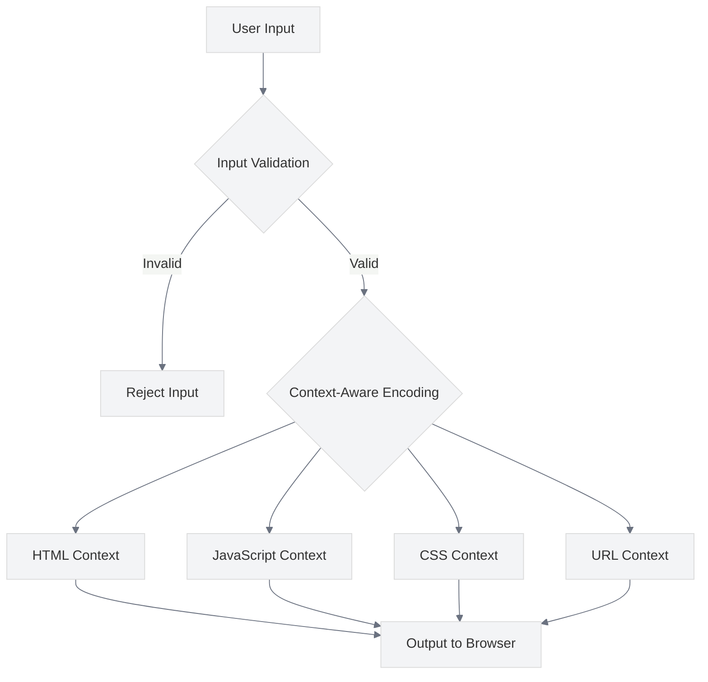

# XSS Prevention

<link rel="stylesheet" href="../assets/css/styles.css">

This guide covers best practices for preventing Cross-Site Scripting (XSS) attacks in your UME application. XSS attacks occur when an attacker injects malicious scripts into web pages viewed by other users.

## Overview

Laravel provides several built-in protections against XSS attacks, but it's important to understand these protections and implement additional safeguards where necessary. The UME implementation leverages these protections and extends them with additional best practices.



## Types of XSS Attacks

1. **Stored XSS**: Malicious script is stored on the server (e.g., in a database) and later served to users
2. **Reflected XSS**: Malicious script is reflected off a web server (e.g., in search results or error messages)
3. **DOM-based XSS**: Malicious script is executed as a result of modifying the DOM environment

## Key Security Considerations

### 1. Automatic Output Escaping in Blade

**Best Practice**: Use Blade's automatic escaping for all dynamic content.

**Implementation**:
- Use Blade's double curly braces `{{ }}` for outputting content, which automatically escapes HTML
- Only use `{!! !!}` for content that is explicitly trusted and needs to contain HTML

```blade
<!-- Safe: Content is automatically escaped -->
<div>{{ $user->name }}</div>

<!-- Unsafe: Only use for trusted content -->
<div>{!! $trustedHtml !!}</div>
```

### 2. Input Validation

**Best Practice**: Validate all user input before processing or storing it.

**Implementation**:
- Use Laravel's validation system to validate input
- Define strict validation rules for all form fields
- Validate both client-side and server-side

```php
// Example of input validation
public function store(Request $request)
{
    $validated = $request->validate([
        'name' => 'required|string|max:255',
        'email' => 'required|email|max:255|unique:users',
        'website' => 'nullable|url',
        'comment' => 'required|string|max:1000',
    ]);
    
    // Process validated data
    Comment::create($validated);
    
    return redirect()->back();
}
```

### 3. Content Security Policy (CSP)

**Best Practice**: Implement a Content Security Policy to restrict which resources can be loaded.

**Implementation**:
- Configure CSP headers to restrict script sources, style sources, etc.
- Use nonces or hashes for inline scripts when necessary
- Start with a strict policy and relax it as needed

```php
// Example of CSP implementation using middleware
class ContentSecurityPolicy
{
    public function handle($request, Closure $next)
    {
        $response = $next($request);
        
        $response->headers->set('Content-Security-Policy', "
            default-src 'self';
            script-src 'self' https://cdn.jsdelivr.net;
            style-src 'self' https://fonts.googleapis.com;
            img-src 'self' data:;
            font-src 'self' https://fonts.gstatic.com;
            connect-src 'self';
            media-src 'self';
            object-src 'none';
            frame-src 'self';
            frame-ancestors 'self';
            form-action 'self';
            base-uri 'self';
            manifest-src 'self'
        ");
        
        return $response;
    }
}
```

### 4. Context-Aware Encoding

**Best Practice**: Use context-aware encoding for different output contexts.

**Implementation**:
- HTML context: Use Blade's automatic escaping
- JavaScript context: Use `json_encode` with `JSON_HEX_TAG | JSON_HEX_APOS | JSON_HEX_AMP | JSON_HEX_QUOT`
- URL context: Use `urlencode` or Laravel's `Str::slug`
- CSS context: Avoid user input in CSS, or use strict validation

```blade
<!-- Example of context-aware encoding -->

<!-- HTML context -->
<div>{{ $user->name }}</div>

<!-- JavaScript context -->
<script>
    const user = @json($user, JSON_HEX_TAG | JSON_HEX_APOS | JSON_HEX_AMP | JSON_HEX_QUOT);
</script>

<!-- URL context -->
<a href="/users/{{ urlencode($user->username) }}">Profile</a>

<!-- CSS context (avoid user input if possible) -->
<style>
    .user-{{ Str::slug($user->role) }} {
        color: #333;
    }
</style>
```

### 5. Sanitizing HTML Content

**Best Practice**: Sanitize user-provided HTML content to remove potentially malicious elements and attributes.

**Implementation**:
- Use a library like HTML Purifier to sanitize HTML content
- Configure the sanitizer to allow only safe elements and attributes
- Apply sanitization before storing or displaying user-provided HTML

```php
// Example of HTML sanitization using HTML Purifier
public function store(Request $request)
{
    $validated = $request->validate([
        'title' => 'required|string|max:255',
        'content' => 'required|string',
    ]);
    
    // Sanitize HTML content
    $config = HTMLPurifier_Config::createDefault();
    $purifier = new HTMLPurifier($config);
    $validated['content'] = $purifier->purify($validated['content']);
    
    // Store sanitized content
    Article::create($validated);
    
    return redirect()->route('articles.index');
}
```

### 6. XSS Protection for JavaScript Frameworks

**Best Practice**: Understand and leverage the XSS protections provided by your JavaScript framework.

**Implementation**:
- Vue.js: Use v-text or v-html with caution
- React: Understand automatic escaping and dangerouslySetInnerHTML
- Alpine.js: Use x-text instead of x-html when possible
- Livewire: Leverage Blade's automatic escaping

```blade
<!-- Example of XSS protection in Vue.js -->
<template>
    <!-- Safe: Content is automatically escaped -->
    <div>{{ user.name }}</div>
    
    <!-- Unsafe: Only use for trusted content -->
    <div v-html="trustedHtml"></div>
</template>
```

### 7. HTTP-Only Cookies

**Best Practice**: Use HTTP-only cookies for sensitive data to prevent access from JavaScript.

**Implementation**:
- Configure session cookies as HTTP-only
- Use HTTP-only cookies for authentication tokens
- Set the Secure flag for cookies in production

```php
// In config/session.php
'http_only' => true,
'secure' => env('SESSION_SECURE_COOKIE', true),
```

### 8. X-XSS-Protection Header

**Best Practice**: Enable the X-XSS-Protection header to activate browser-built-in XSS filters.

**Implementation**:
- Set the X-XSS-Protection header to enable the browser's XSS filter
- Note that this header is being deprecated in favor of Content Security Policy

```php
// Example of X-XSS-Protection header in middleware
$response->headers->set('X-XSS-Protection', '1; mode=block');
```

### 9. Handling User-Generated Markdown

**Best Practice**: Safely convert Markdown to HTML to prevent XSS attacks.

**Implementation**:
- Use a secure Markdown parser
- Configure the parser to disable unsafe features
- Sanitize the resulting HTML

```php
// Example of safe Markdown parsing
public function renderMarkdown($markdown)
{
    // Parse Markdown to HTML
    $html = (new \League\CommonMark\CommonMarkConverter([
        'html_input' => 'strip',
        'allow_unsafe_links' => false,
    ]))->convertToHtml($markdown);
    
    // Additional sanitization if needed
    $config = HTMLPurifier_Config::createDefault();
    $purifier = new HTMLPurifier($config);
    return $purifier->purify($html);
}
```

### 10. Testing for XSS Vulnerabilities

**Best Practice**: Regularly test your application for XSS vulnerabilities.

**Implementation**:
- Write tests that attempt to inject malicious scripts
- Use automated security scanning tools
- Conduct regular security audits

```php
// Example of XSS vulnerability test
public function test_xss_prevention()
{
    // Create a comment with a potential XSS payload
    $comment = Comment::factory()->create([
        'content' => '<script>alert("XSS")</script>',
    ]);
    
    // View the comment
    $response = $this->get(route('comments.show', $comment));
    
    // Verify that the script tag is escaped
    $response->assertSee('&lt;script&gt;alert("XSS")&lt;/script&gt;');
    $response->assertDontSee('<script>alert("XSS")</script>', false);
}
```

## Implementation in UME

The UME implementation follows these best practices through:

1. **Blade Escaping**: Using Blade's automatic escaping for all dynamic content
2. **Input Validation**: Implementing strict validation rules for all user input
3. **Content Security Policy**: Configuring CSP headers to restrict resource loading
4. **HTML Sanitization**: Sanitizing user-provided HTML content
5. **HTTP-Only Cookies**: Using HTTP-only cookies for sensitive data
6. **Secure JavaScript**: Following secure JavaScript practices in Vue.js and Alpine.js components

## Common Vulnerabilities to Avoid

1. **Unescaped Output**: Always escape output in the appropriate context
2. **Insufficient Input Validation**: Validate all user input before processing or storing it
3. **Insecure Third-Party Libraries**: Regularly update dependencies and audit them for security issues
4. **DOM-Based XSS**: Be cautious when manipulating the DOM with user input
5. **Insecure Configurations**: Configure security headers and cookie settings appropriately

## Next Steps

After implementing XSS prevention, proceed to [SQL Injection Prevention](./060-sql-injection-prevention.md) to protect your application from SQL injection attacks.
