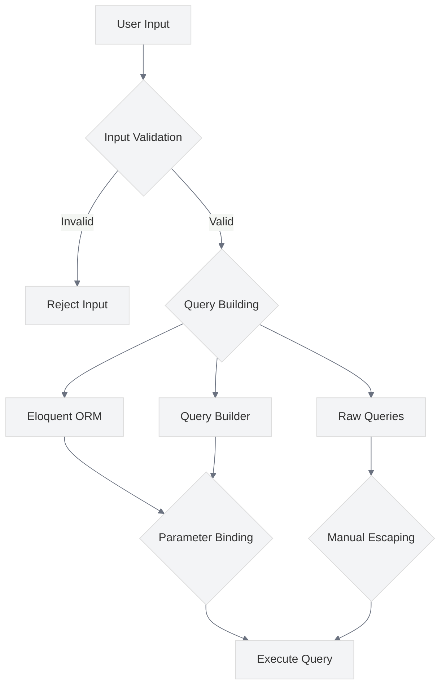

# SQL Injection Prevention

<link rel="stylesheet" href="../assets/css/styles.css">

This guide covers best practices for preventing SQL injection attacks in your UME application. SQL injection occurs when an attacker is able to insert malicious SQL code into queries, potentially allowing them to access, modify, or delete data in your database.

## Overview

Laravel's query builder and Eloquent ORM provide built-in protection against SQL injection by using PDO parameter binding. However, it's important to understand these protections and avoid practices that might bypass them.



## How SQL Injection Works

SQL injection attacks work by inserting malicious SQL code into queries. For example, consider a simple login query:

```sql
SELECT * FROM users WHERE email = 'user@example.com' AND password = 'password'
```

An attacker might input `' OR '1'='1` as the password, resulting in:

```sql
SELECT * FROM users WHERE email = 'user@example.com' AND password = '' OR '1'='1'
```

This would return all users because `'1'='1'` is always true, potentially allowing the attacker to log in as any user.

## Key Security Considerations

### 1. Use Eloquent ORM and Query Builder

**Best Practice**: Use Laravel's Eloquent ORM and Query Builder whenever possible.

**Implementation**:
- Use Eloquent models for database operations
- Use the Query Builder for more complex queries
- Avoid raw SQL queries when possible

```php
// Example of safe Eloquent usage
$users = User::where('status', 'active')
    ->where('role', 'admin')
    ->get();

// Example of safe Query Builder usage
$users = DB::table('users')
    ->where('status', 'active')
    ->where('role', 'admin')
    ->get();
```

### 2. Parameter Binding for Raw Queries

**Best Practice**: Use parameter binding for raw SQL queries.

**Implementation**:
- Use named parameters or positional parameters
- Never concatenate user input directly into SQL strings
- Use the `?` placeholder or named placeholders (`:name`)

```php
// Example of safe parameter binding with positional parameters
$users = DB::select('SELECT * FROM users WHERE status = ? AND role = ?', ['active', 'admin']);

// Example of safe parameter binding with named parameters
$users = DB::select('SELECT * FROM users WHERE status = :status AND role = :role', [
    'status' => 'active',
    'role' => 'admin',
]);
```

### 3. Proper Handling of Dynamic Table Names and Columns

**Best Practice**: Validate and whitelist dynamic table names and columns.

**Implementation**:
- Use a whitelist of allowed table names and columns
- Validate dynamic table names and columns against the whitelist
- Use schema information to validate table and column names

```php
// Example of safe handling of dynamic columns
$allowedColumns = ['name', 'email', 'created_at', 'updated_at'];
$column = $request->input('sort_by');

if (!in_array($column, $allowedColumns)) {
    $column = 'created_at'; // Default to a safe column
}

$users = User::orderBy($column, 'asc')->get();
```

### 4. Input Validation

**Best Practice**: Validate all user input before using it in database queries.

**Implementation**:
- Use Laravel's validation system to validate input
- Define strict validation rules for all form fields
- Validate both client-side and server-side

```php
// Example of input validation
public function store(Request $request)
{
    $validated = $request->validate([
        'name' => 'required|string|max:255',
        'email' => 'required|email|max:255|unique:users',
        'role' => 'required|in:user,admin,editor',
    ]);
    
    // Process validated data
    User::create($validated);
    
    return redirect()->route('users.index');
}
```

### 5. Use Database Migrations

**Best Practice**: Use Laravel's migration system to define database schema.

**Implementation**:
- Define table structures using migrations
- Use appropriate column types and constraints
- Use foreign key constraints to enforce relationships

```php
// Example of a migration
public function up()
{
    Schema::create('users', function (Blueprint $table) {
        $table->id();
        $table->string('name');
        $table->string('email')->unique();
        $table->timestamp('email_verified_at')->nullable();
        $table->string('password');
        $table->enum('role', ['user', 'admin', 'editor'])->default('user');
        $table->rememberToken();
        $table->timestamps();
    });
}
```

### 6. Avoid Raw Expressions

**Best Practice**: Avoid using raw expressions in queries when possible.

**Implementation**:
- Use query builder methods instead of raw expressions
- If raw expressions are necessary, ensure they don't contain user input
- Use parameter binding with raw expressions

```php
// Example of avoiding raw expressions
// Instead of:
// DB::raw("CONCAT(first_name, ' ', last_name) as full_name")

// Use:
DB::table('users')
    ->select('id', 'first_name', 'last_name')
    ->get()
    ->map(function ($user) {
        $user->full_name = $user->first_name . ' ' . $user->last_name;
        return $user;
    });
```

### 7. Limit Database User Privileges

**Best Practice**: Use a database user with limited privileges for your application.

**Implementation**:
- Create a dedicated database user for your application
- Grant only the necessary privileges to this user
- Use different users for different environments

```sql
-- Example of creating a limited database user
CREATE USER 'app_user'@'localhost' IDENTIFIED BY 'password';
GRANT SELECT, INSERT, UPDATE, DELETE ON app_database.* TO 'app_user'@'localhost';
REVOKE DROP, ALTER, CREATE ON app_database.* FROM 'app_user'@'localhost';
```

### 8. Use Prepared Statements for Complex Queries

**Best Practice**: Use prepared statements for complex queries that can't be expressed with the query builder.

**Implementation**:
- Create a prepared statement
- Bind parameters to the statement
- Execute the statement

```php
// Example of a prepared statement
$statement = DB::connection()->getPdo()->prepare('
    SELECT users.*, COUNT(posts.id) as post_count
    FROM users
    LEFT JOIN posts ON posts.user_id = users.id
    WHERE users.status = :status
    GROUP BY users.id
    HAVING post_count > :min_posts
');

$statement->bindValue(':status', 'active');
$statement->bindValue(':min_posts', 5);
$statement->execute();

$users = $statement->fetchAll(PDO::FETCH_OBJ);
```

### 9. Implement Query Timeouts

**Best Practice**: Implement query timeouts to prevent long-running malicious queries.

**Implementation**:
- Set a timeout for database connections
- Configure statement timeouts in your database
- Handle timeout exceptions gracefully

```php
// Example of setting a query timeout
DB::statement('SET SESSION max_execution_time=5000'); // 5 seconds for MySQL

// For PostgreSQL
DB::statement('SET statement_timeout TO 5000'); // 5 seconds
```

### 10. Audit and Log Database Queries

**Best Practice**: Audit and log database queries for security monitoring.

**Implementation**:
- Log all database queries in development for debugging
- Log sensitive database operations in production
- Monitor logs for suspicious activity

```php
// Example of query logging in development
if (app()->environment('local')) {
    DB::listen(function ($query) {
        Log::info(
            $query->sql,
            [
                'bindings' => $query->bindings,
                'time' => $query->time,
            ]
        );
    });
}
```

## Implementation in UME

The UME implementation follows these best practices through:

1. **Eloquent ORM**: Using Eloquent models for all database operations
2. **Query Builder**: Using the Query Builder for complex queries
3. **Parameter Binding**: Using parameter binding for all raw queries
4. **Input Validation**: Implementing strict validation rules for all user input
5. **Migrations**: Using migrations to define database schema
6. **Limited Privileges**: Using database users with limited privileges

## Common Vulnerabilities to Avoid

1. **String Concatenation in Queries**: Never concatenate user input directly into SQL strings
2. **Unvalidated Input**: Always validate user input before using it in queries
3. **Excessive Privileges**: Don't use database users with excessive privileges
4. **Unprotected Dynamic Queries**: Be cautious with dynamic table names and columns
5. **Insecure Error Handling**: Don't expose database errors to users

## Testing for SQL Injection

Regularly test your application for SQL injection vulnerabilities:

1. **Automated Testing**: Use tools like SQLmap to test for SQL injection
2. **Manual Testing**: Try common SQL injection payloads in input fields
3. **Code Review**: Review database-related code for potential vulnerabilities
4. **Penetration Testing**: Conduct regular penetration testing

```php
// Example of a SQL injection test
public function test_sql_injection_prevention()
{
    // Create a user
    $user = User::factory()->create();
    
    // Attempt SQL injection in the login form
    $response = $this->post('/login', [
        'email' => $user->email,
        'password' => "' OR '1'='1",
    ]);
    
    // Verify that the login fails
    $response->assertRedirect('/login');
    $this->assertGuest();
}
```

## Next Steps

After implementing SQL injection prevention, proceed to [API Security](./070-api-security.md) to secure your application's API endpoints.
