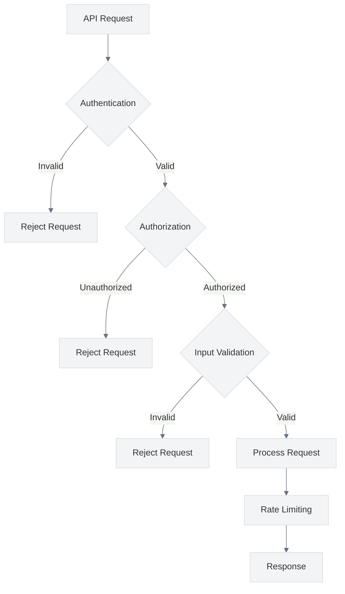

# API Security Guidelines

<link rel="stylesheet" href="../assets/css/styles.css">

This guide covers best practices for securing API endpoints in your UME application. APIs are often targeted by attackers because they provide direct access to application data and functionality.

## Overview

The UME implementation uses Laravel Sanctum and Laravel Passport for API authentication, providing a secure foundation for API development. This guide covers additional security considerations for API endpoints.



## Key Security Considerations

### 1. Authentication

**Best Practice**: Implement robust authentication for all API endpoints.

**Implementation**:
- Use Laravel Sanctum for SPA and mobile authentication
- Use Laravel Passport for OAuth2 authentication
- Implement token expiration and refresh mechanisms
- Secure token storage on clients

```php
// Example of Sanctum authentication
Route::middleware('auth:sanctum')->get('/user', function (Request $request) {
    return $request->user();
});

// Example of Passport authentication
Route::middleware('auth:api')->get('/user', function (Request $request) {
    return $request->user();
});
```

### 2. Authorization

**Best Practice**: Implement proper authorization for API endpoints.

**Implementation**:
- Use policies to control access to resources
- Implement role-based access control
- Check permissions for each API action
- Use team-based permissions where appropriate

```php
// Example of API authorization
public function update(Request $request, Post $post)
{
    $this->authorize('update', $post);
    
    $post->update($request->validated());
    
    return response()->json($post);
}
```

### 3. Input Validation

**Best Practice**: Validate all API input to prevent injection attacks and data corruption.

**Implementation**:
- Use Laravel's validation system for all API requests
- Create dedicated request classes for complex validation
- Validate both data types and business rules
- Return clear validation error messages

```php
// Example of API input validation
public function store(Request $request)
{
    $validated = $request->validate([
        'title' => 'required|string|max:255',
        'content' => 'required|string',
        'category_id' => 'required|exists:categories,id',
        'tags' => 'array',
        'tags.*' => 'exists:tags,id',
    ]);
    
    $post = Post::create($validated);
    $post->tags()->attach($request->tags);
    
    return response()->json($post, 201);
}
```

### 4. Rate Limiting

**Best Practice**: Implement rate limiting to prevent abuse and DoS attacks.

**Implementation**:
- Use Laravel's built-in rate limiting middleware
- Set appropriate limits based on endpoint sensitivity
- Implement different limits for authenticated and unauthenticated users
- Return appropriate headers for rate limit information

```php
// Example of API rate limiting
Route::middleware(['auth:sanctum', 'throttle:api'])
    ->group(function () {
        Route::get('/posts', [PostController::class, 'index']);
        Route::post('/posts', [PostController::class, 'store']);
    });

// In RouteServiceProvider.php
RateLimiter::for('api', function (Request $request) {
    return Limit::perMinute(60)->by($request->user()?->id ?: $request->ip());
});
```

### 5. HTTPS

**Best Practice**: Enforce HTTPS for all API requests.

**Implementation**:
- Configure your web server to use HTTPS
- Redirect HTTP requests to HTTPS
- Use the `secure` middleware to enforce HTTPS in production
- Set the `secure` flag on cookies

```php
// Example of enforcing HTTPS
if (app()->environment('production')) {
    URL::forceScheme('https');
}

// In app/Http/Kernel.php
protected $middlewareGroups = [
    'api' => [
        // ...
        \App\Http\Middleware\RequireHttps::class,
    ],
];
```

### 6. CORS Configuration

**Best Practice**: Configure CORS (Cross-Origin Resource Sharing) to restrict which domains can access your API.

**Implementation**:
- Use Laravel's built-in CORS middleware
- Configure allowed origins, methods, and headers
- Set appropriate max age for preflight requests
- Be as restrictive as possible with allowed origins

```php
// Example of CORS configuration in config/cors.php
return [
    'paths' => ['api/*'],
    'allowed_methods' => ['*'],
    'allowed_origins' => ['https://example.com'],
    'allowed_origins_patterns' => [],
    'allowed_headers' => ['*'],
    'exposed_headers' => [],
    'max_age' => 0,
    'supports_credentials' => false,
];
```

### 7. API Versioning

**Best Practice**: Implement API versioning to maintain backward compatibility.

**Implementation**:
- Use URL-based versioning (e.g., `/api/v1/users`)
- Use header-based versioning (e.g., `Accept: application/vnd.api.v1+json`)
- Document API changes between versions
- Maintain backward compatibility when possible

```php
// Example of URL-based versioning
Route::prefix('api/v1')->group(function () {
    Route::get('/users', [Api\V1\UserController::class, 'index']);
});

Route::prefix('api/v2')->group(function () {
    Route::get('/users', [Api\V2\UserController::class, 'index']);
});
```

### 8. Request Logging and Monitoring

**Best Practice**: Log and monitor API requests for security and debugging.

**Implementation**:
- Log API requests and responses
- Monitor for suspicious activity
- Implement alerts for security events
- Use a centralized logging system

```php
// Example of API request logging middleware
class ApiLogger
{
    public function handle($request, Closure $next)
    {
        // Log the request
        Log::channel('api')->info('API Request', [
            'method' => $request->method(),
            'url' => $request->fullUrl(),
            'ip' => $request->ip(),
            'user_id' => $request->user()?->id,
            'headers' => $request->headers->all(),
        ]);
        
        $response = $next($request);
        
        // Log the response
        Log::channel('api')->info('API Response', [
            'status' => $response->status(),
            'content' => app()->environment('local') ? $response->getContent() : '[redacted]',
        ]);
        
        return $response;
    }
}
```

### 9. Token Management

**Best Practice**: Implement secure token management for API authentication.

**Implementation**:
- Generate secure, random tokens
- Set appropriate token expiration
- Implement token refresh mechanisms
- Allow users to revoke tokens
- Store tokens securely

```php
// Example of token management with Sanctum
// Creating a token
$token = $user->createToken('api-token', ['read', 'write']);

// Revoking tokens
// Revoke all tokens
$user->tokens()->delete();

// Revoke a specific token
$user->tokens()->where('id', $tokenId)->delete();

// Checking token abilities
if ($request->user()->tokenCan('write')) {
    // User has write permission
}
```

### 10. API Documentation and Security Headers

**Best Practice**: Document your API and implement security headers.

**Implementation**:
- Use tools like Swagger/OpenAPI for API documentation
- Implement security headers for API responses
- Document authentication and authorization requirements
- Provide examples of secure API usage

```php
// Example of security headers middleware
class SecurityHeaders
{
    public function handle($request, Closure $next)
    {
        $response = $next($request);
        
        $response->headers->set('X-Content-Type-Options', 'nosniff');
        $response->headers->set('X-Frame-Options', 'DENY');
        $response->headers->set('X-XSS-Protection', '1; mode=block');
        $response->headers->set('Referrer-Policy', 'strict-origin-when-cross-origin');
        
        return $response;
    }
}
```

## Implementation in UME

The UME implementation follows these best practices through:

1. **Sanctum and Passport**: Using Laravel Sanctum for SPA authentication and Laravel Passport for OAuth2
2. **Policy-Based Authorization**: Implementing policies for API resource authorization
3. **Request Validation**: Using dedicated request classes for API validation
4. **Rate Limiting**: Implementing rate limiting for all API endpoints
5. **HTTPS Enforcement**: Enforcing HTTPS for all API requests
6. **Token Management**: Implementing secure token management with Sanctum and Passport

## Common API Vulnerabilities to Avoid

1. **Insecure Authentication**: Implement robust authentication for all API endpoints
2. **Missing Authorization**: Check authorization for all API actions
3. **Insufficient Input Validation**: Validate all API input thoroughly
4. **Excessive Data Exposure**: Return only the necessary data in API responses
5. **Mass Assignment**: Use explicit field lists or validation rules to prevent mass assignment
6. **Insecure Direct Object References**: Validate that the user has access to the requested resource
7. **Lack of Rate Limiting**: Implement rate limiting to prevent abuse
8. **Insecure CORS Configuration**: Configure CORS to restrict access to trusted domains

## Testing API Security

Regularly test your API for security vulnerabilities:

1. **Automated Testing**: Write tests for authentication, authorization, and validation
2. **Penetration Testing**: Conduct regular penetration testing of API endpoints
3. **Security Scanning**: Use tools like OWASP ZAP to scan for vulnerabilities
4. **Code Review**: Review API-related code for security issues

```php
// Example of API security testing
public function test_api_authentication()
{
    // Test that unauthenticated requests are rejected
    $response = $this->getJson('/api/user');
    $response->assertStatus(401);
    
    // Test that authenticated requests are accepted
    $user = User::factory()->create();
    $token = $user->createToken('test-token')->plainTextToken;
    
    $response = $this->withHeader('Authorization', 'Bearer ' . $token)
        ->getJson('/api/user');
    
    $response->assertStatus(200);
    $response->assertJson([
        'id' => $user->id,
        'name' => $user->name,
        'email' => $user->email,
    ]);
}
```

## Next Steps

After implementing API security, proceed to [Secure File Uploads](./080-secure-file-uploads.md) to learn how to handle file uploads securely in your application.
