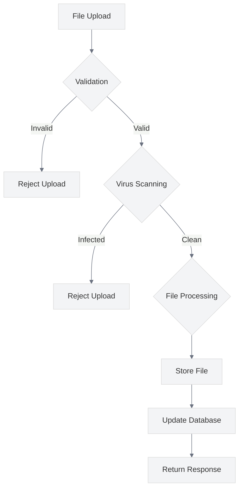

# Secure File Uploads

<link rel="stylesheet" href="../assets/css/styles.css">

This guide covers best practices for implementing secure file uploads in your UME application. File uploads present unique security challenges, as they can be used to introduce malicious content or exploit vulnerabilities in file processing systems.

## Overview

The UME implementation uses Spatie's Laravel MediaLibrary for handling file uploads, particularly for user avatars. This package provides a solid foundation for secure file handling, but additional security measures should be implemented to protect against common file upload vulnerabilities.



## Key Security Considerations

### 1. File Type Validation

**Best Practice**: Validate file types to prevent uploading of malicious files.

**Implementation**:
- Use Laravel's validation rules to restrict file types
- Validate both file extension and MIME type
- Use a whitelist approach rather than a blacklist
- Consider using file signature (magic bytes) validation for critical uploads

```php
// Example of file type validation
public function store(Request $request)
{
    $request->validate([
        'avatar' => 'required|file|mimes:jpeg,png,jpg,gif|max:2048',
    ]);
    
    // Process the validated file
    $user = Auth::user();
    $user->addMedia($request->file('avatar'))
        ->toMediaCollection('avatars');
    
    return redirect()->back();
}
```

### 2. File Size Limits

**Best Practice**: Implement file size limits to prevent denial of service attacks.

**Implementation**:
- Set maximum file size limits in validation rules
- Configure server-side limits in PHP and web server configuration
- Implement client-side validation for better user experience
- Set appropriate limits based on file type and purpose

```php
// Example of file size validation
$request->validate([
    'avatar' => 'required|file|max:2048', // 2MB limit
    'document' => 'required|file|max:10240', // 10MB limit
]);

// In php.ini
// upload_max_filesize = 20M
// post_max_size = 20M
```

### 3. File Storage Location

**Best Practice**: Store uploaded files in a secure location outside the web root.

**Implementation**:
- Configure storage paths to be outside the web root
- Use Laravel's storage system for file management
- Implement proper access controls for stored files
- Use symbolic links for public access when necessary

```php
// Example of secure file storage configuration
// In config/filesystems.php
'disks' => [
    'local' => [
        'driver' => 'local',
        'root' => storage_path('app'),
        'throw' => false,
    ],
    
    'public' => [
        'driver' => 'local',
        'root' => storage_path('app/public'),
        'url' => env('APP_URL').'/storage',
        'visibility' => 'public',
        'throw' => false,
    ],
    
    'private' => [
        'driver' => 'local',
        'root' => storage_path('app/private'),
        'visibility' => 'private',
        'throw' => false,
    ],
];
```

### 4. File Name Sanitization

**Best Practice**: Sanitize file names to prevent path traversal and other attacks.

**Implementation**:
- Generate random file names or use hashing
- Remove or encode special characters
- Validate file names against a whitelist pattern
- Preserve file extensions but validate them separately

```php
// Example of file name sanitization
public function sanitizeFileName($fileName)
{
    // Generate a random name with the original extension
    $extension = pathinfo($fileName, PATHINFO_EXTENSION);
    $sanitizedName = Str::random(40) . '.' . $extension;
    
    return $sanitizedName;
}

// Using MediaLibrary's naming capabilities
$user->addMedia($request->file('avatar'))
    ->usingName('avatar-' . $user->id)
    ->usingFileName(Str::random(40) . '.' . $request->file('avatar')->extension())
    ->toMediaCollection('avatars');
```

### 5. Image Processing Security

**Best Practice**: Implement secure image processing to prevent image-based attacks.

**Implementation**:
- Use a secure image processing library (e.g., Intervention Image)
- Regenerate images rather than directly serving uploaded images
- Strip metadata from images
- Validate image dimensions and content

```php
// Example of secure image processing
use Intervention\Image\Facades\Image;

public function processAvatar($file)
{
    // Create a new image instance from the uploaded file
    $image = Image::make($file->path());
    
    // Strip metadata
    $image->strip();
    
    // Resize and crop to a safe size
    $image->fit(300, 300);
    
    // Generate a secure filename
    $fileName = Str::random(40) . '.jpg';
    $path = storage_path('app/public/avatars/' . $fileName);
    
    // Save the processed image
    $image->save($path, 80, 'jpg');
    
    return 'avatars/' . $fileName;
}
```

### 6. Virus Scanning

**Best Practice**: Scan uploaded files for viruses and malware.

**Implementation**:
- Integrate with a virus scanning service or library
- Scan files before processing or storing them
- Quarantine suspicious files
- Log and alert on virus detections

```php
// Example of virus scanning integration
use Symfony\Component\HttpFoundation\File\UploadedFile;

public function scanFile(UploadedFile $file)
{
    // Example using ClamAV
    $scanner = new \ClamAV\Scanner('127.0.0.1', 3310);
    $result = $scanner->scan($file->path());
    
    if ($result->isInfected()) {
        Log::warning('Virus detected in uploaded file', [
            'file' => $file->getClientOriginalName(),
            'user_id' => Auth::id(),
            'ip' => request()->ip(),
            'virus' => $result->getVirusName(),
        ]);
        
        throw new \Exception('The uploaded file contains a virus or malware.');
    }
    
    return true;
}
```

### 7. Access Control for Uploaded Files

**Best Practice**: Implement proper access control for uploaded files.

**Implementation**:
- Use private storage for sensitive files
- Implement authorization checks for file access
- Use signed URLs for temporary access
- Implement proper file permissions at the filesystem level

```php
// Example of access control for file downloads
public function download($fileId)
{
    $media = Media::findOrFail($fileId);
    $model = $media->model;
    
    // Check if the user has permission to access this file
    $this->authorize('view', $model);
    
    return response()->download($media->getPath(), $media->file_name);
}

// Example of signed URLs for temporary access
public function getTemporaryUrl($fileId)
{
    $media = Media::findOrFail($fileId);
    $model = $media->model;
    
    // Check if the user has permission to access this file
    $this->authorize('view', $model);
    
    // Generate a signed URL that expires in 1 hour
    $url = URL::temporarySignedRoute(
        'media.download',
        now()->addHour(),
        ['id' => $media->id]
    );
    
    return response()->json(['url' => $url]);
}
```

### 8. Content Disposition Headers

**Best Practice**: Use appropriate Content-Disposition headers when serving files.

**Implementation**:
- Use `attachment` disposition for downloadable files
- Use `inline` disposition for viewable files
- Include a filename parameter with a sanitized filename
- Set appropriate MIME types

```php
// Example of Content-Disposition headers
public function download($fileId)
{
    $media = Media::findOrFail($fileId);
    
    return response()->file(
        $media->getPath(),
        [
            'Content-Type' => $media->mime_type,
            'Content-Disposition' => 'attachment; filename="' . $media->file_name . '"',
        ]
    );
}

public function view($fileId)
{
    $media = Media::findOrFail($fileId);
    
    // Only allow viewing of image files
    if (!Str::startsWith($media->mime_type, 'image/')) {
        abort(403, 'Only images can be viewed inline');
    }
    
    return response()->file(
        $media->getPath(),
        [
            'Content-Type' => $media->mime_type,
            'Content-Disposition' => 'inline; filename="' . $media->file_name . '"',
        ]
    );
}
```

### 9. File Upload Limits and Throttling

**Best Practice**: Implement upload limits and throttling to prevent abuse.

**Implementation**:
- Limit the number of files a user can upload in a given time period
- Implement per-user storage quotas
- Use rate limiting middleware for upload endpoints
- Monitor for unusual upload patterns

```php
// Example of upload throttling
Route::middleware(['auth', 'throttle:uploads'])
    ->post('/upload', [UploadController::class, 'store']);

// In RouteServiceProvider.php
RateLimiter::for('uploads', function (Request $request) {
    return Limit::perMinute(10)->by($request->user()->id);
});

// Example of storage quota check
public function store(Request $request)
{
    $user = Auth::user();
    $fileSize = $request->file('document')->getSize();
    
    // Check if the user has enough quota
    if ($user->usedStorage() + $fileSize > $user->storageQuota()) {
        return back()->withErrors(['document' => 'You have exceeded your storage quota.']);
    }
    
    // Process the upload
    $user->addMedia($request->file('document'))
        ->toMediaCollection('documents');
    
    return redirect()->back();
}
```

### 10. Secure File Deletion

**Best Practice**: Implement secure file deletion when files are no longer needed.

**Implementation**:
- Delete files from storage when they are deleted from the database
- Implement proper cleanup of temporary files
- Consider secure deletion methods for sensitive files
- Implement file retention policies

```php
// Example of secure file deletion
public function destroy($fileId)
{
    $media = Media::findOrFail($fileId);
    $model = $media->model;
    
    // Check if the user has permission to delete this file
    $this->authorize('delete', $model);
    
    // Delete the media (MediaLibrary will handle file deletion)
    $media->delete();
    
    return redirect()->back();
}

// Example of temporary file cleanup
public function __destruct()
{
    // Clean up any temporary files
    foreach ($this->temporaryFiles as $file) {
        if (file_exists($file)) {
            unlink($file);
        }
    }
}
```

## Implementation in UME

The UME implementation follows these best practices through:

1. **MediaLibrary Integration**: Using Spatie's Laravel MediaLibrary for secure file handling
2. **Validation Rules**: Implementing strict validation rules for file uploads
3. **Secure Storage**: Configuring secure storage locations for uploaded files
4. **Image Processing**: Using Intervention Image for secure image processing
5. **Access Control**: Implementing proper access control for uploaded files
6. **Quota Management**: Implementing storage quotas for users

## Common File Upload Vulnerabilities to Avoid

1. **Unrestricted File Types**: Always validate file types and extensions
2. **Path Traversal**: Sanitize file names and use secure storage methods
3. **Unrestricted File Size**: Implement file size limits to prevent DoS attacks
4. **Insecure File Storage**: Store files outside the web root with proper permissions
5. **Missing Virus Scanning**: Scan uploaded files for viruses and malware
6. **Insecure File Processing**: Use secure libraries for file processing
7. **Insufficient Access Control**: Implement proper access control for uploaded files
8. **Metadata Leakage**: Strip metadata from uploaded files, especially images

## Testing File Upload Security

Regularly test your file upload implementation for security vulnerabilities:

1. **Upload Validation Testing**: Test file type and size validation
2. **Path Traversal Testing**: Attempt to upload files with malicious names
3. **Access Control Testing**: Verify that users can only access their own files
4. **Performance Testing**: Test the system under heavy upload load
5. **Security Scanning**: Use security tools to scan for file upload vulnerabilities

```php
// Example of file upload security testing
public function test_file_type_validation()
{
    $user = User::factory()->create();
    $this->actingAs($user);
    
    // Create a fake PHP file
    $file = UploadedFile::fake()->create('malicious.php', 100);
    
    // Attempt to upload the file
    $response = $this->post('/upload', [
        'document' => $file,
    ]);
    
    // Verify that the upload is rejected
    $response->assertSessionHasErrors('document');
    
    // Verify that no file was stored
    $this->assertEquals(0, $user->getMedia('documents')->count());
}
```

## Next Steps

After implementing secure file uploads, proceed to [Security Headers](./090-security-headers.md) to learn how to configure HTTP security headers for your application.
