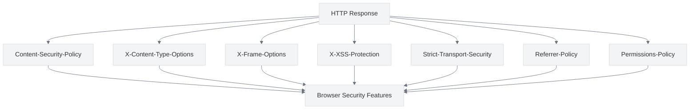

# Security Headers

<link rel="stylesheet" href="../assets/css/styles.css">

This guide covers best practices for implementing HTTP security headers in your UME application. Security headers are HTTP response headers that your application can use to increase the security of your application by enabling browser security features.

## Overview

HTTP security headers provide an additional layer of security by instructing browsers how to behave when handling your site's content. Properly configured security headers can help mitigate various attacks, including cross-site scripting (XSS), clickjacking, and other code injection attacks.



## Key Security Headers

### 1. Content-Security-Policy (CSP)

**Purpose**: Helps prevent XSS attacks by controlling which resources can be loaded.

**Implementation**:
- Define allowed sources for scripts, styles, images, fonts, etc.
- Use nonces or hashes for inline scripts when necessary
- Start with a strict policy and relax it as needed
- Use report-only mode during development

```php
// Example of CSP implementation
public function handle($request, Closure $next)
{
    $response = $next($request);
    
    $csp = "default-src 'self'; " .
           "script-src 'self' https://cdn.jsdelivr.net; " .
           "style-src 'self' https://fonts.googleapis.com; " .
           "img-src 'self' data:; " .
           "font-src 'self' https://fonts.gstatic.com; " .
           "connect-src 'self'; " .
           "media-src 'self'; " .
           "object-src 'none'; " .
           "frame-src 'self'; " .
           "frame-ancestors 'self'; " .
           "form-action 'self'; " .
           "base-uri 'self'; " .
           "manifest-src 'self'";
    
    $response->headers->set('Content-Security-Policy', $csp);
    
    return $response;
}
```

### 2. X-Content-Type-Options

**Purpose**: Prevents MIME type sniffing, which can lead to security vulnerabilities.

**Implementation**:
- Set the header to `nosniff` to prevent browsers from interpreting files as a different MIME type

```php
// Example of X-Content-Type-Options implementation
$response->headers->set('X-Content-Type-Options', 'nosniff');
```

### 3. X-Frame-Options

**Purpose**: Protects against clickjacking attacks by controlling whether a page can be embedded in an iframe.

**Implementation**:
- Set to `DENY` to prevent any framing
- Set to `SAMEORIGIN` to allow framing only by pages on the same domain
- Set to `ALLOW-FROM uri` to allow framing only by specific domains

```php
// Example of X-Frame-Options implementation
$response->headers->set('X-Frame-Options', 'DENY');
```

### 4. X-XSS-Protection

**Purpose**: Enables the browser's built-in XSS filter.

**Implementation**:
- Set to `1; mode=block` to enable XSS filtering and block the page if an attack is detected
- Note: This header is being deprecated in favor of Content-Security-Policy, but is still useful for older browsers

```php
// Example of X-XSS-Protection implementation
$response->headers->set('X-XSS-Protection', '1; mode=block');
```

### 5. Strict-Transport-Security (HSTS)

**Purpose**: Forces browsers to use HTTPS for your site, even if the user enters or follows an HTTP URL.

**Implementation**:
- Set a max-age directive to specify how long browsers should remember to use HTTPS
- Include the `includeSubDomains` directive to apply to all subdomains
- Consider the `preload` directive for inclusion in browser preload lists

```php
// Example of HSTS implementation
$response->headers->set(
    'Strict-Transport-Security',
    'max-age=31536000; includeSubDomains; preload'
);
```

### 6. Referrer-Policy

**Purpose**: Controls how much referrer information should be included with requests.

**Implementation**:
- Set to `no-referrer` to omit the Referer header entirely
- Set to `same-origin` to send referrer information only for same-origin requests
- Set to `strict-origin-when-cross-origin` for a good balance of security and usability

```php
// Example of Referrer-Policy implementation
$response->headers->set('Referrer-Policy', 'strict-origin-when-cross-origin');
```

### 7. Permissions-Policy (formerly Feature-Policy)

**Purpose**: Controls which browser features and APIs can be used in your site.

**Implementation**:
- Restrict access to sensitive browser features like geolocation, camera, microphone, etc.
- Use `self` to allow the feature only for your origin
- Use `none` to disable the feature entirely

```php
// Example of Permissions-Policy implementation
$response->headers->set(
    'Permissions-Policy',
    'camera=(), microphone=(), geolocation=(self), payment=()'
);
```

### 8. Cache-Control

**Purpose**: Controls how pages are cached by browsers and intermediate proxies.

**Implementation**:
- Use `no-store` for sensitive pages to prevent caching
- Use `private, max-age=X` for user-specific content
- Use `public, max-age=X` for public content

```php
// Example of Cache-Control implementation for sensitive pages
$response->headers->set('Cache-Control', 'no-store, max-age=0');

// Example for user-specific content
$response->headers->set('Cache-Control', 'private, max-age=3600');

// Example for public content
$response->headers->set('Cache-Control', 'public, max-age=86400');
```

## Implementing Security Headers in Laravel

### Using Middleware

The most common approach to implementing security headers in Laravel is through middleware. You can create a dedicated middleware for security headers:

```php
// app/Http/Middleware/SecurityHeaders.php
namespace App\Http\Middleware;

use Closure;
use Illuminate\Http\Request;

class SecurityHeaders
{
    public function handle(Request $request, Closure $next)
    {
        $response = $next($request);
        
        // Content-Security-Policy
        $response->headers->set(
            'Content-Security-Policy',
            "default-src 'self'; script-src 'self' https://cdn.jsdelivr.net; style-src 'self' https://fonts.googleapis.com;"
        );
        
        // X-Content-Type-Options
        $response->headers->set('X-Content-Type-Options', 'nosniff');
        
        // X-Frame-Options
        $response->headers->set('X-Frame-Options', 'DENY');
        
        // X-XSS-Protection
        $response->headers->set('X-XSS-Protection', '1; mode=block');
        
        // Strict-Transport-Security
        if (app()->environment('production')) {
            $response->headers->set(
                'Strict-Transport-Security',
                'max-age=31536000; includeSubDomains; preload'
            );
        }
        
        // Referrer-Policy
        $response->headers->set('Referrer-Policy', 'strict-origin-when-cross-origin');
        
        // Permissions-Policy
        $response->headers->set(
            'Permissions-Policy',
            'camera=(), microphone=(), geolocation=(self), payment=()'
        );
        
        return $response;
    }
}
```

Then register the middleware in your `app/Http/Kernel.php` file:

```php
protected $middlewareGroups = [
    'web' => [
        // ...
        \App\Http\Middleware\SecurityHeaders::class,
    ],
];
```

### Using a Package

Alternatively, you can use a package like `bepsvpt/secure-headers` to manage security headers:

```bash
composer require bepsvpt/secure-headers
```

Publish the configuration:

```bash
php artisan vendor:publish --provider="Bepsvpt\SecureHeaders\SecureHeadersServiceProvider"
```

Configure the headers in `config/secure-headers.php` and the package will handle the rest.

## Testing Security Headers

You should regularly test your security headers to ensure they are properly configured:

1. **Manual Testing**: Use browser developer tools to inspect response headers
2. **Automated Testing**: Write tests to verify that headers are set correctly
3. **Online Tools**: Use services like [Security Headers](https://securityheaders.com/) or [Mozilla Observatory](https://observatory.mozilla.org/) to scan your site
4. **CSP Report-Only Mode**: Use CSP in report-only mode to identify potential issues before enforcing the policy

```php
// Example of security header testing
public function test_security_headers()
{
    $response = $this->get('/');
    
    $response->assertHeader('Content-Security-Policy');
    $response->assertHeader('X-Content-Type-Options', 'nosniff');
    $response->assertHeader('X-Frame-Options', 'DENY');
    $response->assertHeader('X-XSS-Protection', '1; mode=block');
    $response->assertHeader('Referrer-Policy', 'strict-origin-when-cross-origin');
}
```

## Implementation in UME

The UME implementation follows these best practices through:

1. **Security Middleware**: Implementing a dedicated middleware for security headers
2. **CSP Configuration**: Configuring a strict Content-Security-Policy
3. **HTTPS Enforcement**: Enforcing HTTPS with Strict-Transport-Security
4. **Frame Protection**: Preventing clickjacking with X-Frame-Options
5. **Cache Control**: Implementing appropriate cache control for different types of content

## Common Security Header Pitfalls

1. **Overly Permissive CSP**: Avoid using `unsafe-inline` or `unsafe-eval` in your CSP
2. **Missing Headers**: Ensure all important security headers are implemented
3. **Inconsistent Implementation**: Apply headers consistently across all responses
4. **Incorrect Configuration**: Test headers to ensure they are configured correctly
5. **Forgetting Subdomains**: Include subdomains in security policies where appropriate

## Next Steps

After implementing security headers, proceed to [Security Testing](./100-security-testing.md) to learn how to test your application for security vulnerabilities.
