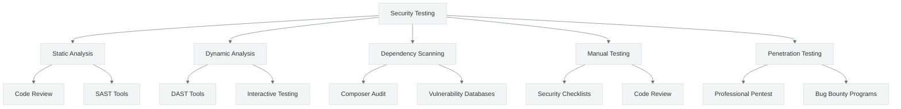

# Security Testing

<link rel="stylesheet" href="../assets/css/styles.css">

This guide covers best practices for security testing in your UME application. Security testing is a critical part of the development process, helping to identify and fix vulnerabilities before they can be exploited.

## Overview

Security testing involves a combination of automated and manual techniques to identify vulnerabilities in your application. The UME implementation incorporates security testing at various stages of the development process to ensure a secure final product.



## Key Security Testing Approaches

### 1. Automated Testing

**Best Practice**: Implement automated security tests as part of your CI/CD pipeline.

**Implementation**:
- Write tests for security features like authentication and authorization
- Test for common vulnerabilities like XSS, CSRF, and SQL injection
- Automate security scans with tools like OWASP ZAP or Burp Suite
- Integrate security testing into your CI/CD pipeline

```php
// Example of security feature testing
public function test_password_reset_token_expiration()
{
    // Create a user
    $user = User::factory()->create();
    
    // Create a password reset token
    $token = Password::createToken($user);
    
    // Advance time beyond the expiration period
    $this->travel(Password::RESET_LINK_EXPIRATION + 1)->minutes();
    
    // Attempt to reset password with the token
    $response = $this->post('/reset-password', [
        'token' => $token,
        'email' => $user->email,
        'password' => 'newpassword',
        'password_confirmation' => 'newpassword',
    ]);
    
    // Verify that the token is expired
    $response->assertSessionHasErrors('email');
}
```

### 2. Static Application Security Testing (SAST)

**Best Practice**: Use static analysis tools to identify security vulnerabilities in your code.

**Implementation**:
- Integrate SAST tools into your development workflow
- Configure tools to check for security vulnerabilities
- Address identified issues promptly
- Include SAST in your CI/CD pipeline

```bash
# Example of running PHP CodeSniffer with security rules
./vendor/bin/phpcs --standard=PSR12,Security app

# Example of running PHPStan
./vendor/bin/phpstan analyse app

# Example of running Psalm
./vendor/bin/psalm
```

### 3. Dynamic Application Security Testing (DAST)

**Best Practice**: Use dynamic analysis tools to identify security vulnerabilities in your running application.

**Implementation**:
- Run DAST tools against your staging environment
- Configure tools to check for common vulnerabilities
- Address identified issues promptly
- Include DAST in your deployment pipeline

```bash
# Example of running OWASP ZAP from the command line
zap-cli quick-scan --self-contained --start-options "-config api.disablekey=true" https://staging.example.com
```

### 4. Dependency Scanning

**Best Practice**: Regularly scan dependencies for known vulnerabilities.

**Implementation**:
- Use Composer's audit command to check for vulnerabilities
- Integrate dependency scanning into your CI/CD pipeline
- Update vulnerable dependencies promptly
- Consider using tools like Snyk or Dependabot

```bash
# Example of running Composer audit
composer audit

# Example of using the roave/security-advisories package
composer require --dev roave/security-advisories:dev-latest
```

### 5. Manual Security Testing

**Best Practice**: Conduct manual security testing to identify vulnerabilities that automated tools might miss.

**Implementation**:
- Follow a security testing checklist
- Test authentication and authorization flows
- Attempt common attack vectors
- Document and address identified issues

**Example Security Testing Checklist**:
- [ ] Test authentication bypass
- [ ] Test authorization bypass
- [ ] Test for XSS vulnerabilities
- [ ] Test for CSRF vulnerabilities
- [ ] Test for SQL injection
- [ ] Test for insecure direct object references
- [ ] Test for sensitive data exposure
- [ ] Test for security misconfiguration
- [ ] Test for broken access control
- [ ] Test for insufficient logging and monitoring

### 6. Penetration Testing

**Best Practice**: Conduct regular penetration testing to identify vulnerabilities from an attacker's perspective.

**Implementation**:
- Engage professional penetration testers
- Define the scope and objectives of the test
- Address identified vulnerabilities promptly
- Conduct penetration testing before major releases

**Example Penetration Testing Scope**:
- Authentication and authorization mechanisms
- Session management
- Input validation and output encoding
- Error handling and logging
- Data protection
- API security
- Business logic vulnerabilities

### 7. Security Code Review

**Best Practice**: Conduct security-focused code reviews to identify vulnerabilities early.

**Implementation**:
- Include security experts in code reviews
- Use a security code review checklist
- Focus on security-sensitive areas of the code
- Address identified issues before merging

**Example Security Code Review Checklist**:
- [ ] Check for proper input validation
- [ ] Verify proper output encoding
- [ ] Review authentication and authorization logic
- [ ] Check for secure password handling
- [ ] Review database query construction
- [ ] Check for proper error handling
- [ ] Verify secure file handling
- [ ] Review security-sensitive configurations

### 8. Fuzz Testing

**Best Practice**: Use fuzz testing to identify vulnerabilities by providing unexpected or random data.

**Implementation**:
- Identify input points in your application
- Generate random or malformed input data
- Monitor for crashes, exceptions, or unexpected behavior
- Address identified issues promptly

```php
// Example of a simple fuzz test
public function test_fuzz_login_form()
{
    $fuzzData = [
        str_repeat('A', 1000),
        '<script>alert("XSS")</script>',
        "'; DROP TABLE users; --",
        json_encode(['email' => 'test@example.com']),
        null,
        true,
        false,
        0,
        -1,
        [],
        new \stdClass(),
    ];
    
    foreach ($fuzzData as $data) {
        // Test email field
        $response = $this->post('/login', [
            'email' => $data,
            'password' => 'password',
        ]);
        
        // Verify that the application doesn't crash
        $this->assertTrue(true);
        
        // Test password field
        $response = $this->post('/login', [
            'email' => 'test@example.com',
            'password' => $data,
        ]);
        
        // Verify that the application doesn't crash
        $this->assertTrue(true);
    }
}
```

### 9. Security Headers Testing

**Best Practice**: Test security headers to ensure they are properly configured.

**Implementation**:
- Use tools like Security Headers or Mozilla Observatory
- Verify that all required headers are present
- Check that headers are configured correctly
- Address any identified issues

```php
// Example of security header testing
public function test_security_headers()
{
    $response = $this->get('/');
    
    $response->assertHeader('Content-Security-Policy');
    $response->assertHeader('X-Content-Type-Options', 'nosniff');
    $response->assertHeader('X-Frame-Options', 'DENY');
    $response->assertHeader('X-XSS-Protection', '1; mode=block');
    $response->assertHeader('Referrer-Policy', 'strict-origin-when-cross-origin');
    $response->assertHeader('Strict-Transport-Security');
}
```

### 10. Security Monitoring and Logging

**Best Practice**: Implement security monitoring and logging to detect and respond to security incidents.

**Implementation**:
- Log security-relevant events
- Monitor logs for suspicious activity
- Set up alerts for potential security incidents
- Implement a security incident response plan

```php
// Example of security event logging
Log::channel('security')->info('User login', [
    'user_id' => $user->id,
    'email' => $user->email,
    'ip' => request()->ip(),
    'user_agent' => request()->userAgent(),
]);

// Example of failed login attempt logging
Log::channel('security')->warning('Failed login attempt', [
    'email' => $request->email,
    'ip' => request()->ip(),
    'user_agent' => request()->userAgent(),
    'attempt' => $this->limiter()->attempts($this->throttleKey($request)),
]);
```

## Implementing Security Testing in CI/CD

Integrating security testing into your CI/CD pipeline ensures that security checks are performed automatically with every code change.

### GitHub Actions Example

```yaml
name: Security Tests

on:
  push:
    branches: [ main ]
  pull_request:
    branches: [ main ]

jobs:
  security:
    runs-on: ubuntu-latest
    
    steps:
    - uses: actions/checkout@v3
    
    - name: Setup PHP
      uses: shivammathur/setup-php@v2
      with:
        php-version: '8.2'
        
    - name: Install dependencies
      run: composer install --prefer-dist --no-progress
      
    - name: Run security tests
      run: php artisan test --filter=Security
      
    - name: Run dependency audit
      run: composer audit
      
    - name: Run static analysis
      run: ./vendor/bin/phpstan analyse app
      
    - name: Run OWASP ZAP scan
      uses: zaproxy/action-baseline@v0.7.0
      with:
        target: 'https://staging.example.com'
```

### GitLab CI Example

```yaml
stages:
  - test
  - security

security_tests:
  stage: test
  script:
    - php artisan test --filter=Security
    
dependency_audit:
  stage: security
  script:
    - composer audit
    
static_analysis:
  stage: security
  script:
    - ./vendor/bin/phpstan analyse app
    
dast:
  stage: security
  script:
    - docker run --rm -v $(pwd):/zap/wrk owasp/zap2docker-stable zap-baseline.py -t https://staging.example.com -r security-report.html
  artifacts:
    paths:
      - security-report.html
```

## Implementation in UME

The UME implementation follows these best practices through:

1. **Automated Tests**: Implementing security-focused automated tests
2. **Dependency Scanning**: Using Composer audit and roave/security-advisories
3. **Static Analysis**: Integrating PHPStan and Psalm for static analysis
4. **Security Headers**: Testing and enforcing security headers
5. **CI/CD Integration**: Integrating security testing into the CI/CD pipeline

## Security Testing Tools

### PHP-Specific Tools

1. **PHPStan**: Static analysis tool for PHP
2. **Psalm**: Static analysis tool with a focus on security
3. **PHP CodeSniffer**: Code style and security checks
4. **Composer Audit**: Dependency vulnerability scanning
5. **PHPUnit**: Framework for writing security tests

### General Security Tools

1. **OWASP ZAP**: Dynamic application security testing
2. **Burp Suite**: Web application security testing
3. **Snyk**: Dependency vulnerability scanning
4. **Metasploit**: Penetration testing framework
5. **Nmap**: Network security scanner

## Common Security Testing Pitfalls

1. **Insufficient Coverage**: Test all aspects of your application, not just the obvious entry points
2. **False Positives**: Verify identified vulnerabilities before spending time fixing them
3. **Outdated Tools**: Keep security testing tools up to date
4. **Ignoring Low-Severity Issues**: Address all security issues, even those with low severity
5. **Testing Only in Production**: Test in development and staging environments as well

## Next Steps

After implementing security testing, review the [Security Checklist](./010-security-checklist.md) to ensure that all security aspects of your application have been addressed.
