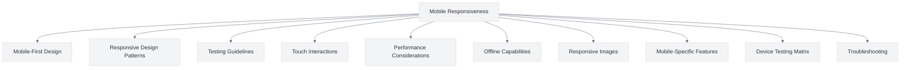

# Mobile Responsiveness

<link rel="stylesheet" href="../assets/css/styles.css">

This section covers best practices for ensuring your UME implementation is fully responsive and provides an excellent experience across all device types and screen sizes.

## Overview

Modern web applications must work well on a variety of devices, from large desktop monitors to small mobile phones. This section provides comprehensive guidance on implementing mobile-responsive UME features.

## Contents

1. [Mobile-First Design](./010-mobile-first-design.md) - Principles and implementation of mobile-first design
2. [Responsive Design Patterns](./020-responsive-design-patterns.md) - Common patterns for responsive UI components
3. [Testing Guidelines](./030-testing-guidelines.md) - How to test your application on different devices
4. [Touch Interactions](./040-touch-interactions.md) - Optimizing for touch-based input
5. [Performance Considerations](./050-performance-considerations.md) - Optimizing performance for mobile devices
6. [Offline Capabilities](./060-offline-capabilities.md) - Implementing offline functionality
7. [Responsive Images](./070-responsive-images.md) - Techniques for optimizing images across devices
8. [Mobile-Specific Features](./080-mobile-specific-features.md) - Features specific to mobile devices
9. [Device Testing Matrix](./090-device-testing-matrix.md) - Comprehensive testing across device types
10. [Troubleshooting](./100-troubleshooting.md) - Common mobile responsiveness issues and solutions

## Why Mobile Responsiveness Matters

Mobile devices account for more than half of all web traffic globally. Ensuring your UME implementation works well on mobile devices is not just a nice-to-have feature—it's essential for providing a good user experience to a significant portion of your users.

In the context of User Model Enhancements, mobile responsiveness is particularly important for features like:

- User authentication and profile management
- Team management interfaces
- Permission management
- Real-time features like presence indicators and chat
- Admin interfaces

## Key Principles

Throughout this section, we'll focus on these key principles:

1. **Mobile-First Design** - Design for mobile first, then enhance for larger screens
2. **Progressive Enhancement** - Start with core functionality, then add enhancements for capable devices
3. **Performance Optimization** - Optimize for limited resources (bandwidth, CPU, battery)
4. **Touch-Friendly Interfaces** - Design for touch as the primary input method
5. **Responsive Testing** - Test thoroughly across different devices and screen sizes

## Getting Started

Begin with [Mobile-First Design](./010-mobile-first-design.md) to understand the fundamental principles of designing for mobile devices.
