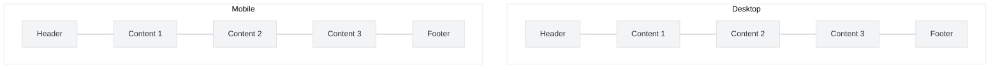
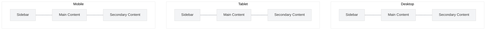
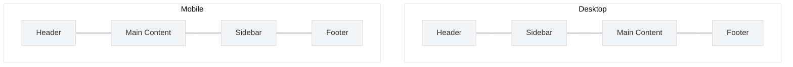
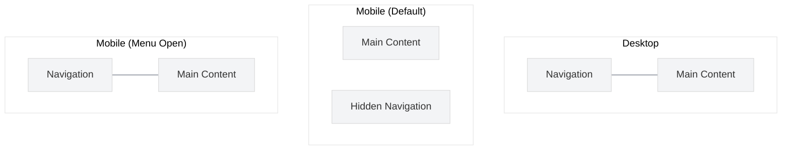

# Responsive Design Patterns

<link rel="stylesheet" href="../assets/css/styles.css">

Responsive design patterns are reusable solutions to common challenges in creating interfaces that work well across different screen sizes. This section covers the most useful patterns for UME implementations.

## Common Responsive Design Patterns

### 1. Mostly Fluid

The Mostly Fluid pattern uses a fluid grid that remains the same on larger screens but stacks columns vertically on smaller screens.



#### Implementation with Tailwind CSS

```html
<div class="container mx-auto px-4">
  <header class="py-4">Header</header>
  <div class="flex flex-col md:flex-row">
    <div class="w-full md:w-1/3 p-4">Content 1</div>
    <div class="w-full md:w-1/3 p-4">Content 2</div>
    <div class="w-full md:w-1/3 p-4">Content 3</div>
  </div>
  <footer class="py-4">Footer</footer>
</div>
```

### 2. Column Drop

The Column Drop pattern starts with a multi-column layout and drops columns as the screen width narrows, eventually stacking all columns.



#### Implementation with Tailwind CSS

```html
<div class="container mx-auto px-4">
  <div class="flex flex-col lg:flex-row">
    <div class="w-full lg:w-1/4 p-4">Sidebar</div>
    <div class="w-full lg:w-2/4 p-4">Main Content</div>
    <div class="w-full md:w-full lg:w-1/4 p-4">Secondary Content</div>
  </div>
</div>
```

### 3. Layout Shifter

The Layout Shifter pattern uses different layouts for different screen sizes, not just stacking columns.



#### Implementation with Tailwind CSS

```html
<div class="container mx-auto px-4">
  <header class="py-4">Header</header>
  <div class="flex flex-col md:flex-row">
    <div class="w-full md:w-1/4 order-2 md:order-1 p-4">Sidebar</div>
    <div class="w-full md:w-3/4 order-1 md:order-2 p-4">Main Content</div>
  </div>
  <footer class="py-4">Footer</footer>
</div>
```

### 4. Off Canvas

The Off Canvas pattern places less frequently used content (like navigation) off-screen, showing it only when needed.



#### Implementation with Flux UI

```php
<div x-data="{ open: false }">
    <!-- Mobile menu button -->
    <button @click="open = !open" class="md:hidden">
        <x-flux::icon name="menu" class="h-6 w-6" />
    </button>
    
    <!-- Off-canvas menu -->
    <div x-show="open" 
         class="fixed inset-0 z-40 flex"
         x-transition:enter="transition ease-in-out duration-300"
         x-transition:enter-start="opacity-0"
         x-transition:enter-end="opacity-100"
         x-transition:leave="transition ease-in-out duration-300"
         x-transition:leave-start="opacity-100"
         x-transition:leave-end="opacity-0">
        
        <!-- Overlay -->
        <div @click="open = false" class="fixed inset-0 bg-black bg-opacity-25"></div>
        
        <!-- Menu panel -->
        <div class="relative flex w-full max-w-xs flex-col overflow-y-auto bg-white pb-12 shadow-xl">
            <!-- Menu content -->
            <nav class="space-y-1 px-2 py-3">
                <!-- Navigation items -->
            </nav>
        </div>
    </div>
    
    <!-- Desktop navigation (always visible on md screens and up) -->
    <nav class="hidden md:block">
        <!-- Navigation items -->
    </nav>
    
    <!-- Main content -->
    <main>
        <!-- Page content -->
    </main>
</div>
```

## Responsive Patterns for UME Components

### User Lists

For displaying lists of users (team members, etc.), consider these patterns:

1. **Card Grid to List**: Display users as a grid of cards on larger screens, switching to a vertical list on mobile.

```php
<div class="grid grid-cols-1 sm:grid-cols-2 lg:grid-cols-3 xl:grid-cols-4 gap-4">
    @foreach ($users as $user)
        <x-flux::card>
            <div class="flex items-center">
                profile_photo_url }}" class="h-10 w-10 rounded-full">
                <div class="ml-4">
                    <div class="font-medium">{{ $user->name }}</div>
                    <div class="text-sm text-gray-500">{{ $user->email }}</div>
                </div>
            </div>
        </x-flux::card>
    @endforeach
</div>
```

2. **Responsive Tables**: For data-heavy user lists, use responsive tables that adapt to smaller screens.

```php
<div class="overflow-x-auto">
    <table class="min-w-full divide-y divide-gray-200">
        <thead>
            <tr>
                <th class="px-6 py-3 text-left text-xs font-medium text-gray-500 uppercase tracking-wider">Name</th>
                <th class="px-6 py-3 text-left text-xs font-medium text-gray-500 uppercase tracking-wider hidden sm:table-cell">Email</th>
                <th class="px-6 py-3 text-left text-xs font-medium text-gray-500 uppercase tracking-wider hidden md:table-cell">Role</th>
                <th class="px-6 py-3 text-left text-xs font-medium text-gray-500 uppercase tracking-wider">Actions</th>
            </tr>
        </thead>
        <tbody class="bg-white divide-y divide-gray-200">
            @foreach ($users as $user)
                <tr>
                    <td class="px-6 py-4 whitespace-nowrap">
                        <div class="flex items-center">
                            profile_photo_url }}" class="h-10 w-10 rounded-full">
                            <div class="ml-4">
                                <div class="font-medium">{{ $user->name }}</div>
                                <div class="text-sm text-gray-500 sm:hidden">{{ $user->email }}</div>
                                <div class="text-sm text-gray-500 md:hidden sm:block">{{ $user->role }}</div>
                            </div>
                        </div>
                    </td>
                    <td class="px-6 py-4 whitespace-nowrap hidden sm:table-cell">{{ $user->email }}</td>
                    <td class="px-6 py-4 whitespace-nowrap hidden md:table-cell">{{ $user->role }}</td>
                    <td class="px-6 py-4 whitespace-nowrap text-right text-sm font-medium">
                        <x-flux::button size="sm">Edit</x-flux::button>
                    </td>
                </tr>
            @endforeach
        </tbody>
    </table>
</div>
```

### Forms

For responsive forms, consider these patterns:

1. **Stacked to Side-by-Side**: Stack form fields vertically on mobile, place them side-by-side on larger screens.

```php
<form wire:submit="save">
    <div class="grid grid-cols-1 md:grid-cols-2 gap-4">
        <x-flux::input-group label="First Name" wire:model="firstName" />
        <x-flux::input-group label="Last Name" wire:model="lastName" />
    </div>
    
    <div class="mt-4">
        <x-flux::input-group label="Email" wire:model="email" type="email" />
    </div>
    
    <div class="mt-4 grid grid-cols-1 md:grid-cols-2 gap-4">
        <x-flux::input-group label="Password" wire:model="password" type="password" />
        <x-flux::input-group label="Confirm Password" wire:model="passwordConfirmation" type="password" />
    </div>
    
    <div class="mt-6">
        <x-flux::button type="submit">Save</x-flux::button>
    </div>
</form>
```

2. **Accordion Forms**: Use accordions to break up long forms on mobile.

```php
<div x-data="{ activeSection: 'personal' }">
    <div class="space-y-4">
        <!-- Personal Information Section -->
        <div class="border rounded-md">
            <button @click="activeSection = activeSection === 'personal' ? null : 'personal'" 
                    class="w-full px-4 py-2 text-left font-medium flex justify-between items-center">
                Personal Information
                <x-flux::icon name="chevron-down" class="h-5 w-5 transform" :class="activeSection === 'personal' ? 'rotate-180' : ''" />
            </button>
            
            <div x-show="activeSection === 'personal'" class="px-4 py-2">
                <!-- Personal information fields -->
            </div>
        </div>
        
        <!-- Contact Information Section -->
        <div class="border rounded-md">
            <button @click="activeSection = activeSection === 'contact' ? null : 'contact'" 
                    class="w-full px-4 py-2 text-left font-medium flex justify-between items-center">
                Contact Information
                <x-flux::icon name="chevron-down" class="h-5 w-5 transform" :class="activeSection === 'contact' ? 'rotate-180' : ''" />
            </button>
            
            <div x-show="activeSection === 'contact'" class="px-4 py-2">
                <!-- Contact information fields -->
            </div>
        </div>
        
        <!-- Preferences Section -->
        <div class="border rounded-md">
            <button @click="activeSection = activeSection === 'preferences' ? null : 'preferences'" 
                    class="w-full px-4 py-2 text-left font-medium flex justify-between items-center">
                Preferences
                <x-flux::icon name="chevron-down" class="h-5 w-5 transform" :class="activeSection === 'preferences' ? 'rotate-180' : ''" />
            </button>
            
            <div x-show="activeSection === 'preferences'" class="px-4 py-2">
                <!-- Preferences fields -->
            </div>
        </div>
    </div>
    
    <div class="mt-6">
        <x-flux::button type="submit">Save</x-flux::button>
    </div>
</div>
```

### Navigation

For responsive navigation, consider these patterns:

1. **Responsive Navbar**: Show full navigation on desktop, hamburger menu on mobile.

```php
<nav x-data="{ open: false }" class="bg-white shadow">
    <div class="max-w-7xl mx-auto px-4 sm:px-6 lg:px-8">
        <div class="flex justify-between h-16">
            <div class="flex">
                <div class="flex-shrink-0 flex items-center">
                    <!-- Logo -->
                    
                </div>
                
                <!-- Desktop navigation -->
                <div class="hidden sm:ml-6 sm:flex sm:space-x-8">
                    <a href="#" class="border-indigo-500 text-gray-900 inline-flex items-center px-1 pt-1 border-b-2 text-sm font-medium">
                        Dashboard
                    </a>
                    <a href="#" class="border-transparent text-gray-500 hover:border-gray-300 hover:text-gray-700 inline-flex items-center px-1 pt-1 border-b-2 text-sm font-medium">
                        Team
                    </a>
                    <!-- More items -->
                </div>
            </div>
            
            <!-- Mobile menu button -->
            <div class="flex items-center sm:hidden">
                <button @click="open = !open" class="inline-flex items-center justify-center p-2 rounded-md text-gray-400 hover:text-gray-500 hover:bg-gray-100 focus:outline-none focus:ring-2 focus:ring-inset focus:ring-indigo-500">
                    <x-flux::icon name="menu" x-show="!open" class="h-6 w-6" />
                    <x-flux::icon name="x" x-show="open" class="h-6 w-6" />
                </button>
            </div>
        </div>
    </div>
    
    <!-- Mobile menu -->
    <div x-show="open" class="sm:hidden">
        <div class="pt-2 pb-3 space-y-1">
            <a href="#" class="bg-indigo-50 border-indigo-500 text-indigo-700 block pl-3 pr-4 py-2 border-l-4 text-base font-medium">
                Dashboard
            </a>
            <a href="#" class="border-transparent text-gray-500 hover:bg-gray-50 hover:border-gray-300 hover:text-gray-700 block pl-3 pr-4 py-2 border-l-4 text-base font-medium">
                Team
            </a>
            <!-- More items -->
        </div>
    </div>
</nav>
```

2. **Bottom Navigation**: Use bottom navigation on mobile for frequently accessed features.

```php
<!-- Desktop sidebar navigation -->
<div class="hidden md:flex md:w-64 md:flex-col md:fixed md:inset-y-0">
    <div class="flex-1 flex flex-col min-h-0 bg-gray-800">
        <div class="flex-1 flex flex-col pt-5 pb-4 overflow-y-auto">
            <nav class="mt-5 flex-1 px-2 space-y-1">
                <!-- Navigation items -->
            </nav>
        </div>
    </div>
</div>

<!-- Mobile bottom navigation -->
<div class="md:hidden fixed bottom-0 inset-x-0 bg-white shadow-lg">
    <div class="flex justify-around">
        <a href="#" class="flex flex-col items-center py-2 text-indigo-600">
            <x-flux::icon name="home" class="h-6 w-6" />
            <span class="text-xs mt-1">Home</span>
        </a>
        <a href="#" class="flex flex-col items-center py-2 text-gray-500">
            <x-flux::icon name="users" class="h-6 w-6" />
            <span class="text-xs mt-1">Team</span>
        </a>
        <!-- More items -->
    </div>
</div>
```

## Best Practices

1. **Test on real devices** - Emulators and responsive design tools are helpful, but nothing beats testing on actual devices
2. **Consider touch targets** - Make interactive elements at least 44×44 pixels for comfortable touch interaction
3. **Optimize performance** - Mobile devices often have slower connections and less processing power
4. **Use relative units** - Use relative units (%, rem, em) instead of fixed units (px) for flexible layouts
5. **Prioritize content** - Show the most important content first on mobile screens

## Next Steps

Continue to [Testing Guidelines](./030-testing-guidelines.md) to learn how to test your responsive design across different devices.
