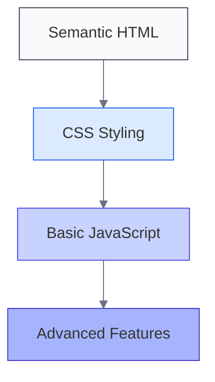
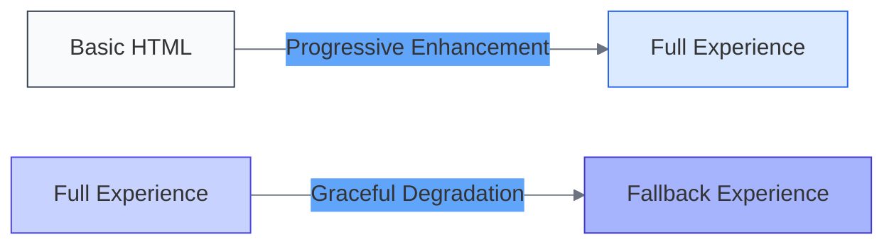

# Progressive Enhancement Principles

<link rel="stylesheet" href="../assets/css/styles.css">

Progressive enhancement is a design philosophy that prioritizes content and core functionality, then gradually enhances the user experience for browsers and devices that support more advanced features. This approach ensures that your UME application is accessible to all users while providing an optimal experience for those with modern browsers.

## Core Principles

### 1. Start with Semantic HTML

Begin with clean, semantic HTML that provides structure and meaning to your content:

```html
<!-- Instead of this -->
<div class="button" onclick="submitForm()">Submit</div>

<!-- Use this -->
<button type="submit">Submit</button>
```

Semantic HTML:
- Works everywhere, regardless of CSS or JavaScript support
- Improves accessibility for screen readers and assistive technologies
- Enhances SEO by clearly defining content structure
- Provides a solid foundation for progressive enhancement

### 2. Separate Structure, Presentation, and Behavior

Follow the separation of concerns principle:

- **Structure (HTML)**: Content and its semantic meaning
- **Presentation (CSS)**: Visual styling and layout
- **Behavior (JavaScript)**: Interactivity and dynamic functionality

This separation allows each layer to enhance the previous one without breaking core functionality.

### 3. Build in Layers

Implement your UME application in layers, with each layer enhancing the previous one:

1. **Base Layer**: Semantic HTML with core content and functionality
2. **Presentation Layer**: CSS for styling and layout
3. **Behavior Layer**: JavaScript for interactivity and enhanced functionality



### 4. Use Feature Detection

Instead of assuming features are available or using browser detection, detect specific feature support:

```javascript
// Instead of checking browser version
if (navigator.userAgent.includes('Chrome')) {
    // Use Chrome-specific code
}

// Use feature detection
if ('IntersectionObserver' in window) {
    // Use IntersectionObserver
} else {
    // Use fallback approach
}
```

### 5. Provide Fallbacks

Always have a plan for when features aren't supported:

```javascript
// Example: Using fetch with XMLHttpRequest fallback
function getData(url, callback) {
    if ('fetch' in window) {
        fetch(url)
            .then(response => response.json())
            .then(data => callback(data))
            .catch(error => console.error('Fetch error:', error));
    } else {
        const xhr = new XMLHttpRequest();
        xhr.open('GET', url);
        xhr.onload = () => {
            if (xhr.status === 200) {
                callback(JSON.parse(xhr.responseText));
            }
        };
        xhr.onerror = () => console.error('XHR error');
        xhr.send();
    }
}
```

## Benefits for UME Applications

Applying progressive enhancement to your UME application provides several benefits:

1. **Universal Access**: Ensures all users can access core functionality
2. **Resilience**: Application continues to work even when some technologies fail
3. **Performance**: Core content loads quickly, with enhancements added progressively
4. **Maintainability**: Cleaner code with clear separation of concerns
5. **Future-Proofing**: New browser features can be adopted without breaking existing functionality

## Progressive Enhancement vs. Graceful Degradation

While related, these approaches differ in their starting point:

- **Progressive Enhancement**: Starts with a minimal viable product and adds enhancements
- **Graceful Degradation**: Starts with a full-featured application and provides fallbacks



Progressive enhancement is generally preferred as it ensures a solid foundation for all users.

## Real-World Example

Consider a UME user profile form:

1. **Base Layer**: HTML form that works with standard form submission
2. **Enhancement 1**: CSS for improved styling and layout
3. **Enhancement 2**: JavaScript for client-side validation
4. **Enhancement 3**: AJAX for form submission without page reload
5. **Enhancement 4**: Advanced features like auto-save and real-time validation

If JavaScript fails, the form still submits traditionally. If AJAX fails, client-side validation still works. If CSS fails, the form remains functional.

## Next Steps

Continue to [Feature Detection](./020-feature-detection.md) to learn how to detect browser capabilities and provide appropriate experiences.
