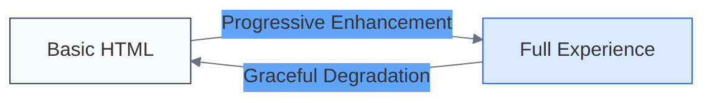

# Graceful Degradation

<link rel="stylesheet" href="../assets/css/styles.css">

Graceful degradation is a design approach that ensures your UME application remains functional and provides a good user experience even when certain features or technologies aren't available or fail. While progressive enhancement builds up from a basic experience, graceful degradation ensures that a more advanced experience can scale back gracefully when needed.

## Understanding Graceful Degradation

Graceful degradation focuses on:

1. **Maintaining Core Functionality**: Ensuring essential features work regardless of browser capabilities
2. **Providing Acceptable Alternatives**: Offering simpler but functional alternatives when advanced features aren't available
3. **Handling Errors Elegantly**: Preventing crashes and providing helpful feedback when things go wrong
4. **Preserving User Experience**: Maintaining a cohesive experience even with reduced functionality

## Progressive Enhancement vs. Graceful Degradation

These approaches are complementary:



- **Progressive Enhancement**: Starts with basic functionality and adds enhancements
- **Graceful Degradation**: Ensures advanced functionality can fall back to simpler alternatives

In practice, you'll often use both approaches together.

## Implementing Graceful Degradation

### 1. JavaScript Degradation

Ensure your application works when JavaScript is limited or unavailable:

```html
<!-- Form that works without JavaScript -->
<form action="/users" method="POST">
    <label for="name">Name:</label>
    <input type="text" id="name" name="name" required>
    
    <label for="email">Email:</label>
    <input type="email" id="email" name="email" required>
    
    <button type="submit">Create User</button>
</form>

<!-- JavaScript enhancement -->
<script>
    document.addEventListener('DOMContentLoaded', () => {
        const form = document.querySelector('form');
        
        // Enhanced with JavaScript: AJAX submission
        form.addEventListener('submit', async (e) => {
            e.preventDefault();
            
            try {
                const formData = new FormData(form);
                const response = await fetch('/users', {
                    method: 'POST',
                    body: formData
                });
                
                if (response.ok) {
                    showSuccessMessage();
                } else {
                    // If AJAX fails, fall back to traditional submission
                    form.submit();
                }
            } catch (error) {
                console.error('Error:', error);
                // If JavaScript errors occur, fall back to traditional submission
                form.submit();
            }
        });
    });
</script>
```

### 2. CSS Degradation

Provide CSS that works across browsers with appropriate fallbacks:

```css
/* Base styles that work everywhere */
.container {
    width: 100%;
    max-width: 1200px;
    margin: 0 auto;
}

.card {
    border: 1px solid #ddd;
    padding: 20px;
    margin-bottom: 20px;
}

/* Modern layout with fallbacks */
.grid {
    /* Fallback for browsers without grid support */
    display: flex;
    flex-wrap: wrap;
}

.grid-item {
    /* Fallback width for flex layout */
    width: 100%;
    padding: 10px;
    box-sizing: border-box;
}

@media (min-width: 768px) {
    .grid-item {
        width: 50%;
    }
}

@media (min-width: 1024px) {
    .grid-item {
        width: 33.333%;
    }
}

/* Grid layout for modern browsers */
@supports (display: grid) {
    .grid {
        display: grid;
        grid-template-columns: repeat(auto-fill, minmax(300px, 1fr));
        gap: 20px;
    }
    
    .grid-item {
        width: auto; /* Reset width from fallback */
        padding: 0; /* Reset padding from fallback */
    }
}
```

### 3. Network Degradation

Handle situations where network connectivity is limited or unreliable:

```javascript
class DataService {
    constructor() {
        this.offlineMode = false;
        this.pendingRequests = [];
        this.localCache = {};
        
        // Listen for online/offline events
        window.addEventListener('online', () => this.handleOnline());
        window.addEventListener('offline', () => this.handleOffline());
    }
    
    async fetchData(url, options = {}) {
        // Try to get from cache first
        const cachedData = this.getCachedData(url);
        
        // If we're offline, return cached data or error
        if (this.offlineMode || !navigator.onLine) {
            if (cachedData) {
                return cachedData;
            }
            
            // Queue request for when we're back online
            this.queueRequest(url, options);
            throw new Error('Currently offline. Request queued for later.');
        }
        
        try {
            // Try to fetch fresh data
            const response = await fetch(url, options);
            const data = await response.json();
            
            // Update cache
            this.cacheData(url, data);
            return data;
        } catch (error) {
            // Network error - try to use cache
            if (cachedData) {
                return cachedData;
            }
            throw error;
        }
    }
    
    handleOffline() {
        this.offlineMode = true;
        // Show offline indicator to user
        document.body.classList.add('offline-mode');
    }
    
    handleOnline() {
        this.offlineMode = false;
        document.body.classList.remove('offline-mode');
        
        // Process queued requests
        this.processPendingRequests();
    }
    
    // Other methods for caching, queue management, etc.
}
```

### 4. Feature Degradation

Provide alternatives when specific features aren't available:

```javascript
class NotificationService {
    constructor() {
        this.hasNotificationSupport = 'Notification' in window;
        this.hasPermission = false;
        
        if (this.hasNotificationSupport) {
            this.checkPermission();
        }
    }
    
    async checkPermission() {
        if (Notification.permission === 'granted') {
            this.hasPermission = true;
        } else if (Notification.permission !== 'denied') {
            const permission = await Notification.requestPermission();
            this.hasPermission = permission === 'granted';
        }
    }
    
    notify(title, options = {}) {
        // Use native notifications if available and permitted
        if (this.hasNotificationSupport && this.hasPermission) {
            return new Notification(title, options);
        }
        
        // Fallback to in-app notification
        this.showInAppNotification(title, options);
    }
    
    showInAppNotification(title, options) {
        const notification = document.createElement('div');
        notification.className = 'in-app-notification';
        
        const titleElement = document.createElement('h4');
        titleElement.textContent = title;
        notification.appendChild(titleElement);
        
        if (options.body) {
            const bodyElement = document.createElement('p');
            bodyElement.textContent = options.body;
            notification.appendChild(bodyElement);
        }
        
        // Add to DOM
        document.body.appendChild(notification);
        
        // Remove after timeout
        setTimeout(() => {
            notification.classList.add('fade-out');
            setTimeout(() => notification.remove(), 500);
        }, 5000);
    }
}
```

## Graceful Degradation Patterns for UME

### 1. Authentication and Authorization

Ensure authentication works even with limited browser capabilities:

```javascript
class AuthService {
    login(credentials) {
        // Try modern approach first
        if ('fetch' in window) {
            return this.loginWithFetch(credentials);
        }
        
        // Fall back to traditional form submission
        this.submitLoginForm(credentials);
    }
    
    async loginWithFetch(credentials) {
        try {
            const response = await fetch('/api/login', {
                method: 'POST',
                headers: {
                    'Content-Type': 'application/json'
                },
                body: JSON.stringify(credentials)
            });
            
            if (response.ok) {
                const data = await response.json();
                this.handleSuccessfulLogin(data);
                return data;
            } else {
                throw new Error('Login failed');
            }
        } catch (error) {
            // If AJAX fails, fall back to form submission
            this.submitLoginForm(credentials);
            throw error;
        }
    }
    
    submitLoginForm(credentials) {
        // Create and submit a traditional form
        const form = document.createElement('form');
        form.method = 'POST';
        form.action = '/login';
        form.style.display = 'none';
        
        for (const [key, value] of Object.entries(credentials)) {
            const input = document.createElement('input');
            input.type = 'hidden';
            input.name = key;
            input.value = value;
            form.appendChild(input);
        }
        
        document.body.appendChild(form);
        form.submit();
    }
}
```

### 2. User Interface Components

Design UI components that degrade gracefully:

```html
<!-- Tabs component with graceful degradation -->
<div class="tabs-container">
    <!-- Works without JavaScript -->
    <div class="tabs-fallback">
        <h2>User Profile</h2>
        <div class="section">
            <h3>Personal Information</h3>
            <!-- Personal info content -->
        </div>
        
        <h2>Account Settings</h2>
        <div class="section">
            <h3>Email Preferences</h3>
            <!-- Email preferences content -->
        </div>
        
        <h2>Security</h2>
        <div class="section">
            <h3>Password</h3>
            <!-- Password content -->
        </div>
    </div>
    
    <!-- Enhanced with JavaScript -->
    <div class="tabs-enhanced" style="display: none;">
        <div class="tabs-nav">
            <button class="tab-button active" data-tab="profile">User Profile</button>
            <button class="tab-button" data-tab="settings">Account Settings</button>
            <button class="tab-button" data-tab="security">Security</button>
        </div>
        
        <div class="tab-content active" id="profile">
            <!-- Profile content -->
        </div>
        
        <div class="tab-content" id="settings">
            <!-- Settings content -->
        </div>
        
        <div class="tab-content" id="security">
            <!-- Security content -->
        </div>
    </div>
</div>

<script>
    document.addEventListener('DOMContentLoaded', () => {
        const container = document.querySelector('.tabs-container');
        const fallback = container.querySelector('.tabs-fallback');
        const enhanced = container.querySelector('.tabs-enhanced');
        
        // Enable enhanced tabs if JavaScript is available
        fallback.style.display = 'none';
        enhanced.style.display = 'block';
        
        // Set up tab functionality
        const buttons = enhanced.querySelectorAll('.tab-button');
        const contents = enhanced.querySelectorAll('.tab-content');
        
        buttons.forEach(button => {
            button.addEventListener('click', () => {
                // Deactivate all tabs
                buttons.forEach(b => b.classList.remove('active'));
                contents.forEach(c => c.classList.remove('active'));
                
                // Activate selected tab
                button.classList.add('active');
                const tabId = button.dataset.tab;
                document.getElementById(tabId).classList.add('active');
            });
        });
    });
</script>
```

## Best Practices for Graceful Degradation

1. **Test with Features Disabled**: Regularly test your application with JavaScript disabled, CSS disabled, or in offline mode
2. **Use Feature Detection**: Always detect features before using them
3. **Provide Meaningful Feedback**: Let users know when features are unavailable and why
4. **Design for Failure**: Assume that any part of your application might fail and plan accordingly
5. **Prioritize Core Functionality**: Ensure that essential features work in all environments
6. **Use Server-Side Rendering**: Render initial content on the server for faster loading and better compatibility
7. **Implement Proper Error Handling**: Catch and handle errors gracefully to prevent application crashes

## Next Steps

Continue to [Core Functionality vs. Enhancements](./050-core-vs-enhancements.md) to learn how to distinguish between essential functionality and enhancements in your UME application.
