# Core Functionality vs. Enhancements

<link rel="stylesheet" href="../assets/css/styles.css">

A key aspect of progressive enhancement is distinguishing between core functionality (what users need) and enhancements (what improves the experience). This distinction helps you prioritize development efforts and ensure that your UME application remains accessible to all users.

## Identifying Core Functionality

Core functionality includes the essential features that all users need to accomplish their primary goals with your application.

### Characteristics of Core Functionality

1. **Essential for Task Completion**: Features required to complete the main tasks
2. **Universally Accessible**: Works across all supported browsers and devices
3. **Independent of Advanced Technologies**: Functions without relying on modern JavaScript or CSS
4. **Focused on Content and Actions**: Prioritizes content delivery and user actions
5. **Resilient to Failures**: Continues to work when parts of the application fail

### Examples of Core Functionality in UME

| Feature | Core Functionality |
|---------|-------------------|
| User Authentication | Ability to log in and maintain a session |
| User Profile | View and edit basic profile information |
| Team Management | Create, join, and leave teams |
| Permissions | Basic permission checks for resource access |
| Content Creation | Create and edit content |
| Notifications | Receive important notifications |

## Identifying Enhancements

Enhancements improve the user experience but aren't essential for completing primary tasks.

### Characteristics of Enhancements

1. **Improves User Experience**: Makes tasks easier, faster, or more enjoyable
2. **Relies on Modern Technologies**: Often uses newer JavaScript or CSS features
3. **Provides Additional Functionality**: Adds features beyond the core requirements
4. **May Have Performance Implications**: Sometimes requires more resources
5. **Can Fail Gracefully**: Application remains usable if enhancements aren't available

### Examples of Enhancements in UME

| Feature | Enhancement |
|---------|-------------|
| User Authentication | Passwordless login, social login, remember me functionality |
| User Profile | Real-time validation, auto-save, rich media uploads |
| Team Management | Drag-and-drop organization, real-time updates, animated transitions |
| Permissions | Visual permission builder, role suggestions, permission templates |
| Content Creation | Rich text editing, image cropping, auto-formatting |
| Notifications | Real-time notifications, customizable notification preferences |

## Mapping Core vs. Enhancements

Creating a clear map of core functionality vs. enhancements helps guide your implementation:

```mermaid
%%{init: {'theme': 'base', 'themeVariables': {'primaryColor': '#f3f4f6', 'lineColor': '#6b7280', 'textColor': '#111827', 'mainBkg': '#ffffff', 'secondaryColor': '#60a5fa', 'tertiaryColor': '#e5e7eb'}}}%%
graph TD
    A[User Authentication] --> B[Core: Basic Login Form]
    A --> C[Enhancement: Remember Me]
    A --> D[Enhancement: Social Login]
    A --> E[Enhancement: 2FA]
    
    F[User Profile] --> G[Core: View/Edit Basic Info]
    F --> H[Enhancement: Avatar Upload]
    F --> I[Enhancement: Real-time Validation]
    F --> J[Enhancement: Profile Completeness]
    
    K[Team Management] --> L[Core: Create/Join Teams]
    K --> M[Enhancement: Team Hierarchy]
    K --> N[Enhancement: Team Analytics]
    K --> O[Enhancement: Team Chat]
    
    style B fill:#f9fafb,stroke:#374151
    style G fill:#f9fafb,stroke:#374151
    style L fill:#f9fafb,stroke:#374151
    
    style C fill:#dbeafe,stroke:#2563eb
    style D fill:#dbeafe,stroke:#2563eb
    style E fill:#dbeafe,stroke:#2563eb
    style H fill:#dbeafe,stroke:#2563eb
    style I fill:#dbeafe,stroke:#2563eb
    style J fill:#dbeafe,stroke:#2563eb
    style M fill:#dbeafe,stroke:#2563eb
    style N fill:#dbeafe,stroke:#2563eb
    style O fill:#dbeafe,stroke:#2563eb
```



## Implementation Approach

### 1. Start with Core Functionality

Begin by implementing the core functionality using the most widely supported technologies:

```php
// Controller with core functionality
class UserProfileController extends Controller
{
    public function show(User $user)
    {
        return view('user.profile.show', compact('user'));
    }
    
    public function edit(User $user)
    {
        $this->authorize('update', $user);
        return view('user.profile.edit', compact('user'));
    }
    
    public function update(UpdateUserProfileRequest $request, User $user)
    {
        $this->authorize('update', $user);
        
        $user->update($request->validated());
        
        return redirect()->route('users.profile.show', $user)
            ->with('success', 'Profile updated successfully.');
    }
}
```

```html
<!-- Core profile edit form -->
<form action="{{ route('users.profile.update', $user) }}" method="POST">
    @csrf
    @method('PUT')
    
    <div class="form-group">
        <label for="name">Name</label>
        <input type="text" id="name" name="name" value="{{ old('name', $user->name) }}" required>
        @error('name')
            <span class="error">{{ $message }}</span>
        @enderror
    </div>
    
    <div class="form-group">
        <label for="email">Email</label>
        <input type="email" id="email" name="email" value="{{ old('email', $user->email) }}" required>
        @error('email')
            <span class="error">{{ $message }}</span>
        @enderror
    </div>
    
    <button type="submit">Update Profile</button>
</form>
```

### 2. Add Enhancements Progressively

Once core functionality is in place, add enhancements that improve the experience:

```html
<!-- Enhanced profile edit form -->
<form id="profile-form" action="{{ route('users.profile.update', $user) }}" method="POST">
    @csrf
    @method('PUT')
    
    <div class="form-group">
        <label for="name">Name</label>
        <input type="text" id="name" name="name" value="{{ old('name', $user->name) }}" required>
        @error('name')
            <span class="error">{{ $message }}</span>
        @enderror
    </div>
    
    <div class="form-group">
        <label for="email">Email</label>
        <input type="email" id="email" name="email" value="{{ old('email', $user->email) }}" required>
        @error('email')
            <span class="error">{{ $message }}</span>
        @enderror
    </div>
    
    <!-- Enhancement: Avatar upload -->
    <div class="form-group">
        <label for="avatar">Profile Picture</label>
        <div class="avatar-upload">
            avatar_url }}" alt="Profile picture" class="avatar-preview">
            <input type="file" id="avatar" name="avatar" accept="image/*">
        </div>
        @error('avatar')
            <span class="error">{{ $message }}</span>
        @enderror
    </div>
    
    <button type="submit">Update Profile</button>
</form>

<!-- Enhancement: JavaScript for real-time validation and AJAX submission -->
<script>
    document.addEventListener('DOMContentLoaded', function() {
        const form = document.getElementById('profile-form');
        const nameInput = document.getElementById('name');
        const emailInput = document.getElementById('email');
        const avatarInput = document.getElementById('avatar');
        
        // Only add enhancements if browser supports them
        if (window.fetch && FormData) {
            // Real-time validation
            nameInput.addEventListener('blur', validateName);
            emailInput.addEventListener('blur', validateEmail);
            
            // Avatar preview
            if (avatarInput && 'FileReader' in window) {
                setupAvatarPreview();
            }
            
            // AJAX form submission
            form.addEventListener('submit', submitFormAsync);
        }
        
        function validateName() {
            // Name validation logic
        }
        
        function validateEmail() {
            // Email validation logic
        }
        
        function setupAvatarPreview() {
            // Avatar preview logic
        }
        
        async function submitFormAsync(e) {
            e.preventDefault();
            
            try {
                const formData = new FormData(form);
                const response = await fetch(form.action, {
                    method: 'POST',
                    body: formData,
                    headers: {
                        'X-Requested-With': 'XMLHttpRequest',
                    }
                });
                
                if (response.ok) {
                    const data = await response.json();
                    showSuccessMessage(data.message);
                } else {
                    // If AJAX fails, fall back to traditional submission
                    form.submit();
                }
            } catch (error) {
                console.error('Error:', error);
                // If JavaScript errors occur, fall back to traditional submission
                form.submit();
            }
        }
    });
</script>
```

### 3. Ensure Enhancements Don't Break Core Functionality

Always verify that enhancements don't interfere with core functionality:

```javascript
// Safe enhancement pattern
function enhanceUserInterface() {
    try {
        // Check for required features
        if (!('fetch' in window) || !('FormData' in window)) {
            console.log('Browser does not support required features for enhanced UI');
            return;
        }
        
        // Apply enhancements
        setupRealTimeValidation();
        setupAjaxForms();
        setupDragAndDrop();
        
    } catch (error) {
        console.error('Error applying UI enhancements:', error);
        // Core functionality continues to work
    }
}

// Call after DOM is ready
document.addEventListener('DOMContentLoaded', enhanceUserInterface);
```

## Decision Framework for Core vs. Enhancements

Use this framework to decide whether a feature is core or an enhancement:

1. **Ask**: Can users accomplish their primary goal without this feature?
   - If No → Core Functionality
   - If Yes → Potential Enhancement

2. **Ask**: Does this feature require modern browser capabilities?
   - If Yes → Enhancement
   - If No → Potential Core Functionality

3. **Ask**: Would removing this feature significantly impact user satisfaction?
   - If Yes → Consider making it core with fallbacks
   - If No → Enhancement

4. **Ask**: Is this feature essential for accessibility?
   - If Yes → Core Functionality
   - If No → Potential Enhancement

5. **Ask**: Does this feature have significant performance implications?
   - If Yes → Enhancement with careful implementation
   - If No → Could be either core or enhancement

## UME Feature Classification Examples

### User Authentication

| Feature | Classification | Reasoning |
|---------|---------------|-----------|
| Login Form | Core | Essential for authentication |
| Password Reset | Core | Essential for account recovery |
| Remember Me | Enhancement | Improves experience but not essential |
| Social Login | Enhancement | Alternative login method, not essential |
| Two-Factor Auth | Enhancement | Adds security but not required for basic authentication |

### Team Management

| Feature | Classification | Reasoning |
|---------|---------------|-----------|
| Create Team | Core | Essential for team functionality |
| Add/Remove Members | Core | Essential for team management |
| Team Hierarchy | Enhancement | Adds organization but not essential |
| Team Chat | Enhancement | Improves collaboration but not essential |
| Team Analytics | Enhancement | Provides insights but not essential |

## Next Steps

Continue to [Accessibility Considerations](./060-accessibility.md) to learn how to ensure your progressively enhanced application is accessible to all users.
