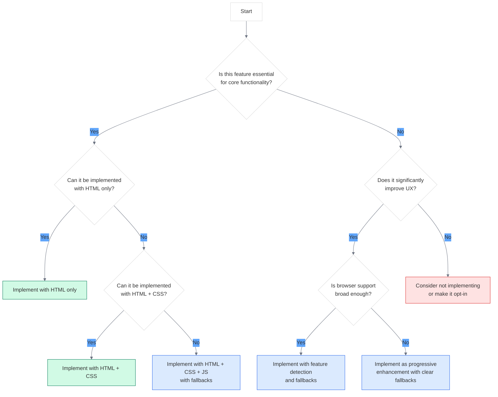

# Decision Tree for Implementation Approaches

<link rel="stylesheet" href="../assets/css/styles.css">

When implementing progressive enhancement in your UME application, you'll need to make decisions about which approach to use for different features. This decision tree will help you determine the most appropriate implementation approach based on various factors.

## Core Decision Framework

Use this decision tree to guide your implementation approach:



## Feature Categorization

Before applying the decision tree, categorize your features:

### Essential Features

These features are critical for the core functionality of your application:

- User authentication and account management
- Basic CRUD operations for primary entities (users, teams, etc.)
- Core navigation and routing
- Form submission and data processing
- Error handling and feedback

### Enhancement Features

These features improve the user experience but aren't essential:

- Real-time updates and notifications
- Advanced UI interactions (drag-and-drop, animations)
- Client-side validation (in addition to server-side)
- Auto-save and offline capabilities
- Rich media handling and previews

## Decision Factors

Consider these factors when making implementation decisions:

### 1. User Impact

- **High Impact**: Features used by most users frequently
- **Medium Impact**: Features used by many users occasionally
- **Low Impact**: Features used by few users rarely

### 2. Technical Complexity

- **High Complexity**: Requires advanced JavaScript, complex state management
- **Medium Complexity**: Requires moderate JavaScript, some state management
- **Low Complexity**: Can be implemented with HTML/CSS or minimal JavaScript

### 3. Browser Support

- **Broad Support**: Feature supported in all target browsers
- **Moderate Support**: Feature supported in most modern browsers
- **Limited Support**: Feature only supported in the latest browsers

### 4. Performance Impact

- **High Impact**: Significantly affects page load or interaction time
- **Medium Impact**: Moderately affects performance
- **Low Impact**: Minimal performance implications

## Implementation Approach Matrix

Use this matrix to determine the appropriate implementation approach based on the factors above:

| User Impact | Technical Complexity | Browser Support | Performance Impact | Recommended Approach |
|-------------|---------------------|-----------------|-------------------|---------------------|
| High | Low | Broad | Low | HTML/CSS with minimal JS |
| High | Medium | Broad | Low/Medium | Progressive enhancement with good fallbacks |
| High | High | Moderate | Medium | Progressive enhancement with robust fallbacks |
| High | High | Limited | High | Server-rendered core with opt-in enhancements |
| Medium | Low | Broad | Low | Progressive enhancement |
| Medium | Medium | Moderate | Medium | Progressive enhancement with fallbacks |
| Medium | High | Limited | High | Consider alternative approaches |
| Low | Low | Broad | Low | Progressive enhancement |
| Low | Medium | Moderate | Medium | Opt-in enhancement |
| Low | High | Limited | High | Consider not implementing |

## Decision Examples for UME Features

### User Authentication

**Analysis**:
- **User Impact**: High (all users need this)
- **Technical Complexity**: Medium (form handling, validation, session management)
- **Browser Support**: Broad (forms work everywhere)
- **Performance Impact**: Medium (critical for user experience)

**Decision**: Implement core functionality with HTML forms and server-side processing. Enhance with client-side validation and AJAX submission where supported.

```javascript
// Implementation approach
document.addEventListener('DOMContentLoaded', function() {
    const form = document.getElementById('login-form');
    
    // Only enhance if the browser supports the required features
    if (form && 'fetch' in window && 'FormData' in window) {
        form.addEventListener('submit', async function(e) {
            e.preventDefault();
            
            try {
                const formData = new FormData(form);
                const response = await fetch(form.action, {
                    method: 'POST',
                    body: formData,
                    headers: {
                        'X-Requested-With': 'XMLHttpRequest',
                        'Accept': 'application/json'
                    }
                });
                
                const data = await response.json();
                
                if (data.success) {
                    window.location.href = data.redirect;
                } else {
                    // Show validation errors
                    displayErrors(data.errors);
                }
            } catch (error) {
                console.error('Error:', error);
                // Fall back to traditional form submission
                form.submit();
            }
        });
    }
});
```

### Team Management Dashboard

**Analysis**:
- **User Impact**: High (core feature for team collaboration)
- **Technical Complexity**: High (real-time updates, complex UI)
- **Browser Support**: Moderate (advanced features need modern browsers)
- **Performance Impact**: High (lots of data and interactions)

**Decision**: Implement a server-rendered core dashboard with all essential functionality. Progressively enhance with real-time updates, drag-and-drop, and advanced filtering for modern browsers.

```javascript
// Implementation approach
class TeamDashboard {
    constructor() {
        this.initializeCore();
        
        // Feature detection for enhancements
        this.supportsRealtime = 'WebSocket' in window;
        this.supportsDragDrop = 'draggable' in document.createElement('div');
        this.supportsLocalStorage = this.checkLocalStorage();
        
        // Apply enhancements based on feature support
        if (this.supportsRealtime) {
            this.initializeRealtimeUpdates();
        }
        
        if (this.supportsDragDrop) {
            this.initializeDragAndDrop();
        }
        
        if (this.supportsLocalStorage) {
            this.initializeStatePreservation();
        }
    }
    
    initializeCore() {
        // Core functionality that works for everyone
        // Server-rendered content with traditional form submissions
    }
    
    checkLocalStorage() {
        try {
            localStorage.setItem('test', 'test');
            localStorage.removeItem('test');
            return true;
        } catch (e) {
            return false;
        }
    }
    
    // Other methods for enhanced functionality
}
```

### User Profile Image Upload

**Analysis**:
- **User Impact**: Medium (important but not critical)
- **Technical Complexity**: Medium (file handling, preview)
- **Browser Support**: Moderate (modern file APIs needed for best experience)
- **Performance Impact**: Medium (involves file uploads)

**Decision**: Implement basic file upload with HTML form. Enhance with image preview, drag-and-drop, and client-side resizing for modern browsers.

```html
<!-- Implementation approach -->
<form action="/profile/update" method="POST" enctype="multipart/form-data">
    @csrf
    
    <!-- Basic file upload (works everywhere) -->
    <div class="form-group">
        <label for="avatar">Profile Picture</label>
        <input type="file" id="avatar" name="avatar" accept="image/*">
    </div>
    
    <!-- Enhanced upload area (only shown if JS is available) -->
    <div class="enhanced-upload" style="display: none;">
        <div class="upload-preview">
            avatar_url }}" alt="Profile preview" id="avatar-preview">
        </div>
        <div class="upload-dropzone" id="upload-dropzone">
            <p>Drag and drop an image here, or click to select a file</p>
        </div>
    </div>
    
    <button type="submit">Update Profile</button>
</form>

<script>
document.addEventListener('DOMContentLoaded', function() {
    const basicUpload = document.getElementById('avatar');
    const enhancedUpload = document.querySelector('.enhanced-upload');
    const dropzone = document.getElementById('upload-dropzone');
    const preview = document.getElementById('avatar-preview');
    
    // Feature detection
    const hasFileReader = 'FileReader' in window;
    const hasDragDrop = 'draggable' in document.createElement('div');
    
    if (hasFileReader) {
        // Show enhanced upload UI
        enhancedUpload.style.display = 'block';
        
        // Setup image preview
        basicUpload.addEventListener('change', function() {
            if (this.files && this.files[0]) {
                const reader = new FileReader();
                reader.onload = function(e) {
                    preview.src = e.target.result;
                };
                reader.readAsDataURL(this.files[0]);
            }
        });
        
        // Setup click to select
        dropzone.addEventListener('click', function() {
            basicUpload.click();
        });
        
        // Setup drag and drop if supported
        if (hasDragDrop) {
            dropzone.addEventListener('dragover', function(e) {
                e.preventDefault();
                this.classList.add('dragover');
            });
            
            dropzone.addEventListener('dragleave', function() {
                this.classList.remove('dragover');
            });
            
            dropzone.addEventListener('drop', function(e) {
                e.preventDefault();
                this.classList.remove('dragover');
                
                if (e.dataTransfer.files.length) {
                    basicUpload.files = e.dataTransfer.files;
                    
                    // Trigger change event
                    const event = new Event('change');
                    basicUpload.dispatchEvent(event);
                }
            });
        }
    }
});
</script>
```

## Decision-Making Workflow

Follow this workflow when implementing new features:

1. **Identify the feature's purpose and importance**
   - Is it essential for core functionality?
   - Who will use it and how often?

2. **Determine the simplest implementation approach**
   - Can it be implemented with HTML only?
   - Does it require CSS for layout or presentation?
   - Is JavaScript necessary for functionality?

3. **Assess browser and device support requirements**
   - Which browsers and devices must be supported?
   - What are the minimum requirements for the feature?

4. **Evaluate performance implications**
   - How will this feature affect page load time?
   - Will it impact runtime performance?
   - Are there bandwidth considerations?

5. **Implement using the appropriate approach**
   - Start with the core functionality
   - Add enhancements progressively
   - Ensure fallbacks work correctly

6. **Test across different environments**
   - Test with JavaScript disabled
   - Test on different browsers and devices
   - Test under various network conditions

7. **Refine based on testing results**
   - Improve fallbacks if needed
   - Optimize performance
   - Enhance accessibility

## Conclusion

By using this decision tree and considering the various factors that influence implementation approaches, you can create a UME application that works for all users while providing enhanced experiences for those with modern browsers and devices.

Remember that progressive enhancement is not about providing the same experience for everyone, but about ensuring that everyone can access the core functionality of your application regardless of their browser, device, or network conditions.

As you implement features in your UME application, regularly revisit these decision-making guidelines to ensure you're providing the best possible experience for all users.
