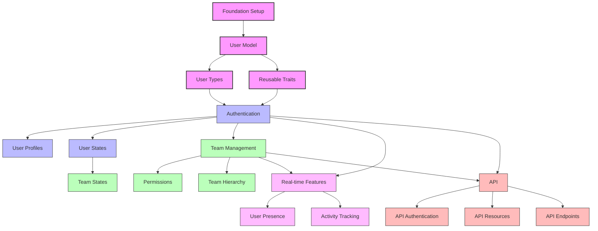

# Concept Relationship Map

<link rel="stylesheet" href="../assets/css/styles.css">

This document provides a comprehensive map of the relationships between key concepts in the UME tutorial. It visualizes how different features, components, and ideas connect to each other, helping users navigate the documentation more effectively.

## Core Concept Map

The following diagram shows the primary relationships between core UME concepts:

```mermaid
graph TD
    %% Core Concepts
    User[User Model] --> STI[Single Table Inheritance]
    User --> UserTypes[User Types]
    User --> Traits[Reusable Traits]
    User --> Auth[Authentication]
    User --> Teams[Team Management]
    
    %% Traits
    Traits --> HasUlid[HasUlid Trait]
    Traits --> HasUserTracking[HasUserTracking Trait]
    Traits --> HasAdditionalFeatures[HasAdditionalFeatures Trait]
    
    %% User Types
    UserTypes --> Admin[Admin User]
    UserTypes --> Manager[Manager User]
    UserTypes --> Practitioner[Practitioner User]
    
    %% Authentication
    Auth --> Fortify[Laravel Fortify]
    Auth --> TwoFactor[Two-Factor Auth]
    Auth --> Profiles[User Profiles]
    Auth --> States[User States]
    
    %% States
    States --> StateMachine[State Machine]
    StateMachine --> Transitions[State Transitions]
    
    %% Teams
    Teams --> TeamHierarchy[Team Hierarchy]
    Teams --> TeamMembers[Team Members]
    Teams --> Permissions[Permissions]
    Teams --> TeamStates[Team States]
    
    %% Permissions
    Permissions --> Roles[User Roles]
    Permissions --> Policies[Authorization Policies]
    Permissions --> Gates[Authorization Gates]
    
    %% Real-time
    RealTime[Real-time Features] --> WebSockets[WebSockets]
    RealTime --> Broadcasting[Event Broadcasting]
    RealTime --> Presence[User Presence]
    RealTime --> Activity[Activity Tracking]
    
    %% Advanced
    Advanced[Advanced Features] --> MultiTenancy[Multi-tenancy]
    Advanced --> Audit[Audit Logging]
    Advanced --> Search[Search Functionality]
    Advanced --> API[API]
    
    %% API
    API --> Authentication[API Authentication]
    API --> Resources[API Resources]
    API --> Endpoints[API Endpoints]
    
    %% Testing
    Testing[Testing] --> UnitTests[Unit Tests]
    Testing --> FeatureTests[Feature Tests]
    Testing --> BrowserTests[Browser Tests]
    
    %% Deployment
    Deployment[Deployment] --> Docker[Docker]
    Deployment --> CI[CI/CD]
    Deployment --> Environments[Environments]
    
    %% Connections between major sections
    User --> RealTime
    Teams --> RealTime
    Auth --> API
    User --> API
    Teams --> API
    StateMachine --> TeamStates
    User --> Testing
    Teams --> Testing
    Auth --> Testing
    RealTime --> Testing
    API --> Testing
    User --> Deployment
    Teams --> Deployment
    RealTime --> Deployment
    API --> Deployment
    
    %% Style
    classDef core fill:#f9f,stroke:#333,stroke-width:2px
    classDef feature fill:#bbf,stroke:#333,stroke-width:1px
    classDef implementation fill:#bfb,stroke:#333,stroke-width:1px
    
    class User,Teams,Auth,RealTime,Advanced,Testing,Deployment core
    class STI,UserTypes,Traits,TeamHierarchy,Permissions,StateMachine,WebSockets,MultiTenancy,API feature
    class HasUlid,HasUserTracking,Admin,Manager,Practitioner,Fortify,TwoFactor,Transitions implementation
```

## Concept Groups

UME concepts can be organized into the following groups:

### Core Models and Inheritance

- User Model
- Single Table Inheritance
- User Types (Admin, Manager, Practitioner)
- Reusable Traits (HasUlid, HasUserTracking, HasAdditionalFeatures)

### Authentication and User Management

- Laravel Fortify Integration
- Two-Factor Authentication
- User Profiles
- User States and State Machine
- State Transitions

### Team and Permission System

- Team Model
- Team Hierarchy
- Team Members and Invitations
- Permission System
- User Roles
- Authorization Policies and Gates
- Team States

### Real-time Features

- WebSockets Configuration
- Event Broadcasting
- User Presence
- Activity Tracking
- Real-time Notifications

### Advanced Features

- Multi-tenancy
- Audit Logging
- Search Functionality
- Feature Flags
- Caching Strategies

### API and Integration

- API Authentication
- API Resources
- API Endpoints
- External Integrations
- Webhooks

### Testing and Quality Assurance

- Unit Tests
- Feature Tests
- Browser Tests
- Test Data Factories
- CI/CD Integration

### Deployment and Operations

- Docker Configuration
- Environment Management
- Performance Optimization
- Security Considerations
- Monitoring and Logging

## Concept Relationships in Detail

### User Model Relationships

The User Model is connected to:

1. **Single Table Inheritance**
   - Implementation approach for user types
   - Database structure for inheritance

2. **User Types**
   - Admin, Manager, and Practitioner models
   - Type-specific functionality
   - Type detection and casting

3. **Reusable Traits**
   - HasUlid for ULID primary keys
   - HasUserTracking for audit fields
   - HasAdditionalFeatures for extended functionality

4. **Authentication**
   - User authentication process
   - Login and registration
   - Password management

5. **Teams**
   - User-team relationships
   - Team membership
   - Team ownership

### Authentication Relationships

Authentication is connected to:

1. **Laravel Fortify**
   - Authentication scaffolding
   - Login and registration
   - Password reset

2. **Two-Factor Authentication**
   - 2FA implementation
   - Recovery codes
   - Device management

3. **User Profiles**
   - Profile information
   - Profile images
   - Profile settings

4. **User States**
   - Account status management
   - State transitions
   - State-dependent functionality

### Team Relationships

Teams are connected to:

1. **Team Hierarchy**
   - Parent-child relationships
   - Nested teams
   - Hierarchy management

2. **Team Members**
   - Member management
   - Invitations
   - Member roles

3. **Permissions**
   - Team-level permissions
   - Role-based access control
   - Permission inheritance

4. **Team States**
   - Team status management
   - Team lifecycle
   - State-dependent functionality

### Real-time Feature Relationships

Real-time features are connected to:

1. **WebSockets**
   - WebSocket configuration
   - Connection management
   - Client-server communication

2. **Event Broadcasting**
   - Event definition
   - Channel configuration
   - Broadcasting process

3. **User Presence**
   - Online status
   - Presence channels
   - Presence events

4. **Activity Tracking**
   - User activity logging
   - Activity feeds
   - Real-time updates

## Implementation Dependencies

The following diagram shows the implementation dependencies between UME components:

## Learning Path Relationships

The following diagram shows how different learning paths relate to UME concepts:

```mermaid
graph TD
    %% Learning Paths
    Beginner[Beginner Path] --> Foundation[Foundation Concepts]
    Beginner --> BasicUser[Basic User Model]
    Beginner --> SimpleAuth[Simple Authentication]
    
    Intermediate[Intermediate Path] --> STI[Single Table Inheritance]
    Intermediate --> Traits[Reusable Traits]
    Intermediate --> AdvAuth[Advanced Authentication]
    Intermediate --> BasicTeams[Basic Team Management]
    
    Advanced[Advanced Path] --> StateMachine[State Machines]
    Advanced --> TeamHierarchy[Team Hierarchy]
    Advanced --> Permissions[Advanced Permissions]
    Advanced --> RealTime[Real-time Features]
    
    Frontend[Frontend Path] --> UIComponents[UI Components]
    Frontend --> Forms[Form Handling]
    Frontend --> ClientSide[Client-side Features]
    Frontend --> RealTimeUI[Real-time UI]
    
    Backend[Backend Path] --> Models[Advanced Models]
    Backend --> Services[Service Layer]
    Backend --> API[API Development]
    Backend --> Performance[Performance Optimization]
    
    Fullstack[Fullstack Path] --> Intermediate
    Fullstack --> Frontend
    Fullstack --> Backend
    
    %% Style
    classDef path fill:#f9f,stroke:#333,stroke-width:2px
    classDef concept fill:#bbf,stroke:#333,stroke-width:1px
    
    class Beginner,Intermediate,Advanced,Frontend,Backend,Fullstack path
    class Foundation,BasicUser,SimpleAuth,STI,Traits,AdvAuth,BasicTeams,StateMachine,TeamHierarchy,Permissions,RealTime,UIComponents,Forms,ClientSide,RealTimeUI,Models,Services,API,Performance concept
```

## Concept Relationship Table

| Concept | Related Concepts | Relationship Type | Documentation Section |
|---------|------------------|-------------------|------------------------|
| User Model | Single Table Inheritance | Implementation | Models |
| User Model | User Types | Parent-Child | Models |
| User Model | Reusable Traits | Composition | Models |
| User Model | Authentication | Functionality | Authentication |
| User Model | Teams | Relationship | Teams |
| Single Table Inheritance | User Types | Implementation | Models |
| Single Table Inheritance | Database Migration | Implementation | Models |
| Reusable Traits | HasUlid | Implementation | Models |
| Reusable Traits | HasUserTracking | Implementation | Models |
| Reusable Traits | HasAdditionalFeatures | Implementation | Models |
| Authentication | Laravel Fortify | Implementation | Authentication |
| Authentication | Two-Factor Auth | Feature | Authentication |
| Authentication | User Profiles | Feature | Authentication |
| Authentication | User States | Feature | Authentication |
| User States | State Machine | Implementation | State Machines |
| User States | State Transitions | Implementation | State Machines |
| Teams | Team Hierarchy | Feature | Teams |
| Teams | Team Members | Relationship | Teams |
| Teams | Permissions | Functionality | Permissions |
| Teams | Team States | Feature | Teams |
| Permissions | Roles | Implementation | Permissions |
| Permissions | Policies | Implementation | Permissions |
| Permissions | Gates | Implementation | Permissions |
| Real-time Features | WebSockets | Implementation | Real-time |
| Real-time Features | Event Broadcasting | Implementation | Real-time |
| Real-time Features | User Presence | Feature | Real-time |
| Real-time Features | Activity Tracking | Feature | Real-time |
| API | API Authentication | Implementation | API |
| API | API Resources | Implementation | API |
| API | API Endpoints | Implementation | API |

## Navigation Paths

Common navigation paths through the UME documentation:

### User Model Implementation Path

1. Foundation Setup
2. User Model Basics
3. Single Table Inheritance
4. User Types
5. Reusable Traits
6. Testing User Models

### Authentication Implementation Path

1. User Model
2. Laravel Fortify Setup
3. Login and Registration
4. Two-Factor Authentication
5. User Profiles
6. User States
7. Testing Authentication

### Team Implementation Path

1. User Model
2. Authentication
3. Team Model
4. Team Members
5. Team Hierarchy
6. Permissions
7. Team States
8. Testing Teams

### Real-time Features Path

1. Foundation Setup
2. WebSockets Configuration
3. Event Broadcasting
4. User Presence
5. Activity Tracking
6. Real-time UI Components
7. Testing Real-time Features

## Using This Map

This concept relationship map can be used in several ways:

1. **Documentation Navigation**: Follow the relationships to find related content
2. **Implementation Planning**: Understand dependencies for implementation
3. **Learning Path Selection**: Choose appropriate learning paths based on concepts
4. **Cross-Reference Development**: Identify which concepts should cross-reference each other
5. **Content Gap Analysis**: Identify missing documentation for important relationships

## Maintaining the Concept Map

This concept map should be updated when:

1. New features are added to UME
2. Existing features are significantly changed
3. New relationships are identified
4. Documentation structure changes
5. User feedback indicates confusion about relationships

## Conclusion

The concept relationship map provides a comprehensive view of how different UME concepts relate to each other. By understanding these relationships, users can navigate the documentation more effectively, and documentation authors can create more useful cross-references.

## See Also

- [Cross-Reference Audit](010-cross-reference-audit.md) - Review of the current cross-referencing system
- [Improved Cross-Reference System](020-improved-cross-reference-system.md) - Standards for cross-references
- [Learning Paths](../090-learning-paths/000-index.md) - Guided learning paths through UME
- [Documentation Standards](../070-documentation/010-standards.md) - Overall documentation standards
- [User Journey Maps](../070-documentation/030-user-journeys.md) - Common paths through the documentation
