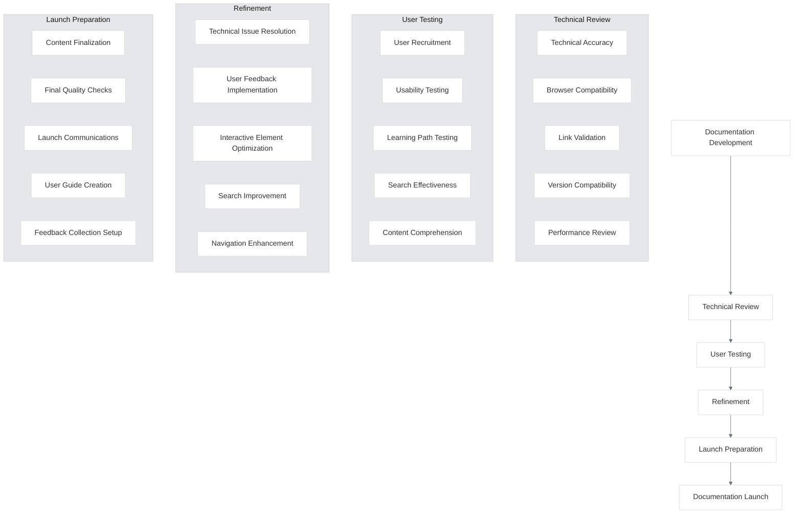

# Quality Assurance and Refinement

<link rel="stylesheet" href="../assets/css/styles.css">
<link rel="stylesheet" href="../assets/css/ume-docs-enhancements.css">

This section covers the comprehensive quality assurance and refinement process for the UME tutorial documentation. It provides guidelines, checklists, and procedures to ensure the documentation meets high standards of technical accuracy, usability, and accessibility.

## Overview

Quality assurance is a critical phase in the documentation lifecycle. It ensures that all content is accurate, complete, and provides a positive user experience. This section outlines the processes and tools used to verify and refine the UME tutorial documentation.

## In This Section

1. [Technical Review](./010-technical-review/000-index.md) - Ensuring technical accuracy and quality
   - [Technical Accuracy Review](./010-technical-review/010-technical-accuracy.md) - Verifying code examples and technical explanations
   - [Browser Compatibility Testing](./010-technical-review/020-browser-compatibility.md) - Testing across different browsers
   - [Link and Reference Validation](./010-technical-review/030-link-validation.md) - Ensuring all links work correctly
   - [Laravel Version Compatibility](./010-technical-review/040-version-compatibility.md) - Checking compatibility with Laravel versions
   - [Performance Review](./010-technical-review/050-performance-review.md) - Evaluating documentation site performance

2. [User Testing](./020-user-testing/000-index.md) - Testing with real users
   - [User Recruitment](./020-user-testing/010-user-recruitment.md) - Finding test users of different experience levels
   - [Usability Testing Procedures](./020-user-testing/020-usability-testing.md) - Conducting effective usability tests
   - [Learning Path Testing](./020-user-testing/030-learning-path-testing.md) - Testing learning paths with target users
   - [Search Effectiveness](./020-user-testing/040-search-effectiveness.md) - Evaluating search functionality
   - [Content Comprehension](./020-user-testing/050-content-comprehension.md) - Assessing understanding of technical content

3. [Refinement](./030-refinement/000-index.md) - Improving documentation based on feedback
   - [Technical Review Issue Resolution](./030-refinement/010-technical-issues.md) - Addressing technical issues
   - [User Feedback Implementation](./030-refinement/020-user-feedback.md) - Implementing changes based on user feedback
   - [Interactive Element Optimization](./030-refinement/030-interactive-optimization.md) - Optimizing interactive elements
   - [Search Relevance Improvement](./030-refinement/040-search-improvement.md) - Improving search functionality
   - [Navigation Enhancement](./030-refinement/050-navigation-enhancement.md) - Enhancing navigation based on user behavior

4. [Launch Preparation](./040-launch-preparation/000-index.md) - Preparing for documentation launch
   - [Content Finalization](./040-launch-preparation/010-content-finalization.md) - Finalizing all content updates
   - [Final Quality Checks](./040-launch-preparation/020-final-checks.md) - Conducting final quality assurance
   - [Launch Communications](./040-launch-preparation/030-launch-communications.md) - Preparing launch communications
   - [User Guide](./040-launch-preparation/040-user-guide.md) - Creating a guide for new features
   - [Feedback Collection](./040-launch-preparation/050-feedback-collection.md) - Setting up feedback mechanisms

## Quality Assurance Process

The UME documentation quality assurance process follows these steps:

## Getting Started

Begin by reviewing the [Technical Review](./010-technical-review/000-index.md) section to understand how to ensure the technical accuracy of the documentation.

## Related Resources

- [Review and QA Process](../210-review-and-qa-process.md) - Detailed review and QA process
- [Documentation Audit Report](../200-documentation-audit-report.md) - Results of the documentation audit
- [Visual Style Guide](../220-visual-style-guide.md) - Guidelines for visual elements
