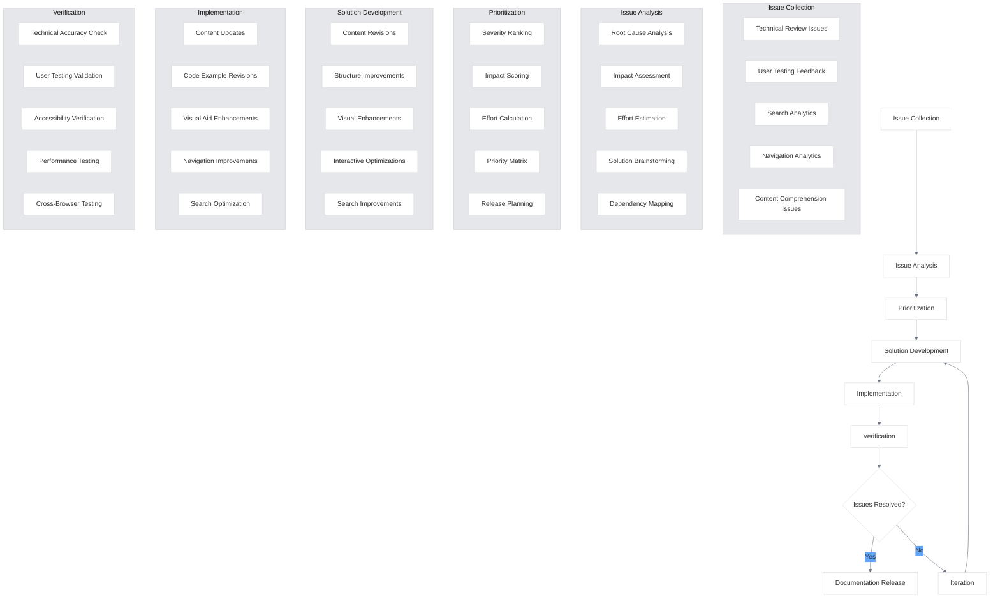

# Refinement

<link rel="stylesheet" href="../../assets/css/styles.css">
<link rel="stylesheet" href="../../assets/css/ume-docs-enhancements.css">
<script src="../../assets/js/ume-docs-enhancements.js"></script>

This section covers the refinement process for the UME tutorial documentation. Refinement involves improving the documentation based on feedback gathered during technical review and user testing.

## Overview

Refinement is a critical phase in the documentation quality assurance process. It focuses on addressing identified issues, implementing user feedback, and optimizing the documentation for maximum effectiveness. This section outlines the processes and tools used to refine the UME tutorial documentation.

## In This Section

1. [Technical Review Issue Resolution](./010-technical-issues.md) - Addressing issues identified in technical review
2. [User Feedback Implementation](./020-user-feedback.md) - Implementing changes based on user feedback
3. [Interactive Element Optimization](./030-interactive-optimization.md) - Optimizing interactive elements
4. [Search Relevance Improvement](./040-search-improvement.md) - Improving search functionality
5. [Navigation Enhancement](./050-navigation-enhancement.md) - Enhancing navigation based on user behavior
6. [Accessibility Features](./060-accessibility-features.md) - Enhancing accessibility for users with disabilities
7. [Mobile Experience](./070-mobile-experience.md) - Optimizing for mobile devices
8. [Cross-Referencing](./080-cross-referencing.md) - Implementing effective cross-references
9. [Visual Elements](./090-visual-elements.md) - Refining visual elements for clarity
10. [Technical Accuracy](./100-technical-accuracy.md) - Updating content for technical accuracy

## Refinement Process

The refinement process follows these steps:

1. **Issue Collection**: Gather all issues identified during technical review and user testing
2. **Issue Analysis**: Analyze issues to understand root causes and potential solutions
3. **Prioritization**: Prioritize issues based on severity, impact, and effort required
4. **Solution Development**: Develop solutions for prioritized issues
5. **Implementation**: Implement solutions in the documentation
6. **Verification**: Verify that solutions effectively address the issues
7. **Iteration**: Repeat the process for remaining issues

## Refinement Principles

The UME documentation refinement process is guided by these principles:

### User-Centered Refinement
- Prioritize changes that address user needs and pain points
- Focus on improving the user experience
- Consider different user personas and experience levels
- Validate changes with user testing when possible

### Evidence-Based Decisions
- Base refinement decisions on concrete evidence
- Use data from technical review and user testing
- Avoid making changes based solely on personal preferences
- Track the impact of refinements

### Incremental Improvement
- Make small, focused changes rather than massive rewrites
- Test and validate each change
- Build on what works well
- Continuously refine rather than waiting for perfect solutions

### Consistency Maintenance
- Ensure refinements maintain documentation consistency
- Apply changes systematically across similar content
- Update related content when making changes
- Preserve the established documentation style and tone

### Accessibility Enhancement
- Ensure refinements improve or maintain accessibility
- Consider diverse user needs and abilities
- Test accessibility of refined content
- Prioritize inclusive design principles

## Refinement Workflow

The UME documentation refinement workflow consists of the following steps:



## Issue Tracking

The UME documentation uses a structured approach to track refinement issues:

### Issue Categories
- **Technical Accuracy**: Issues related to technical correctness
- **Content Clarity**: Issues related to explanation clarity
- **Navigation**: Issues related to finding information
- **Search**: Issues related to search functionality
- **Interactive Elements**: Issues related to interactive features
- **Accessibility**: Issues related to accessibility
- **Performance**: Issues related to documentation performance
- **Visual Design**: Issues related to visual elements

### Issue Severity Levels
- **Critical**: Prevents users from accomplishing core tasks
- **High**: Significantly impedes user progress or understanding
- **Medium**: Causes user frustration or minor confusion
- **Low**: Minor issues that don't significantly impact usability

### Issue Status Tracking
- **Identified**: Issue has been identified and documented
- **Analyzed**: Root cause has been determined
- **Prioritized**: Issue has been prioritized for resolution
- **In Progress**: Solution is being implemented
- **Verified**: Solution has been implemented and verified
- **Closed**: Issue has been resolved and verified

## Issue Resolution Template

Use this template to document issue resolution:

```markdown
# Issue Resolution: [Issue Title]

## Issue Details
- **Category**: [Technical Accuracy/Content Clarity/Navigation/etc.]
- **Severity**: [Critical/High/Medium/Low]
- **Identified By**: [Technical Review/User Testing/etc.]
- **Identification Date**: [Date]

## Issue Description
[Detailed description of the issue]

## Impact
[Description of how the issue impacts users]

## Root Cause
[Analysis of what caused the issue]

## Solution
[Description of the implemented solution]

## Implementation Details
- **Files Modified**:
  - [File path 1]
  - [File path 2]
- **Changes Made**:
  - [Description of change 1]
  - [Description of change 2]
- **Implementation Date**: [Date]

## Verification
- **Verification Method**: [Technical Review/User Testing/etc.]
- **Verification Date**: [Date]
- **Verification Result**: [Passed/Failed]
- **Verification Notes**: [Notes on verification]

## Related Issues
- [Link to related issue 1]
- [Link to related issue 2]
```

## Getting Started

Begin by reviewing the [Technical Review Issue Resolution](./010-technical-issues.md) section to understand how to address issues identified during technical review.
