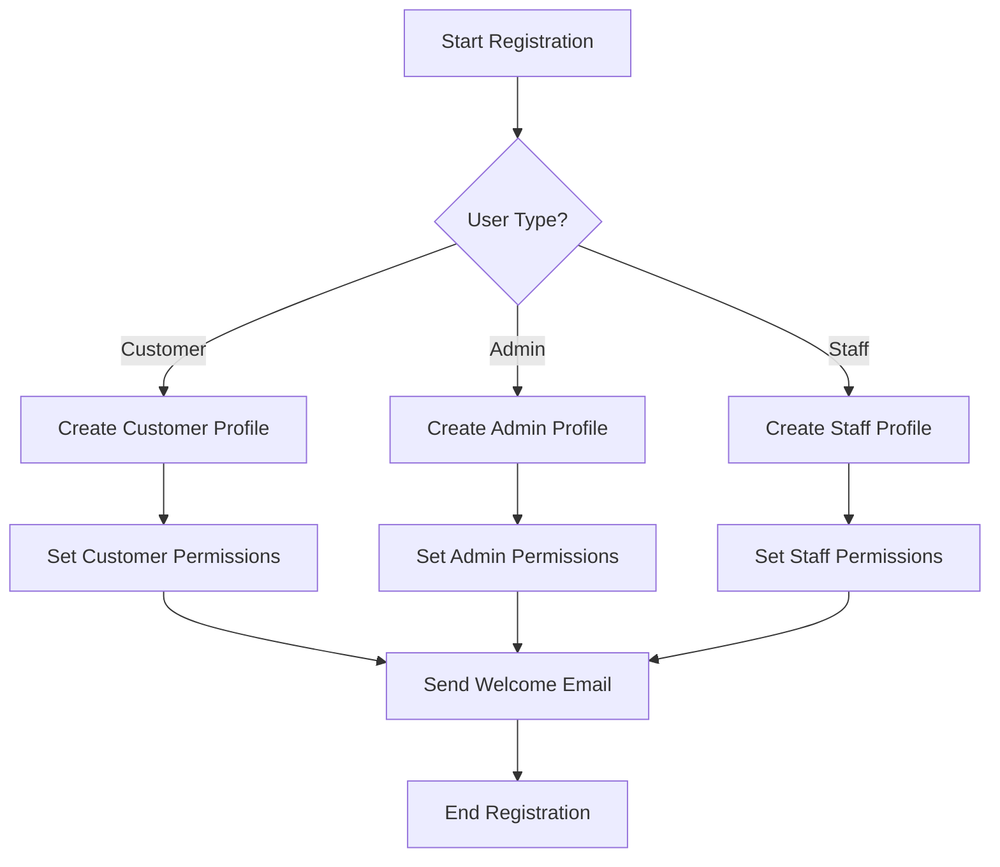
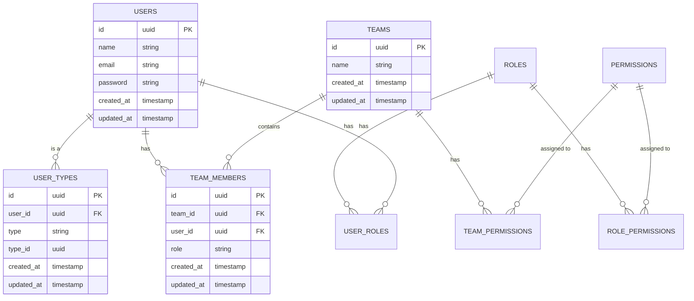
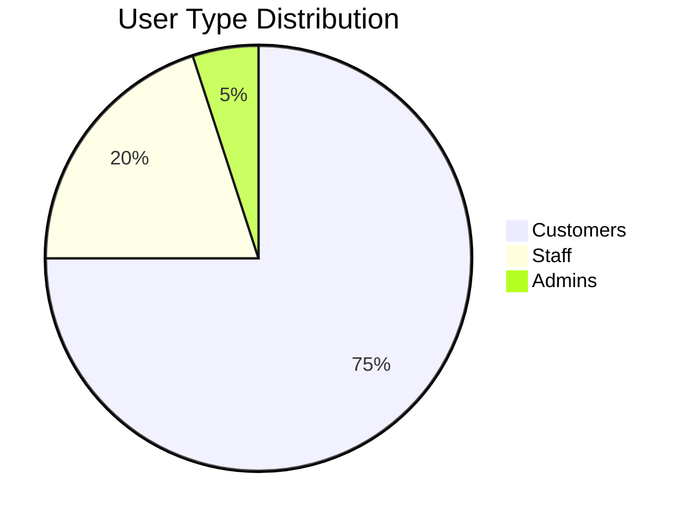

# Visual Elements

<link rel="stylesheet" href="../../assets/css/styles.css">
<link rel="stylesheet" href="../../assets/css/ume-docs-enhancements.css">
<script src="../../assets/js/ume-docs-enhancements.js"></script>

This document outlines the process for refining visual elements in the UME tutorial documentation. It provides a structured approach to enhancing diagrams, illustrations, code formatting, and other visual components to improve clarity and understanding.

## Overview

Visual elements play a crucial role in technical documentation, helping users understand complex concepts, relationships, and processes. Effective visual elements can significantly enhance comprehension, reduce learning time, and improve the overall user experience. This document focuses on refining visual elements to maximize their clarity and effectiveness.

## Types of Visual Elements

The UME tutorial documentation includes several types of visual elements:

### Diagrams
- Architecture diagrams
- Flow charts
- Entity relationship diagrams
- State machine diagrams
- Sequence diagrams
- Class diagrams
- Component diagrams
- Concept maps
- Decision trees

### Illustrations
- Process illustrations
- Concept illustrations
- Comparison illustrations
- Step-by-step illustrations
- Interface mockups
- Implementation examples
- Visual metaphors
- Infographics
- Icons and symbols

### Code Formatting
- Syntax highlighting
- Code indentation
- Line numbering
- Code annotations
- Code block styling
- Inline code formatting
- Code diff highlighting
- Error and warning highlighting
- Output formatting

### UI Elements
- Screenshots
- Annotated interfaces
- Interactive UI examples
- Form examples
- Navigation examples
- Modal dialog examples
- Notification examples
- Dashboard examples
- Mobile interface examples

### Data Visualizations
- Tables
- Charts and graphs
- Data flow diagrams
- Metrics visualizations
- Performance graphs
- Comparison matrices
- Heatmaps
- Timeline visualizations
- Hierarchical data visualizations

## Visual Element Refinement Process

The visual element refinement process consists of the following steps:

### 1. Visual Audit

Before beginning refinement:

- Inventory existing visual elements
- Assess visual consistency across documentation
- Identify visual elements that need improvement
- Evaluate visual accessibility
- Gather user feedback on visual elements
- Prioritize visual elements for refinement

### 2. Refinement Planning

For each visual element:

1. **Define objectives**: Determine what needs to be improved
2. **Research best practices**: Identify effective approaches for the specific element type
3. **Consider technical constraints**: Evaluate what's feasible within the documentation platform
4. **Create refinement plan**: Define specific changes needed
5. **Document the plan**: Record the planned refinement

### 3. Implementation

Execute the refinement plan:

1. **Create or update visual elements**: Implement the planned changes
2. **Ensure consistency**: Maintain visual language across similar elements
3. **Optimize for accessibility**: Ensure elements are accessible to all users
4. **Add appropriate context**: Provide explanatory text and captions
5. **Implement responsive behavior**: Ensure elements work across devices

### 4. Testing and Verification

After implementation:

1. **Visual review**: Assess the visual clarity and effectiveness
2. **Accessibility testing**: Verify accessibility for users with disabilities
3. **Device testing**: Test on different screen sizes and devices
4. **User testing**: When possible, test with actual users
5. **Technical accuracy review**: Verify that visual elements accurately represent technical concepts

### 5. Documentation and Integration

Document and integrate the refined visual elements:

1. **Update documentation**: Integrate refined elements into documentation
2. **Create usage guidelines**: Document how to use and maintain visual elements
3. **Provide source files**: Make source files available for future updates
4. **Train content creators**: Educate team on visual element standards
5. **Establish review process**: Set up process for reviewing future visual elements

## Implementation Strategies

### Diagram Refinement

#### Architecture Diagrams
- Use consistent visual language
- Implement clear hierarchy and grouping
- Add appropriate labels and annotations
- Use color to highlight important elements
- Ensure diagrams are readable at different sizes

Implementation example:
```markdown
## UME Architecture

The following diagram illustrates the high-level architecture of the UME system:


*Figure 1: UME Architecture showing the relationship between core components*

Key components:
1. **User Model**: Central user entity with polymorphic relationships
2. **Type System**: Manages different user types and their relationships
3. **Permission System**: Handles authorization and access control
4. **Team Management**: Manages team membership and permissions
5. **Authentication**: Integrates with Laravel's authentication system
```

#### Flow Charts
- Use standard flowchart symbols
- Implement logical flow direction
- Add clear decision points
- Use consistent connector styles
- Ensure adequate spacing between elements

Implementation example:
```markdown
## User Registration Process

The following flowchart illustrates the user registration process:



*Figure 2: User registration process flowchart showing type-specific paths*
```

#### Entity Relationship Diagrams
- Use standard ER notation
- Show cardinality clearly
- Group related entities
- Use consistent entity styling
- Add field details for important entities

Implementation example:
```markdown
## User and Team Data Model

The following ER diagram shows the relationship between users and teams:



*Figure 3: Entity relationship diagram showing user and team data model*
```

### Illustration Refinement

#### Process Illustrations
- Use clear step sequence
- Add numbering or arrows to show flow
- Use consistent visual style
- Highlight key actions or decision points
- Include brief explanatory text

Implementation example:
```markdown
## Team Invitation Process

The following illustration shows the team invitation process:


*Figure 4: Team invitation process showing the flow from invitation to acceptance*

The process consists of four main steps:
1. **Invitation Creation**: Team admin creates and sends invitation
2. **Email Delivery**: System delivers invitation via email
3. **User Acceptance**: Recipient accepts the invitation
4. **Team Membership**: System adds user to the team
```

#### Concept Illustrations
- Focus on core concept elements
- Use visual metaphors when appropriate
- Simplify complex ideas
- Use annotations to explain components
- Ensure visual hierarchy matches concept importance

Implementation example:
```markdown
## Permission Inheritance Concept

The following illustration explains the concept of permission inheritance:


*Figure 5: Permission inheritance showing how permissions flow from roles to users*

This illustration demonstrates:
- Base permissions assigned to all users
- Role-specific permissions that extend base permissions
- Team-specific permissions that can override role permissions
- The effective permission set that results from combining all sources
```

### Code Formatting Refinement

#### Syntax Highlighting
- Use consistent color scheme
- Ensure sufficient contrast
- Highlight important code elements
- Support dark and light modes
- Maintain readability at different sizes

Implementation example:
```markdown
## User Type Registration

The following code shows how to register a new user type:

```php
use App\Models\User;
use App\Types\CustomerType;

// Create a new user
$user = User::create([
    'name' => 'John Doe',
    'email' => 'john@example.com',
    'password' => bcrypt('password')
]);

// Register as a customer type
$customerType = CustomerType::create([
    'user_id' => $user->id,
    'company' => 'ACME Corp',
    'industry' => 'Technology'
]);

// Associate the type with the user
$user->assignType($customerType);
```

*Example 1: Registering a new user with the customer type*
```

#### Code Annotations
- Use consistent annotation style
- Place annotations at relevant points
- Keep annotations concise
- Use visual distinction for annotations
- Ensure annotations don't obscure code

Implementation example:
```markdown
## Permission Check Implementation

```php
public function hasPermission(string $permission): bool
{
    // Check direct user permissions first
    if ($this->permissions->contains('name', $permission)) {
        return true; // User has direct permission
    }
    
    // Check role-based permissions
    foreach ($this->roles as $role) {
        if ($role->hasPermission($permission)) {
            return true; // User has permission via role
        }
    }
    
    // Check team-based permissions
    foreach ($this->teams as $team) {
        if ($team->hasPermission($permission) && 
            $this->hasTeamPermission($team, $permission)) {
            return true; // User has permission via team
        }
    }
    
    return false; // No permission found
}
```

*Example 2: Permission check implementation with annotations explaining the logic*
```

### UI Element Refinement

#### Annotated Screenshots
- Use clear, high-quality screenshots
- Add numbered annotations
- Highlight important UI elements
- Use consistent annotation style
- Include brief explanatory text

Implementation example:
```markdown
## Team Management Interface

The following screenshot shows the team management interface:


*Figure 6: Team management interface with key features highlighted*

Key interface elements:
1. **Team Selector**: Switch between different teams
2. **Member List**: View and manage team members
3. **Role Assignment**: Assign roles to team members
4. **Invitation Controls**: Send invitations to new members
5. **Permission Settings**: Configure team permissions
```

#### Interface Examples
- Show realistic UI examples
- Include common use cases
- Demonstrate proper UI interaction
- Use consistent styling
- Provide code examples when appropriate

Implementation example:
```markdown
## Team Creation Form

The following example shows a team creation form:

```html
<form action="/teams" method="POST">
    @csrf
    <div class="form-group">
        <label for="team-name">Team Name</label>
        <input type="text" id="team-name" name="name" class="form-control" required>
    </div>
    
    <div class="form-group">
        <label for="team-description">Description</label>
        <textarea id="team-description" name="description" class="form-control"></textarea>
    </div>
    
    <div class="form-group">
        <label>Initial Members</label>
        <select name="members[]" class="form-control" multiple>
            @foreach($users as $user)
                <option value="{{ $user->id }}">{{ $user->name }}</option>
            @endforeach
        </select>
    </div>
    
    <button type="submit" class="btn btn-primary">Create Team</button>
</form>
```


*Example 3: Team creation form with fields for name, description, and initial members*
```

### Data Visualization Refinement

#### Tables
- Use clear column headers
- Implement consistent alignment
- Add appropriate spacing
- Use zebra striping for readability
- Highlight important data

Implementation example:
```markdown
## Permission Comparison

The following table compares permissions across different user types:

| Permission | Admin | Staff | Customer |
|------------|:-----:|:-----:|:--------:|
| View Dashboard | ✓ | ✓ | ✗ |
| Manage Users | ✓ | ✓ | ✗ |
| Create Teams | ✓ | ✓ | ✗ |
| Manage Team Members | ✓ | ✓ | ✓* |
| View Reports | ✓ | ✓ | ✗ |
| Edit Settings | ✓ | ✗ | ✗ |
| API Access | ✓ | ✓ | ✓ |
| Billing Management | ✓ | ✗ | ✓ |

*\* Customers can only manage members of teams they own*

*Table 1: Permission comparison across user types*
```

#### Charts and Graphs
- Use appropriate chart types for data
- Implement clear labels and legends
- Use consistent color scheme
- Ensure adequate contrast
- Add explanatory captions

Implementation example:
```markdown
## User Type Distribution

The following chart shows the distribution of user types in a typical application:



*Figure 7: Typical distribution of user types in a UME application*

This distribution reflects:
- A majority of customer users (75%)
- A moderate number of staff users (20%)
- A small number of admin users (5%)
```

## Visual Element Implementation Template

Use this template to document visual element implementations:

```markdown
# Visual Element Implementation: [Element Name]

## Element Details
- **Element Type**: [Diagram/Illustration/Code Formatting/UI Element/Data Visualization]
- **Purpose**: [What the element is intended to communicate]
- **Target Audience**: [Who the element is designed for]
- **Affected Content**: [File paths or section references]

## Implementation Description
[Detailed description of the visual element implementation]

## Design Considerations
[Description of key design decisions and rationale]

## Implementation Details
- **Files Created/Modified**:
  - [File path 1]
  - [File path 2]
- **Tools Used**:
  - [Tool 1]
  - [Tool 2]
- **Implementation Date**: [Date]
- **Implemented By**: [Name or role]

## Accessibility Features
[Description of how accessibility was addressed]

## Testing and Verification
- **Testing Method**: [How the element was tested]
- **Verification Results**: [Results of testing]
- **User Feedback**: [Any user feedback on the element]

## Maintenance Plan
[Plan for maintaining this visual element]

## Related Elements
- [Link to related element 1]
- [Link to related element 2]
```

## Example Visual Element Implementation

```markdown
# Visual Element Implementation: Permission Hierarchy Diagram

## Element Details
- **Element Type**: Diagram
- **Purpose**: Illustrate the hierarchical relationship between different permission types
- **Target Audience**: Developers implementing permission systems
- **Affected Content**: docs/100-user-model-enhancements/031-ume-tutorial/080-teams-and-permissions/050-permission-hierarchy.md

## Implementation Description
Created a hierarchical diagram showing how permissions flow from different sources (roles, teams, direct assignments) and how they combine to form the effective permission set for a user. The diagram uses a tree structure with color coding to distinguish different permission sources and includes annotations explaining key concepts.

## Design Considerations
- Used a top-down tree structure to clearly show inheritance relationships
- Implemented color coding to distinguish permission sources (blue for roles, green for teams, purple for direct)
- Added numbered annotations to explain the permission resolution process
- Included examples of permission conflicts and their resolution
- Designed for clarity at different zoom levels and in both light and dark modes

## Implementation Details
- **Files Created/Modified**:
  - docs/100-user-model-enhancements/031-ume-tutorial/assets/images/permission-hierarchy.svg
  - docs/100-user-model-enhancements/031-ume-tutorial/080-teams-and-permissions/050-permission-hierarchy.md
- **Tools Used**:
  - Figma for initial design
  - SVG optimization with SVGO
  - Accessibility testing with axe DevTools
- **Implementation Date**: May 15, 2024
- **Implemented By**: Jane Doe (Documentation Engineer)

## Accessibility Features
- Added ARIA labels to all diagram elements
- Included detailed alt text describing the hierarchy
- Ensured sufficient color contrast (4.5:1 minimum)
- Provided text-based alternative explanation
- Tested with screen readers (NVDA and VoiceOver)

## Testing and Verification
- **Testing Method**: 
  - Visual review by documentation team
  - Technical accuracy review by permission system developers
  - Accessibility testing with screen readers
  - User testing with 3 developers
- **Verification Results**: Diagram accurately represents permission hierarchy and is accessible
- **User Feedback**: Users found the diagram helpful for understanding permission inheritance and conflict resolution

## Maintenance Plan
- Update diagram when permission system changes
- Review annually for accuracy and clarity
- Track usage via documentation analytics
- Collect ongoing user feedback

## Related Elements
- Permission Conflict Resolution Flowchart
- Team Permission Implementation Code Example
- Permission Comparison Table
```

## Best Practices for Visual Element Refinement

### General Best Practices
- **Maintain consistency**: Use consistent visual language
- **Focus on clarity**: Prioritize clear communication over aesthetics
- **Consider accessibility**: Ensure elements are accessible to all users
- **Provide context**: Include explanatory text and captions
- **Use appropriate detail**: Include enough detail to be useful without overwhelming
- **Test with users**: Validate visual elements with actual users
- **Optimize for all devices**: Ensure elements work on different screen sizes
- **Support dark mode**: Design for both light and dark color schemes
- **Provide alternatives**: Include text alternatives for visual information
- **Update regularly**: Keep visual elements current with technical changes

### Diagram Best Practices
- **Use standard notation**: Follow established diagramming conventions
- **Limit complexity**: Break complex diagrams into simpler components
- **Show hierarchy**: Make relationships and importance clear
- **Use consistent symbols**: Maintain consistent visual language
- **Add clear labels**: Label all important elements
- **Consider flow**: Arrange elements to show logical progression
- **Group related elements**: Use visual grouping for related items
- **Use color purposefully**: Apply color to highlight or categorize
- **Provide legends**: Include legends for symbol meanings
- **Consider printability**: Ensure diagrams work in black and white

### Code Formatting Best Practices
- **Use consistent highlighting**: Apply consistent syntax highlighting
- **Ensure readability**: Maintain code readability at different sizes
- **Show context**: Include enough code for understanding
- **Highlight important parts**: Draw attention to key code elements
- **Use appropriate indentation**: Follow language-specific conventions
- **Add line numbers**: Include line numbers for reference
- **Provide annotations**: Add explanatory annotations where helpful
- **Show real examples**: Use realistic, working code examples
- **Include output**: Show expected output when relevant
- **Format for readability**: Break long lines appropriately

### UI Element Best Practices
- **Use high-quality images**: Ensure screenshots are clear and crisp
- **Highlight key features**: Draw attention to important UI elements
- **Show realistic examples**: Use realistic data and scenarios
- **Provide context**: Show enough of the interface for orientation
- **Add annotations**: Label important UI components
- **Show interactions**: Illustrate how users interact with the interface
- **Consider different states**: Show various UI states (empty, loading, error)
- **Maintain privacy**: Avoid showing sensitive information
- **Update regularly**: Keep screenshots current with UI changes
- **Show responsive behavior**: Illustrate how UI adapts to different devices

### Data Visualization Best Practices
- **Choose appropriate formats**: Select the right visualization for the data
- **Simplify**: Avoid chart junk and unnecessary elements
- **Label clearly**: Include clear labels and titles
- **Use consistent scales**: Maintain consistent measurement scales
- **Provide context**: Include explanatory text
- **Ensure accuracy**: Verify data accuracy and representation
- **Consider color meaning**: Use color consistently and meaningfully
- **Support comparisons**: Make data comparisons easy
- **Show trends**: Highlight important trends or patterns
- **Include sources**: Cite data sources when appropriate

## Conclusion

Refining visual elements is essential to enhance the clarity and effectiveness of the UME tutorial documentation. By following the process outlined in this document and using the provided templates, you can systematically improve diagrams, illustrations, code formatting, UI elements, and data visualizations to better communicate complex concepts and improve the overall user experience.

## Next Steps

After refining visual elements, proceed to [Technical Accuracy](./100-technical-accuracy.md) to learn how to update content for technical accuracy.
