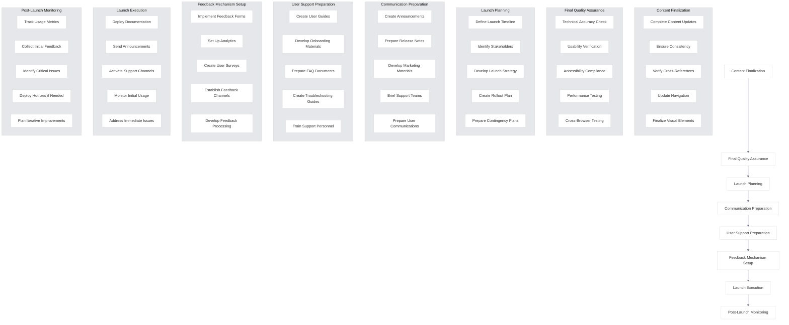

# Launch Preparation

<link rel="stylesheet" href="../../assets/css/styles.css">
<link rel="stylesheet" href="../../assets/css/ume-docs-enhancements.css">
<script src="../../assets/js/ume-docs-enhancements.js"></script>

This section covers the launch preparation process for the UME tutorial documentation. Launch preparation involves finalizing all content, conducting final quality checks, preparing communications, and setting up feedback mechanisms before releasing the documentation to users.

## Overview

Launch preparation is the final phase in the documentation quality assurance process. It focuses on ensuring that the documentation is fully ready for release, with all content finalized, quality verified, and launch logistics prepared. This section outlines the processes and tools used to prepare the UME tutorial documentation for launch.

## In This Section

1. [Content Finalization](./010-content-finalization.md) - Finalizing all content updates
2. [Final Quality Checks](./020-final-checks.md) - Conducting final quality assurance
3. [Launch Communications](./030-launch-communications.md) - Preparing launch communications
4. [User Guide](./040-user-guide.md) - Creating a guide for new features
5. [Feedback Collection](./050-feedback-collection.md) - Setting up feedback mechanisms

## Launch Preparation Process

The launch preparation process follows these steps:

1. **Content Finalization**: Complete all content updates and ensure consistency
2. **Final Quality Assurance**: Conduct comprehensive quality checks
3. **Launch Planning**: Develop a detailed launch plan and timeline
4. **Communication Preparation**: Create launch communications and announcements
5. **User Support Preparation**: Develop user guides and support materials
6. **Feedback Mechanism Setup**: Implement systems for collecting user feedback
7. **Launch Execution**: Release the documentation according to the launch plan

## Launch Preparation Workflow

The UME documentation launch preparation workflow consists of the following steps:



## Launch Readiness Checklist

Use this checklist to ensure the documentation is ready for launch:

### Content Readiness
- [ ] All planned content is complete
- [ ] Content has been reviewed for technical accuracy
- [ ] Content has been reviewed for clarity and completeness
- [ ] All code examples have been tested
- [ ] All visual elements are finalized
- [ ] All cross-references are correct
- [ ] Navigation structure is complete and logical
- [ ] Search functionality is working correctly
- [ ] All placeholder content has been replaced
- [ ] Version information is accurate and up-to-date

### Quality Assurance
- [ ] Technical accuracy has been verified
- [ ] Usability testing has been completed
- [ ] Accessibility compliance has been verified
- [ ] Performance testing has been conducted
- [ ] Cross-browser testing has been completed
- [ ] Mobile responsiveness has been verified
- [ ] Link validation has been performed
- [ ] Spell check and grammar check have been completed
- [ ] Style guide compliance has been verified
- [ ] Security review has been conducted

### Launch Logistics
- [ ] Launch timeline has been established
- [ ] Stakeholders have been identified and informed
- [ ] Launch strategy has been developed
- [ ] Rollout plan has been created
- [ ] Contingency plans have been prepared
- [ ] Required resources have been allocated
- [ ] Launch responsibilities have been assigned
- [ ] Launch approval has been obtained
- [ ] Launch metrics have been defined
- [ ] Post-launch monitoring plan is in place

### Communication Readiness
- [ ] Announcements have been created
- [ ] Release notes have been prepared
- [ ] Marketing materials have been developed
- [ ] Support teams have been briefed
- [ ] User communications have been prepared
- [ ] Communication channels have been identified
- [ ] Communication timeline has been established
- [ ] Key messages have been defined
- [ ] Target audiences have been identified
- [ ] Communication responsibilities have been assigned

### User Support Readiness
- [ ] User guides have been created
- [ ] Onboarding materials have been developed
- [ ] FAQ documents have been prepared
- [ ] Troubleshooting guides have been created
- [ ] Support personnel have been trained
- [ ] Support channels have been established
- [ ] Support hours have been defined
- [ ] Escalation procedures have been established
- [ ] Known issues have been documented
- [ ] User support metrics have been defined

### Feedback Readiness
- [ ] Feedback forms have been implemented
- [ ] Analytics have been set up
- [ ] User surveys have been created
- [ ] Feedback channels have been established
- [ ] Feedback processing procedures have been developed
- [ ] Feedback categorization system has been defined
- [ ] Feedback prioritization criteria have been established
- [ ] Feedback response procedures have been defined
- [ ] Feedback tracking system is in place
- [ ] Feedback reporting mechanisms have been established

## Launch Plan Template

Use this template to create a launch plan:

```markdown
# UME Tutorial Documentation Launch Plan

## Launch Overview
- **Launch Date**: [Date]
- **Launch Type**: [Soft Launch/Full Launch/Phased Launch]
- **Target Audience**: [Description of target audience]
- **Launch Goals**: [Goals for the launch]
- **Success Metrics**: [How success will be measured]

## Launch Timeline

### Pre-Launch Phase
- **[Date]**: [Activity]
- **[Date]**: [Activity]
- **[Date]**: [Activity]

### Launch Day
- **[Time]**: [Activity]
- **[Time]**: [Activity]
- **[Time]**: [Activity]

### Post-Launch Phase
- **[Date]**: [Activity]
- **[Date]**: [Activity]
- **[Date]**: [Activity]

## Stakeholders and Responsibilities

### Launch Team
- **[Name/Role]**: [Responsibilities]
- **[Name/Role]**: [Responsibilities]
- **[Name/Role]**: [Responsibilities]

### Approvers
- **[Name/Role]**: [Approval Area]
- **[Name/Role]**: [Approval Area]
- **[Name/Role]**: [Approval Area]

### Support Team
- **[Name/Role]**: [Support Area]
- **[Name/Role]**: [Support Area]
- **[Name/Role]**: [Support Area]

## Communication Plan

### Announcement Channels
- **[Channel]**: [Audience, Timing, Responsible Person]
- **[Channel]**: [Audience, Timing, Responsible Person]
- **[Channel]**: [Audience, Timing, Responsible Person]

### Key Messages
- **[Message 1]**: [Target Audience, Channel]
- **[Message 2]**: [Target Audience, Channel]
- **[Message 3]**: [Target Audience, Channel]

### Communication Materials
- **[Material 1]**: [Purpose, Responsible Person, Status]
- **[Material 2]**: [Purpose, Responsible Person, Status]
- **[Material 3]**: [Purpose, Responsible Person, Status]

## User Support Plan

### Support Channels
- **[Channel]**: [Hours, Responsible Team, Escalation Path]
- **[Channel]**: [Hours, Responsible Team, Escalation Path]
- **[Channel]**: [Hours, Responsible Team, Escalation Path]

### Support Materials
- **[Material 1]**: [Purpose, Location, Status]
- **[Material 2]**: [Purpose, Location, Status]
- **[Material 3]**: [Purpose, Location, Status]

### Known Issues
- **[Issue 1]**: [Impact, Workaround, Resolution Timeline]
- **[Issue 2]**: [Impact, Workaround, Resolution Timeline]
- **[Issue 3]**: [Impact, Workaround, Resolution Timeline]

## Feedback Collection Plan

### Feedback Channels
- **[Channel]**: [Purpose, Data Collection Method, Processing Approach]
- **[Channel]**: [Purpose, Data Collection Method, Processing Approach]
- **[Channel]**: [Purpose, Data Collection Method, Processing Approach]

### Feedback Processing
- **[Process Step 1]**: [Responsible Person, Timeline]
- **[Process Step 2]**: [Responsible Person, Timeline]
- **[Process Step 3]**: [Responsible Person, Timeline]

## Risk Assessment and Contingency Plans

### Identified Risks
- **[Risk 1]**: [Probability, Impact, Mitigation Strategy]
- **[Risk 2]**: [Probability, Impact, Mitigation Strategy]
- **[Risk 3]**: [Probability, Impact, Mitigation Strategy]

### Contingency Plans
- **[Scenario 1]**: [Trigger, Response Plan, Responsible Person]
- **[Scenario 2]**: [Trigger, Response Plan, Responsible Person]
- **[Scenario 3]**: [Trigger, Response Plan, Responsible Person]

## Post-Launch Evaluation

### Success Metrics Evaluation
- **[Metric 1]**: [Measurement Method, Target, Evaluation Timeline]
- **[Metric 2]**: [Measurement Method, Target, Evaluation Timeline]
- **[Metric 3]**: [Measurement Method, Target, Evaluation Timeline]

### Post-Launch Review
- **Review Date**: [Date]
- **Review Participants**: [List of participants]
- **Review Agenda**: [Agenda items]
- **Follow-up Actions**: [Action items]
```

## Getting Started

Begin by reviewing the [Content Finalization](./010-content-finalization.md) section to understand how to finalize all content updates before launch.
