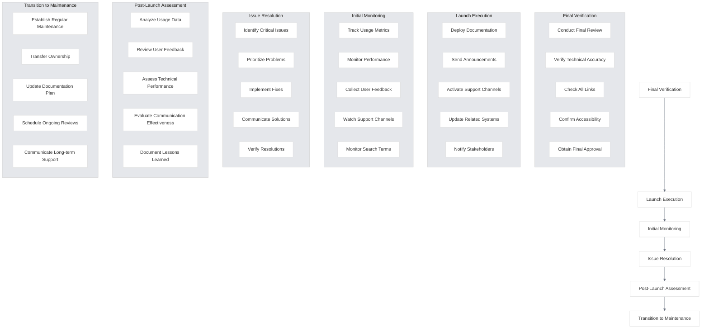

# Launch

<link rel="stylesheet" href="../../assets/css/styles.css">
<link rel="stylesheet" href="../../assets/css/ume-docs-enhancements.css">

This section covers the launch process for the UME tutorial documentation. It provides guidance on executing a successful documentation release, monitoring initial performance, and addressing any issues that arise.

## Overview

The launch phase is when the documentation is officially released to users. It involves executing the launch plan, monitoring initial usage and feedback, and making any necessary adjustments to ensure a positive user experience from day one. This section outlines the processes and best practices for a successful documentation launch.

## In This Section

1. [Launch Execution](./010-launch-execution.md) - Executing the launch plan
2. [Initial Monitoring](./020-initial-monitoring.md) - Monitoring initial usage and performance
3. [Issue Resolution](./030-issue-resolution.md) - Addressing issues that arise after launch
4. [Post-Launch Assessment](./040-post-launch-assessment.md) - Evaluating launch success
5. [Transition to Maintenance](./050-maintenance-transition.md) - Moving to ongoing maintenance

## Launch Process

The documentation launch process follows these steps:

1. **Final Verification**: Confirm documentation is ready for release
2. **Launch Execution**: Deploy documentation and execute communications
3. **Initial Monitoring**: Track initial usage and gather feedback
4. **Issue Resolution**: Address any issues that arise
5. **Post-Launch Assessment**: Evaluate launch success
6. **Transition to Maintenance**: Shift to ongoing maintenance mode

## Launch Workflow

The UME documentation launch workflow consists of the following steps:

## Launch Readiness Checklist

Use this checklist to ensure the documentation is ready for launch:

### Final Content Verification
- [ ] All planned content is complete and reviewed
- [ ] Content has been verified for technical accuracy
- [ ] All code examples have been tested
- [ ] All visual elements are finalized
- [ ] All cross-references are correct
- [ ] Navigation structure is complete and logical
- [ ] Search functionality is working correctly
- [ ] All placeholder content has been replaced
- [ ] Version information is accurate and up-to-date
- [ ] Content has been reviewed for clarity and completeness

### Technical Readiness
- [ ] Documentation platform is stable
- [ ] Performance has been tested and optimized
- [ ] All links have been validated
- [ ] Accessibility compliance has been verified
- [ ] Cross-browser compatibility has been confirmed
- [ ] Mobile responsiveness has been verified
- [ ] Analytics tracking is implemented
- [ ] Feedback mechanisms are in place
- [ ] Backup systems are in place
- [ ] Security review has been completed

### Launch Logistics
- [ ] Launch timeline has been finalized
- [ ] Launch team responsibilities have been assigned
- [ ] Communication materials are ready
- [ ] Support channels are prepared
- [ ] Stakeholders have been briefed
- [ ] Monitoring systems are in place
- [ ] Issue tracking system is ready
- [ ] Rollback plan has been prepared
- [ ] Launch approval has been obtained
- [ ] Post-launch review has been scheduled

## Launch Day Checklist

Use this checklist on the day of launch:

### Pre-Launch Tasks
- [ ] Conduct final review of documentation
- [ ] Verify all systems are operational
- [ ] Brief launch team on responsibilities
- [ ] Prepare support team for potential questions
- [ ] Set up monitoring dashboards
- [ ] Test backup and rollback procedures
- [ ] Verify communication materials
- [ ] Check analytics tracking
- [ ] Confirm stakeholder availability
- [ ] Review contingency plans

### Launch Tasks
- [ ] Deploy documentation to production
- [ ] Verify deployment success
- [ ] Activate new navigation and links
- [ ] Send announcement communications
- [ ] Update related systems and references
- [ ] Notify internal teams
- [ ] Activate support channels
- [ ] Begin monitoring
- [ ] Document launch time and status
- [ ] Notify stakeholders of successful launch

### Immediate Post-Launch Tasks
- [ ] Verify documentation is accessible
- [ ] Check for any immediate issues
- [ ] Monitor initial usage
- [ ] Respond to initial feedback
- [ ] Address any critical problems
- [ ] Send confirmation to stakeholders
- [ ] Document any issues encountered
- [ ] Begin collecting usage data
- [ ] Monitor support channels
- [ ] Prepare for first status update

## Getting Started

Begin by reviewing the [Launch Execution](./010-launch-execution.md) section to understand how to execute the documentation launch plan.
