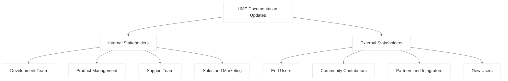

# UME Documentation Communication Plan

<link rel="stylesheet" href="./assets/css/styles.css">
<link rel="stylesheet" href="./assets/css/ume-docs-enhancements.css">
<script src="./assets/js/ume-docs-enhancements.js"></script>

## Overview

This communication plan outlines the strategy for communicating updates, changes, and improvements to the UME tutorial documentation. The plan ensures that all stakeholders are informed about documentation changes in a timely and effective manner.

## Stakeholder Analysis

The following stakeholders have an interest in UME documentation updates:



<div class="mermaid-caption">Figure 1: UME Documentation Stakeholders</div>

### Internal Stakeholders

#### Development Team
- **Interest**: Technical accuracy, completeness, code examples
- **Communication Needs**: Detailed technical updates, changes to code examples, new features
- **Preferred Channels**: GitHub, Slack, team meetings

#### Product Management
- **Interest**: Feature coverage, user experience, alignment with product strategy
- **Communication Needs**: New documentation sections, major updates, user feedback
- **Preferred Channels**: Email, product meetings, dashboards

#### Support Team
- **Interest**: Troubleshooting guides, common issues, user questions
- **Communication Needs**: New troubleshooting content, updates to common issues
- **Preferred Channels**: Email, support system, knowledge base

#### Sales and Marketing
- **Interest**: Feature highlights, benefits, case studies
- **Communication Needs**: New features, success stories, competitive advantages
- **Preferred Channels**: Email, marketing meetings, sales enablement platform

### External Stakeholders

#### End Users
- **Interest**: How-to guides, tutorials, troubleshooting
- **Communication Needs**: New features, improvements, breaking changes
- **Preferred Channels**: Documentation site, release notes, blog posts, social media

#### Community Contributors
- **Interest**: Documentation structure, contribution guidelines, feedback
- **Communication Needs**: Documentation improvements, contribution opportunities
- **Preferred Channels**: GitHub, community forums, contributor newsletter

#### Partners and Integrators
- **Interest**: Integration guides, API documentation, best practices
- **Communication Needs**: API changes, new integration options, deprecations
- **Preferred Channels**: Partner portal, email, webinars

#### New Users
- **Interest**: Getting started guides, basic concepts, examples
- **Communication Needs**: Learning resources, onboarding materials
- **Preferred Channels**: Documentation site, welcome emails, tutorials

## Communication Channels

The UME documentation team uses the following channels to communicate updates:

### GitHub

- **Purpose**: Detailed technical updates, contribution management
- **Audience**: Development team, community contributors
- **Frequency**: As changes occur
- **Format**: Pull requests, issues, discussions

### Documentation Website

- **Purpose**: Central repository for all documentation
- **Audience**: All stakeholders
- **Frequency**: Continuous updates
- **Format**: Documentation pages, release notes, change log

### Email Newsletters

- **Purpose**: Regular updates on significant changes
- **Audience**: Registered users, partners, internal teams
- **Frequency**: Monthly
- **Format**: HTML email with highlights and links

### Blog Posts

- **Purpose**: In-depth coverage of major updates or features
- **Audience**: End users, community, partners
- **Frequency**: For significant updates (approximately quarterly)
- **Format**: Blog post with examples, screenshots, and explanations

### Social Media

- **Purpose**: Brief announcements and links to detailed information
- **Audience**: Community, end users, potential users
- **Frequency**: As needed for significant updates
- **Format**: Short posts with links to more information

### Slack/Teams

- **Purpose**: Internal updates and discussions
- **Audience**: Internal teams
- **Frequency**: As needed
- **Format**: Channel messages, threads, direct messages

### Webinars

- **Purpose**: Interactive demonstrations of major new features
- **Audience**: Partners, power users, internal teams
- **Frequency**: Quarterly or for major releases
- **Format**: Live presentation with Q&A, recorded for later viewing

### Release Notes

- **Purpose**: Comprehensive list of all changes
- **Audience**: All stakeholders
- **Frequency**: With each significant update
- **Format**: Structured document with categories of changes

## Communication Types

The UME documentation team communicates different types of updates:

### Major Updates

- **Definition**: Significant new sections, restructuring, or major feature documentation
- **Approval**: Documentation manager and project lead
- **Channels**: All channels
- **Example Message**:

```
Subject: Major Update to UME Documentation: New Real-time Features Section

We're excited to announce a major update to the UME documentation with a comprehensive new section on Real-time Features. This update includes:

- Detailed guides for implementing real-time features with Laravel Reverb
- Interactive examples demonstrating user presence and real-time chat
- Troubleshooting guides for common real-time issues
- Performance optimization recommendations

Check out the new section at [link] and let us know what you think!
```

### Minor Updates

- **Definition**: Small improvements, additional examples, clarifications
- **Approval**: Documentation reviewer
- **Channels**: GitHub, documentation website, internal channels
- **Example Message**:

```
Subject: Minor Updates to UME Documentation (Week of May 15)

This week's documentation updates include:

- Added additional code examples to the Single Table Inheritance section
- Clarified the steps for implementing Two-Factor Authentication
- Fixed broken links in the Team Management section
- Updated diagrams in the State Machine section to improve clarity

View the changes at [link].
```

### Bug Fixes

- **Definition**: Corrections to errors, typos, or technical inaccuracies
- **Approval**: Technical reviewer
- **Channels**: GitHub, documentation website
- **Example Message**:

```
Subject: Documentation Bug Fixes (May 15, 2023)

We've fixed the following issues in the UME documentation:

- Corrected code example in HasUserTracking trait implementation
- Fixed incorrect parameter name in API authentication section
- Updated outdated information about Laravel Sanctum configuration
- Fixed typos in several sections

View the changes at [link].
```

### Breaking Changes

- **Definition**: Documentation for changes that require user action
- **Approval**: Documentation manager and project lead
- **Channels**: All channels with emphasis on email and prominent website notices
- **Example Message**:

```
Subject: IMPORTANT: Breaking Changes in UME v2.0 Documentation

The UME v2.0 release includes breaking changes that require updates to your code. We've updated the documentation to help you migrate:

- The HasUlid trait now requires explicit configuration (migration guide: [link])
- User state transitions have changed (see updated state machine: [link])
- Team invitation process has been redesigned (new implementation: [link])

Please review these changes carefully before upgrading to v2.0. A comprehensive migration guide is available at [link].
```

## Communication Schedule

The UME documentation team follows this communication schedule:

### Regular Communications

- **Weekly Updates**: Minor changes and bug fixes (GitHub, internal channels)
- **Monthly Newsletter**: Summary of all changes (email)
- **Quarterly Webinars**: Major features and best practices (live webinar)
- **Release-based Communications**: With each significant software release (all channels)

### Ad-hoc Communications

- **Critical Bug Fixes**: As soon as fixed (GitHub, documentation website)
- **Security-related Updates**: As needed (email, documentation website)
- **Major Feature Documentation**: When completed (all channels)

## Communication Roles and Responsibilities

### Documentation Manager

- Approve major update communications
- Review and approve monthly newsletters
- Coordinate with product management on release communications
- Ensure communication plan is followed

### Documentation Authors

- Draft update announcements for their content
- Provide technical details for communications
- Review communication drafts for technical accuracy
- Update release notes with their changes

### Technical Reviewers

- Review communications for technical accuracy
- Provide input on technical impact of changes
- Help prioritize which changes to highlight
- Review release notes for completeness

### Marketing Team

- Format and send email newsletters
- Manage social media communications
- Create blog posts based on technical content
- Track engagement metrics

## Message Templates

### Email Newsletter Template

```
Subject: UME Documentation Update - [Month Year]

Dear UME Community,

We've made the following updates to the UME documentation this month:

## New Content
- [New section/feature name]: [Brief description with link]
- [New section/feature name]: [Brief description with link]

## Major Updates
- [Updated section name]: [What changed and why it matters, with link]
- [Updated section name]: [What changed and why it matters, with link]

## Bug Fixes and Improvements
- [Brief description of fix or improvement with link]
- [Brief description of fix or improvement with link]

## Coming Soon
- [Preview of upcoming documentation changes]

We value your feedback! Please let us know what you think by [instructions for providing feedback].

Thank you for using UME!

The UME Documentation Team
```

### Blog Post Template

```
# [Title of Major Update]

Published on [Date] by [Author]

## Overview

[Brief introduction to the update and why it's important]

## What's New

[Detailed description of the new content or features]

### [Subheading for specific feature]

[Details, code examples, screenshots]

### [Subheading for specific feature]

[Details, code examples, screenshots]

## How to Use It

[Step-by-step instructions or examples]

## Why We Made These Changes

[Explanation of the rationale behind the changes]

## What's Next

[Preview of upcoming changes or improvements]

## Feedback

[Instructions for providing feedback]
```

### Social Media Template

```
📚 UME Documentation Update:
[Brief description of update in 1-2 sentences]
Learn more: [link]
#UME #Laravel #Documentation
```

## Feedback Mechanisms

The UME documentation team collects feedback through:

### GitHub Issues

- **Purpose**: Detailed technical feedback, bug reports
- **Process**: Issues are triaged weekly and assigned to team members
- **Response Time**: Acknowledgment within 2 business days, resolution timeline provided within 5 business days

### Documentation Feedback Form

- **Purpose**: Quick user feedback on specific pages
- **Process**: Feedback is reviewed daily and categorized by priority
- **Response Time**: No direct response, but feedback influences future updates

### User Surveys

- **Purpose**: Comprehensive feedback on documentation quality and usefulness
- **Process**: Surveys are conducted quarterly and results are analyzed by the team
- **Response Time**: Summary of results shared within 2 weeks of survey completion

### Usage Analytics

- **Purpose**: Understand how users interact with documentation
- **Process**: Analytics are reviewed monthly to identify trends and issues
- **Response Time**: Insights are incorporated into quarterly documentation planning

## Success Metrics

The UME documentation communication plan is evaluated using these metrics:

### Engagement Metrics

- **Email Open Rate**: Target >30%
- **Email Click-Through Rate**: Target >10%
- **Blog Post Views**: Target >500 per post
- **Social Media Engagement**: Target >2% engagement rate

### Feedback Metrics

- **Positive Feedback Rate**: Target >80%
- **Issue Resolution Rate**: Target >90% within SLA
- **Survey Satisfaction Score**: Target >4/5

### Usage Metrics

- **Documentation Page Views**: Track growth month-over-month
- **Time on Page**: Target >2 minutes average
- **Bounce Rate**: Target <40%
- **Search Success Rate**: Target >70%

## Continuous Improvement

The communication plan is reviewed quarterly to:

- Analyze success metrics and identify areas for improvement
- Gather feedback from stakeholders on communication effectiveness
- Update channels, templates, and schedules based on feedback
- Test new communication approaches

## Crisis Communication

In the event of critical documentation issues (such as security-related information or serious technical errors), the following process is followed:

1. **Identification**: Issue is identified and escalated to documentation manager
2. **Assessment**: Severity and impact are assessed
3. **Correction**: Documentation is corrected immediately
4. **Communication**: High-priority notification is sent through all appropriate channels
5. **Follow-up**: Root cause analysis is conducted to prevent similar issues

## Conclusion

This communication plan ensures that all stakeholders are informed about UME documentation updates in a timely and effective manner. By following this plan, we can maintain transparency, gather valuable feedback, and continuously improve the documentation to better serve our users.
