# UME Documentation Audit Report

<link rel="stylesheet" href="./assets/css/styles.css">
<link rel="stylesheet" href="./assets/css/ume-docs-enhancements.css">

## Overview

This document presents a comprehensive audit of the User Model Enhancements (UME) tutorial documentation. The audit evaluates the current state of the documentation, identifies gaps and areas for improvement, and provides recommendations for enhancing the overall quality and effectiveness of the documentation.

## Methodology

The audit was conducted by systematically reviewing all sections of the UME tutorial documentation, including:

1. Main index and navigation structure
2. Introduction sections
3. Prerequisites
4. Implementation approach
5. Implementation phases (0-6)
6. Exercises and sample answers
7. Appendices and supplementary materials

Each section was evaluated based on the following criteria:

- **Completeness**: Does the section cover all necessary information?
- **Clarity**: Is the content clear and easy to understand?
- **Structure**: Is the content well-organized and logically structured?
- **Consistency**: Is the style, terminology, and approach consistent throughout?
- **Visual Aids**: Are diagrams, code examples, and other visual elements effectively used?
- **Interactivity**: Are there opportunities for interactive learning?
- **Accessibility**: Is the content accessible to users with different needs?
- **Cross-referencing**: Are related topics properly linked and referenced?

## Current Documentation Structure

The UME tutorial documentation is currently organized as follows:

```mermaid
%%{init: {'theme': 'base', 'themeVariables': {'primaryColor': '#f3f4f6', 'lineColor': '#6b7280', 'textColor': '#111827', 'mainBkg': '#ffffff', 'secondaryColor': '#60a5fa', 'tertiaryColor': '#e5e7eb'}}}%%
graph TD
    A[UME Tutorial] --> B[010-introduction]
    A --> C[020-prerequisites]
    A --> D[030-implementation-approach]
    A --> E[040-implementation]
    A --> F[888-exercises]
    A --> G[888-sample-answers]
    A --> H[900-appendices]
    
    B --> B1[000-index.md]
    B --> B2[010-overview.md]
    B --> B3[020-features.md]
    B --> B4[030-benefits.md]
    
    C --> C1[000-index.md]
    C --> C2[010-laravel-basics.md]
    C --> C3[020-php8-features.md]
    C --> C4[030-development-environment.md]
    
    D --> D1[000-index.md]
    D --> D2[010-architecture.md]
    D --> D3[020-implementation-phases.md]
    D --> D4[030-testing-strategy.md]
    
    E --> E1[000-index.md]
    E --> E2[010-phase0-foundation]
    E --> E3[020-phase1-core-models]
    E --> E4[030-phase2-auth-profile]
    E --> E5[040-phase3-teams-permissions]
    E --> E6[050-phase4-real-time]
    E --> E7[060-phase5-advanced]
    E --> E8[070-phase6-polishing]
    
    F --> F1[000-index.md]
    F --> F2[010-phase0-exercises.md]
    F --> F3[020-phase1-exercises.md]
    F --> F4[030-phase2-exercises.md]
    F --> F5[040-phase3-exercises.md]
    F --> F6[050-phase4-exercises.md]
    F --> F7[060-phase5-exercises.md]
    F --> F8[070-phase6-exercises.md]
    
    G --> G1[000-index.md]
    G --> G2[010-phase0-answers.md]
    G --> G3[020-phase1-answers.md]
    G --> G4[030-phase2-answers.md]
    G --> G5[040-phase3-answers.md]
    G --> G6[050-phase4-answers.md]
    G --> G7[060-phase5-answers.md]
    G --> G8[070-phase6-answers.md]
    
    H --> H1[000-index.md]
    H --> H2[010-glossary.md]
    H --> H3[020-references.md]
    H --> H4[030-troubleshooting.md]
    H --> H5[040-faq.md]
```

Figure 1: Current UME Documentation Structure

## Key Findings

### Strengths

1. **Comprehensive Coverage**: The documentation covers a wide range of topics related to User Model Enhancements in Laravel.
2. **Structured Approach**: The documentation is organized into logical phases, making it easier to follow.
3. **Visual Elements**: Mermaid diagrams are used effectively in some sections to illustrate concepts.
4. **Exercises and Answers**: The inclusion of exercises and sample answers enhances the learning experience.
5. **Appendices**: Supplementary materials like glossaries and references provide additional context.
6. **PHP 8 Attributes**: Strong focus on modern PHP 8 attributes throughout the codebase.

### Areas for Improvement

1. **Visual Learning Aids**: Limited use of diagrams, flowcharts, and other visual aids in many sections.
2. **Interactive Examples**: Lack of interactive code examples to help users experiment with concepts.
3. **Troubleshooting Guides**: Insufficient troubleshooting information for common issues.
4. **Consistency**: Varying levels of detail and style across different sections.
5. **Navigation**: Limited cross-referencing between related topics.
6. **Real-world Examples**: Need for more practical, real-world examples and case studies.
7. **Time/Difficulty Indicators**: No indication of estimated time or difficulty level for each section.
8. **Accessibility Considerations**: Limited guidance on making UME implementations accessible.
9. **Mobile Responsiveness**: No specific guidance on ensuring mobile compatibility.
10. **Performance Considerations**: Limited information on optimizing performance.

## Detailed Section Analysis

### 1. Main Index and Navigation

**Strengths**:
- Clear overview of the tutorial structure
- Effective use of Mermaid diagrams for visualization
- Good introduction to the main features

**Areas for Improvement**:
- No visual indication of estimated completion time for each section
- Limited guidance on different learning paths based on experience level
- No quick reference links for experienced developers

### 2. Introduction Sections

**Strengths**:
- Clear explanation of the purpose and benefits of UME
- Good overview of the key features
- Effective use of examples to illustrate concepts

**Areas for Improvement**:
- Limited visual aids to illustrate key concepts
- No comparison with alternative approaches
- Insufficient real-world examples to demonstrate practical applications

### 3. Prerequisites

**Strengths**:
- Comprehensive list of required knowledge and tools
- Clear explanation of PHP 8 features needed
- Good links to external resources for further learning

**Areas for Improvement**:
- No quick setup guide for development environment
- Limited troubleshooting information for common setup issues
- No assessment tool to help users determine if they're ready to proceed

### 4. Implementation Approach

**Strengths**:
- Clear explanation of the overall architecture
- Logical breakdown of implementation phases
- Good overview of the testing strategy

**Areas for Improvement**:
- Limited visual representation of the architecture
- Insufficient explanation of design decisions and trade-offs
- No discussion of alternative implementation approaches

### 5. Implementation Phases

**Strengths**:
- Comprehensive coverage of each implementation phase
- Good code examples throughout
- Clear explanations of key concepts

**Areas for Improvement**:
- Inconsistent level of detail across different phases
- Limited visual aids to illustrate complex concepts
- Insufficient troubleshooting information for common issues
- No interactive code examples to help users experiment

### 6. Exercises and Sample Answers

**Strengths**:
- Good coverage of key concepts through practical exercises
- Clear sample answers with explanations
- Progressive difficulty level

**Areas for Improvement**:
- Some sections lack corresponding exercises
- Limited variety in exercise types (mostly coding exercises)
- No self-assessment tools to help users evaluate their understanding

### 7. Appendices

**Strengths**:
- Comprehensive glossary of terms
- Good list of external references
- Useful FAQ section

**Areas for Improvement**:
- Limited troubleshooting information
- No comprehensive index for quick reference
- No cheat sheets for common patterns and techniques

## User Journey Analysis

The audit included an analysis of different user journeys through the documentation, based on different personas:

### Novice Developer

**Current Experience**:
- May struggle with understanding prerequisites
- Likely to need more context and explanation
- May find some sections too technical without sufficient background

**Improvement Opportunities**:
- More detailed explanations of basic concepts
- Additional visual aids to illustrate key points
- Step-by-step guides with more granular steps
- More basic exercises with detailed explanations

### Intermediate Developer

**Current Experience**:
- Can follow most of the documentation but may struggle with advanced concepts
- Likely to benefit from the exercises but may need more context for some solutions
- May need more practical examples to connect concepts to real-world applications

**Improvement Opportunities**:
- More real-world examples and case studies
- Additional context for advanced concepts
- More varied exercises with different difficulty levels
- Better cross-referencing between related topics

### Advanced Developer

**Current Experience**:
- Can understand the concepts but may want more depth on specific topics
- Likely to look for quick reference rather than step-by-step guides
- May want to understand design decisions and trade-offs

**Improvement Opportunities**:
- Quick reference guides for experienced developers
- More in-depth explanations of design decisions and trade-offs
- Advanced exercises and challenges
- Performance optimization guidelines

### Team Lead / Architect

**Current Experience**:
- Likely to focus on architecture and design decisions
- May be evaluating UME for team adoption
- Interested in integration with existing systems

**Improvement Opportunities**:
- More detailed architecture diagrams
- Integration guidelines for different environments
- Team adoption strategies
- Performance and scaling considerations

## Recommendations

Based on the audit findings, the following improvements are recommended:

### Short-term Improvements (1-3 months)

1. **Complete Exercise Coverage**: Ensure all sections have corresponding exercises and sample answers.
2. **Enhanced Visual Aids**: Create more diagrams and visual representations for complex concepts.
3. **Troubleshooting Guides**: Develop basic troubleshooting guides for common issues.
4. **Cross-referencing**: Improve linking between related topics.
5. **Quick Reference Guides**: Create concise reference guides for key concepts.

### Medium-term Improvements (3-6 months)

1. **Interactive Code Examples**: Implement interactive code examples to allow users to experiment with concepts.
2. **Time/Difficulty Indicators**: Add estimated time and difficulty level for each section.
3. **Real-world Case Studies**: Develop comprehensive case studies demonstrating practical applications.
4. **Visual Learning Aids**: Create animated GIFs and video tutorials for complex concepts.
5. **Consistency Review**: Ensure consistent style, terminology, and level of detail across all sections.

### Long-term Improvements (6-12 months)

1. **Personalized Learning Paths**: Develop different learning paths based on user experience level.
2. **Comprehensive Troubleshooting**: Create detailed troubleshooting guides for all major components.
3. **Performance Optimization**: Add detailed guidelines for optimizing performance.
4. **Accessibility Guidelines**: Develop comprehensive accessibility guidelines for UME implementations.
5. **Mobile Responsiveness**: Add specific guidance for ensuring mobile compatibility.

## Implementation Plan

The recommended improvements have been prioritized and organized into an implementation plan, which is available in the [UME Documentation Improvement Plan](/.augment/ume-docs-improvement-plan/implementation-plan.md).

## Conclusion

The UME tutorial documentation provides a solid foundation for users to learn about and implement User Model Enhancements in Laravel applications. However, there are significant opportunities to enhance the documentation through improved visual aids, interactive examples, troubleshooting guides, and more consistent coverage across all sections.

By implementing the recommended improvements, the documentation will better serve users with different experience levels and learning styles, ultimately making the UME system more accessible and easier to adopt.

## Appendix: Audit Methodology Details

### Documentation Sections Reviewed

The audit included a detailed review of the following documentation sections:

1. **Main Index and Navigation**
   - 000-index.md
   - Navigation structure and cross-linking

2. **Introduction Sections**
   - 010-introduction/000-index.md
   - 010-introduction/010-overview.md
   - 010-introduction/020-features.md
   - 010-introduction/030-benefits.md

3. **Prerequisites**
   - 020-prerequisites/000-index.md
   - 020-prerequisites/010-laravel-basics.md
   - 020-prerequisites/020-php8-features.md
   - 020-prerequisites/030-development-environment.md

4. **Implementation Approach**
   - 030-implementation-approach/000-index.md
   - 030-implementation-approach/010-architecture.md
   - 030-implementation-approach/020-implementation-phases.md
   - 030-implementation-approach/030-testing-strategy.md

5. **Implementation Phases**
   - 040-implementation/000-index.md
   - 040-implementation/010-phase0-foundation/* (all files)
   - 040-implementation/020-phase1-core-models/* (all files)
   - 040-implementation/030-phase2-auth-profile/* (all files)
   - 040-implementation/040-phase3-teams-permissions/* (all files)
   - 040-implementation/050-phase4-real-time/* (all files)
   - 040-implementation/060-phase5-advanced/* (all files)
   - 040-implementation/070-phase6-polishing/* (all files)

6. **Exercises and Sample Answers**
   - 888-exercises/000-index.md
   - 888-exercises/010-phase0-exercises.md through 070-phase6-exercises.md
   - 888-sample-answers/000-index.md
   - 888-sample-answers/010-phase0-answers.md through 070-phase6-answers.md

7. **Appendices**
   - 900-appendices/000-index.md
   - 900-appendices/010-glossary.md
   - 900-appendices/020-references.md
   - 900-appendices/030-troubleshooting.md
   - 900-appendices/040-faq.md

### Evaluation Criteria Details

Each section was evaluated based on the following detailed criteria:

1. **Completeness (1-5 scale)**
   - 5: Comprehensive coverage of all relevant aspects
   - 4: Good coverage with minor omissions
   - 3: Adequate coverage with some significant omissions
   - 2: Limited coverage with major omissions
   - 1: Minimal coverage with critical omissions

2. **Clarity (1-5 scale)**
   - 5: Exceptionally clear and easy to understand
   - 4: Generally clear with minor issues
   - 3: Moderately clear with some confusing elements
   - 2: Often unclear or confusing
   - 1: Consistently unclear or confusing

3. **Structure (1-5 scale)**
   - 5: Excellent organization with logical flow
   - 4: Good organization with minor structural issues
   - 3: Adequate organization with some structural issues
   - 2: Poor organization with significant structural issues
   - 1: Very poor organization with critical structural issues

4. **Consistency (1-5 scale)**
   - 5: Completely consistent throughout
   - 4: Generally consistent with minor inconsistencies
   - 3: Moderately consistent with some significant inconsistencies
   - 2: Often inconsistent
   - 1: Highly inconsistent throughout

5. **Visual Aids (1-5 scale)**
   - 5: Excellent use of visual aids that significantly enhance understanding
   - 4: Good use of visual aids that enhance understanding
   - 3: Adequate use of visual aids with some missed opportunities
   - 2: Limited use of visual aids
   - 1: No visual aids or poorly implemented visual aids

6. **Interactivity (1-5 scale)**
   - 5: Excellent interactive elements that significantly enhance learning
   - 4: Good interactive elements that enhance learning
   - 3: Some interactive elements with missed opportunities
   - 2: Limited interactive elements
   - 1: No interactive elements

7. **Accessibility (1-5 scale)**
   - 5: Fully accessible to users with different needs
   - 4: Generally accessible with minor issues
   - 3: Moderately accessible with some significant issues
   - 2: Limited accessibility with major issues
   - 1: Not accessible to users with different needs

8. **Cross-referencing (1-5 scale)**
   - 5: Excellent cross-referencing that significantly enhances navigation
   - 4: Good cross-referencing that enhances navigation
   - 3: Adequate cross-referencing with some missed opportunities
   - 2: Limited cross-referencing
   - 1: No cross-referencing or poorly implemented cross-referencing
